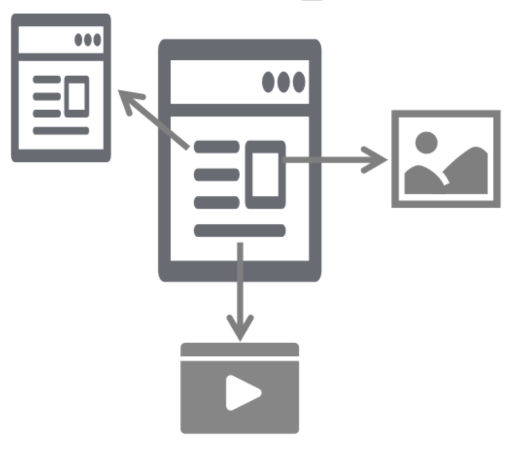
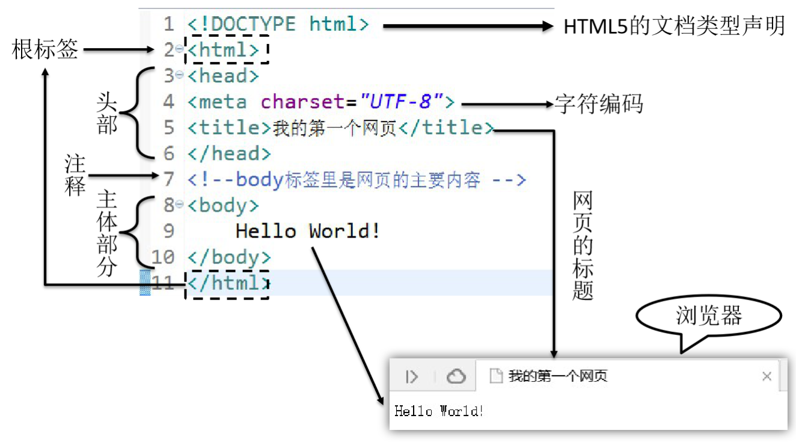

# JavaWeb基础

**@author: Shuxin_Wang**

**@time: 2023.03.15**

--------

[toc]

---------

# 1 JavaWeb开发概述

## 1.1 服务器端应用程序


## 1.2 请求和响应


## 1.3 架构

### 1.3.1 概念

**架构其实就是项目的结构**。只不过结构这个词太小了，不适合用来描述项目这么大的东西，所以换了另一个更大的词：架构。所以当我们聊一个项目的架构时，我们聊的是项目是由哪些部分组成的。

### 1.3.2 发展演变历程

#### 单一架构

一个项目就是一个工程，这样的结构就是单一架构，也叫`all in one`。我们现在的`JavaWeb`阶段、`SSM`阶段都是学习单一架构开发技术。

#### 分布式架构

一个项目中包含很多工程，每个工程作为一个模块。模块之间存在调用关系。分布式架构阶段的技术分为两类：

- Java框架：`SpringBoot`、`SpringCloud`、`Dubbo`等等；
- 中间件：`Redis`、`ElasticSearch`、`FastDFS`、`Nginx`、`Zookeeper`、`RabbitMQ`等等；

### 1.3.3 单一架构技术体系

- 视图：用户的操作界面+数据的动态显示：
  - 前端技术：`HTML/CSS/JavaScript`；
  - 服务器端页面模板技术：`Thymeleaf`；
- 控制层：处理请求+跳转页面：
  - 服务器：`Tomcat`；
  - 控制器：`Servlet`；
  - 域对象：`request`、`session`、`servletContext`；
  - 过滤器：`Filter`；
  - 监听器：`Listener`；
  - 异步交互：`Ajax`；
- 业务逻辑层：业务逻辑计算；
- 持久化层：操作数据库；


## 1.4 技术体系


# 2 HTML&CSS

## 2.1 单一架构

从现在的`JavaWeb`阶段到后面学习`SSM`框架阶段都是在学习单一架构项目开发的技术。而在`JavaWeb`阶段由于重点是探讨如何实现Web开发，所以必须学习一部分前端开发的技术。本节就是让大家明确我们现在要学习的内容在整个架构体系中处于什么位置。

### 2.1.1 视图层

严格来说视图分成两层：

- 前端技术：`HTML/CSS/JavaScript`
- 服务器端页面模板技术：`Thymeleaf`

其中`HTML`、`CSS`、`JavaScript`都是工作在浏览器上的，所以它们都属于前端技术。而`Thymeleaf`是在服务器上把动态内容计算出具体数据，所以严格来说`Thymeleaf`是后端技术。


> 这里大家会有个疑问：为什么在`视图`这个地方已经有`HTML`、`CSS`、`JavaScript`这些前端技术了，能够生成用户可以操作的界面，那为什么还需要`Thymeleaf`这样一个后端技术呢？
>
> 简单来说原因是`Thymeleaf`=`HTML+动态数据`，而`HTML`不支持动态数据，这部分需要借助`Thymeleaf`来完成。

### 2.1.2 Web2.0

`Web2.0`是相对于更早的网页开发规范而提出的新规范。`Web2.0`规范之前的网页开发并没有明确的将`HTML`、`CSS`、`JavaScript`代码**<u>分开</u>**，而是互相之间纠缠在一起，导致代码维护困难，开发效率很低。

> 在开发中我们把这样彼此纠缠、互相影响的现象称为`耦合`。而把耦合在一起的东西拆解开，让他们彼此独立出来称为`解耦`。各个组成部分独立完成自己负责的功能，和其他模块无关称为`内聚`。
>
> 将来大家经常会听到一句话：软件开发提倡 `高内聚，低耦合`。
>
> 一个软件项目只有做到了高内聚、低耦合才能算得上结构严谨，模块化程度高，有利于开发和维护。

所以`Web2.0`规范主张将网页代码分成下面三个部分：

- 结构：由`HTML`实现，负责管理网页的内容。将来网页上不管是静态还是动态的数据都是填写到HTML的标签里；
- 表现：由`CSS`实现，负责管理网页内容的表现形式。比如：颜色、尺寸、位置、层级等等。也就是给数据穿上一身漂亮的衣服；
- 行为：由`JavaScript`实现，负责实现网页的动态交互效果。比如：轮播图、表单验证、鼠标滑过显示下拉菜单、鼠标滑过改变背景颜色等等；

## 2.2 HTML简介

### 2.2.1 超文本语言

**<u>超文本标记语言（Hyper Text Markup Language，HTML）</u>**文件本质上是文本文件，而普通的文本文件只能显示字符。但是HTML技术则通过HTML标签把其他网页、图片、音频、视频等各种多媒体资源引入到当前网页中，让网页有了非常丰富的呈现方式，这就是超文本的含义——本身是文本，但是呈现出来的最终效果超越了文本



### 2.2.2 标记语言

说HTML是一种『标记语言』是因为它不是向Java这样的『编程语言』，因为它是由一系列『标签』组成的，没有常量、变量、流程控制、异常处理、IO等等这些功能。HTML很简单，每个标签都有它固定的含义和确定的页面显示效果。

标签是通过一组尖括号+标签名的方式来定义的：

```html
<p>
    HTML is a very popular fore-end technology.
</p>
```

这个例子中使用了一个`p`标签来定义一个段落，`<p>`叫**『开始标签』**，`</p>`叫**『结束标签』**。开始标签和结束标签一起构成了一个完整的标签。开始标签和结束标签之间的部分叫**『文本标签体』**，也简称**『标签体』**。

有时候标签还带有**<u>属性</u>**：

```html
<a href="http://www.xxx.com">
    show detail
</a>
```

`href="http://www.xxx.com"`就是属性，`href`是**『属性名』**，`"http://www.xxx.com"`是**『属性值』**。

还有一种标签是**<u>单标签</u>**：

```html
<input type="text" name="username" />
```

### 2.2.3 Hello World



### 2.2.4 HTML文件结构

#### 文档类型声明

HTML文件中第一行的内容，用来告诉浏览器当前HTML文档的基本信息，其中最重要的就是当前HTML文档遵循的语法标准。这里我们只需要知道HTML有4和5这两个大的版本，`HTML4`版本的文档类型声明是：

```html
<!DOCTYPE HTML PUBLIC "-//W3C//DTD HTML 4.01 Transitional//EN"
"http://www.w3.org/TR/html4/loose.dtd">
```

`HTML5`版本的文档类型声明是：

```html
<!DOCTYPE html>
```

现在主流的技术选型都是使用`HTML5`，之前的版本基本不用了。

#### 根标签

`html`标签是整个文档的根标签，所有其他标签都必须放在html标签里面。上面的文档类型不能当做普通标签看待。

> 所谓『根』其实是『树根』的意思。在一个树形结构中，根节点只能有一个。

#### 头部

`head`标签用于定义文档的头部，其他头部元素都放在head标签里。头部元素包括`title`标签、`script`标签、`style`标签、`link`标签、`meta`标签等等。

#### 主体

`body`标签定义网页的主体内容，在浏览器窗口内显示的内容都定义到`body`标签内。

#### 注释

HTML注释的写法是：

```html
<!-- 注释内容 -->
```

注释的内容不会显示到浏览器窗口内，是开发人员用来对代码内容进行解释说明。

### 2.2.5 HTML语法规则

- 根标签有且只能有一个；
- 无论是双标签还是单标签都必须正确关闭；
- 标签可以嵌套但不能交叉嵌套；
- 注释不能嵌套；
- 属性必须有值，值必须加引号，单引号或双引号均可；
- 标签名不区分大小写但建议使用小写；

## 2.3 使用HTML展示文章

以文章的组织形式展示数据是HTML最基本的功能了，网页上显示的文章在没有做任何CSS样式设定的情况下如下图所示：


本节我们要学习的HTML标签如下表：

| 标签名称 | 功能                   |
| -------- | ---------------------- |
| `h1~h6`  | 1级标题~6级标题        |
| `p`      | 段落                   |
| `a`      | 超链接                 |
| `ul/li`  | 无序列表               |
| `img`    | 图片                   |
| `div`    | 定义一个前后有换行的块 |
| `span`   | 定义一个前后无换行的块 |

### 2.3.1 标签标题

```html
<!DOCTYPE html>
<html lang="en">
<head>
    <meta charset="UTF-8">
    <title>Title</title>
</head>
<body>
    <h1>这是一级标题</h1>
    <h2>这是二级标题</h2>
    <h3>这是三级标题</h3>
    <h4>这是四级标题</h4>
    <h5>这是五级标题</h5>
    <h6>这是六级标题</h6>
</body>
</html>
```

==**<u>注意：标题标签前后有换行。</u>**==

### 2.3.2 段落标签

```html
<p>There is clearly a need for CSS to be taken seriously by graphic artists. The Zen Garden aims to excite, inspire, and encourage participation. To begin, view some of the existing designs in the list. Clicking on any one will load the style sheet into this very page. The code remains the same, the only thing that has changed is the external .css file. Yes, really.</p>
```

==**<u>注意：标题标签前后有换行。</u>**==

### 2.3.3 超链接

```html
<a href="page02-anchor-target.html">点我跳转到下一个页面</a>
```

点击后跳转到`href`属性指定的页面

### 2.3.4 路径

在整个Web开发技术体系中，**路径**是一个贯穿始终的重要概念。凡是需要获取另外一个资源的时候都需要用到路径。要想理解路径这个概念，我们首先要认识一个概念：**『文件系统』**。

#### 文件系统

Windows系统和Linux系统的文件系统有很大差别，为了让我们编写的代码不会因为从Windows系统部署到了Linux系统而出现故障，实际开发时不允许使用**物理路径**。

> 物理路径举例：
>
> `D:\aaa\pro01-HTML\page01-article-tag.html`
>
> `D:\aaa\pro01-HTML\page02-anchor-target.html`

幸运的是不管是Windows系统还是Linux系统环境下，目录结构都是**树形结构**，编写路径的规则是一样的。

所以我们**以项目的树形目录结构为依据**来编写路径就不用担心操作系统平台发生变化之后路径错误的问题了。有了这个大前提，我们具体编写路径时有两种具体写法：

- 相对路径；
- 绝对路径（建议使用）；

#### 相对路径

**相对路径都是以*『当前位置』*为基准**来编写的。假设我们现在正在浏览a页面，想在a页面内通过超链接跳转到z页面。


那么按照相对路径的规则，我们现在所在的位置是`a.html`所在的b目录；`z.html`并不在b目录下，所以我们要从b目录出发，向上走，进入b的父目录——c目录；c目录还是不行，继续向上走，进入c的父目录——d目录；在从d目录向下经过两级子目录——e目录、f目录才能找到`z.html`。

所以整个路径的写法是：

```html
<a href="../../e/f/z.html">To z.html</a>
```

可以看到使用相对路径有可能会很繁琐，而且在后面我们结合了在服务器上运行的Java程序后，相对路径的基准是有可能发生变化的，所以**不建议使用相对路径**。

#### 绝对路径

测试绝对路径的前提是通过IDEA的内置服务器访问我们编写的HTML页面——这样访问地址的组成结构才能和我们以后在服务器上运行的Java程序一致。

绝对路径要求必须是以**『正斜线』**，测试开头在端口号后面的位置代表的是**『服务器根目录』**，从这里开始我们就是在服务器的内部查找一个具体的Web应用。

所以编写绝对路径时就从这个位置开始，**按照目录结构找到目标文件**即可。拿前面相对路径中的例子来说，我们想在a.html页面中通过超链接访问z.html。此时路径从正斜线开始，和a.html自身所在位置没有任何关系：

```html
<a href="/d/e/f/z.html">To z.html</a>
```

### 2.3.5 换行

```html
<p>
    We would like to see as much CSS1 as possible. CSS2 should be limited to widely-supported elements only. The css Zen Garden is about functional, practical CSS and not the latest bleeding-edge tricks viewable by 2% of the browsing public.<br/>The only real requirement we have is that your CSS validates.
</p>
```

### 2.3.6 无序列表

```html
<ul>
    <li>Apple</li>
    <li>Banana</li>
    <li>Grape</li>
</ul>
```

### 2.3.7 图片

`src`属性用来指定图片文件的路径，这里同样按我们前面说的使用**『绝对路径』**。

```html

```

### 2.3.8 块

**『块』**并不是为了显示文章内容的，而是为了方便结合CSS对页面进行布局。块有两种，div是前后有换行的块，span是前后没有换行的块。

把下面代码粘贴到HTML文件中查看他们的区别：

```html
<div style="border: 1px solid black;width: 100px;height: 100px;">This is a div block</div>
<div style="border: 1px solid black;width: 100px;height: 100px;">This is a div block</div>

<span style="border: 1px solid black;width: 100px;height: 100px;">This is a span block</span>
<span style="border: 1px solid black;width: 100px;height: 100px;">This is a span block</span>
```

### 2.3.9 实体

在HTML文件中，`<`、`>`等等这样的符号已经被赋予了特定含义，不会作为符号本身显示到页面上，此时如果我们想使用符号本身怎么办呢？那就是使用HTML实体来转义。


资料来源：[W3School](https://www.w3school.com.cn/html/html_entities.asp)

## 2.4 表格标签

