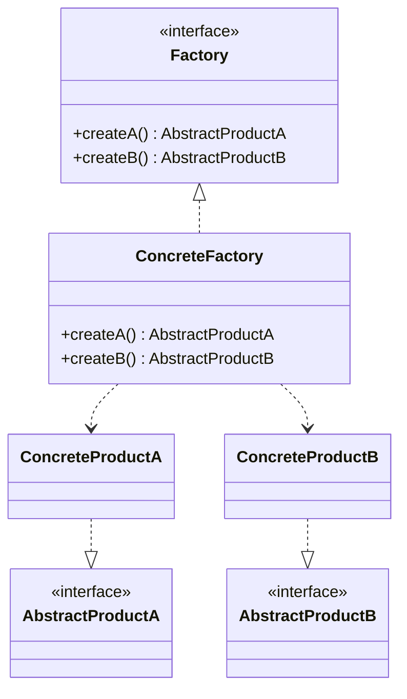
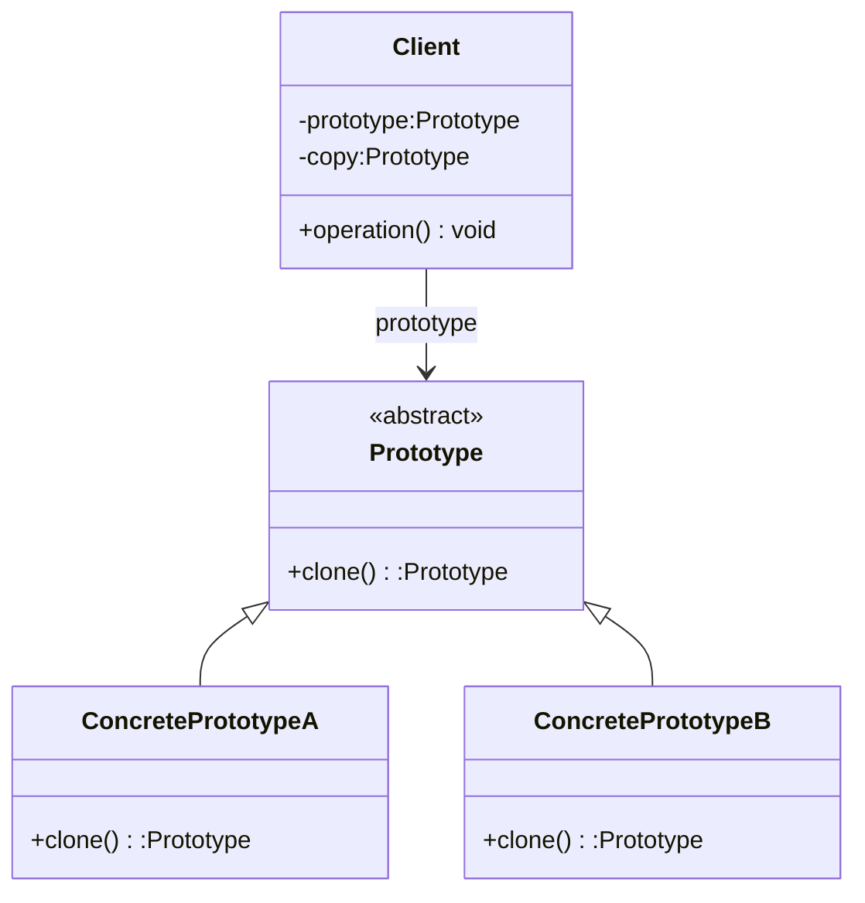
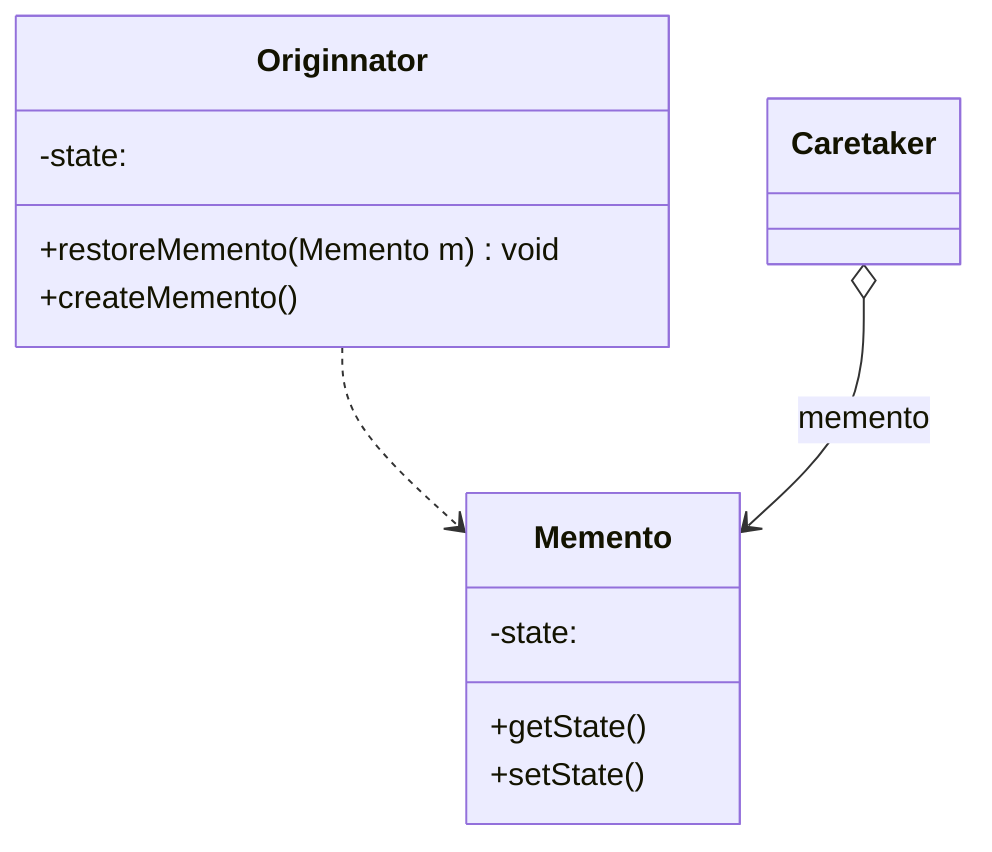

- **author: Shuxin_Wang**
- **time    :2022.10.04**

# 1 适配器模式

# 2 外观模式

# 3 组合模式

# 4 桥接模式

# 5 单例模式

## 5.1 模式动机

- **对于系统中的某些类来说，只有一个实例很重要**，例如，一个系统中可以存在多个打印任务，但是只能有一个正在工作的任务；一个系统只能有一个窗口管理器或文件系统；一个系统只能有一个计时工具或ID（序号）生成器；
- 如何保证一个类只有一个实例并且这个实例易于被访问呢？**定义一个全局变量可以确保对象随时都可以被访问，但不能防止我们实例化多个对象**；
- 一个更好的解决办法是**让类自身负责保存它的唯一实例**。这个类可以保证没有其他实例被创建，并且它可以提供一个访问该实例的方法。这就是单例模式的模式动机；

## 5.2 模式定义

- 单例模式(Singleton Pattern)：单例模式**确保某一个类只有一个实例，而且自行实例化并向整个系统提供这个实例**，这个类称为单例类，它提供全局访问的方法；
- 单例模式的要点有三个：一是某个**类只能有一个实例**；二是**它必须<u>自行</u>创建这个实例**；三是**它必须自行向整个系统提供这个实例**。单例模式是一种对象创建型模式。单例模式又名单件模式或单态模式。

## 5.3 模式结构

- `Singleton`：单例

# 6 观察者模式

# 7 中介者模式

# 8 代理模式

# 9 责任链模式

# 10 享元模式

## 10.1 模式动机

- **面向对象技术可以很好地解决一些灵活性或可扩展性问题，但在很多情况下需要在系统中增加类和对象的个数。**当对象数量太多时，将导致运行代价过高，带来性能下降等问题；
- **享元模式**正是为解决这一类问题而诞生的。**享元模式通过共享技术实现相同或相似对象的重用**；
- 在享元模式中**可以共享的相同内容称为内部状态(Intrinsic State)**，而那些**需要外部环境来设置的不能共享的内容称为外部状态(Extrinsic State)**，由于区分了内部状态和外部状态，因此可以通过设置不同的外部状态使得相同的对象可以具有一些不同的特征，而相同的内部状态是可以共享的；
- 在享元模式中通常会出现工厂模式，需要**创建一个享元工厂来维护一个享元池(Flyweight Pool)用于存储具有相同内部状态的享元对象**；
- 在享元模式中共享的是享元对象的内部状态，外部状态需要通过环境来设置。在实际使用中，能够共享的内部状态是有限的，因此**享元对象一般都设计为较小的对象，它所包含的内部状态较少，这种对象也称为细粒度对象。享元模式的<u>目的</u>就是使用共享技术来实现大量细粒度对象的复用**；

## 10.2 模式定义

享元模式(Flyweight Pattern)：运用**共享技术**有效地支持大量**细粒度对象**的复用。系统只使用少量的对象，**而这些对象都很相似，状态变化很小**，可以实现对象的多次复用。由于享元模式要求能够共享的对象必须是细粒度对象，因此它又称为**轻量级模式**，它是一种**对象结构型模式**。

## 10.3 模式结构

- `Flyweight`: 抽象享元类
- `ConcreteFlyweight`: 具体享元类
- `UnsharedConcreteFlyweight`: 非共享具体享元类
- `FlyweightFactory`: 享元工厂类

# 11 建造者模式

## 11.1 模式动机

- 无论是在现实世界中还是在软件系统中，都存在一些复杂的对象，它们拥有多个组成部分，如汽车，它包括车轮、方向盘、发送机等各种部件。而对于大多数用户而言，无须知道这些部件的装配细节，也几乎不会使用单独某个部件，而是使用一辆完整的汽车，可以通过建造者模式对其进行设计与描述，**建造者模式可以将部件和其组装过程分开，一步一步创建一个复杂的对象**。用户只需要指定复杂对象的类型就可以得到该对象，而无须知道其内部的具体构造细节；
- 在软件开发中，也存在大量类似汽车一样的复杂对象，**它们拥有一系列成员属性，这些成员属性中有些是引用类型的成员对象**。而且在这些复杂对象中，还可能存在一些限制条件，如某些属性没有赋值则复杂对象不能作为一个完整的产品使用；有些属性的赋值必须按照某个顺序，一个属性没有赋值之前，另一个属性可能无法赋值等；
- **复杂对象相当于一辆有待建造的汽车，而对象的属性相当于汽车的部件**，建造产品的过程就相当于组合部件的过程。由于组合部件的过程很复杂，因此，这些部件的组合过程往往被“外部化”到一个称作建造者的对象里，**建造者返还给客户端的是一个已经建造完毕的完整产品对象，而用户无须关心该对象所包含的属性以及它们的组装方式**，这就是建造者模式的模式动机；

## 11.2 模式定义

- 建造者模式(Builder Pattern)：将**一个复杂对象的构建与它的表示分离**，使得**同样的构建过程可以创建不同的表示**；
- 建造者模式是**一步一步创建一个复杂的对象**，它允许用户只通过指定复杂对象的类型和内容就可以构建它们，用户不需要知道内部的具体构建细节。建造者模式属于对象创建型模式。根据中文翻译的不同，建造者模式又可以称为生成器模式；

## 11.3 模式结构

- `Builder`：抽象建造者
- `ConcreteBuilder`：具体建造者
- `Director`：指挥者
- `Product`：产品角色

# 12 简单工厂模式

## 12.0 创建型模式概述

- **创建型模式(Creational Pattern)**对类的实例化过程进行了抽象，能够**将软件模块中对象的<u>创建</u>和对象的<u>使用</u>分离**。为了使软件的结构更加清晰，外界对于这些对象只需要知道它们共同的接口，而不清楚其具体的实现细节，使整个系统的设计更加符合单一职责原则；
- 创建型模式在**创建什么(What)，由谁创建(Who)，何时创建(When)**等方面都为软件设计者提供了尽可能大的灵活性。创建型模式**隐藏了类的实例的创建细节，通过隐藏对象如何被创建和组合在一起达到使整个系统独立的目的**;

**<u>*创建性模式简介：*</u>**

- 简单工厂模式（Simple Factory）
- 工厂方法模式（Factory Method）
- 抽象工厂模式（Abstract Factory）
- 建造者模式（Builder）
- 原型模式（Prototype）
- 单例模式（Singleton）

## 12.1 模式动机

- 考虑一个简单的软件应用场景，一个软件系统可以提供多个外观不同的按钮（如圆形按钮、矩形按钮、菱形按钮等），**这些按钮都源自同一个基类**，不过在继承基类后不同的子类修改了部分属性从而使得它们可以呈现不同的外观，如果我们希望在使用这些按钮时，**不需要知道这些具体按钮类的名字，只需要知道表示该按钮类的一个参数，并提供一个调用方便的方法，把该参数传入方法即可返回一个相应的按钮对象**，此时，就可以使用简单工厂模式；

## 12.2 模式定义

简单工厂模式(Simple Factory Pattern)：又称为**静态工厂方法(Static Factory Method)模式**，它属于类创建型模式。在简单工厂模式中，可以**根据参数的不同返回不同类的实例**。简单工厂模式**专门定义一个类来负责创建其他类的实例，被创建的实例通常都具有共同的父类**；

## 12.3 模式结构

- `Factory`：工厂角色
- `Product`：抽象产品角色
- `ConcreteProduct`：具体产品角色

# 13 工厂模式

## 13.0 简单工厂的不足

在简单工厂模式中，只提供了一个工厂类，该工厂类处于对产品类进行实例化的中心位置，它知道每一个产品对象的创建细节，并决定何时实例化哪一个产品类。**简单工厂模式最大的缺点是当有新产品要加入到系统中时，必须修改工厂类，加入必要的处理逻辑，这违背了“开闭原则”**。在简单工厂模式中，所有的产品都是由同一个工厂创建，工厂类职责较重，业务逻辑较为复杂，具体产品与工厂类之间的耦合度高，严重影响了系统的灵活性和扩展性，而工厂方法模式则可以很好地解决这一问题

## 13.1 模式动机

- 考虑这样一个系统，按钮工厂类可以返回一个具体的按钮实例，如圆形按钮、矩形按钮、菱形按钮等。在这个系统中，如果需要增加一种新类型的按钮，如椭圆形按钮，那么**除了增加一个新的具体产品类之外，还需要修改工厂类的代码，这就使得整个设计在一定程度上违反了“开闭原则”**；
- 现在对该系统进行修改，不再设计一个按钮工厂类来统一负责所有产品的创建，而是**将具体按钮的创建过程交给专门的工厂子类去完成，我们先定义一个抽象的按钮工厂类，再定义具体的工厂类来生成圆形按钮、矩形按钮、菱形按钮等**，它们实现在抽象按钮工厂类中定义的方法。这种抽象化的结果使这种结构**可以在不修改具体工厂类的情况下引进新的产品**，如果出现新的按钮类型，只需要为这种新类型的按钮创建一个具体的工厂类就可以获得该新按钮的实例，这一特点无疑使得工厂方法模式具有超越简单工厂模式的优越性，**更加符合“开闭原则”**。

## 13.2 模式定义

工厂方法模式(Factory Method Pattern)又称为工厂模式，也叫**虚拟构造器(Virtual Constructor)模式**或者**多态工厂(Polymorphic Factory)模式**，它属于类创建型模式。在工厂方法模式中，工厂父类负责定义创建产品对象的公共接口，而工厂子类则负责生成具体的产品对象，这样做的目的是将产品类的实例化操作延迟到工厂子类中完成，即通过工厂子类来确定究竟应该实例化哪一个具体产品类。

## 13.3 模式结构

- `Product`：抽象产品
- `ConcreteProduct`：具体产品
- `Factory`：抽象工厂
- `ConcreteFactory`：具体工厂

# 14 抽象工厂模式

## 14.1 模式动机

- 在工厂方法模式中具体工厂负责生产具体的产品，每一个具体工厂对应一种具体产品，工厂方法也具有唯一性，一般情况下，一个具体工厂中只有一个工厂方法或者一组重载的工厂方法。但是有时候**我们需要一个工厂可以提供多个产品对象，而不是单一的产品对象**；
- 为了更清晰地理解工厂方法模式，需要先引入两个概念：
  - **产品等级结构：产品等级结构即产品的继承结构**，如一个抽象类是电视机，其子类有海尔电视机、海信电视机、TCL电视机，则抽象电视机与具体品牌的电视机之间构成了一个产品等级结构，抽象电视机是父类，而具体品牌的电视机是其子类；
  - **产品族**：在抽象工厂模式中，**产品族是指由同一个工厂生产的，位于不同产品等级结构中的一组产品**，如海尔电器工厂生产的海尔电视机、海尔电冰箱，海尔电视机位于电视机产品等级结构中，海尔电冰箱位于电冰箱产品等级结构中；
- 当系统所提供的工厂所需生产的具体产品并不是一个简单的对象，而是**多个位于不同产品等级结构中属于不同类型的具体产品时**需要使用抽象工厂模式；
- 抽象工厂模式是所有形式的工厂模式中**最为抽象和最具一般性的一种形态**；
- 抽象工厂模式与工厂方法模式最大的区别在于，**工厂方法模式针对的是一个产品等级结构，而抽象工厂模式则需要面对多个产品等级结构**，一个工厂等级结构可以负责多个不同产品等级结构中的产品对象的创建 。当一个工厂等级结构可以创建出分属于不同产品等级结构的一个产品族中的所有对象时，抽象工厂模式比工厂方法模式更为简单、有效率；

## 14.2 模式定义

抽象工厂模式(Abstract Factory Pattern)：提供一个**创建一系列相关或相互依赖对象的接口**，而**无须指定它们具体的类**。抽象工厂模式又称为**Kit模式**，属于对象创建型模式。

## 14.3 模式结构

- `AbstractFactory`：抽象工厂
- `ConcreteFactory`：具体工厂
- `AbstractProduct`：抽象产品
- `Product`：具体产品

# 15 原型模式

## 15.1 模式动机

- 在面向对象系统中，使用原型模式来复制一个对象自身，从而**克隆出多个与原型对象一模一样的对象**；
- 在软件系统中，有些对象的创建过程较为复杂，而且有时候需要频繁创建，**原型模式通过给出一个原型对象来指明所要创建的对象的类型，然后用复制这个原型对象的办法创建出更多同类型的对象**，这就是原型模式的意图所在；

## 15.2 模式定义

- 原型模式(Prototype Pattern)：原型模式是一种对象创建型模式，**用原型实例指定创建对象的种类，并且通过复制这些原型创建新的对象。**原型模式允许一个对象再创建另外一个可定制的对象，无须知道任何创建的细节；
- 原型模式的基本工作原理是通过将一个原型对象传给那个要发动创建的对象，这个要发动创建的对象通过请求原型对象拷贝原型自己来实现创建过程；

## 15.3 模式结构

- `Prototype`：抽象原型类
- `ConcretePrototype`：具体原型类
- `Client`：客户类

# 16 备忘录模式

## 16.1 模式动机

- 为了使软件的使用更加人性化，对于误操作，我们需要提供一种类似“**后悔药**”的机制，让软件系统可以回到误操作前的状态，因此需要保存用户每一次操作时系统的状态，**一旦出现误操作，可以把存储的历史状态取出即可回到之前的状态**；
- 现在大多数软件都有**撤销(Undo)**的功能，快捷键一般都是**Ctrl+Z**，目的就是为了解决这个后悔的问题；
- 在应用软件的开发过程中，很多时候我们都需要**记录一个对象的内部状态**；
- 在具体实现过程中，为了允许用户取消不确定的操作或从错误中恢复过来，需要**实现备份点和撤销机制**，而要实现这些机制，必须**事先将状态信息保存在某处**，这样才能将对象恢复到它们原先的状态；
- 备忘录模式是一种**给我们的软件提供后悔药的机制**，通过它可以**使系统恢复到某一特定的历史状态**。

## 16.2 模式定义

备忘录模式(Memento Pattern)：在**不破坏封装**的前提下，**捕获一个对象的内部状态**，并**在该对象之外保存这个状态**，这样可以在以后**将对象恢复到原先保存的状态**。它是一种*<u>对象行为型模式</u>*，其别名为Token。

## 16.3 模式结构

- `Originator`: 原发器
- `Memento`: 备忘录
- `Caretaker`: 负责人

# 17 模板方法模式

## 17.1 模式动机

- 模板方法模式是**基于继承**的代码复用基本技术，模板方法模式的结构和用法也是面向对象设计的核心之一。在模板方法模式中，可以**将相同的代码放在父类中，而将不同的方法实现放在不同的子类中**；
- 在模板方法模式中，我们需要准备一个抽象类，**将部分逻辑以具体方法以及具体构造函数的形式实现**，然后**声明一些抽象方法来让子类实现剩余的逻辑。不同的子类可以以不同的方式实现这些抽象方法，从而对剩余的逻辑有不同的实现**，这就是模板方法模式的用意。模板方法模式体现了面向对象的诸多重要思想，是一种使用频率较高的模式；

## 17.2 模式定义

模板方法模式(Template Method Pattern)：定义一个操作中**算法的骨架**，而将一些步骤**延迟到子类**中，模板方法使得子类**可以不改变一个算法的结构即可重定义该算法的某些特定步骤**。模板方法是一种*<u>类行为型</u>*模式

# 18 状态模式

