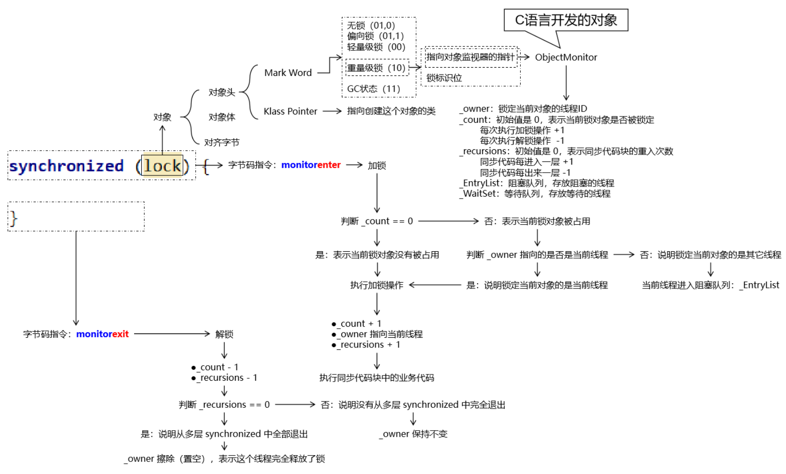

# JUC

[toc]

---

# 1 多线程知识回顾

## 1.1 基础概念

### 1.1.1 程序、进程、线程

#### 程序

- 程序从开发到发布的过程：源程序（源代码） → 打包封装 → 应用软件 ；

- 笼统的来说，源程序、应用软件都可以称之为『程序』；

- 相对于进程、线程来说，程序是一个**静态**的概念；

#### 进程

- 内部视角：程序运行起来就是一个进程。所以相对于程序来说，进程是一个**动态**的概念；
- 外部视角：站在操作系统的层次上来说，现代的大型操作系统都是支持多进程模式运行的，这样操作系统就可以同时执行很多个任务；

#### 线程

在一个进程中，需要同时处理多个不同任务，每一个任务由一个线程来执行。从这个意义上来说，可以把进程看做是线程的容器。


### 1.1.2 串行、并行、并发

#### 串行

多个操作**在同一个线程内**按顺序执行。这种情况下的工作模式我们往往也称之为：**同步**。按照同步模式执行的多个操作，当前操作没有结束时，下一个操作就必须等待。处于等待中的状态往往也称为：阻塞（block）。

#### 并行和并发

并行和并发都是以异步的模式来执行操作的。**异步**工作模式下不同线程内的操作互相不需要等待。

- 并行：多个 CPU（或 CPU 核心）同时执行多个任务
- 并发：一个 CPU（或 CPU 核心）同时执行多个任务

### 1.1.3 sleep()和wait()

二者最关键的区别是下面两点：

- `sleep()` 会让线程**拿着锁**去睡；
- `wait()` 会让线程**放开锁**去睡；

#### `sleep()`进入等待状态不释放锁

```java
// 1、创建一个对象，作为锁对象
Object lockObj = new Object();

// 2、创建执行 sleep 的线程
new Thread(()->{

    System.out.println(Thread.currentThread().getName() + " begin");
    // ※ 两个线程使用同一个锁对象，就会存在竞争关系
    synchronized (lockObj) {
        System.out.println(Thread.currentThread().getName() + " get lock");
        try {

            // ※ sleep() 方法拿着锁去睡
            TimeUnit.SECONDS.sleep(5);
        } catch (InterruptedException e) {
            e.printStackTrace();
        }
        System.out.println(Thread.currentThread().getName() + " release lock");

    }
    System.out.println(Thread.currentThread().getName() + " end");

}, "thread-a").start();

// ※ 让主线程睡一会儿，确保 a 线程先启动
try {TimeUnit.SECONDS.sleep(1);} catch (InterruptedException e) {}

// 3、创建竞争锁的线程
new Thread(()->{

    System.out.println(Thread.currentThread().getName() + " begin");
    // ※ 两个线程使用同一个锁对象，就会存在竞争关系
    synchronized (lockObj) {
        System.out.println(Thread.currentThread().getName() + " get lock");
    }

    System.out.println(Thread.currentThread().getName() + " end");
}, "thread-b").start();
```

打印结果：

>thread-a begin 
>
>thread-a get lock 
>
>thread-b begin 
>
>thread-a release lock 
>
>thread-b get lock 
>
>thread-b end 
>
>thread-a end

#### `wait()`进入等待状态释放锁

```java
// 1、创建一个对象，作为锁对象
Object lockObj = new Object();

// 2、创建执行 sleep 的线程
new Thread(()->{

    System.out.println(Thread.currentThread().getName() + " begin");
    // ※ 两个线程使用同一个锁对象，就会存在竞争关系
    synchronized (lockObj) {
        System.out.println(Thread.currentThread().getName() + " get lock");
        try {

            // ※ wait() 方法放开锁去睡
            lockObj.wait(5000);

        } catch (InterruptedException e) {
            e.printStackTrace();
        }
        System.out.println(Thread.currentThread().getName() + " release lock");

    }
    System.out.println(Thread.currentThread().getName() + " end");

}, "thread-a").start();

// ※ 让主线程睡一会儿，确保 a 线程先启动
try {TimeUnit.SECONDS.sleep(1);} catch (InterruptedException e) {}

// 3、创建竞争锁的线程
new Thread(()->{

    System.out.println(Thread.currentThread().getName() + " begin");
    // ※ 两个线程使用同一个锁对象，就会存在竞争关系
    synchronized (lockObj) {
        System.out.println(Thread.currentThread().getName() + " get lock");
    }

    System.out.println(Thread.currentThread().getName() + " end");
}, "thread-b").start();
```

打印结果：

> thread-a begin
>
> thread-a get lock
>
> thread-b begin
>
> thread-b get lock
>
> thread-b end
>
> thread-a release lock
>
> thread-a end

#### 小结

|                | wait()                               | sleep()                |
| -------------- | ------------------------------------ | ---------------------- |
| 声明位置       | Object 类                            | Thread 类              |
| 影响线程的方式 | 通过调用 wait() 方法的对象影响到线程 | 直接影响当前线程       |
| 性质           | 非静态方法                           | 静态方法               |
| 释放锁资源     | **放开锁进入等待**                   | **不释放锁进入等待**   |
| 同步要求       | 必须在同步上下文中使用               | 不要求在同步上下文中   |
| 应用场景       | 用于线程间通信                       | 用来让线程暂停一段时间 |

### 1.1.4 同步方法和同步代码块

#### 相同点

都会用到`synchronized`关键字

#### 区别

|            | 锁对象                           | 锁定范围             |
| ---------- | -------------------------------- | -------------------- |
| 同步代码块 | 由程序员指定                     | 代码块的范围（灵活） |
| 同步方法   | 静态：类.class  <br>非静态：this | 整个方法体           |

#### 小结

- 结论1：静态同步方法使用类.class作为锁对象；非静态同步方法使用this作为锁对象；
- 结论2：多个线程如果使用同一个锁对象就会有竞争关系；否则没有竞争关系；


## 1.2 创建多线程

无论有多少种形式，创建多线程的真正的方法，其实只有两种： 

> 继承 Thread 类 
>
>  实现 Runnable 接口 

**<u>其它形式都是这两种方式的变体</u>**

### 1.2.1 继承Thread类

#### 实现方法

- 第一步：继承 Thread 类；
- 第二步：重写 run() 方法；
- 第三步：创建 Thread 子类对象；
- 第四步：调用 start() 方法启动线程；

```java
public class CreateThread01Extends {

    public static void main(String[] args) {
        DemoThread demo = new DemoThread("AAA");
        demo.start();
    }

}

class DemoThread extends Thread {

    public DemoThread(String threadName) {
        super(threadName);
    }

    @Override
    public void run() {
        System.out.println(Thread.currentThread().getName() + " thread working ...");
    }
}
```

#### `start()` 方法和 `run()` 方法区别

调用 run() 方法仅仅只是调用了一个子类中重写的父类方法，并没有真正开启一个新的线程，还是在当前线程运行，也就是 main 线程。

#### 评价

因为 Java 是单继承的，一个类继承了 Thread 类就不能继承其它类，所以通常不采用这个办法创建多线程。

### 1.2.2 实现Runnable接口

#### 实现接口形式

```java
public class CreateThread02Impl {

    public static void main(String[] args) {

        // 第四步：创建实现了 Runnable 接口的类的对象
        MyRunnableThread runnable = new MyRunnableThread();

        // 第五步：创建 Thread 类对象
        // 参数1：runnable 对象
        // 参数2：线程名称
        Thread thread = new Thread(runnable, "thread 002");

        // 第六步：调用 Thread 对象的 start() 方法启动线程
        thread.start();
    }

}

// 第一步：实现 Runnable 接口
class MyRunnableThread implements Runnable {

    // 第二步：实现 run() 方法
    @Override
    public void run() {

        // 第三步：编写线程中的逻辑代码
        System.out.println(Thread.currentThread().getName() + " is working");
    }
}
```

#### 匿名内部类形式

```java
// 第一步：以匿名内部类的方式创建 Runnable 接口类型的对象
Runnable runnable = new Runnable() {
    @Override
    public void run() {
        // 第二步：编写线程中的逻辑代码
        System.out.println(Thread.currentThread().getName() + " is working");
    }
};

// 第三步：创建 Thread 类对象
// 参数1：runnable 对象
// 参数2：线程名称
Thread thread = new Thread(runnable, "thread 003");

// 第四步：调用 Thread 对象的 start() 方法启动线程
thread.start();
```

#### Lambda表达式

**声明变量：**

```java
// 编写 Lambda 表达式的口诀：
// 复制小括号
// 写死右箭头
// 落地大括号

// 第一步：以匿名内部类的方式创建 Runnable 接口类型的对象
Runnable runnable = () -> {
    // 第二步：编写线程中的逻辑代码
    System.out.println(Thread.currentThread().getName() + " is working");
};

// 第三步：创建 Thread 类对象
// 参数1：runnable 对象
// 参数2：线程名称
Thread thread = new Thread(runnable, "thread 004");

// 第四步：调用 Thread 对象的 start() 方法启动线程
thread.start();
```

**不声明变量：**

```java
// 第一步：创建 Thread 类对象并调用 start() 方法启动线程
// 参数1：以Lambda 表达式形式创建的 runnable 对象
// 参数2：线程名称
new Thread(() -> {
    // 第二步：编写线程中的逻辑代码
    System.out.println(Thread.currentThread().getName() + " is working");
}, "thread 005").start();
```

### 1.2.3 使用Callable接口配合FutureTask

该方案最核心的价值是：使用 Callable 接口限定的功能 + Future 接口限定的功能 = 汇总各个线程执行结果 最终执行汇总操作的这一步会被阻塞，直到前面各个线程完成了计算。

#### `FutureTask`类和`Runnable`接口的关系


从继承关系能够看到，`FutureTask`本身也间接实现了`Runnable`接口。`FutureTask`类的对象也是`Runnable`接口的实例，可以用于在创建`Thread`对象时，传入Thread构造器。

#### Future接口

**停止任务：**

```java
boolean cancel(boolean mayInterruptIfRunning);
```

如果尚未启动，它将停止任务。如果已启动，则仅在 mayInterrupt 为 true 时才会中断任务。

**获取任务的结果：**

```java
V get() throws InterruptedException, ExecutionException;
```

如果任务完成，它将立即返回结果，否则将等待任务完成，然后返回结果。

**判断任务是否完成：**

```java
boolean isDone();
```

如果任务完成，则返回true，否则返回false。

#### `FutureTask`类的构造器

**介绍：**

`FutureTask` 类兼具 `Runnable` 和 `Future` 接口的功能，并方便地将两种功能组合在一起。关于 `FutureTask` 类的使用有如下建议：

- 在主线程中需要执行比较耗时的操作时，但又不想阻塞主线程时，可以把这些作业交给 Future 对象在后台完成；
- 当主线程将来需要时，就可以通过 Future 对象获得后台作业的计算结果或者执行状态；
- 一般 FutureTask 多用于耗时的计算，主线程可以在完成自己的任务后，再去获取结果；
- 仅在计算完成时才能检索结果；如果计算尚未完成，则阻塞 get() 方法；
- 一旦计算完成，就不能再重新开始或取消计算；
- get() 方法而获取结果只有在计算完成时获取，否则会一直阻塞直到任务转入完成状态，然后会返回结果或者抛出异常；
- get() **<u>只执行一次</u>**，因此get() 方法放到最后；

**可以使用的构造器：**

```java
    public FutureTask(Callable<V> callable) {
        if (callable == null)
            throw new NullPointerException();
        this.callable = callable;
        this.state = NEW;       // ensure visibility of callable
    }
```

根据这个构造器，我们知道，创建 FutureTask 对象时，传入一个 Callable 类型的对象即可。

#### Callable接口

```java
@FunctionalInterface
public interface Callable<V> {
    /**
     * Computes a result, or throws an exception if unable to do so.
     *
     * @return computed result
     * @throws Exception if unable to compute a result
     */
    V call() throws Exception;
}
```

从 call() 方法的声明我们可以看出，它有一个返回值。这个返回值可以将当前线程内计算结果返回。

#### 测试代码

```java
// 1.创建三个FutureTask对象，封装三个线程的执行逻辑
FutureTask<Integer> task01 = new FutureTask<>(() -> {

    int result = (int) (Math.random() * Math.random() * 100);

    System.out.println(Thread.currentThread().getName());

    return result;
});
FutureTask<Integer> task02 = new FutureTask<>(() -> {

    int result = (int) (Math.random() * Math.random() * 1000);

    System.out.println(Thread.currentThread().getName());

    return result;
});
FutureTask<Integer> task03 = new FutureTask<>(() -> {

    int result = (int) (Math.random() * Math.random() * 10000);

    System.out.println(Thread.currentThread().getName());

    return result;
});

// 2.创建三个线程对象，然后启动线程
new Thread(task01, "thread01").start();
new Thread(task02, "thread02").start();
new Thread(task03, "thread03").start();

// 3.上面三个线程执行完成后，可以收集它们各自运算的结果
Integer task01Result = task01.get();
Integer task02Result = task02.get();
Integer task03Result = task03.get();

System.out.println("task01Result = " + task01Result);
System.out.println("task02Result = " + task02Result);
System.out.println("task03Result = " + task03Result);
```

#### callable和Runnable对比

| Runnable接口               | Callable接口             |
| -------------------------- | ------------------------ |
| 重写run()方法              | 重写call()方法           |
| run()没有返回值            | call()有返回值           |
| run()没有声明抛出异常      | call()声明抛出Exception  |
| 没有汇总各个线程结果的机制 | 有汇总各个线程结果的机制 |

### 1.2.4 线程池

#### 参考代码

```java
// 1.创建线程池对象
ExecutorService pool = Executors.newFixedThreadPool(5);

// 2.给线程池对象分配任务，每一个任务是一个线程
pool.execute(() -> {
    System.out.println(Thread.currentThread().getName() + " " + new Date());
});

pool.execute(() -> {
    System.out.println(Thread.currentThread().getName() + " " + new Date());
});

pool.execute(() -> {
    System.out.println(Thread.currentThread().getName() + " " + new Date());
});
```

### 1.2.5 并行计算

```java
List<String> list = Arrays.asList("a", "b", "c", "d", "e");

// 串行计算
list.stream().forEach(System.out::print);

System.out.println();

// 并行计算
list.parallelStream().forEach(System.out::print);
```

### 1.2.6 Timer定时任务

```java
// 1、创建 Timer 对象封装定时任务中要执行的操作
// 每一个 Timer 对象会使用一个线程来执行定时任务
Timer timer01 = new Timer();

// 2、调用 schedule() 指定任务和执行周期
// 参数1：timerTask 封装具体任务操作
// 参数2：delay 指定定时任务延迟多久后开始执行
// 参数3：period 指定定时任务执行的时间间隔
timer01.schedule(new TimerTask() {
    @Override
    public void run() {
        System.out.println(Thread.currentThread().getName() +" is working");
    }
}, 0, 1000);

Timer timer02 = new Timer();

timer02.schedule(new TimerTask() {
    @Override
    public void run() {
        System.out.println(Thread.currentThread().getName() +" is working");
    }
}, 0, 1000);
```

### 1.2.7 Spring异步方法

在 Spring 环境下，如果组件 A（假设是 ControllerA）要调用组件 B（假设是 ServiceB）的多个方法，而且希望这些方法能够异步执行。

#### 准备SpringBoot环境

**引入依赖：**

```xml
<dependencies>
    <dependency>
        <groupId>org.springframework.boot</groupId>
        <artifactId>spring-boot-starter-web</artifactId>
        <version>2.5.2</version>
    </dependency>
</dependencies>
```

**创建主启动类：**

```java
@SpringBootApplication
public class Application {

    public static void main(String[] args) {
        SpringApplication.run(Application.class, args);
    }

}
```

**创建Service：**

```java
@Service
public class DemoService {
    
    public void doSth() {
        System.out.println("Demo Service " + Thread.currentThread().getName());
    }

}
```

**创建Controller：**

```java
@RestController
public class DemoController {

    @Autowired
    private DemoService demoService;

    @RequestMapping("/demo/test/async")
    public String callServiceMethod() {

        demoService.doSth();
        demoService.doSth();
        demoService.doSth();
        demoService.doSth();
        demoService.doSth();

        return "success";
    }

}
```

#### 使用异步方法

**开启异步功能：**

在主启动类使用 @EnableAsync 注解：

```java
// 开启支持异步方法调用功能
@EnableAsync
@SpringBootApplication
public class Application {

    public static void main(String[] args) {
        SpringApplication.run(Application.class, args);
    }

}
```

**标记异步方法：**

在想要异步调用的方法上使用 @Async 注解：

```java
@Service
public class DemoService {

    // 在想要实现异步调用的方法上加 @Async注解
    @Async
    public void doSth() {
        System.out.println("Demo Service " + Thread.currentThread().getName());
    }

}
```


## 1.3 线程状态与生命周期

### 1.3.1 线程状态枚举类

#### 源代码

```java
    public enum State {
        /**
         * Thread state for a thread which has not yet started.
         */
        NEW,

        /**
         * Thread state for a runnable thread.  A thread in the runnable
         * state is executing in the Java virtual machine but it may
         * be waiting for other resources from the operating system
         * such as processor.
         */
        RUNNABLE,

        /**
         * Thread state for a thread blocked waiting for a monitor lock.
         * A thread in the blocked state is waiting for a monitor lock
         * to enter a synchronized block/method or
         * reenter a synchronized block/method after calling
         * {@link Object#wait() Object.wait}.
         */
        BLOCKED,

        /**
         * Thread state for a waiting thread.
         * A thread is in the waiting state due to calling one of the
         * following methods:
         * <ul>
         *   <li>{@link Object#wait() Object.wait} with no timeout</li>
         *   <li>{@link #join() Thread.join} with no timeout</li>
         *   <li>{@link LockSupport#park() LockSupport.park}</li>
         * </ul>
         *
         * <p>A thread in the waiting state is waiting for another thread to
         * perform a particular action.
         *
         * For example, a thread that has called <tt>Object.wait()</tt>
         * on an object is waiting for another thread to call
         * <tt>Object.notify()</tt> or <tt>Object.notifyAll()</tt> on
         * that object. A thread that has called <tt>Thread.join()</tt>
         * is waiting for a specified thread to terminate.
         */
        WAITING,

        /**
         * Thread state for a waiting thread with a specified waiting time.
         * A thread is in the timed waiting state due to calling one of
         * the following methods with a specified positive waiting time:
         * <ul>
         *   <li>{@link #sleep Thread.sleep}</li>
         *   <li>{@link Object#wait(long) Object.wait} with timeout</li>
         *   <li>{@link #join(long) Thread.join} with timeout</li>
         *   <li>{@link LockSupport#parkNanos LockSupport.parkNanos}</li>
         *   <li>{@link LockSupport#parkUntil LockSupport.parkUntil}</li>
         * </ul>
         */
        TIMED_WAITING,

        /**
         * Thread state for a terminated thread.
         * The thread has completed execution.
         */
        TERMINATED;
    }

```

#### 说明

| 英文名称      | 中文名称 | 含义                                                     |
| ------------- | -------- | -------------------------------------------------------- |
| NEW           | 新建     | 线程对象刚创建                                           |
| RUNNABLE      | 就绪     | 等待 CPU 时间片                                          |
| RUNNING       | 运行     | 得到了 CPU 时间片，正在执行                              |
| BLOCKED       | 阻塞     | 等待同步锁                                               |
| WAITING       | 等待     | 等待被唤醒                                               |
| TIMED_WAITING | 限时等待 | 在进入等待状态时设定了等待时间。时间一到自动回到就绪状态 |
| TERMINATED    | 终止     | 线程因为代码执行完成或抛异常而停止执行                   |

### 1.3.2 线程的生命周期


## 1.4 线程间通信

在多线程模式下进行工作，除了要考虑各个线程之间是否同步、如何竞争锁等问题，还要考虑这样一个问题：线程之间有的时候需要相互配合来共同完成一件事情。 把一个大的任务拆分成多个不同的任务线，每个任务线中都有更小的执行步骤。各个线程之间需要彼此配合：A 线程执行一步唤醒 B 线程，自己等待；B 线程执行一步，唤醒 A 线程，自己等待……

### 1.4.1 核心语法

#### `Object` 类的 `wait()` 方法

> Causes the current thread to wait until another thread invokes the `java.lang.Object`#notify() method or the `java.lang.Object`#notifyAll() method for this object.

- `wait()` 方法会导致当前线程进入等待状态；
- **必须**是**另外一个线程**调用 `notify()` 或 `notifyAll()` 方法来**唤醒**；
- “for this object” 表示还是要使用**<u>同一个对象</u>**分别调用 `wait()`、`notify()`、`notifyAll()` 这些方法；

#### `Object` 类的 `notify()` 方法

> Wakes up a single thread that is waiting on this object's monitor. If any threads are waiting on this object, one of them is chosen to be awakened.

- `notify()` 方法只唤醒一个线程；
- 处于等待状态的线程会被存放在对象监视器中的一个数组中；
- 如果在这个对象的监视器中维护的处于等待状态的线程是多个，那么 `notify()` 方法会**随机**唤醒一个；
- `notfiy()` 方法无法精确唤醒一个指定的线程，这个需求可以通过 Lock + Condition 方式实现（定制化通信）；

#### `Object` 类的 `notifyAll()` 方法

> Wakes up all threads that are waiting on this object's monitor.

唤醒当前对象监视器上等待的**<u>所有</u>**线程。

### 1.4.2 虚假唤醒


这种情况，我们称之为：虚假唤醒。

要解决虚假唤醒问题，就需要对线程间通信时的判断条件使用 `while` 循环结构来执行，而不是 if 分支判断。


# 2 synchronized底层原理

为了方便大家理解，我们先说结论：synchronized底层的锁机制并不是『用钥匙开锁』这样的模型，而是『小狗撒尿』。 

- 小狗：线程 ；
- 电线杆子：锁对象关联的监视器对象 ；
- 小狗撒的尿：成功拿到锁的线程在监视器对象身上留下的痕迹；

## 2.1 锁膨胀机制

### 2.1.1 JDK 1.6分水岭

在 JDK 1.6 之前，synchronized 的底层工作机制只有『重量级锁』这一种模式。从 JDK 1.6 开始，官方对synchronized 的底层工作机制做了重大调整。

之所以要做这个调整是考虑到线程访问锁时，如果没有竞争，那么加锁和解锁的操作就显得有点浪费性能。

为了减少获得锁和释放锁带来的性能消耗，引入了『偏向锁』和『轻量级锁』的概念。升级后锁一共有 4 种状态，级别从低到高依次是：无锁状态、偏向锁状态、轻量级锁状态和重量级锁状态。锁可以升级但不能降级，也称为膨胀过程**不可逆**。

### 2.1.2 锁膨胀

#### 无锁

对象（用来作为锁对象的那个）刚创建出来，没有线程来申请锁——没有线程准备执行同步代码块。

#### 偏向锁

只有一个线程访问对象。此时没有必要执行获得锁和释放锁的操作，我们只需要在对象中记录当前偏向的线程的 ID，只要是这个线程来访问对象，则无需获得锁，直接可以开始操作。

如果一个线程获得了锁，那么锁就进入偏向模式，此时 *Mark Word* 的结构也就变为偏向锁结构，当该线程再次请求锁时，无需再做任何同步操作（同步操作就是加锁、解锁操作的总称），即获取锁的过程只需要检查 *Mark Word* 的锁标记位为偏向锁以及当前线程 ID 等于 Mark Word 的 Thread ID 即可，这样就省去了大量有关锁申请的操作。

#### 轻量级锁

轻量级锁是由偏向锁升级而来，当存在第二个线程申请同一个锁对象时，偏向锁就会立即升级为轻量级锁。注意这里的第二个线程只是申请锁，**<u>不存在两个线程同时竞争锁，可以是一前一后地交替执行同步块</u>**。

#### 重量级锁

重量级锁是由轻量级锁升级而来。当同一时间有多个线程竞争锁时，锁就会被升级成重量级锁，此时其申请锁带来的开销也就变大。此时各个线程之间存在竞争关系。

重量级锁一般用在不追求吞吐量，同步块或者同步方法执行时间较长的场景。

### 2.1.3 锁消除

占用锁的线程把同步代码执行完释放了锁，并且没有其它线程来申请锁，锁对象就会从重量级锁状态回到无锁状态。

### 2.1.4 自旋锁

轻量级锁失败后，虚拟机为了避免线程真实地在操作系统层面挂起，还会进行一项称为自旋锁的优化手段。大致相当于：在遇到 synchronized 时，没有拿到锁，但是并不乖乖去阻塞，而是继续执行一些无意义代码。执行完这些代码再看看别人把锁释放没有。如果还是没有释放，那就只好去阻塞了。

- 适合的场景：锁定时间较短，通过自旋有较大几率获得锁。
- 不适合的场景：锁定时间长，自旋操作本身浪费了 CPU 性能。
    - 通俗来说就是：“旋”了半天没等到，白“旋”了。

### 2.1.5 自适应自旋锁

这种相当于是对上面自旋锁优化方式的进一步优化，它的自旋的次数不再固定，其自旋的次数由前一次在同一个锁上的自旋时间及锁的拥有者的状态来决定，这就解决了自旋锁带来的缺点。


## 2.2 对象存储结构

学习本节内容是为了搞清楚当线程在申请锁时，底层具体是如何工作的。

### 2.2.1 对象存储结构

现在我们都知道了对象（包括数组）都是放在堆内存中，那么对象在堆内存中保存时的数据结构是什么样子的呢？


#### 对象头

- 非数组对象
    - Mark Word
    - 类型指针
- 数组
    - Mark Word
    - 类型指针
    - 数组长度


#### 对象体

这一部分也称为：实例数据。也就是对象中实际包含的属性数据。

#### 对齐字节

为了寻址方便，JVM 要求每一个对象起始地址必须是 8 字节的整数倍，也就是要求每一个对象的存储空间都是 8 字节的整数倍。所以对于占空间不满足这一要求的对象会进行填充。所以这一部分是不一定存在的。

### 2.2.2 Mark Word

Mark Word 部分用于存储对象自身运行时数据，如哈希码、GC分代年龄等，这部分数据的长度在 32 位和 64 位的虚拟机中分别为 32 位和 64 位。

由于对象头的信息是与对象自身定义的数据没有关系的额外存储成本，因此考虑到 JVM 的空间效率，Mark Word 被设计成为一个非固定的数据结构，以便存储更多有效的数据，它会根据对象本身的状态复用自己的存储空间。

在 Mark Word 各种状态下的数据结构中，我们首先要关注一个数据：锁标识位。

| 锁标识位数值 | 是否偏向 | 锁标识位含义 |
| ------------ | -------- | ------------ |
| 01           | 0        | 无锁状态     |
| 01           | 1        | 偏向锁状态   |
| 00           | ——       | 轻量级锁状态 |
| 10           | ——       | 重量级锁状态 |
| 11           | ——       | GC状态       |

#### 无锁状态


#### 偏向锁状态


#### 轻量级锁状态


#### 重量级锁状态


#### GC状态


锁状态膨胀到**『重量级锁』**的时候，就会有一个指向**『对象监视器』**的指针。

### 2.2.3 对象监视器

从上面的介绍中我们发现：当锁状态膨胀为『重量级锁』时，Mark Word 中有一个指针指向一个特殊的对象——对象监视器。这个对象是由C++开发的，原名ObjectMonitor。

#### 锁对象和对象监视器之间的关系


其中 this 就是我们这里所说的锁对象。而就是通过这个锁对象的对象头，我们一步一步找到了它关联的 ObjectMonitor 对象监视器对象。

#### 监视器对象结构

```c++
ObjectMonitor() {
    _header       = NULL;
    _count        = 0;  // 锁计数器
    _waiters      = 0;
    _recursions   = 0; // 锁的重入次数
    _object       = NULL;
    _owner        = NULL; // 指向持有 ObjectMonitor 对象的线程
    _WaitSet      = NULL; // 处于 wait 状态的线程，会被加入到 _WaitSet（等待队列）
    _WaitSetLock  = 0 ;
    _Responsible  = NULL ;
    _succ         = NULL ;
    _cxq          = NULL ;
    FreeNext      = NULL ;
    _EntryList    = NULL ; // 处于等待锁 block 状态的线程，会被加入到该列表（阻塞队列）
    _SpinFreq     = 0 ;
    _SpinClock    = 0 ;
    OwnerIsThread = 0 ;
  }
```

## 2.3 加锁和解锁流程

### 2.3.1 `monitorenter`指令和`monitorexit`指令

#### 字节码指令分析

代码如下：

```java
public class Demo06CodeTest {
    
    public void doSth() {

        synchronized (this) {
            System.out.println("Hello");
        }
        
    }

}
```

编译并javap分析

```shell
> javac Demo06CodeTest.java
> javap -c Demo06CodeTest.class
```

分析结果如下：

```java
Compiled from "Demo06CodeTest.java"  
public class com.atguigu.thread.demo.Demo06CodeTest {  
public com.atguigu.thread.demo.Demo06CodeTest();  
Code:  
0: aload_0  
1: invokespecial #1 // Method java/lang/Object."<init>": ()V
4: return  

public void doSth();  
Code:  
0: aload_0  
1: dup  
2: astore_1  
3: monitorenter  
4: getstatic #2 // Field java/lang/System.out:Ljava/io/PrintStream;  
7: ldc #3 // String Hello  
9: invokevirtual #4 // Method java/io/PrintStream.println:(Ljava/lang/String;)V  
12: aload_1  
13: monitorexit  
14: goto 22  
17: astore_2  
18: aload_1  
19: monitorexit  
20: aload_2  
21: athrow  
22: return  
Exception table:  
from to target type  
4 14 17 any  
17 20 17 any  
}
```

#### 对应关系


#### 执行过程

**根据锁对象找到对象监视器：**


**加锁或阻塞：**


### 2.3.2 可重入性

从一个同步代码块又进入下一个同步代码块，这种现象我们称之为：『重入』。而多线程执行过程中如果不支持∶『可重入』，那将会发生死锁的问题。

所谓可重入性就是指：一个线程在获得锁之后如果再次进入同步代码，那么对于由它自己锁定的对象可以直接获得锁。具体来说就是：

- _owner 保持指向当前线程不变
- _count 继续 + 1
- _recursions 继续 + 1

而当内层的 synchronized 需要释放锁时执行：

- _owner 保持指向当前线程不变
- _count - 1
- _recursions - 1

当最外层的 synchronized 需要释放锁时执行：

- _owner 擦除
- _count - 1，让 _count 回到 0
- _recursions - 1，让 _recursions 回到 0

结论：可重入性就是指一个线程可以直接获得它自己加的锁。

### 2.3.3 为什么monitorexit出现两次


### 2.3.4 小结



# 3 Lock API控制多线程

## 3.1 HelloWorld

### 3.1.1 买票

```java
public class Demo01HelloWorld {

    // 声明成员变量维护票库存
    private int stock = 100;

    // 创建锁对象
    // 变量类型：java.util.concurrent.locks.Lock 接口
    // 对象类型：Lock 接口的最常用的实现类 ReentrantLock
    private Lock lock = new ReentrantLock();

    // 声明卖票的方法
    public void saleTicket() {
        try {

            // 加锁
            lock.lock(); // synchronized (this) {

            if (stock > 0) {
                // 卖票的核心操作
                System.out.println(Thread.currentThread().getName() + " 卖了一张，还剩 " + --stock + " 张票。");

            } else {

                System.out.println(Thread.currentThread().getName() + " 卖完了。");

            }

        } catch (Exception e) {
            e.printStackTrace();
        } finally {

            // 解锁
            lock.unlock(); // }

        }
    }

    public static void main(String[] args) {

        // 1、创建当前类对象
        Demo01HelloWorld demo = new Demo01HelloWorld();

        // 2、开启三个线程调用卖票方法
        new Thread(()->{
            for (int i = 0; i < 40; i++) {
                demo.saleTicket();
                try {
                    TimeUnit.SECONDS.sleep(1);} catch (InterruptedException e) {}
            }
        }, "thread-01").start();

        new Thread(()->{
            for (int i = 0; i < 40; i++) {
                demo.saleTicket();
                try {
                    TimeUnit.SECONDS.sleep(1);} catch (InterruptedException e) {}
            }
        }, "thread-02").start();

        new Thread(()->{
            for (int i = 0; i < 40; i++) {
                demo.saleTicket();
                try {
                    TimeUnit.SECONDS.sleep(1);} catch (InterruptedException e) {}
            }
        }, "thread-03").start();
    }

}
```

### 3.1.2 需要注意的点

#### 确保锁被释放

使用 Lock API 实现同步操作，是一种面向对象的编码风格。这种风格有很大的灵活性，同时可以在常规操作的基础上附加更强大的功能。但是也要求编写代码更加谨慎：如果忘记调用 `lock.unlock()` 方法则锁不会被释放，从而造成程序运行出错。

#### 加锁和解锁操作对称执行

不管同步操作是一层还是多层，有多少个加锁操作，就应该相应的有多少个解锁操作。

#### 避免锁对象的线程私有化

锁对象如果是线程内部自己创建的，是自己独占的，其它线程访问不到这个对象，那么这个锁将无法实现**『排他』**效果，说白了就是：锁不住。


## 3.2 Lock接口

全类名：`java.util.concurrent.locks.Lock`

方法功能说明：

| 方法名                                    | 功能                                                         |
| ----------------------------------------- | ------------------------------------------------------------ |
| void lock()                               | 加同步锁，如果没有得到锁会一直等                             |
| void unlock()                             | 解除同步锁                                                   |
| boolean tryLock()                         | 尝试获取锁。如果没有获取到则立即返回，不做任何等待<br>返回 true：表示获取成功  <br>返回 false：表示获取失败 |
| boolean tryLock(long time, TimeUnit unit) | 尝试获取锁，且等待指定时间<br>返回 true：表示获取成功  <br>返回 false：表示获取失败 |
| void lockInterruptibly()                  | 以『支持响应中断』的模式获取锁                               |
| Condition newCondition()                  | 获取用于线程间通信的 Condition 对象                          |

## 3.3 可重入锁

全类名：`java.util.concurrent.locks.ReentrantLock`

这是 Lock 接口最典型、最常用的一个实现类。

### 3.3.1 基本用法

基本要求1：将解锁操作放在 `finally` 块中，确保解锁操作能够被执行到。

基本要求2：加锁和解锁操作要对称。

```java
try {
    // 加锁
    lock.lock();
    
    // 同步代码部分
} catch(Exception e) {
    // ...
} finally {
    // 解锁
    lock.unlock();
}
```

### 3.3.2 验证可重入性

```java
// 测试目标：验证可重入性
// 测试方式：在同一个线程内，嵌套使用 try ... catch ... finally 结构
// 由于可重入性的大前提就是已经加了一个锁，然后再加一个锁，所以不可能有多个线程，就在 main 线程里测试即可
// 测试标准：线程不会被自己锁住，不会陷入死锁就证明当前使用的 API 支持可重入
// 创建锁对象
Lock lock = new ReentrantLock();

try {
    // 外层加锁操作
    lock.lock();
    System.out.println(Thread.currentThread().getName() + " 外层加锁成功。");

    try {
        // 内层加锁操作
        lock.lock();
        System.out.println(Thread.currentThread().getName() + " 内层加锁成功。");
    } finally {
        // 内层解锁操作
        lock.unlock();
        System.out.println(Thread.currentThread().getName() + " 内层解锁成功。");
    }

} finally {
    // 外层解锁操作
    lock.unlock();
    System.out.println(Thread.currentThread().getName() + " 外层解锁成功。");
}
```


### 3.3.3 `tryLock()`

```java
public class Demo03TryLock {

    private Lock lock = new ReentrantLock();

    public void showMessage() {

        boolean lockResult = false;

        try {

            // 尝试获取锁
            // 返回true：获取成功
            // 返回false：获取失败
            lockResult = lock.tryLock();

            if (lockResult) {
                try {
                    TimeUnit.SECONDS.sleep(1);} catch (InterruptedException e) {}
                System.out.println(Thread.currentThread().getName() + " 得到了锁，正在工作");
            } else {
                System.out.println(Thread.currentThread().getName() + " 没有得到锁");
            }

        }catch (Exception e){
            e.printStackTrace();
        }finally {

            // 如果曾经得到了锁，那么就解锁
            if (lockResult) {
                lock.unlock();
            }

        }

    }

    public static void main(String[] args) {

        // 1、创建多个线程共同操作的对象
        Demo03TryLock demo = new Demo03TryLock();

        // 2、创建三个线程
        new Thread(()->{

            for(int i = 0; i < 20; i++) {
                try {TimeUnit.SECONDS.sleep(1);} catch (InterruptedException e) {}
                demo.showMessage();
            }

        }, "thread-01").start();

        new Thread(()->{

            for(int i = 0; i < 20; i++) {
                try {TimeUnit.SECONDS.sleep(1);} catch (InterruptedException e) {}
                demo.showMessage();
            }

        }, "thread-02").start();

        new Thread(()->{

            for(int i = 0; i < 20; i++) {
                try {TimeUnit.SECONDS.sleep(1);} catch (InterruptedException e) {}
                demo.showMessage();
            }

        }, "thread-03").start();
    }

}
```

### 3.3.4 `tryLock(time,timeUnit)`

```java
public class Demo04TryLockWithTime {

    private Lock lock = new ReentrantLock();

    // 得到锁之后占用 5 秒
    public void useLock() {

        try {

            lock.lock();

            System.out.println(Thread.currentThread().getName() + " 开始工作");
            try {TimeUnit.SECONDS.sleep(5);} catch (InterruptedException e) {}
            System.out.println(Thread.currentThread().getName() + " 结束工作");

        } catch (Exception e) {
            e.printStackTrace();
        } finally {

            lock.unlock();

        }

    }

    // 在尝试获取锁的过程中，可以等待一定时间
    public void waitLock() {

        boolean lockResult = false;

        try {

            // 尝试获取锁，并指定了等待时间
            lockResult = lock.tryLock(3, TimeUnit.SECONDS);

            if (lockResult) {
                System.out.println(Thread.currentThread().getName() + " 得到了锁，开始工作");
            } else {
                System.out.println(Thread.currentThread().getName() + " 没有得到锁");
            }

        }catch (Exception e){
            e.printStackTrace();
        }finally {
            if (lockResult) {
                lock.unlock();
            }
        }

    }

    public static void main(String[] args) {

        // 1、创建当前类对象
        Demo04TryLockWithTime demo = new Demo04TryLockWithTime();

        // 2、创建 A 线程占用锁
        new Thread(()->{

            demo.useLock();

        }, "thread-a").start();

        // 3、创建 B 线程尝试获取锁
        new Thread(()->{

            demo.waitLock();

        }, "thread-b").start();
    }

}
```

### 3.3.5 公平锁

#### 概念

在 `ReentrantLock` 构造器中传入 boolean 类型的参数：

- true：创建公平锁（在锁上等待最长时间的线程有最高优先级）；
- false：创建非公平锁；

#### 代码

```java
public class Demo05FairLock {

    private Lock lock = new ReentrantLock(true);

    public void printMessage() {

        try {

            lock.lock();

            System.out.println(Thread.currentThread().getName() + " say hello to you");

            try {TimeUnit.SECONDS.sleep(1);} catch (InterruptedException e) {}

        }catch (Exception e) {
            e.printStackTrace();
        }finally {
            lock.unlock();
        }

    }

    public static void main(String[] args) {

        // 1、创建当前类的对象
        Demo05FairLock demo = new Demo05FairLock();

        // 2、创建三个线程，每个线程内调用 printMessage() 方法十次
        new Thread(()->{

            for (int i = 0; i < 10; i++) {
                demo.printMessage();
            }

        }, "thread-a").start();

        new Thread(()->{

            for (int i = 0; i < 10; i++) {
                demo.printMessage();
            }

        }, "thread-b").start();

        new Thread(()->{

            for (int i = 0; i < 10; i++) {
                demo.printMessage();
            }

        }, "thread-c").start();


    }

}
```

#### 使用建议

- 公平锁对线程操作的吞吐量有限制，效率上不如非公平锁；
- 如果没有特殊需要还是建议使用默认的非公平锁。

### 3.3.6 `lockInterruptibly()`

`lock`：动词，加锁的动作 

`Interruptibly`：修饰动词的副词，表示可以被打断 组合起来的含义：以可以被打断的方式加锁。 

具体来说就是如果线程是被 `lockInterruptibly()` 加的锁给阻塞的，那么这个阻塞状态可以被打断。

#### 相应中断


#### synchronized方式下的阻塞状态无法打断

`synchronized` 导致的 `blocked` 状态不支持响应中断。


#### `lockInterruptibly()`


```java
public class Demo07LockInterruptibly {

    private Lock lock = new ReentrantLock();

    // 小强：持续占用锁。
    public void useLock() {
        try {

            lock.lock();

            while (true) {
                System.out.println(Thread.currentThread().getName() + " 正在占用锁");
                try {TimeUnit.SECONDS.sleep(1);} catch (InterruptedException e) {}
            }

        }catch (Exception e) {
            e.printStackTrace();
        }finally {
            lock.unlock();
        }
    }

    // 小明：痴痴地等待小强释放锁
    public void waitLock() {

        System.out.println(Thread.currentThread().getName() + " 线程启动了");

        try {

            // 通过 lockInterruptibly() 方法获取锁，在没有获取到锁的阻塞过程中可以被打断
            lock.lockInterruptibly();

            // ...

        }catch (Exception e) {
            e.printStackTrace();
        }finally {
            lock.unlock();
        }

        System.out.println(Thread.currentThread().getName() + " 线程结束了");

    }

    public static void main(String[] args) {

        // 1、创建当前类对象
        Demo07LockInterruptibly demo = new Demo07LockInterruptibly();

        // 2、创建占用锁的线程（小强）
        new Thread(()->{

            demo.useLock();

        }, "thread-qiang").start();

        Thread thread = new Thread(() -> {

            demo.waitLock();

        }, "thread-ming");

        thread.start();

        try {
            TimeUnit.SECONDS.sleep(3);} catch (InterruptedException e) {}

        // 打断小明线程的阻塞状态
        thread.interrupt();
    }
}
```

在`lockInterruptibly()`模式下，被打断的线程，如果希望在被打断之后继续执行某些逻辑，那么可以在catch块编写。

## 3.4 读写锁

### 3.4.1 读写锁介绍

#### 概念

在实际场景中，读操作不会改变数据，所以应该允许多个线程同时读取共享资源；但是如果一个线程想去写这些共享资源，就不应该允许其他线程对该资源进行读和写的操作了。

针对这种场景，Java 的并发包提供了读写锁 `ReentrantReadWriteLock`，它表示两个锁，一个是读操作相关的锁，称为读锁，这是一种共享锁；一个是写相关的锁，称为写锁，这是一种排他锁，也叫独占锁、互斥锁。

#### 进入条件

**进入读锁条件：**

- 同一个线程内（可重入性角度）：
    - 目前无锁：可以进入
    - 已经有读锁：可以进入
    - 已经有写锁：可以进入（锁可以降级，权限可以收缩）
- 不同线程之间（排他性角度）：
    - 其他线程已经加了读锁：可以进入
    - 其他线程已经加了写锁：不能进入

**进入写锁条件：**

- 同一个线程内（可重入性角度）：
    - 目前无锁：可以进入
    - 已经有读锁：不能进入（锁不能升级，权限不能扩大）
    - 已经有写锁：可以进入
- 不同线程之间（排他性角度）：
    - 其他线程已经加了读锁：不能进入
    - 其他线程已经加了写锁：不能进入

#### 重要特征

**公平选择性：**

支持非公平（默认）和公平的锁获取方式，吞吐量还是非公平优于公平。

**重进入：**

读锁和写锁都支持线程重进入：

- 同一个线程：加读锁后再加读锁
- 同一个线程：加写锁后再加写锁

**锁降级：**

在同一个线程内：读锁不能升级为写锁，但是写锁可以降级为读锁。

### 3.4.2 `ReadWriteLock`接口

全类名：`java.util.concurrent.locks.ReadWriteLock`

源码如下：

```java
public interface ReadWriteLock {
    /**
     * Returns the lock used for reading.
     *
     * @return the lock used for reading.
     */
    Lock readLock();
 
    /**
     * Returns the lock used for writing.
     *
     * @return the lock used for writing.
     */
    Lock writeLock();
}
```

readLock() 方法用来获取读锁，writeLock() 方法用来获取写锁。也就是说将文件的读写操作分开，分成两种不同的锁来分配给线程，从而使得多个线程可以同时进行读操作。

该接口下我们常用的实现类是：`java.util.concurrent.locks.ReentrantReadWriteLock`

### 3.4.3 `ReentrantReadWriteLock`类结构

```java
public class ReentrantReadWriteLock implements ReadWriteLock, java.io.Serializable {

    /** 读锁 */
    private final ReentrantReadWriteLock.ReadLock readerLock;

    /** 写锁 */
    private final ReentrantReadWriteLock.WriteLock writerLock;

    final Sync sync;
    
    /** 使用默认（非公平）的排序属性创建一个新的 ReentrantReadWriteLock */
    public ReentrantReadWriteLock() {
        this(false);
    }

    /** 使用给定的公平策略创建一个新的 ReentrantReadWriteLock */
    public ReentrantReadWriteLock(boolean fair) {
        sync = fair ? new FairSync() : new NonfairSync();
        readerLock = new ReadLock(this);
        writerLock = new WriteLock(this);
    }

    /** 返回用于写入操作的锁 */
    public ReentrantReadWriteLock.WriteLock writeLock() { return writerLock; }
    
    /** 返回用于读取操作的锁 */
    public ReentrantReadWriteLock.ReadLock  readLock()  { return readerLock; }

    abstract static class Sync extends AbstractQueuedSynchronizer {}

    static final class NonfairSync extends Sync {}

    static final class FairSync extends Sync {}

    public static class ReadLock implements Lock, java.io.Serializable {}

    public static class WriteLock implements Lock, java.io.Serializable {}
}
```

#### 总体结构图


### 3.4.4 典型案例

使用 ReentrantReadWriteLock 进行读和写操作

|        | 操作                                               | 测试目标                   |
| ------ | -------------------------------------------------- | -------------------------- |
| 场景一 | **多个线程**：同时获取读锁                         | 读锁可以共享               |
| 场景二 | **多个线程**：获取写锁                             | 写锁不能共享               |
| 场景三 | **多个线程**：一个线程先获取读锁后其他线程获取写锁 | 读排斥写                   |
| 场景四 | **多个线程**：一个线程获取写锁后其他线程获取读锁   | 写排斥读                   |
| 场景五 | **同一个线程**：获取读锁后再去获取写锁             | 读权限**不能升级**为写权限 |
| 场景六 | **同一个线程**：获取写锁后再去获取读锁             | 写权限**可以降级**为读权限 |
| 场景七 | **同一个线程**：获取读锁之后再去获取读锁           | 读锁可重入                 |
| 场景八 | **同一个线程**：获取写锁之后再去所获写锁           | 写锁可重入                 |

## 3.5 线程间通信

### 3.5.1 核心语法

- ReentrantLock 同步锁：将执行操作的代码块设置为同步操作，提供原子性保证；
- Condition 对象：对指定线程进行等待、唤醒操作；
    - await() 方法：让线程等待；
    - signal() 方法：将线程唤醒；
    - signalAll()方法：唤醒全部等待中的线程；

### 3.5.2 案例演示

#### 代码实现

```java
public class Demo03LockConditionWay {

    // 创建同步锁对象
    private Lock lock = new ReentrantLock();

    // 通过同步锁对象创建控制线程间通信的条件对象
    private Condition condition = lock.newCondition();

    private int data = 0;

    // 声明方法执行 + 1 操作
    public void doIncr() {

        try {

            // 使用 lock 锁对象加锁
            lock.lock();

            // 为了避免虚假唤醒问题：使用 while 结构进行循环判断
            // 判断当前线程是否满足执行核心操作的条件
            while (data == 1) {

                // 满足条件时，不该当前线程干活，所以进入等待状态
                condition.await();

            }

            // 不满足上面的条件时，说明该当前线程干活了，所以执行核心操作
            System.out.println(Thread.currentThread().getName() + " 执行 + 1 操作，data = " + ++data);

            // 自己的任务完成后，叫醒其它线程
            condition.signalAll();
        } catch (InterruptedException e) {
            e.printStackTrace();
        } finally {

            // 释放锁
            lock.unlock();

        }
    }

    // 声明方法执行 - 1 操作
    public void doDecr() {

        try {

            // 使用 lock 锁对象加锁
            lock.lock();

            // 为了避免虚假唤醒问题：使用 while 结构进行循环判断
            // 判断当前线程是否满足执行核心操作的条件
            while (data == 0) {

                // 满足条件时，不该当前线程干活，所以进入等待状态
                condition.await();

            }

            // 不满足上面的条件时，说明该当前线程干活了，所以执行核心操作
            System.out.println(Thread.currentThread().getName() + " 执行 - 1 操作，data = " + --data);

            // 自己的任务完成后，叫醒其它线程
            condition.signalAll();
        } catch (InterruptedException e) {
            e.printStackTrace();
        } finally {

            // 释放锁
            lock.unlock();

        }
    }

    public static void main(String[] args) {

        // 1、创建当前类的对象
        Demo03LockConditionWay demo = new Demo03LockConditionWay();

        // 2、创建四个线程，两个 + 1，两个 - 1
        new Thread(() -> {
            for (int i = 0; i < 20; i++) {
                demo.doIncr();
            }
        }, "thread-add A").start();

        new Thread(() -> {
            for (int i = 0; i < 20; i++) {
                demo.doDecr();
            }
        }, "thread-sub A").start();

        new Thread(() -> {
            for (int i = 0; i < 20; i++) {
                demo.doIncr();
            }
        }, "thread-add B").start();

        new Thread(() -> {
            for (int i = 0; i < 20; i++) {
                demo.doDecr();
            }
        }, "thread-sub B").start();

    }

  }
```


### 3.5.3 定制化通信

传统的 synchronized、wait()、notifyAll() 方式无法唤醒一个指定的线程。而 Lock 配合 Condition 的方式能够唤醒指定的线程，从而执行指定线程中指定的任务。

#### 语法基础

- ReentrantLock 同步锁：将执行操作的代码块设置为同步操作，提供原子性保证；
- Condition 对象：对指定线程进行等待、唤醒操作；
    - await() 方法：让线程等待；
    - signal() 方法：将线程唤醒；

#### 案例

**要求：**

要求四个线程交替执行打印如下内容：

- 线程1：打印连续数字
- 线程2：打印连续字母
- 线程3：打印 * 符
- 线程4：打印 $ 符

**代码实现：**

```java
public class Demo03Condition {

    // 控制总体的操作步骤
    private int step = 1;

    // 负责打印数字的线程要打印的数字
    private int digital = 1;

    // 负责打印字母的线程要打印的字母
    private char alphaBet = 'a';

    // 同步锁对象
    private Lock lock = new ReentrantLock();

    // 条件对象：对应打印数字的线程
    private Condition conditionDigital = lock.newCondition();

    // 条件对象：对应打印字母的线程
    private Condition conditionAlphaBet = lock.newCondition();

    // 条件对象：对应打印星号的线程
    private Condition conditionStar = lock.newCondition();

    // 条件对象：对应打印 $ 的线程
    private Condition conditionDollar = lock.newCondition();

    // 声明一个方法专门打印数字
    public void printDigital() {
        try {
            lock.lock();

            // 只要 step 对 4 取模不等于 1，就不该当前方法干活
            while (step % 4 != 1) {

                // 使用专门的条件对象，让当前线程进入等待
                // 将来还用同一个条件对象，调用 singal() 方法就能精确的把这里等待的线程唤醒
                conditionDigital.await();
            }

            // 执行要打印的操作
            System.out.print(digital++);

            // 精准唤醒打印字母的线程
            conditionAlphaBet.signal();

            step++ ;
        } catch (Exception e) {
            e.printStackTrace();
        } finally {
            lock.unlock();
        }
    }

    public void printAlphaBet() {
        try {
            lock.lock();

            while (step % 4 != 2) {
                conditionAlphaBet.await();
            }

            System.out.print(alphaBet++);

            conditionStar.signal();

            step++ ;
        } catch (Exception e) {
            e.printStackTrace();
        } finally {
            lock.unlock();
        }
    }

    public void printStar() {
        try {
            lock.lock();

            while (step % 4 != 3) {
                conditionStar.await();
            }

            System.out.print("*");

            conditionDollar.signal();

            step++ ;
        } catch (Exception e) {
            e.printStackTrace();
        } finally {
            lock.unlock();
        }
    }

    public void printDollar() {
        try {
            lock.lock();

            while (step % 4 != 0) {
                conditionDollar.await();
            }

            System.out.println("$");

            conditionDigital.signal();

            step++ ;
        } catch (Exception e) {
            e.printStackTrace();
        } finally {
            lock.unlock();
        }
    }

    public static void main(String[] args) {

        Demo03Condition demo = new Demo03Condition();

        new Thread(()->{
            for (int i = 0; i < 10; i++) {
                demo.printDigital();
            }
        }).start();

        new Thread(()->{
            for (int i = 0; i < 10; i++) {
                demo.printAlphaBet();
            }
        }).start();

        new Thread(()->{
            for (int i = 0; i < 10; i++) {
                demo.printStar();
            }
        }).start();

        new Thread(()->{
            for (int i = 0; i < 10; i++) {
                demo.printDollar();
            }
        }).start();

    }

}
```


## 3.6 Lock与synchronized对比

结论：在实际开发时，如果synchronized能够满足需要，那就使用synchronized，毕竟它自动加锁、解锁，代码简单。 如果synchronized无法满足需求，只能使用Lock。

### 3.6.1 相同点

- 都支持独占锁

- 都支持可重入

### 3.6.2 不同点

|                                        | Lock 系列 API 用法                                 | synchronized 用法                                            |
| -------------------------------------- | -------------------------------------------------- | ------------------------------------------------------------ |
| 加锁/解锁                              | 手动                                               | 自动                                                         |
| 支持共享锁                             | √                                                  | ×                                                            |
| 支持尝试获取锁失败  <br>后执行特定操作 | √                                                  | ×                                                            |
| 灵活                                   | √                                                  | ×                                                            |
| 便捷                                   | ×                                                  | √                                                            |
| 响应中断                               | lockInterruptibly()  <br>方式支持阻塞状态响应中断  | sleep()  <br>睡眠后支持响应中断<br><br>被synchronized阻塞<br>不支持响应中断 |
| 代码风格                               | 面向对象                                           | 面向过程                                                     |
| 底层机制                               | AQS（volatile + CAS + 线程的双向链表）= 非阻塞同步 | 阻塞同步                                                     |

### 3.6.3 使用建议

#### 从功能效果的角度

Lock 能够覆盖 synchronized 的功能，而且功能更强大。


#### 从开发便捷性的角度

- synchronized：自动加锁、解锁，使用方便
- Lock：手动加锁、解锁，使用不那么方便

#### 从性能角度

二者差不多；

#### 使用建议

synchronized 够用，那就使用 synchronized；如果需要额外附加功能则使用 Lock：

- 公平锁
- 共享锁
- 尝试获取锁
- 以支持响应中断的方式获取锁
- ……

