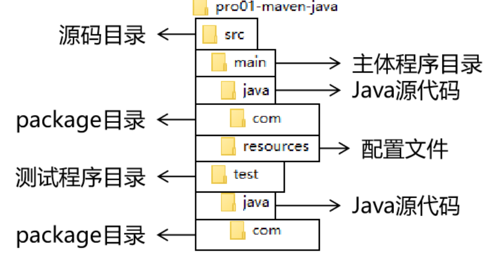

# Maven

**@author: Shuxin_Wang**

**@time: 2023.03.20**

--------

[toc]

---

# 1 Maven概述

## 1.1 为什么使用Maven

### 1.1.1 作为依赖管理工具

#### jar包的规模

随着我们使用越来越多的框架，或者框架封装程度越来越高，项目中使用的jar包也越来越多。项目中，一个模块里面用到上百个jar包是非常正常的。

#### jar包的来源

这个jar包所属技术的官网。官网通常是英文界面，网站的结构又不尽相同，甚至找到下载链接还发现需要通过特殊的工具下载；

第三方网站提供下载。问题是不规范，在使用过程中会出现各种问题；
- jar包的名称；
- jar包的版本；
- jar包内的具体细节；

而使用 Maven 后，依赖对应的 jar 包能够自动下载，方便、快捷又规范；

#### jar包之间的依赖关系

框架中使用的jar包，不仅数量庞大，而且彼此之间存在错综复杂的依赖关系。依赖关系的复杂程度，已经上升到了完全不能靠人力手动解决的程度。另外，jar包之间有可能产生冲突。进一步增加了我们在jar包使用过程中的难度。

而实际上jar包之间的依赖关系是普遍存在的，如果要由程序员手动梳理无疑会增加极高的学习成本，而这些工作又对实现业务功能毫无帮助。而使用Maven则几乎不需要管理这些关系，极个别的地方调整一下即可，极大的减轻了我们的工作量。

### 1.1.2 作为构建管理工具

可以不使用Maven，但是构建必须要做。当我们使用IDEA进行开发时，构建是IDEA替我们做的。

#### 脱离IDE环境仍需构建


### 1.1.3 结论

- 管理规模庞大的jar包，需要专门工具；
- 脱离IDE环境执行构建操作，需要专门工具；


## 1.2 什么是Maven

Maven是Apache软件基金会组织维护的一款专门为Java项目提供==**<u>构建</u>**==和==**<u>依赖</u>**==管理支持的工具。

### 1.2.1 构建

Java项目开发过程中，构建指的是使用『原材料生产产品』的过程。

- 原材料：
    - Java源代码
    - 基于HTML的 Thymeleaf 文件
    - 图片
    - 配置文件
    - ……
- 产品：
    - 一个可以在服务器上运行的项目

构建过程包含的主要的环节：

- 清理：删除上一次构建的结果，为下一次构建做好准备；
- 编译：Java源程序编译成`*.class`字节码文件；
- 测试：运行提前准备好的测试程序；
- 报告：针对刚才测试的结果生成一个全面的信息；
- 打包
    - Java工程：jar包；
    - Web工程：war包；
- 安装：把一个Maven工程经过打包操作生成的jar包或war包存入Maven的本地仓库；
- 部署
    - 部署jar包：把一个jar包部署到Nexus私服服务器上；
    - 部署war包：借助相关Maven插件（例如cargo），将war包部署到Tomcat服务器上；

### 1.2.2 依赖

如果 A 工程里面用到了 B 工程的类、接口、配置文件等等这样的资源，那么我们就可以说 A 依赖 B。例如：

- `junit-4.12`依赖`hamcrest-core-1.3`；
- `thymeleaf-3.0.12.RELEASE`依赖`ognl-3.1.26`
    - `ognl-3.1.26`依赖`javassist-3.20.0-GA`；
- `thymeleaf-3.0.12.RELEASE`依赖`attoparser-2.0.5.RELEASE`；
- `thymeleaf-3.0.12.RELEASE`依赖`unbescape-1.1.6.RELEASE`；
- `thymeleaf-3.0.12.RELEASE`依赖`slf4j-api-1.7.26`；

依赖管理中要解决的具体问题：

- jar包的**下载**：使用Maven之后，jar包会从规范的远程仓库下载到本地；
- jar包之间的**依赖**：通过依赖的传递性自动完成；
- jar包之间的**冲突**：通过对依赖的配置进行调整，让某些jar包不会被导入；

### 1.2.3 Maven的工作机制


# 2 Maven配置

## 2.1 Maven下载

### 2.1.1 官方地址

- 首页：[Maven – Welcome to Apache Maven](https://maven.apache.org/)

- 下载页面：[Maven – Download Apache Maven](https://maven.apache.org/download.cgi)


### 2.1.2 解压Maven

核心程序压缩包：apache-maven-3.9.1-bin.zip，解压到非中文、没有空格的目录。

在解压目录中，我们需要着重关注 Maven 的核心配置文件：`conf/settings.xml`。

### 2.1.3 设置配置文件

#### 指定本地仓库

```xml
<!-- localRepository
| The path to the local repository maven will use to store artifacts.
|
| Default: ${user.home}/.m2/repository
<localRepository>/path/to/local/repo</localRepository>
-->
<localRepository>D:/maven_repository</localRepository>
```

#### 配置JDK版本

```xml
<profile>
    <id>jdk-1.8</id>
    <activation>
    <activeByDefault>true</activeByDefault>
    <jdk>1.8</jdk>
    </activation>
    <properties>
    <maven.compiler.source>1.8</maven.compiler.source>
    <maven.compiler.target>1.8</maven.compiler.target> 
    <maven.compiler.compilerVersion>1.8</maven.compiler.compilerVersion>
    </properties>
</profile>
```

## 2.2 配置环境变量

将maven的bin文件夹路径加入到环境变量PATH中，配置后使用下面命令验证：

```shell
> mvn -v
Apache Maven 3.9.1 (2e178502fcdbffc201671fb2537d0cb4b4cc58f8)
Maven home: D:\JavaWeb\apache-maven-3.9.1
Java version: 17.0.6, vendor: Oracle Corporation, runtime: C:\Program Files\Java\jdk-17
Default locale: zh_CN, platform encoding: GBK
OS name: "windows 11", version: "10.0", arch: "amd64", family: "windows"
```

# 3 Maven命令行

## 3.1 根据坐标创建工程

### 3.1.1 坐标

#### Maven中的坐标

**<u>向量说明：</u>**

使用三个『向量』在『Maven的仓库』中==**唯一的定位**==到一个『jar』包。

- `groupId`：公司或组织的id；
- `artifactId`：一个项目或者是项目中的一个模块的id；
- `version`：版本号；

**<u>向量取值：</u>**

- `groupId`：公司或组织域名的倒序，通常也会加上项目名称
    - 例如：`com.atguigu.maven`
- `artifactId`：模块的名称，将来作为 Maven 工程的工程名
- `version`：模块的版本号，根据自己的需要设定
    - 例如：SNAPSHOT表示快照版本，正在迭代过程中，不稳定的版本；
    - 例如：RELEASE表示正式版本；

#### 坐标与jar包存储路径之间的对应关系

```xml
<groupId>javax.servlet</groupId>
<artifactId>servlet-api</artifactId>
<version>2.5</version>
```

坐标对应的jar包在Maven本地仓库中的位置：

```shell
Maven本地仓库根目录\javax\servlet\servlet-api\2.5\servlet-api-2.5.jar
```

### 3.1.2 实验操作

1. 创建目录作为后面操作的工作空间；
2. 在工作空间目录下打开终端；
3. 使用命令生成Maven工程；

```shell
> mvn archetype:generate
```

根据提示操作：

```shell
Choose a number or apply filter (format: [groupId:]artifactId, case sensitive contains): 2032:【回车，使用默认值】
Choose org.apache.maven.archetypes:maven-archetype-quickstart version:
1: 1.0-alpha-1
2: 1.0-alpha-2
3: 1.0-alpha-3
4: 1.0-alpha-4
5: 1.0
6: 1.1
7: 1.3
8: 1.4
Choose a number: 8:【回车，使用默认值】
Define value for property 'groupId': cn.seucs.maven
Define value for property 'artifactId': pro1_maven_test
Define value for property 'version' 1.0-SNAPSHOT: :【回车使用默认值】
Define value for property 'package' cn.seucs.maven: :【回车使用默认值】
Confirm properties configuration:
groupId: cn.seucs.maven
artifactId: pro1_maven_test
version: 1.0-SNAPSHOT
package: cn.seucs.maven
 Y: :【回车确定】
```

4. 调整

Maven默认生成的工程，对`junit`依赖的是较低的3.8.1版本，我们可以改成较适合的4.12版本。

自动生成的`App.java`和`AppTest.java`可以删除。

```xml
<!-- 依赖信息配置 -->
<!-- dependencies复数标签：里面包含dependency单数标签 -->
<dependencies>
  <!-- dependency单数标签：配置一个具体的依赖 -->
  <dependency>
    <!-- 通过坐标来依赖其他jar包 -->
    <groupId>junit</groupId>
    <artifactId>junit</artifactId>
    <version>4.12</version>
    
    <!-- 依赖的范围 -->
    <scope>test</scope>
  </dependency>
</dependencies>
```

5. 自动生成的`pom.xml`解读；

```xml
<!-- 当前Maven工程的坐标 -->
<groupId>com.atguigu.maven</groupId>
<artifactId>pro01-maven-java</artifactId>
<version>1.0-SNAPSHOT</version>

<!-- 当前Maven工程的打包方式，可选值有下面三种： -->
<!-- jar：表示这个工程是一个Java工程  -->
<!-- war：表示这个工程是一个Web工程 -->
<!-- pom：表示这个工程是“管理其他工程”的工程 -->
<packaging>jar</packaging>

<name>pro01-maven-java</name>
<url>http://maven.apache.org</url>

<properties>
<!-- 工程构建过程中读取源码时使用的字符集 -->
<project.build.sourceEncoding>UTF-8</project.build.sourceEncoding>
</properties>

<!-- 当前工程所依赖的jar包 -->
<dependencies>
<!-- 使用dependency配置一个具体的依赖 -->
<dependency>
  <!-- 在dependency标签内使用具体的坐标依赖我们需要的一个jar包 -->
  <groupId>junit</groupId>
  <artifactId>junit</artifactId>
  <version>4.12</version>
  <!-- scope标签配置依赖的范围 -->
  <scope>test</scope>
</dependency>
</dependencies>
```

### 3.1.3 POM

#### 含义

`POM：Project Object Model`，项目对象模型。和POM类似的是：`DOM（Document Object Model）`，文档对象模型。它们都是模型化思想的具体体现。

#### 模型化思想

`POM`表示将工程抽象为一个模型，再用程序中的对象来描述这个模型。这样我们就可以用程序来管理项目了。我们在开发过程中，最基本的做法就是将现实生活中的事物抽象为模型，然后封装模型相关的数据作为一个对象，这样就可以在程序中计算与现实事物相关的数据。

#### 对应的配置文件

`POM`理念集中体现在Maven工程根目录下`pom.xml`这个配置文件中。所以这个`pom.xml`配置文件就是Maven工程的核心配置文件。其实学习Maven就是学这个文件怎么配置，各个配置有什么用。

### 3.1.4 约定的目录结构

#### 各个目录作用



另外还有一个`target`目录专门存放构建操作输出的结果。

#### 约定目录结构的意义

`Maven`为了让构建过程能够尽可能==**<u>自动化</u>**==完成，所以必须约定目录结构的作用。例如：`Maven`执行编译操作，必须先去Java源程序目录读取Java源代码，然后执行编译，最后把编译结果存放在target目录。

#### 约定大于配置

Maven 对于目录结构这个问题，没有采用配置的方式，而是基于约定。这样会让我们在开发过程中非常方便。如果每次创建Maven工程后，还需要针对各个目录的位置进行详细的配置，那肯定非常麻烦。

目前开发领域的技术发展趋势就是：**<u>约定大于配置，配置大于编码</u>**。

## 3.2 在Maven中编写代码

### 3.2.1 主体程序

放在`main/java`的package部分：

```java
package com.atguigu.maven;
  
public class Calculator {
  
  public int sum(int i, int j){
    return i + j;
  }
}
```

### 3.2.2 测试程序

放在`test/java`的package部分：

```java
package com.atguigu.maven;
  
import org.junit.Test;
import com.atguigu.maven.Calculator;
  
// 静态导入的效果是将Assert类中的静态资源导入当前类
// 这样一来，在当前类中就可以直接使用Assert类中的静态资源，不需要写类名
import static org.junit.Assert.*;
  
public class CalculatorTest{
  
  @Test
  public void testSum(){
    
    // 1.创建Calculator对象
    Calculator calculator = new Calculator();
    
    // 2.调用Calculator对象的方法，获取到程序运行实际的结果
    int actualResult = calculator.sum(5, 3);
    
    // 3.声明一个变量，表示程序运行期待的结果
    int expectedResult = 8;
    
    // 4.使用断言来判断实际结果和期待结果是否一致
    // 如果一致：测试通过，不会抛出异常
    // 如果不一致：抛出异常，测试失败
    assertEquals(expectedResult, actualResult);
    
  }
}
```

## 3.3 执行构建命令

### 3.3.1 要求

运行Maven中和构建操作相关的命令时，==**<u>必须进入</u>**==到`pom.xml`所在的目录。

### 3.3.2 清理操作

```shell
> mvn clean
```

- 删除`target`目录

### 3.3.3 编译操作

**<u>主程序编译：</u>**

```shell
> mvn compile
```

- 主体程序编译结果存放的目录：`target/classes`；

**<u>测试程序编译：</u>**

```shell
> mvn test-compile
```

- 测试程序编译结果存放的目录：`target/test-classes`；

### 3.3.4 测试操作

```shell
> mvn test
```

- 测试的报告存放的目录：`target/surefire-reports`；

### 3.3.5 打包操作

```shell
> mvn package
```

- 打包的结果——jar包，存放的目录：`target`；

### 3.3.6 安装操作

```shell
> mvn install
[INFO] Installing D:\JavaWeb\code_test\maven_space\pro1_maven_test\target\pro1_maven_test-1.0-SNAPSHOT.jar to D:\maven_repository\cn\seucs\maven\pro1_maven_test\1.0-SNAPSHOT\pro1_maven_test-1.0-SNAPSHOT.jar
[INFO] Installing D:\JavaWeb\code_test\maven_space\pro1_maven_test\pom.xml to D:\maven_repository\cn\seucs\maven\pro1_maven_test\1.0-SNAPSHOT\pro1_maven_test-1.0-SNAPSHOT.pom
```

安装的效果是将本地构建过程中生成的 jar 包存入 Maven 本地仓库。这个 jar 包在 Maven 仓库中的路径是根据它的坐标生成的。

另外，安装操作还会将`pom.xml`文件转换为`XXX.pom`文件一起存入本地仓库。所以我们在Maven的本地仓库中想看一个jar包原始的`pom.xml`文件时，查看对应`XXX.pom`文件即可，它们是名字发生了改变，本质上是同一个文件。

```
mvn archetype:generate -DarchetypeGroupId=org.apache.maven.archetypes -DarchetypeArtifactId=maven-archetype-webapp -DgroupId=cn.seucs.webapp -DartifactId=pro2_maven_web
```
