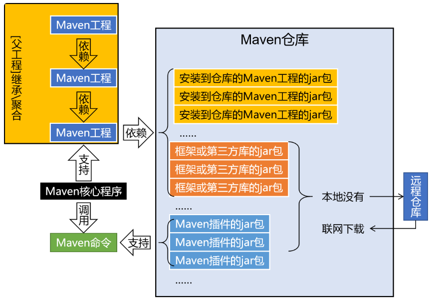
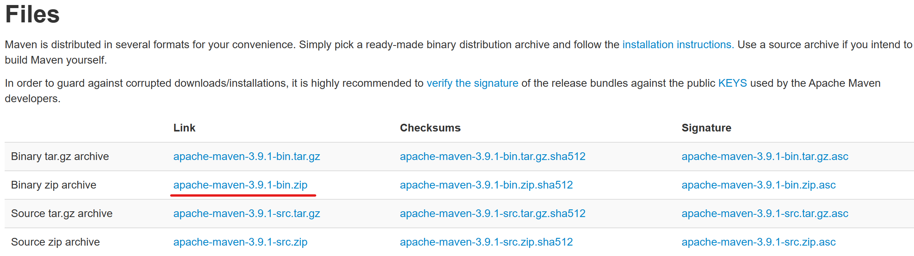

# Maven

**@author: Shuxin_Wang**

**@time: 2023.03.20**

--------

[toc]

---

# 1 Maven概述

## 1.1 为什么使用Maven

### 1.1.1 作为依赖管理工具

#### jar包的规模

随着我们使用越来越多的框架，或者框架封装程度越来越高，项目中使用的jar包也越来越多。项目中，一个模块里面用到上百个jar包是非常正常的。

#### jar包的来源

这个jar包所属技术的官网。官网通常是英文界面，网站的结构又不尽相同，甚至找到下载链接还发现需要通过特殊的工具下载；

第三方网站提供下载。问题是不规范，在使用过程中会出现各种问题；
- jar包的名称；
- jar包的版本；
- jar包内的具体细节；

而使用 Maven 后，依赖对应的 jar 包能够自动下载，方便、快捷又规范；

#### jar包之间的依赖关系

框架中使用的jar包，不仅数量庞大，而且彼此之间存在错综复杂的依赖关系。依赖关系的复杂程度，已经上升到了完全不能靠人力手动解决的程度。另外，jar包之间有可能产生冲突。进一步增加了我们在jar包使用过程中的难度。

而实际上jar包之间的依赖关系是普遍存在的，如果要由程序员手动梳理无疑会增加极高的学习成本，而这些工作又对实现业务功能毫无帮助。而使用Maven则几乎不需要管理这些关系，极个别的地方调整一下即可，极大的减轻了我们的工作量。

### 1.1.2 作为构建管理工具

可以不使用Maven，但是构建必须要做。当我们使用IDEA进行开发时，构建是IDEA替我们做的。

#### 脱离IDE环境仍需构建


### 1.1.3 结论

- 管理规模庞大的jar包，需要专门工具；
- 脱离IDE环境执行构建操作，需要专门工具；


## 1.2 什么是Maven

Maven是Apache软件基金会组织维护的一款专门为Java项目提供==**<u>构建</u>**==和==**<u>依赖</u>**==管理支持的工具。

### 1.2.1 构建

Java项目开发过程中，构建指的是使用『原材料生产产品』的过程。

- 原材料：
    - Java源代码
    - 基于HTML的 Thymeleaf 文件
    - 图片
    - 配置文件
    - ……
- 产品：
    - 一个可以在服务器上运行的项目

构建过程包含的主要的环节：

- 清理：删除上一次构建的结果，为下一次构建做好准备；
- 编译：Java源程序编译成`*.class`字节码文件；
- 测试：运行提前准备好的测试程序；
- 报告：针对刚才测试的结果生成一个全面的信息；
- 打包
    - Java工程：jar包；
    - Web工程：war包；
- 安装：把一个Maven工程经过打包操作生成的jar包或war包存入Maven的本地仓库；
- 部署
    - 部署jar包：把一个jar包部署到Nexus私服服务器上；
    - 部署war包：借助相关Maven插件（例如cargo），将war包部署到Tomcat服务器上；

### 1.2.2 依赖

如果 A 工程里面用到了 B 工程的类、接口、配置文件等等这样的资源，那么我们就可以说 A 依赖 B。例如：

- `junit-4.12`依赖`hamcrest-core-1.3`；
- `thymeleaf-3.0.12.RELEASE`依赖`ognl-3.1.26`
    - `ognl-3.1.26`依赖`javassist-3.20.0-GA`；
- `thymeleaf-3.0.12.RELEASE`依赖`attoparser-2.0.5.RELEASE`；
- `thymeleaf-3.0.12.RELEASE`依赖`unbescape-1.1.6.RELEASE`；
- `thymeleaf-3.0.12.RELEASE`依赖`slf4j-api-1.7.26`；

依赖管理中要解决的具体问题：

- jar包的**下载**：使用Maven之后，jar包会从规范的远程仓库下载到本地；
- jar包之间的**依赖**：通过依赖的传递性自动完成；
- jar包之间的**冲突**：通过对依赖的配置进行调整，让某些jar包不会被导入；

### 1.2.3 Maven的工作机制



# 2 Maven配置

## 2.1 Maven下载

### 2.1.1 官方地址

- 首页：[Maven – Welcome to Apache Maven](https://maven.apache.org/)

- 下载页面：[Maven – Download Apache Maven](https://maven.apache.org/download.cgi)



### 2.1.2 解压Maven

核心程序压缩包：apache-maven-3.9.1-bin.zip，解压到非中文、没有空格的目录。

在解压目录中，我们需要着重关注 Maven 的核心配置文件：`conf/settings.xml`。

### 2.1.3 设置配置文件

#### 指定本地仓库

```xml
<!-- localRepository
| The path to the local repository maven will use to store artifacts.
|
| Default: ${user.home}/.m2/repository
<localRepository>/path/to/local/repo</localRepository>
-->
<localRepository>D:/maven_repository</localRepository>
```

#### 配置JDK版本

```xml
<profile>
    <id>jdk-1.8</id>
    <activation>
    <activeByDefault>true</activeByDefault>
    <jdk>1.8</jdk>
    </activation>
    <properties>
    <maven.compiler.source>1.8</maven.compiler.source>
    <maven.compiler.target>1.8</maven.compiler.target> 
    <maven.compiler.compilerVersion>1.8</maven.compiler.compilerVersion>
    </properties>
</profile>
```

## 2.2 配置环境变量

将maven的bin文件夹路径加入到环境变量PATH中，配置后使用下面命令验证：

```shell
> mvn -v
Apache Maven 3.9.1 (2e178502fcdbffc201671fb2537d0cb4b4cc58f8)
Maven home: D:\JavaWeb\apache-maven-3.9.1
Java version: 17.0.6, vendor: Oracle Corporation, runtime: C:\Program Files\Java\jdk-17
Default locale: zh_CN, platform encoding: GBK
OS name: "windows 11", version: "10.0", arch: "amd64", family: "windows"
```

# 3 Maven命令行

