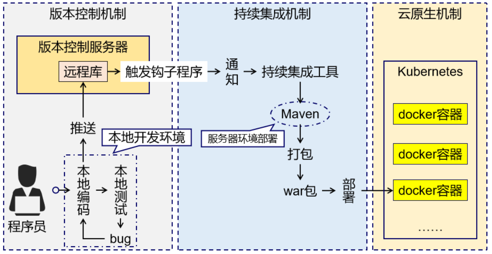

# Maven

**@author: Shuxin_Wang**

**@time: 2023.03.20**

--------

[toc]

---

# 1 Maven概述

## 1.1 为什么使用Maven

### 1.1.1 作为依赖管理工具

#### jar包的规模

随着我们使用越来越多的框架，或者框架封装程度越来越高，项目中使用的jar包也越来越多。项目中，一个模块里面用到上百个jar包是非常正常的。

#### jar包的来源

这个jar包所属技术的官网。官网通常是英文界面，网站的结构又不尽相同，甚至找到下载链接还发现需要通过特殊的工具下载；

第三方网站提供下载。问题是不规范，在使用过程中会出现各种问题；
- jar包的名称；
- jar包的版本；
- jar包内的具体细节；

而使用 Maven 后，依赖对应的 jar 包能够自动下载，方便、快捷又规范；

#### jar包之间的依赖关系

框架中使用的jar包，不仅数量庞大，而且彼此之间存在错综复杂的依赖关系。依赖关系的复杂程度，已经上升到了完全不能靠人力手动解决的程度。另外，jar包之间有可能产生冲突。进一步增加了我们在jar包使用过程中的难度。

而实际上jar包之间的依赖关系是普遍存在的，如果要由程序员手动梳理无疑会增加极高的学习成本，而这些工作又对实现业务功能毫无帮助。而使用Maven则几乎不需要管理这些关系，极个别的地方调整一下即可，极大的减轻了我们的工作量。

### 1.1.2 作为构建管理工具

可以不使用Maven，但是构建必须要做。当我们使用IDEA进行开发时，构建是IDEA替我们做的。

#### 脱离IDE环境仍需构建

### 1.1.3 结论

- 管理规模庞大的jar包，需要专门工具；
- 脱离IDE环境执行构建操作，需要专门工具；

## 1.2 什么是Maven

Maven是Apache软件基金会组织维护的一款专门为Java项目提供==**<u>构建</u>**==和==**<u>依赖</u>**==管理支持的工具。