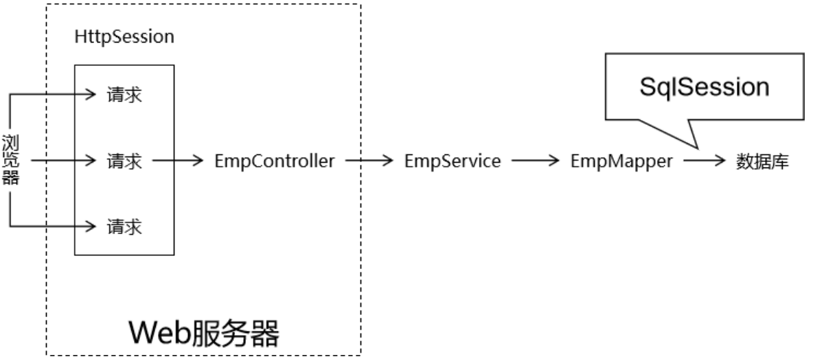
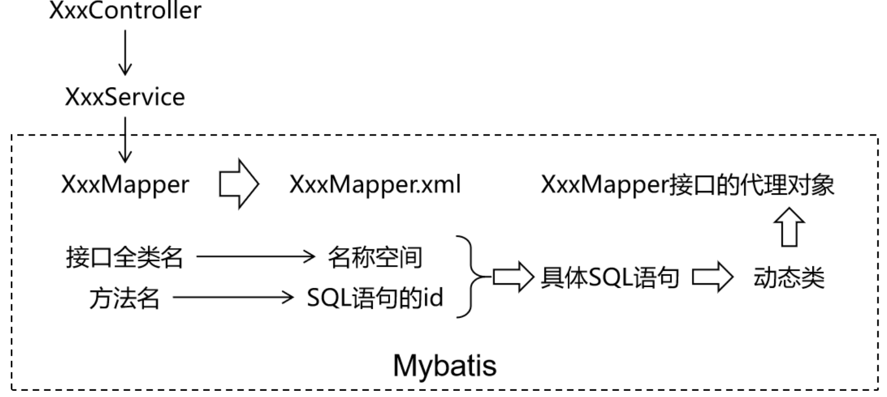
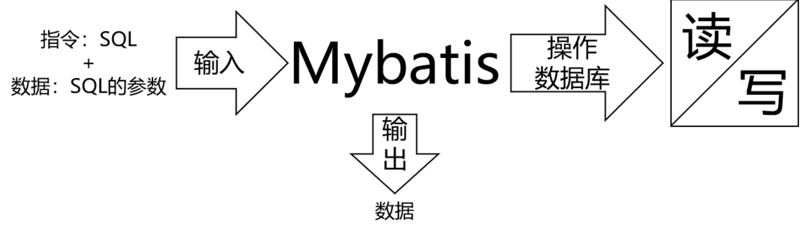
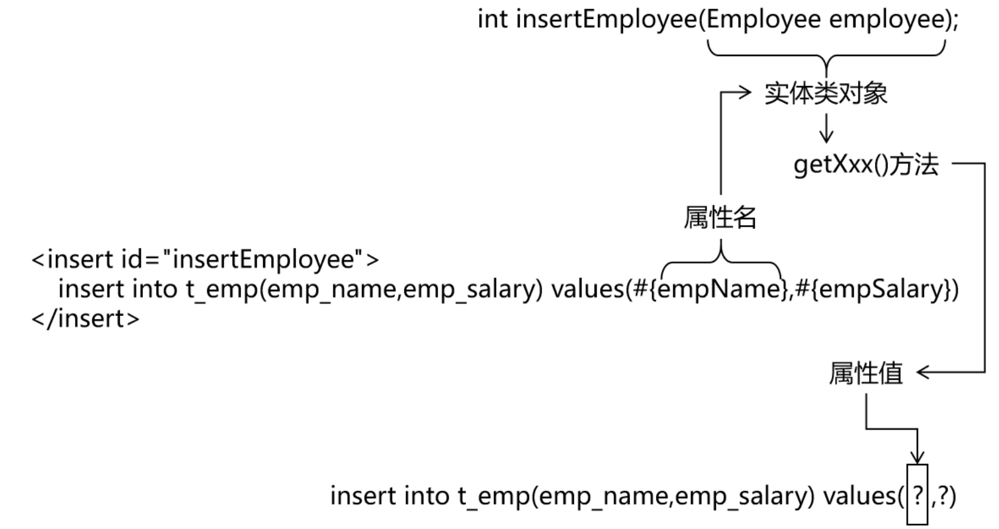
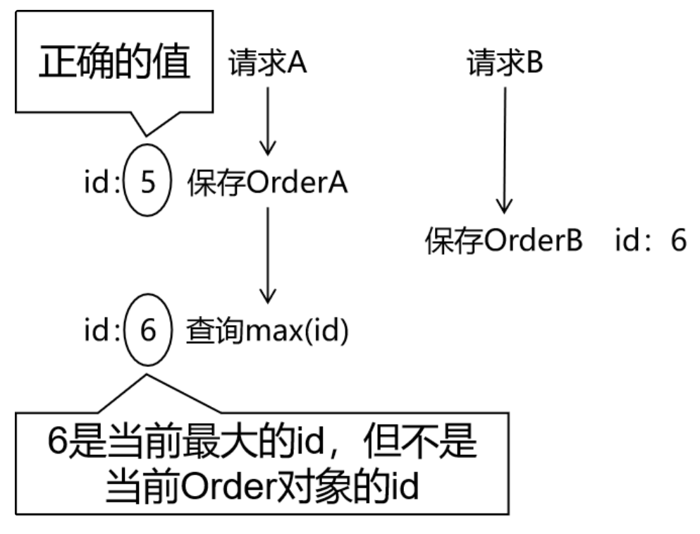

# Mybatis

**@author: Shuxin_Wang**

**@time: 2023.03.31**

---

[toc]

---

# 1 前言

## 1.1 总体技术体系

### 1.1.1 单一架构

一个项目，一个工程，导出为一个war包，在一个Tomcat上运行。也叫all in one。


### 1.1.2 分布式架构

一个项目（对应IDEA中的一个project），拆分成很多个模块，每个模块是一个IDEA中的一个module。每一个工程都是运行在自己的Tomcat上。模块之间可以互相调用。每一个模块内部可以看成是一个单一架构的应用。


## 1.2 框架的概念

框架 = jar包 + 配置文件


## 1.3 Mybatis历史

`MyBatis`最初是Apache的一个开源项目`iBatis`, 2010年6月这个项目由Apache Software Foundation迁移到了Google Code。随着开发团队转投Google Code旗下， `iBatis3.x`正式更名为`MyBatis`。代码于2013年11月迁移到Github；

`iBatis`一词来源于“`internet`”和“`abatis`”的组合，是一个基于Java的持久层框架。 `iBatis`提供的持久层框架包括SQL Maps和Data Access Objects（DAO）；

`Mybatis`的最大特点：轻量级。相对于Hibernate省略了大量不常用的功能，整体轻巧又高效；

## 1.4 Mybatis特性

- MyBatis支持定制化SQL、存储过程以及高级映射；
- MyBatis避免了几乎所有的JDBC代码和手动设置参数以及结果集解析操作；
- MyBatis可以使用简单的XML或注解实现配置和原始映射；将接口和Java的POJO（Plain Ordinary Java Object，普通的Java对象）映射成数据库中的记录；
- Mybatis是一个半自动的ORM（Object Relation Mapping）框架；

## 1.5 和其他持久化层技术对比

- JDBC
    - SQL 夹杂在Java代码中耦合度高，导致硬编码内伤；
    - 维护不易且实际开发需求中 SQL 有变化，频繁修改的情况多见；
    - 代码冗长，开发效率低；
- Hibernate 和 JPA
    - 操作简便，开发效率高；
    - 程序中的长难复杂SQL需要绕过框架；
    - 内部自动生成的SQL，不容易做特殊优化；
    - 基于全映射的全自动框架，大量字段的 POJO 进行部分映射时比较困难；
    - 反射操作太多，导致数据库性能下降；
- MyBatis
    - 轻量级，性能出色；
    - SQL 和 Java 编码分开，功能边界清晰。Java代码专注业务、SQL语句专注数据；
    - 开发效率稍逊于 HIbernate，但是完全能够接收；

开发效率：`Hibernate > Mybatis > JDBC`；

运行效率：`JDBC > Mybatis > Hibernate`；


# 2 日志框架

## 2.1 用日志打印代替sout

### 2.1.1 sout的问题

#### I/O影响性能

`System.out`对象是一个输出流对象，所以控制台输出信息本质上是I/O操作。而I/O操作是项目运行过程中两大性能瓶颈之一。

#### 无法统一管理

项目上线时，希望把所有（或一部分）`sout`打印关闭，但是只能手动一个一个查找，耗费开发人员的极大精力，因为`sout`的无度使用会使它分散在项目的各个角落。

### 2.1.2 使用好处

#### 设定级别，统一管理

日志框架会按照事件的严重程度来划分级别，例如：

- 错误（Error）：表示程序运行出错，比如抛异常等情况；
- 警告（Warning）：表示程序运行过程中有潜在风险，但此时并没有报错；
- 信息（Info）：表示程序运行过程中完成了一个关键动作，需要以程序运行信息的形式告知开发者；
- 调试（Debug）：表示程序运行过程中更加细致的信息，协助程序员调试程序；

通过在配置文件中指定某一个日志级别来控制系统要打印的内容。日志框架会打印**当前指定级别**的日志和比当前指定级别**更严重**的级别的日志。

例如在开发阶段，我们指定debug级别，项目上线修改成info级别，那么所有debug级别的日志就都不打印了，不需要到项目代码中一个一个修改，非常方便。

#### 灵活指定输出位置

使用日志框架不一定是打印到控制台，也可以保存到文件中或者保存到数据库。这就看具体的项目维护需求。

#### 自定义日志格式

打印日志数据可以使用日志框架的默认格式，也可以根据需要定制。

#### 基于日志分析问题

将来我们开发的应用系统中，不仅包含Java代码，还有很多中间件服务器。任何子系统出现故障我们都是通过日志来定位问题、分析故障原因。甚至更复杂的系统还会专门开发日志子系统，在主系统出现问题时抓取日志数据供维护人员参考。

而日志数据必须要有确定格式才便于格式化和抓取，这肯定不是随意写sout就能实现的。


## 2.2 Java日志体系的演变

### 2.2.1 门面

门面：类似于标准层、接口层

| 名称                                    | 说明                 |
| --------------------------------------- | -------------------- |
| JCL（Jakarta Commons Logging）          | 陈旧                 |
| SLF4J（Simple Logging Facade for Java） | 适合（**同一作者**） |
| jboss-logging                           | 特殊专业领域使用     |

### 2.2.2 实现

| 名称                     | 说明                                               |
| ------------------------ | -------------------------------------------------- |
| log4j                    | 最初版（**同一作者**）                             |
| JUL（java.util.logging） | JDK自带                                            |
| log4j2                   | Apache收购log4j后全面重构，内部实现和log4j完全不同 |
| logback                  | 优雅、强大（**同一作者**）                         |

### 2.2.3 最佳搭档

- 门面：`SLF4J`

- 实现：`logback`

### 2.2.4 用法

#### 导入依赖

```xml
<dependency>
  <groupId>ch.qos.logback</groupId>
  <artifactId>logback-classic</artifactId>
  <version>1.4.6</version>
  <scope>compile</scope>
</dependency>
```

#### 代码测试

```java
import org.junit.Test;
import org.slf4j.Logger;
import org.slf4j.LoggerFactory;

public class LogTest {
    private final Logger logger = LoggerFactory.getLogger(LogTest.class);

    @Test
    public void testLog(){
        logger.trace("hello trace");
        logger.debug("hello, debug");
        logger.info("hello info");
        logger.warn("hello warn");
        logger.error("hello error");
    }
}
```

#### 引入配置文件

`Logback`要求配置文件名称必须是`logback.xml`，存放路径在`main/resources`目录下。

配置文件示例如下：

```xml
<?xml version="1.0" encoding="UTF-8"?>
<configuration debug="true">
    <!-- 指定日志输出的位置，ConsoleAppender表示输出到控制台 -->
    <appender name="STDOUT"
              class="ch.qos.logback.core.ConsoleAppender">
        <encoder>
            <!-- 日志输出的格式 -->
            <!-- 按照顺序分别是：时间、日志级别、线程名称、打印日志的类、日志主体内容、换行 -->
            <pattern>[%d{HH:mm:ss.SSS}] [%-5level] [%thread] [%logger] [%msg]%n</pattern>
            <charset>UTF-8</charset>
        </encoder>
    </appender>
    <!-- 设置全局日志级别。日志级别按顺序分别是：TRACE、DEBUG、INFO、WARN、ERROR -->
    <!-- 指定任何一个日志级别都只打印当前级别和后面级别的日志。 -->
    <root level="INFO">
        <!-- 指定打印日志的appender，这里通过“STDOUT”引用了前面配置的appender -->
        <appender-ref ref="STDOUT" />
    </root>
    <!-- 根据特殊需求指定局部日志级别，可也是包名或全类名。 -->
    <logger name="com.atguigu.mybatis" level="DEBUG" />
</configuration>
```

## 2.3 Lombook插件使用

### 2.3.1 Lombok简介

使用`Lombok`注解就可以省略生成`getXxx()`、`setXxx()`方法、`toString()`方法、构造器等固定格式代码的繁琐操作，提高开发效率。包括`Logger`日志对象。

#### Lombok原理

`Lombok`是将自动生成的代码织入字节码文件中，从而实现：源代码没有，但是字节码文件有——毕竟我们最终运行的是字节码文件，只要字节码文件中有即可。而这个过程因为要参与源文件编译，所以需要安装IDEA插件。

### 2.3.2 使用Lombok注解

#### 加入依赖

```xml
<dependency>
  <groupId>org.projectlombok</groupId>
  <artifactId>lombok</artifactId>
  <version>1.18.26</version>
  <scope>compile</scope>
</dependency>
```

#### 注解功能

| 注解                | 作用                                                         |
| ------------------- | ------------------------------------------------------------ |
| @Data               | 生成getXxx()方法、setXxx()方法、toString()、equals()、canEqual()、hashCode()方法 |
| @AllArgsConstructor | 生成全参构造器                                               |
| @NoArgsConstructor  | 生成无参构造器                                               |
| @Slf4j              | 生成日志对象                                                 |
| @Getter             | 生成getXxx()方法                                             |
| @Setter             | 生成setXxx()方法                                             |
| @ToString           | 生成toString()方法                                           |

# 3 Mybatis基本用法

## 3.1 HelloWorld

### 3.1.1 物理建模

```sql
CREATE DATABASE `mybatis-example`;

USE `mybatis-example`;

CREATE TABLE `t_emp`(
  emp_id INT AUTO_INCREMENT,
  emp_name CHAR(100),
  emp_salary DOUBLE(10,5),
  PRIMARY KEY(emp_id)
);

INSERT INTO `t_emp`(emp_name,emp_salary) VALUES("tom",200.33);
INSERT INTO `t_emp`(emp_name,emp_salary) VALUES("jerry",666.66);
INSERT INTO `t_emp`(emp_name,emp_salary) VALUES("andy",777.77);
```

### 3.1.2 逻辑建模

#### 创建Maven项目加入依赖

```xml
<dependency>
  <groupId>org.projectlombok</groupId>
  <artifactId>lombok</artifactId>
  <version>1.18.26</version>
  <scope>compile</scope>
</dependency>
```

#### 创建Java实体类

实体类是和现实世界中某一个具体或抽象的概念对应，是软件开发过程中，为了管理现实世界中的数据而设计的模型。 实体类的多个不同的叫法：

- domain：领域模型；
- entity：实体；
- `POJO`：Plain Old Java Object；
- Java bean：一个Java类；

```java
/**
 * 和数据库表 t_emp 对应的实体类
 * emp_id INT AUTO_INCREMENT
 * emp_name CHAR(100)
 * emp_salary DOUBLE(10,5)
 *
 * Java 的实体类中，属性的类型不要使用基本数据类型，要使用包装类型。因为包装类型可以赋值为null，表示空，而基本数据类型不可以。
 */
@Data
@NoArgsConstructor
@AllArgsConstructor
public class Employee {

    private Integer empId;

    private String empName;

    private Double empSalary;

}

```

### 3.1.3 搭建框架环境

#### 导入依赖

```xml
<!-- Mybatis核心 -->
<dependency>
  <groupId>org.mybatis</groupId>
  <artifactId>mybatis</artifactId>
  <version>3.5.7</version>
</dependency>

<!-- junit测试 -->
<dependency>
  <groupId>junit</groupId>
  <artifactId>junit</artifactId>
  <version>4.12</version>
  <scope>test</scope>
</dependency>

<!-- MySQL驱动 -->
<dependency>
  <groupId>mysql</groupId>
  <artifactId>mysql-connector-java</artifactId>
  <version>5.1.3</version>
</dependency>
```

#### 配置文件

**<u>Mybatis全局配置文件:</u>**

习惯上命名为 `mybatis-config.xml`，这个文件名仅仅只是建议，并非强制要求。将来整合Spring之后，这个配置文件可以省略，所以大家操作时可以直接复制、粘贴。

```xml
<?xml version="1.0" encoding="UTF-8" ?>
<!DOCTYPE configuration
  PUBLIC "-//mybatis.org//DTD Config 3.0//EN"
  "http://mybatis.org/dtd/mybatis-3-config.dtd">

<configuration>

  <!-- environments表示配置Mybatis的开发环境，可以配置多个环境，在众多具体环境中，使用default属性指定实际运行时使用的环境。default属性的取值是environment标签的id属性的值。 -->
  <environments default="development">
  
    <!-- environment表示配置Mybatis的一个具体的环境 -->
    <environment id="development">

      <!-- Mybatis的内置的事务管理器 -->
      <transactionManager type="JDBC"/>

      <!-- 配置数据源 -->
      <dataSource type="POOLED">

        <!-- 建立数据库连接的具体信息 -->
        <property name="driver" value="com.mysql.cj.jdbc.Driver"/>
        <property name="url" value="jdbc:mysql://localhost:3306/mybatis-example"/>
        <property name="username" value="root"/>
        <property name="password" value="atguigu"/>
      </dataSource>

    </environment>
  </environments>

  <mappers>
    <!-- Mapper注册：指定Mybatis映射文件的具体位置 -->
    <!-- mapper标签：配置一个具体的Mapper映射文件 -->
    <!-- resource属性：指定Mapper映射文件的实际存储位置，这里需要使用一个以类路径根目录为基准的相对路径 -->
    <!--    对Maven工程的目录结构来说，resources目录下的内容会直接放入类路径，所以这里我们可以以resources目录为基准 -->
    <mapper resource="mappers/EmployeeMapper.xml"/>
  </mappers>

</configuration>
```

- ==**<u>注意：配置文件存放的位置是`src/main/resources`目录下</u>**==

**<u>Mybatis 映射配置文件:</u>**

相关概念：ORM（Object Relationship Mapping）对象关系映射。

- 对象：Java的实体类对象;
- 关系：关系型数据库;
- 映射：二者之间的对应关系;

下表列举的是最简单的单表映射（一个表和一个类）：

| Java概念 | 数据库概念 |
| -------- | ---------- |
| 类       | 表         |
| 属性     | 字段/列    |
| 对象     | 记录/行    |

==**<u>注意：`EmployeeMapper.xml`所在的目录要和`mybatis-config.xml`中使用`mapper`标签配置的一致。</u>**==

```xml
<?xml version="1.0" encoding="UTF-8" ?>
<!DOCTYPE mapper
        PUBLIC "-//mybatis.org//DTD Mapper 3.0//EN"
        "http://mybatis.org/dtd/mybatis-3-mapper.dtd">

<!-- mapper是根标签，namespace属性：在Mybatis全局范围内找到一个具体的Mapper配置 -->
<!-- 引入接口后，为了方便通过接口全类名来找到Mapper配置文件，所以通常将namespace属性设置为接口全类名 -->
<mapper namespace="com.atguigu.mybatis.dao.EmployeeMapper">

    <!-- 编写具体的SQL语句，使用id属性唯一的标记一条SQL语句 -->
    <!-- resultType属性：指定封装查询结果的Java实体类的全类名 -->
    <select id="selectEmployee" resultType="com.atguigu.mybatis.entity.Employee">
        <!-- Mybatis负责把SQL语句中的#{}部分替换成“?”占位符，在#{}内部还是要声明一个见名知意的名称 -->
        select emp_id empId,emp_name empName,emp_salary empSalary from t_emp where emp_id=#{empId}
    </select>
</mapper>
```

### 3.1.4 测试代码

```java
@Test
public void testSelectEmployee() throws IOException {

  // 1.创建SqlSessionFactory对象
  // ①声明Mybatis全局配置文件的路径
  String mybatisConfigFilePath = "mybatis-config.xml";

  // ②以输入流的形式加载Mybatis配置文件
  InputStream inputStream = Resources.getResourceAsStream(mybatisConfigFilePath);

  // ③基于读取Mybatis配置文件的输入流创建SqlSessionFactory对象
  SqlSessionFactory sessionFactory = new SqlSessionFactoryBuilder().build(inputStream);

  // 2.使用SqlSessionFactory对象开启一个会话
  SqlSession session = sessionFactory.openSession();

  // 3.根据Mapper配置文件的名称空间+SQL语句的id找到具体的SQL语句
  // 格式是：名称空间.SQL语句的id
  String statement = "com.atguigu.mybatis.dao.EmployeeMapper.selectEmployee";

  // 要传入SQL语句的参数
  Integer empId = 1;

  // 执行SQL语句
  Object result = session.selectOne(statement, empId);

  System.out.println("o = " + result);

  // 4.关闭SqlSession
  session.close();

}
```

说明：

- `SqlSession`：代表Java程序和数据库之间的会话。（`HttpSession`是Java程序和浏览器之间的会话）；
- `SqlSessionFactory`：是“生产”`SqlSession`的“工厂”；
- 工厂模式：如果创建某一个对象，使用的过程基本固定，那么我们就可以把创建这个对象的相关代码封装到一个“工厂类”中，以后都使用这个工厂类来“生产”我们需要的对象；



## 3.2 HelloWorld强化

### 3.2.1 加入日志

在Mybatis工作过程中，通过打印日志的方式，将要执行的SQL语句打印出来。

#### 加入依赖

```xml
<!-- 日志 -->
<dependency>
    <groupId>ch.qos.logback</groupId>
    <artifactId>logback-classic</artifactId>
    <version>1.2.3</version>
</dependency>
```

#### 加入配置文件

```xml
<?xml version="1.0" encoding="UTF-8"?>
<configuration debug="true">
    <!-- 指定日志输出的位置，ConsoleAppender表示输出到控制台 -->
    <appender name="STDOUT"
              class="ch.qos.logback.core.ConsoleAppender">
        <encoder>
            <!-- 日志输出的格式 -->
            <!-- 按照顺序分别是：时间、日志级别、线程名称、打印日志的类、日志主体内容、换行 -->
            <pattern>[%d{HH:mm:ss.SSS}] [%-5level] [%thread] [%logger] [%msg]%n</pattern>
            <charset>UTF-8</charset>
        </encoder>
    </appender>

    <!-- 设置全局日志级别。日志级别按顺序分别是：TRACE、DEBUG、INFO、WARN、ERROR -->
    <!-- 指定任何一个日志级别都只打印当前级别和后面级别的日志。 -->
    <root level="INFO">
        <!-- 指定打印日志的appender，这里通过“STDOUT”引用了前面配置的appender -->
        <appender-ref ref="STDOUT" />
    </root>

    <!-- 根据特殊需求指定局部日志级别 -->
    <logger name="com.atguigu.mybatis" level="DEBUG" />
</configuration>
```

#### 修改测试代码

这里我们仅仅修改查询结果的打印方式，为此需要做两件事：

- 在类上加`@Slf4j`注解；
- 使用`Logger`对象打印数据；

```java
if (result != null) {
    log.info(result.toString());
}
```

### 3.2.2 关联外部属性文件

在实际开发时，同一套代码往往会对应多个不同的具体服务器环境。使用的数据库连接参数也不同。为了更好的维护这些信息，我们建议把数据库连接信息提取到Mybatis全局配置文件外边。

#### 创建属性文件

```properties
wechat.dev.driver=com.mysql.jdbc.Driver
wechat.dev.url=jdbc:mysql://192.168.198.100:3306/mybatis-example
wechat.dev.username=root
wechat.dev.password=atguigu
    
wechat.test.driver=com.mysql.jdbc.Driver
wechat.test.url=jdbc:mysql://192.168.198.150:3306/mybatis-example
wechat.test.username=root
wechat.test.password=atguigu
    
wechat.product.driver=com.mysql.jdbc.Driver
wechat.product.url=jdbc:mysql://192.168.198.200:3306/mybatis-example
wechat.product.username=root
wechat.product.password=atguigu
```

#### 引入属性文件中的值

在`Mybatis`全局配置文件中指定外部`jdbc.properties`文件的位置。

```xml
<properties resource="jdbc.properties"/>
```

#### 引用属性文件中的值

在需要具体属性值的时候使用${key}格式引用属性文件中的键

```XML
<dataSource type="POOLED">
    <!-- 建立数据库连接的具体信息（引用了外部属性文件中的数据） -->
    <property name="driver" value="${wechat.dev.driver}"/>
    <property name="url" value="${wechat.dev.url}"/>
    <property name="username" value="${wechat.dev.username}"/>
    <property name="password" value="${wechat.dev.password}"/>
</dataSource>
```

### 3.2.3 用上Mapper接口

Mybatis中的`Mapper`接口相当于以前的Dao。但是区别在于，Mapper仅仅只是建接口即可，我们不需要提供实现类。该用法的思路如下图所示：



#### 测试类中抽取代码

这一步和Mapper接口没关系，只是对代码本身的优化：

```Java
    private SqlSession session;
    
    // junit会在每一个@Test方法前执行@Before方法
    @Before
    public void init() throws IOException {
         session = new SqlSessionFactoryBuilder()
                 .build(
                         Resources.getResourceAsStream("mybatis-config.xml"))
                 .openSession();
    }
    
    // junit会在每一个@Test方法后执行@After方法
    @After
    public void clear() {
        session.commit();
        session.close();
    }
```

#### 声明Mapper接口

```java
public interface EmployeeMapper {

    Employee selectEmployee(Integer empId);
    
}
```

- 方法名和SQL的`id`一致；
- 方法返回值和`resultType`一致；
- 方法的参数和SQL的参数一致；
- 接口的全类名和映射配置文件的名称空间一致；

#### 测试方法

```java
 @Test
public void testUsrMapperInterface() {
    // 1.根据EmployeeMapper接口的Class对象获取Mapper接口类型的对象
    EmployeeMapper employeeMapper = session.getMapper(EmployeeMapper.class);
    // 2.调用EmployeeMapper接口的方法完成对数据库的操作
    Employee emp = employeeMapper.selectEmployee(1);
    // 3.打印查询结果
    if (emp != null)
        log.info(emp.toString());
}
```

## 3.3 给SQL语句传参

### 3.3.1 `#{}`形式

Mybatis会将SQL语句中的`#{}`转换为问号占位符。

### 3.3.2 `${}`形式

`${}`形式传参，底层Mybatis做的是字符串拼接操作。

>  通常不会采用`${}`的方式传值。 一个特定的适用场景是：通过Java程序动态生成数据库表，表名部分需要Java程序通过参数传入；而JDBC对于表名部分是不能使用问号占位符的，此时只能使用`${}`。 结论：实际开发中，能用`#{}`实现的，肯定不用`${}`。


## 3.4 数据输入

### 3.4.1 MyBatis总体机制概括



### 3.4.2 概括说明

这里数据输入具体是指上层方法（例如Service方法）调用Mapper接口时，数据传入的形式。

- 简单类型：只包含一个值的数据类型
    - 基本数据类型：int、byte、short、double、……
    - 基本数据类型的包装类型：Integer、Character、Double、……
    - 字符串类型：String
- 复杂类型：包含多个值的数据类型
    - 实体类类型：Employee、Department、……
    - 集合类型：List、Set、Map、……
    - 数组类型：int[]、String[]、……
    - 复合类型：List<Employee>、实体类中包含集合……

### 3.4.3 单个简单类型参数

#### 抽象方法声明

```java
Employee selectEmployee(Integer empId);
```

#### SQL语句

```xml
<select id="selectEmployee" resultType="com.atguigu.mybatis.entity.Employee">

  select emp_id empId,emp_name empName,emp_salary empSalary from t_emp where emp_id=#{empId}

</select>
```

单个简单类型参数，在`#{}`中可以随意命名，但是没有必要。**<u>通常还是使用和接口方法参数同名</u>**。

### 3.4.4 实体类型参数

#### 抽象方法声明

```java
int insertEmployee(Employee employee);
```

#### SQL语句

```xml
<insert id="insertEmployee">

  insert into t_emp(emp_name,emp_salary) values(#{empName},#{empSalary})

</insert>
```



Mybatis会根据`#{}`中传入的数据，加工成`getXxx()`方法，通过反射在实体类对象中调用这个方法，从而获取到对应的数据。填充到`#{}`解析后的问号占位符这个位置。

### 3.4.5 零散的简单数据类型

#### 抽象方法声明

```java
int updateEmployee(@Param("empId") Integer empId,@Param("empSalary") Double empSalary);
```

#### SQL语句

```xml
<update id="updateEmployee">

  update t_emp set emp_salary=#{empSalary} where emp_id=#{empId}

</update>
```

### 3.4.6 Map类型参数

#### 抽象方法声明

```java
int updateEmployeeByMap(Map<String, Object> paramMap);
```

#### SQL语句

```xml
<update id="updateEmployeeByMap">

  update t_emp set emp_salary=#{empSalaryKey} where emp_id=#{empIdKey}

</update>
```

#### 测试

```java
@Test
public void testUpdateEmpNameByMap() {

  EmployeeMapper mapper = session.getMapper(EmployeeMapper.class);

  Map<String, Object> paramMap = new HashMap<>();

  paramMap.put("empSalaryKey", 999.99);

  paramMap.put("empIdKey", 5);

  int result = mapper.updateEmployeeByMap(paramMap);

  log.info("result = " + result);

}
```

#### 使用场景

有很多零散的参数需要传递，但是没有对应的实体类类型可以使用。使用@Param注解一个一个传入又太麻烦了。所以都封装到Map中。


## 3.5 数据输出

数据输出总体上有两种形式：

- 增删改操作返回的受影响行数：直接使用 int 或 long 类型接收即可
- 查询操作的查询结果

### 3.5.1 返回单个简单类型数据

#### 抽象方法

```java
int selectEmpCount();
```

#### SQL语句

```xml
<select id="selectEmpCount" resultType="int">

  select count(*) from t_emp

</select>
```

Mybatis内部给常用的数据类型设定了很多别名。 以`int`类型为例，可以写的名称有：`int`、`integer`、`Integer`、`java.lang.Integer`、`Int`、`INT`、`INTEGER`等等。

### 3.5.2 返回实体类对象

#### 抽象方法

```java
Employee selectEmployee(Integer empId);
```

#### SQL语句

```xml
<!-- 编写具体的SQL语句，使用id属性唯一的标记一条SQL语句 -->
<!-- resultType属性：指定封装查询结果的Java实体类的全类名 -->
<select id="selectEmployee" resultType="com.atguigu.mybatis.entity.Employee">

  <!-- Mybatis负责把SQL语句中的#{}部分替换成“?”占位符 -->
  <!-- 给每一个字段设置一个别名，让别名和Java实体类中属性名一致 -->
  select emp_id empId,emp_name empName,emp_salary empSalary from t_emp where emp_id=#{maomi}

</select>
```

通过给数据库表字段加别名，让查询结果的每一列都和Java实体类中属性对应起来。

#### 增加配置自动识别对应关系

在 Mybatis 全局配置文件中，做了下面的配置，select语句中可以不给字段设置别名

```XML
<!-- 在全局范围内对Mybatis进行配置 -->
<settings>
  <!-- 具体配置 -->
  <!-- 从org.apache.ibatis.session.Configuration类中可以查看能使用的配置项 -->
  <!-- 将mapUnderscoreToCamelCase属性配置为true，表示开启自动映射驼峰式命名规则 -->
  <!-- 规则要求数据库表字段命名方式：单词_单词 -->
  <!-- 规则要求Java实体类属性名命名方式：首字母小写的驼峰式命名 -->
  <setting name="mapUnderscoreToCamelCase" value="true"/>
</settings>
```

### 3.5.3 返回Map类型

适用于SQL查询返回的各个字段综合起来并不和任何一个现有的实体类对应，没法封装到实体类对象中。能够封装成实体类类型的，就不使用Map类型。

#### 抽象方法

```java
Map<String,Object> selectEmpNameAndMaxSalary();
```

#### SQL语句

```xml
<!-- Map<String,Object> selectEmpNameAndMaxSalary(); -->
<!-- 返回工资最高的员工的姓名和他的工资 -->
<select id="selectEmpNameAndMaxSalary" resultType="map">

  SELECT
    emp_name 员工姓名,
    emp_salary 员工工资,
    (SELECT AVG(emp_salary) FROM t_emp) 部门平均工资
  FROM t_emp WHERE emp_salary=(
    SELECT MAX(emp_salary) FROM t_emp
  )

</select>
```

### 3.5.4 返回List类型

查询结果返回多个实体类对象，希望把多个实体类对象放在List集合中返回。此时不需要任何特殊处理，在resultType属性中还是设置实体类类型即可。

#### 抽象方法

```java
List<Employee> selectAll();
```

#### SQL语句

```xml
<!-- List<Employee> selectAll(); -->

<select id="selectAll" resultType="com.atguigu.mybatis.entity.Employee">

  select emp_id empId,emp_name empName,emp_salary empSalary
  from t_emp

</select>
```

### 3.5.5 返回自增主键

#### 返回场景

例如：保存订单信息。需要保存`Order`对象和`List<OrderItem>`。其中，`OrderItem`对应的数据库表，包含一个外键，指向`Order`对应表的主键。  

在保存`List<OrderItem>`的时候，需要使用下面的SQL：

```sql
insert into t_order_item(item_name,item_price,item_count,order_id) values(...)
```

这里需要用到的order_id，是在保存Order对象时，数据库表以自增方式产生的，需要特殊办法拿到这个自增的主键值。至于，为什么不能通过查询最大主键的方式解决这个问题，参考下图：



#### SQL语句

```xml
<!-- int insertEmployee(Employee employee); -->
<!-- useGeneratedKeys属性字面意思就是“使用生成的主键” -->
<!-- keyProperty属性可以指定主键在实体类对象中对应的属性名，Mybatis会将拿到的主键值存入这个属性 -->
<insert id="insertEmployee" useGeneratedKeys="true" keyProperty="empId">

  insert into t_emp(emp_name,emp_salary)
  values(#{empName},#{empSalary})

</insert>
```

==**<u>Mybatis是将自增主键的值设置到实体类对象中，而不是以Mapper接口方法返回值的形式返回</u>**==

#### 不支持自增主键的数据库

而对于不支持自增型主键的数据库（例如 Oracle），则可以使用 selectKey 子元素：selectKey 元素将会首先运行，id 会被设置，然后插入语句会被调用

```XML
<insert id="insertEmployee" parameterType="com.atguigu.mybatis.beans.Employee"  databaseId="oracle">

  <selectKey order="BEFORE" keyProperty="id" resultType="integer">

    select employee_seq.nextval from dual 

  </selectKey>  

  insert into orcl_employee(id,last_name,email,gender) values(#{id},#{lastName},#{email},#{gender})

</insert>
```

或者是

```XML
<insert id="insertEmployee" parameterType="com.atguigu.mybatis.beans.Employee"  databaseId="oracle">

  <selectKey order="AFTER" keyProperty="id" resultType="integer">

    select employee_seq.currval from dual 

  </selectKey>  

  insert into orcl_employee(id,last_name,email,gender) values(employee_seq.nextval,#{lastName},#{email},#{gender})

</insert>
```

### 3.5.6 使用resultMap

使用resultMap标签定义对应关系，再在后面的SQL语句中引用这个对应关系

```XML
<!-- 专门声明一个resultMap设定column到property之间的对应关系 -->
<resultMap id="selectEmployeeByRMResultMap" type="com.atguigu.mybatis.entity.Employee">

  <!-- 使用id标签设置主键列和主键属性之间的对应关系 -->
  <!-- column属性用于指定字段名；property属性用于指定Java实体类属性名 -->
  <id column="emp_id" property="empId"/>

  <!-- 使用result标签设置普通字段和Java实体类属性之间的关系 -->
  <result column="emp_name" property="empName"/>

  <result column="emp_salary" property="empSalary"/>

</resultMap>

<!-- Employee selectEmployeeByRM(Integer empId); -->
<select id="selectEmployeeByRM" resultMap="selectEmployeeByRMResultMap">

  select emp_id,emp_name,emp_salary from t_emp where emp_id=#{empId}

</select>
```


# 4 使用Mybatis映射关联关系

## 4.1 概念

### 4.1.1 关联关系概念

#### 数量关系

主要体现在数据库表中

- 一对一

    夫妻关系，人和身份证号
- 一对多

    用户和用户的订单，锁和钥匙
- 多对多

    老师和学生，部门和员工

#### 关联方向

主要体现在Java实体类中

- 双向：双方都可以访问到对方
    - Customer：包含Order的集合属性
    - Order：包含单个Customer的属性
- 单向：双方中只有一方能够访问到对方
    - Customer：不包含Order的集合属性，访问不到Order
    - Order：包含单个Customer的属性
