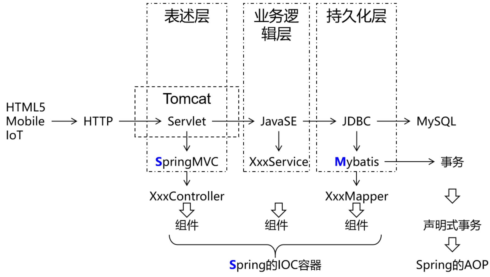
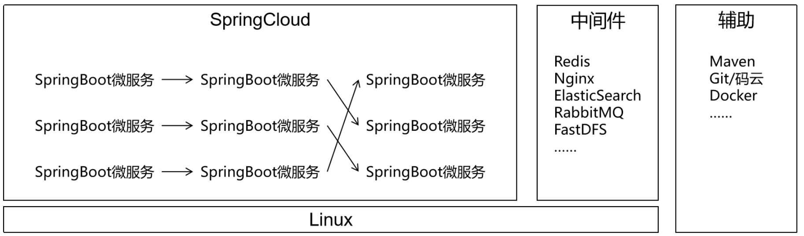
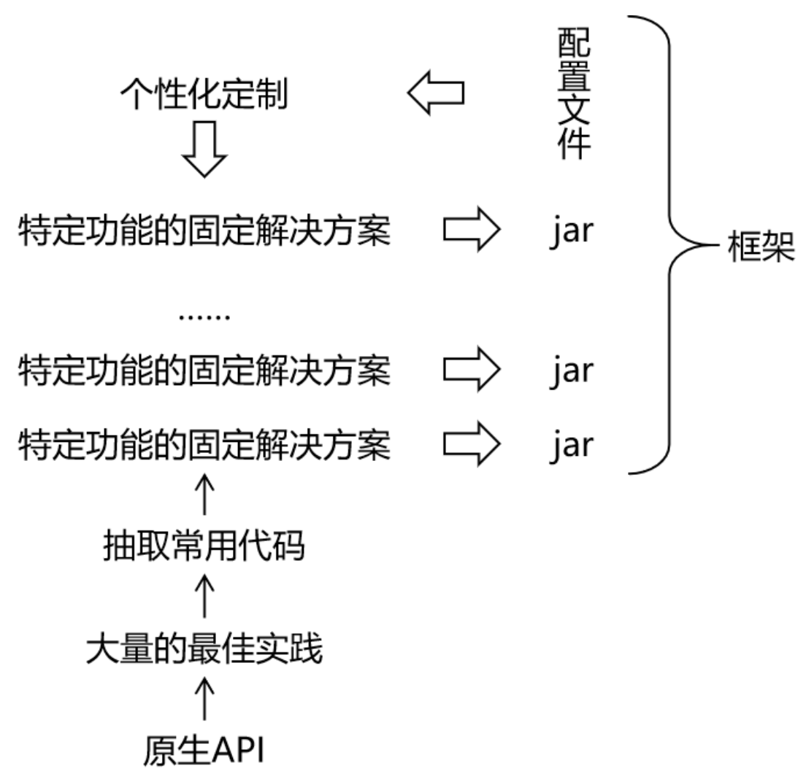

# Mybatis

**@author: Shuxin_Wang**

**@time: 2023.03.31**

---

[toc]

---

# 1 前言

## 1.1 总体技术体系

### 1.1.1 单一架构

一个项目，一个工程，导出为一个war包，在一个Tomcat上运行。也叫all in one。

### 1.1.2 分布式架构

一个项目（对应IDEA中的一个project），拆分成很多个模块，每个模块是一个IDEA中的一个module。每一个工程都是运行在自己的Tomcat上。模块之间可以互相调用。每一个模块内部可以看成是一个单一架构的应用。

## 1.2 框架的概念

框架 = jar包 + 配置文件

## 1.3 Mybatis历史

`MyBatis`最初是Apache的一个开源项目`iBatis`, 2010年6月这个项目由Apache Software Foundation迁移到了Google Code。随着开发团队转投Google Code旗下， `iBatis3.x`正式更名为`MyBatis`。代码于2013年11月迁移到Github；

`iBatis`一词来源于“`internet`”和“`abatis`”的组合，是一个基于Java的持久层框架。 `iBatis`提供的持久层框架包括SQL Maps和Data Access Objects（DAO）；

`Mybatis`的最大特点：轻量级。相对于Hibernate省略了大量不常用的功能，整体轻巧又高效；

## 1.4 Mybatis特性

- MyBatis支持定制化SQL、存储过程以及高级映射；
- MyBatis避免了几乎所有的JDBC代码和手动设置参数以及结果集解析操作；
- MyBatis可以使用简单的XML或注解实现配置和原始映射；将接口和Java的POJO（Plain Ordinary Java Object，普通的Java对象）映射成数据库中的记录；
- Mybatis是一个半自动的ORM（Object Relation Mapping）框架；

## 1.5 和其他持久化层技术对比

- JDBC
    - SQL 夹杂在Java代码中耦合度高，导致硬编码内伤；
    - 维护不易且实际开发需求中 SQL 有变化，频繁修改的情况多见；
    - 代码冗长，开发效率低；
- Hibernate 和 JPA
    - 操作简便，开发效率高；
    - 程序中的长难复杂SQL需要绕过框架；
    - 内部自动生成的SQL，不容易做特殊优化；
    - 基于全映射的全自动框架，大量字段的 POJO 进行部分映射时比较困难；
    - 反射操作太多，导致数据库性能下降；
- MyBatis
    - 轻量级，性能出色；
    - SQL 和 Java 编码分开，功能边界清晰。Java代码专注业务、SQL语句专注数据；
    - 开发效率稍逊于 HIbernate，但是完全能够接收；

开发效率：`Hibernate > Mybatis > JDBC`；

运行效率：`JDBC > Mybatis > Hibernate`；

# 2 日志框架

## 2.1 用日志打印代替sout

