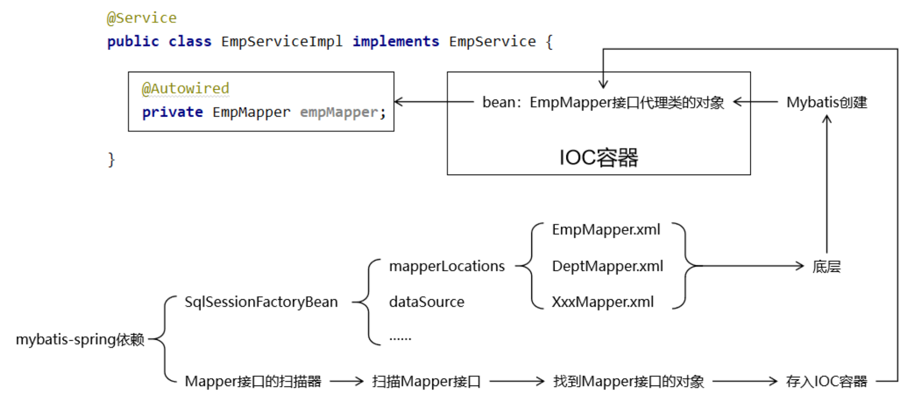

# SSM

**@author: Shuxin_Wang**

**@time: 2023.04.08**

---

[toc]

---

# 1 Spring和Mybatis整合

**本质**：Spring接管一切，代码更加简洁。

- Spring管理数据源，连接数据库；
- Spring管理`SqlSessionFactory`，开启`SqlSession`的细节被屏蔽了；
- Spring的IOC容器负责注入Mapper接口；
- Spring管理声明式事务；

## 1.1 连接数据库

### 1.1.1 整体所需依赖

```xml
<!-- SpringMVC -->
<dependency>
    <groupId>org.springframework</groupId>
    <artifactId>spring-webmvc</artifactId>
    <version>5.3.1</version>
</dependency>
 
<!-- Spring 持久化层所需依赖 -->
<dependency>
    <groupId>org.springframework</groupId>
    <artifactId>spring-orm</artifactId>
    <version>5.3.1</version>
</dependency>
 
<!-- 日志 -->
<dependency>
    <groupId>ch.qos.logback</groupId>
    <artifactId>logback-classic</artifactId>
    <version>1.2.3</version>
</dependency>
 
<!-- ServletAPI -->
<dependency>
    <groupId>javax.servlet</groupId>
    <artifactId>javax.servlet-api</artifactId>
    <version>3.1.0</version>
    <scope>provided</scope>
</dependency>
 
<!-- Spring5和Thymeleaf整合包 -->
<dependency>
    <groupId>org.thymeleaf</groupId>
    <artifactId>thymeleaf-spring5</artifactId>
    <version>3.0.12.RELEASE</version>
</dependency>
 
<!-- Mybatis 和 Spring 的整合包 -->
<dependency>
    <groupId>org.mybatis</groupId>
    <artifactId>mybatis-spring</artifactId>
    <version>2.0.6</version>
</dependency>
 
<!-- Mybatis核心 -->
<dependency>
    <groupId>org.mybatis</groupId>
    <artifactId>mybatis</artifactId>
    <version>3.5.7</version>
</dependency>
 
<!-- MySQL驱动 -->
<dependency>
    <groupId>mysql</groupId>
    <artifactId>mysql-connector-java</artifactId>
    <version>5.1.3</version>
</dependency>
 
<!-- 数据源 -->
<dependency>
    <groupId>com.alibaba</groupId>
    <artifactId>druid</artifactId>
    <version>1.0.31</version>
</dependency>
 
<!-- Spring 的测试功能 -->
<dependency>
    <groupId>org.springframework</groupId>
    <artifactId>spring-test</artifactId>
    <version>5.3.1</version>
</dependency>
 
<!-- junit4 -->
<dependency>
    <groupId>junit</groupId>
    <artifactId>junit</artifactId>
    <version>4.12</version>
    <scope>test</scope>
</dependency>

<!-- Lombok -->
<dependency>
    <groupId>org.projectlombok</groupId>
    <artifactId>lombok</artifactId>
    <version>1.18.12</version>
    <scope>provided</scope>
</dependency>
```

### 1.1.2 配置数据源

#### 创建jdbc.properties

```properties
jdbc.user=root
jdbc.password=atguigu
jdbc.url=jdbc:mysql://192.168.200.100:3306/mybatis-example
jdbc.driver=com.mysql.jdbc.Driver
```

#### 加入日志和Spring配置文件

```xml
<!-- 加载外部属性文件 -->
<context:property-placeholder location="classpath:jdbc.properties"/>
 
<!-- 配置数据源 -->
<bean id="druidDataSource" class="com.alibaba.druid.pool.DruidDataSource">
    <property name="username" value="${jdbc.user}"/>
    <property name="password" value="${jdbc.password}"/>
    <property name="driverClassName" value="${jdbc.driver}"/>
    <property name="url" value="${jdbc.url}"/>
</bean>
```

#### 测试

```java
@RunWith(SpringJUnit4ClassRunner.class)
@ContextConfiguration(value = "classpath:spring-persist.xml")
@Slf4j
public class SSMTest {

    @Autowired
    private DataSource dataSource;

    @Test
    public void testConnection() throws SQLException {
        Connection connection = dataSource.getConnection();
        log.debug("connection = " + connection);
    }

}
```

## 1.2 整合Mybatis

### 1.2.1 思路



### 1.2.2 Mybatis-Spring技术

#### 版本匹配说明

| MyBatis-Spring | MyBatis | Spring Framework | Spring Batch | Java     |
| :------------- | :------ | :--------------- | :----------- | :------- |
| **3.0**        | 3.5+    | 6.0+             | 5.0+         | Java 17+ |
| **2.1**        | 3.5+    | 5.x              | 4.x          | Java 8+  |
| **2.0**        | 3.5+    | 5.x              | 4.x          | Java 8+  |
| **1.3**        | 3.4+    | 3.2.2+           | 2.1+         | Java 6+  |

#### 加入依赖

```xml
<!-- https://mvnrepository.com/artifact/org.mybatis/mybatis-spring -->
<dependency>
    <groupId>org.mybatis</groupId>
    <artifactId>mybatis-spring</artifactId>
    <version>2.0.6</version>
</dependency>
```

### 1.2.3 创建Mybatis全局配置文件

```xml
<?xml version="1.0" encoding="UTF-8" ?>
<!DOCTYPE configuration
        PUBLIC "-//mybatis.org//DTD Config 3.0//EN"
        "http://mybatis.org/dtd/mybatis-3-config.dtd">
<configuration>
 
    <!-- Mybatis全局配置 -->
    <settings>
        <!-- 将数据库表字段映射到驼峰式命名的Java实体类属性中 -->
        <!-- 数据库表字段格式：单词_单词 -->
        <!-- Java实体类属性：首字母小写的驼峰式命名 -->
        <setting name="mapUnderscoreToCamelCase" value="true"/>
    </settings>
 
</configuration>
```

### 1.2.4 创建模型

物理模型继续沿用之前创建的t_emp表。

```Java
public class Emp {
 
    private Integer empId;
    private String empName;
    private Double empSalary;
```

### 1.2.5 创建Mapper接口

```java
public interface EmpMapper {
 
    List<Emp> selectAll();
 
}
```

### 1.2.6 创建Mapper配置文件

```xml
<?xml version="1.0" encoding="UTF-8" ?>
<!DOCTYPE mapper
        PUBLIC "-//mybatis.org//DTD Mapper 3.0//EN"
        "http://mybatis.org/dtd/mybatis-3-mapper.dtd">
 
<!-- mapper是根标签。namespace属性是找到当前配置的依据 -->
<!-- 由于最理想的Mybatis使用方式是：通过Mapper接口调用接口方法，访问数据库 -->
<!-- 这样的理想方式要求：能够通过接口全类名找到Mapper配置 -->
<!-- 所以：我们就用Mapper接口的全类名来给namespace属性赋值 -->
<mapper namespace="com.atguigu.ssm.mapper.EmpMapper">
 
    <!-- List<Emp> selectAll(); -->
    <select id="selectAll" resultType="Emp">
        select emp_id,emp_name,emp_salary from t_emp
    </select>
 
</mapper>
```

### 1.2.7 配置`SqlSessionFactoryBean`

#### 保留Mybatis全局配置文件

```xml
<!-- 配置 SqlSessionFactoryBean -->
<bean id="sqlSessionFactory" class="org.mybatis.spring.SqlSessionFactoryBean">
 
    <!-- 指定 Mybatis 全局配置文件位置 -->
    <property name="configLocation" value="classpath:mybatis-config.xml"/>
 
    <!-- 指定 Mapper 配置文件位置 -->
    <property name="mapperLocations" value="classpath:mappers/*Mapper.xml"/>
 
    <!-- 装配数据源 -->
    <property name="dataSource" ref="druidDataSource"/>
 
</bean>
```

#### 彻底舍弃Mybatis全局配置文件

```xml
<!-- 配置 SqlSessionFactoryBean -->
<bean id="sqlSessionFactory" class="org.mybatis.spring.SqlSessionFactoryBean">
 
    <!-- 舍弃 Mybatis 全局配置文件，使用 configuration 属性 -->
    <property name="configuration">
        <bean class="org.apache.ibatis.session.Configuration">
            <property name="mapUnderscoreToCamelCase" value="true"/>
        </bean>
    </property>
 
    <!-- 舍弃 Mybatis 全局配置文件，使用 typeAliasesPackage 属性配置实体类所在包 -->
    <property name="typeAliasesPackage" value="com.atguigu.ssm.entity"/>
 
    <!-- 指定 Mapper 配置文件位置 -->
    <property name="mapperLocations" value="classpath:mappers/*Mapper.xml"/>
 
    <!-- 装配数据源 -->
    <property name="dataSource" ref="druidDataSource"/>
 
</bean>
```

> 注意：上面两种方式如果并存，会抛出异常： `java.lang.IllegalStateException: Property 'configuration' and 'configLocation' can not specified with together`


### 1.2.8 配置接口扫描器

#### 使用扫描器

```xml
<!-- 配置 Mapper 接口类型的bean的扫描器 -->
<bean id="mapperScannerConfigurer" class="org.mybatis.spring.mapper.MapperScannerConfigurer">
    <property name="basePackage" value="com.atguigu.ssm.mapper"/>
</bean>
```

#### 使用`mybatis-spring`命名空间

```xml
<mybatis-spring:scan base-package="com.atguigu.ssm.mapper"/>
```


### 1.2.9 测试

```java
@Autowired
private EmpMapper empMapper;

@Test
public void testMybatis() {
    List<Emp> empList = empMapper.selectAll();
 
    for (Emp emp : empList) {
        log.debug(emp.toString());
    }
}
```


## 1.3 加入声明式事务

### 1.3.1 配置事务管理器

```xml
<!-- 配置事务管理器 -->
<bean id="transactionManager" class="org.springframework.jdbc.datasource.DataSourceTransactionManager">
    <!-- 装配数据源 -->
    <property name="dataSource" ref="druidDataSource"/>
</bean>
 
<!-- 开启基于注解的声明式事务 -->
<tx:annotation-driven transaction-manager="transactionManager"/>
```

### 1.3.2 创建Service组件

```java
@Service
public class EmpServiceImpl implements EmpService {
 
    @Autowired
    private EmpMapper empMapper;
 
    @Override
    @Transactional(readOnly = true)
    public List<Emp> getAll() {
        return empMapper.selectAll();
    }
}
```

### 1.3.3 配置自动扫描的包

```xml
<context:component-scan base-package="com.atguigu.ssm.service"/>
```

### 1.3.4 测试

```java
@Autowired
private EmpService empService;
 
@Test
public void testTx() {
    List<Emp> empList = empService.getAll();
    for (Emp emp : empList) {
        log.debug("emp = " + emp);
    }
}
```

> 在框架打印的日志中能够看到事务打开、提交、回滚等操作即可确认声明式事务已生效。


# 2 Spring和SpringMVC整合

## 2.1 配置`web.xml`

```xml
<!-- ContextLoaderListener -->
<!-- 通过 context-param 指定 Spring 框架的配置文件位置 -->
<context-param>
    <param-name>contextConfigLocation</param-name>
    <param-value>classpath:spring-persist.xml</param-value>
</context-param>
 
<!-- 配置 ContextLoaderListener -->
<listener>
    <listener-class>org.springframework.web.context.ContextLoaderListener</listener-class>
</listener>
 
<!-- DispatcherServlet -->
<servlet>
    <servlet-name>dispatcherServlet</servlet-name>
    <servlet-class>org.springframework.web.servlet.DispatcherServlet</servlet-class>
    <init-param>
        <param-name>contextConfigLocation</param-name>
        <param-value>classpath:spring-mvc.xml</param-value>
    </init-param>
    <load-on-startup>1</load-on-startup>
</servlet>
<servlet-mapping>
    <servlet-name>dispatcherServlet</servlet-name>
    <url-pattern>/</url-pattern>
</servlet-mapping>
 
<!-- 需要注意两个 Filter 的顺序：字符集过绿器在前，转换请求方式过绿器在后 -->
<!-- CharacterEncodingFilter -->
<filter>
    <filter-name>characterEncodingFilter</filter-name>
    <filter-class>org.springframework.web.filter.CharacterEncodingFilter</filter-class>
    <init-param>
        <param-name>encoding</param-name>
        <param-value>UTF-8</param-value>
    </init-param>
    <init-param>
        <param-name>forceRequestEncoding</param-name>
        <param-value>true</param-value>
    </init-param>
    <init-param>
        <param-name>forceResponseEncoding</param-name>
        <param-value>true</param-value>
    </init-param>
</filter>
<filter-mapping>
    <filter-name>characterEncodingFilter</filter-name>
    <url-pattern>/*</url-pattern>
</filter-mapping>
 
<!-- HiddenHttpMethodFilter -->
<filter>
    <filter-name>hiddenHttpMethodFilter</filter-name>
    <filter-class>org.springframework.web.filter.HiddenHttpMethodFilter</filter-class>
</filter>
<filter-mapping>
    <filter-name>hiddenHttpMethodFilter</filter-name>
    <url-pattern>/*</url-pattern>
</filter-mapping>
```


## 2.2 配置SpringMVC

```xml
<!-- SpringMVC 只sao描 handler 类所在的包 -->
<!-- Spring 和 SpringMVC sao描各自负责的组件，sao描的范围没有重合的部分，直接避免了重复创建对象 -->
<context:component-scan base-package="com.atguigu.ssm.handler"/>
 
<!-- 配置 Thymeleaf 的视图解析器 -->
<bean id="thymeleafViewResolver" class="org.thymeleaf.spring5.view.ThymeleafViewResolver">
    <property name="order" value="1"/>
    <property name="characterEncoding" value="UTF-8"/>
    <property name="templateEngine">
        <bean class="org.thymeleaf.spring5.SpringTemplateEngine">
            <property name="templateResolver">
                <bean class="org.thymeleaf.spring5.templateresolver.SpringResourceTemplateResolver">
                    <property name="prefix" value="/WEB-INF/templates/"/>
                    <property name="suffix" value=".html"/>
                    <property name="characterEncoding" value="UTF-8"/>
                    <property name="templateMode" value="HTML5"/>
                </bean>
            </property>
        </bean>
    </property>
</bean>
 
<!-- SpringMVC 注解驱动（标配） -->
<mvc:annotation-driven/>
 
<!-- 对于没有映射的请求直接转发放行，主要是静态资源 -->
<mvc:default-servlet-handler/>
 
<!-- 匹配请求路径直接前往视图，不经过 handler 方法 -->
<mvc:view-controller path="/" view-name="portal"/>
<mvc:view-controller path="/index.html" view-name="portal"/>
```

## 2.3 显示数据列表

### 2.3.1 显示首页

#### 声明view-controller

```xml
<!-- 匹配请求路径直接前往视图，不经过 handler 方法 -->
<mvc:view-controller path="/" view-name="portal"/>
<mvc:view-controller path="/index.html" view-name="portal"/>
```

#### 创建页面

```html
<!DOCTYPE html>
<html lang="en" xml:th="http://www.thymeleaf.org">
<head>
    <meta charset="UTF-8">
    <title>Title</title>
</head>
<body>
	<a th:href="@{/get/all}">显示全部数据</a>
</body>
</html>
```

### 2.3.2 显示数据列表

#### 创建处理类

```java
@Controller
public class EmpHandler {
 
    @Autowired
    private EmpService empService;
     
    @RequestMapping("/get/all")
    public String getAll(Model model) {
 
        // 1、查询数据
        List<Emp> empList = empService.getAll();
         
        // 2.存入模型
        model.addAttribute("empList", empList);
 
        return "emp-list";
    }
 
}
```

#### 页面显示

```html
<table>
    <tr>
        <th>ID</th>
        <th>NAME</th>
        <th>SALARY</th>
    </tr>
    <tbody th:if="${#lists.isEmpty(empList)}">
        <tr>
            <td colspan="3">抱歉！没有查询到数据！</td>
        </tr>
    </tbody>
    <tbody th:if="${not #lists.isEmpty(empList)}">
        <tr th:each="emp : ${empList}">
            <td th:text="${emp.empId}">这里显示员工ID</td>
            <td th:text="${emp.empName}">这里显示员工NAME</td>
            <td th:text="${emp.empSalary}">这里显示员工SALARY</td>
        </tr>
    </tbody>
</table>
 
<a th:href="@{/}">回首页</a>
```


# 3 分页

3.1 分页的概念