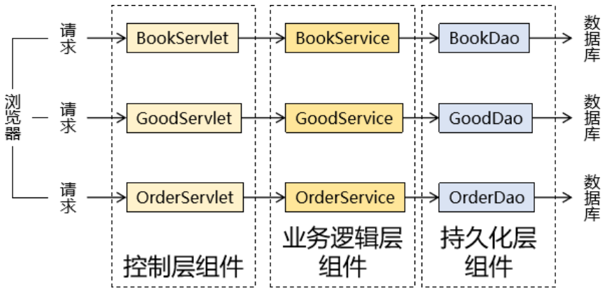
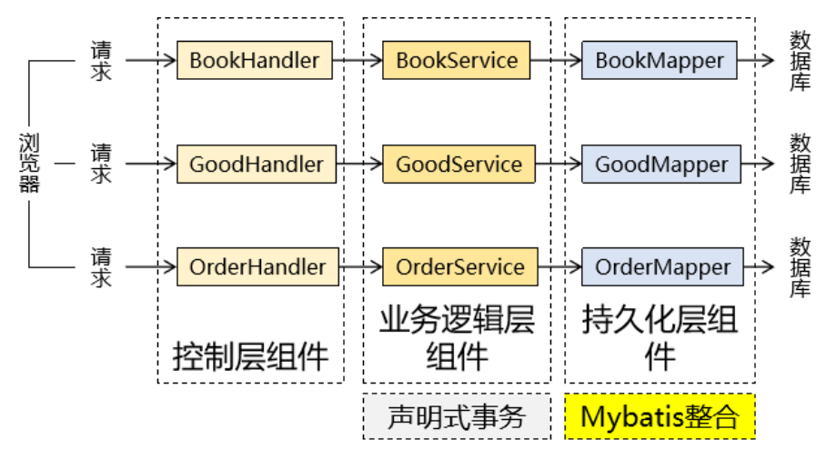
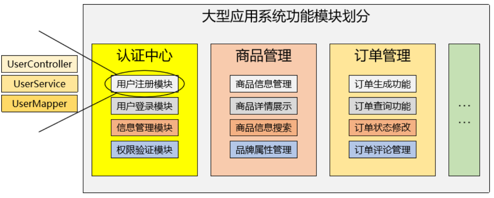

# Spring

**@author: Shuxin_Wang**

**@time: 2023.04.02**

---

[toc]

---

# 1 Spring简介

Spring官网：[Spring Home](https://spring.io/)

## 1.1 Spring Framework优良特性

`Spring Framework`：Spring的基础框架，可以视为Spring基础设施，基本上任何其他Spring项目都是以Spring Framework为基础的。

- 非侵入式：使用Spring Framework开发应用程序时，Spring对应用程序本身的结构影响非常小。对领域模型可以做到零污染；对功能性组件也只需要使用几个简单的注解进行标记，完全不会破坏原有结构，反而能将组件结构进一步简化。这就使得基于Spring Framework开发应用程序时结构清晰、简洁优雅；
- 控制反转：`IOC——Inversion of Control`，翻转资源获取方向。把自己创建资源、向环境索取资源变成环境将资源准备好，我们享受资源注入；
- 面向切面编程：`AOP——Aspect Oriented Programming`，在不修改源代码的基础上增强代码功能：
    - 抽取重复代码：将方法内部重复的代码抽取出来；
    - 代码增强：我使用抽取出来的代码套用到某个独立功能上，就对这个独立功能进行了增强；
- 容器：`Spring IOC`是一个容器，因为它包含并且管理组件对象的生命周期。组件享受到了容器化的管理，替程序员屏蔽了组件创建过程中的大量细节，极大的降低了使用门槛，大幅度提高了开发效率；
- 组件化：Spring实现了使用简单的组件配置组合成一个复杂的应用。在Spring中可以使用XML和Java注解组合这些对象。这使得我们可以基于一个个功能明确、边界清晰的组件有条不紊的搭建超大型复杂应用系统；
- 声明式：很多以前需要编写代码才能实现的功能，现在只需要声明需求即可由框架代为实现；
- 一站式：在`IOC`和`AOP`的基础上可以整合各种企业级应用的开源框架和优秀的第三方类库。而且Spring旗下的项目已经覆盖了广泛领域，很多方面的功能性需求可以在Spring Framework的基础上全部使用Spring来实现；

## 1.2 五大功能模块

| 功能模块                | 功能介绍                                                    |
| ----------------------- | ----------------------------------------------------------- |
| Core Container          | 核心容器，在 Spring 环境下使用任何功能都必须基于 IOC 容器。 |
| AOP&Aspects             | 面向切面编程                                                |
| Testing                 | 提供了对 junit 或 TestNG 测试框架的整合。                   |
| Data Access/Integration | 提供了对数据访问/集成的功能。                               |
| Spring MVC              | 提供了面向Web应用程序的集成功能。                           |

# 2 IOC容器

## 2.1 IOC容器的概念

### 2.1.1 组件的概念

#### 原生Web应用的组件

#### SSM整合组件

#### 组件管理

其实这里我们强调的仍然是我们自己为了开发业务功能而创建的组件，而除了我们开发的组件，框架内部也有很多组件需要管理。

那么不管是我们开发的还是框架内部的，Spring都可以通过IOC容器的方式对它们进行统一管理和调配。所以Spring在SSM三大框架中起到的是一个基础设置的作用。而IOC容器的作用就是帮助我们管理组件。

那到底什么是组件呢？

我们都知道，一个大型的项目可以包含很多子系统，子系统内又可以划分很多模块。这个层次结构是按照它们之间的逻辑关系划分的。那么从系统功能的具体实现的角度来看，我们可以说每一个功能模块都是由『组件』组合起来而实现的。

### 2.1.2 容器的概念

#### 普通容器

- 数组
- 集合：List
- 集合：Set

#### 复杂容器

Servlet容器能够管理 Servlet、Filter、Listener这样的组件的一生，所以它是一个复杂容器。我们即将要学习的IOC容器也是一个复杂容器。它们不仅要负责创建组件的对象、存储组件的对象，还要负责调用组件的方法让它们工作，最终在特定情况下销毁组件。

**<u>Servlet容器：</u>**

| 名称       | 时机                                                         | 次数 |
| ---------- | ------------------------------------------------------------ | ---- |
| 创建对象   | 默认情况：接收到第一次请求   修改启动顺序后：Web应用启动过程中 | 一次 |
| 初始化操作 | 创建对象之后                                                 | 一次 |
| 处理请求   | 接收到请求                                                   | 多次 |
| 销毁操作   | Web应用卸载之前                                              | 一次 |

**<u>Filter生命周期：</u>**

| 生命周期阶段 | 执行时机         | 执行次数 |
| ------------ | ---------------- | -------- |
| 创建对象     | Web应用启动时    | 一次     |
| 初始化       | 创建对象后       | 一次     |
| 拦截请求     | 接收到匹配的请求 | 多次     |
| 销毁         | Web应用卸载前    | 一次     |