# SpringMVC

**@author: Shuxin_Wang**

**@time: 2023.04.04**

---

[toc]

---


# 1 SpringMVC基础操作

## 1.1 SpringMVC概述

### 1.1.1 SpringMVC优势

SpringMVC是Spring为表述层开发提供的一整套完备的解决方案。

在表述层框架历经`Strust`、`WebWork`、`Strust2`等诸多产品的历代更迭之后，目前业界普遍选择了SpringMVC作为`Java EE`项目表述层开发的**首选方案**。之所以能做到这一点，是因为SpringMVC具备如下显著优势：

- **Spring 家族原生产品**，与IOC容器等基础设施无缝对接；
- 表述层各细分领域需要解决的问题**全方位覆盖**，提供**全面解决方案**；
- **代码清新简洁**，大幅度提升开发效率；
- 内部组件化程度高，可插拔式组件**即插即用**，想要什么功能配置相应组件即可；
- **性能卓著**，尤其适合现代大型、超大型互联网项目要求；

### 1.1.2 表述层要解决的问题

- 请求映射
- 数据输入
- 视图界面
- 请求分发
- 表单回显
- 会话控制
- 过滤拦截
- 异步交互
- 文件上传
- 文件下载
- 数据校验
- 类型转换

### 1.1.3 SpringMVC代码对比

#### 基于原生Servlet API开发

```java
protected void doGet(HttpServletRequest request, HttpServletResponse response) 
                                                        throws ServletException, IOException {   
    
    String userName = request.getParameter("userName");
    
    System.out.println("userName="+userName);
    
}
```

#### 基于SpringMVC开发

```java
@RequestMapping("/user/login")
public String login(@RequestParam("userName") String userName){
    
    log.debug("userName="+userName);
    
    return "result";
}
```

## 1.2 HelloWorld

### 1.2.1 功能需求

#### 访问首页

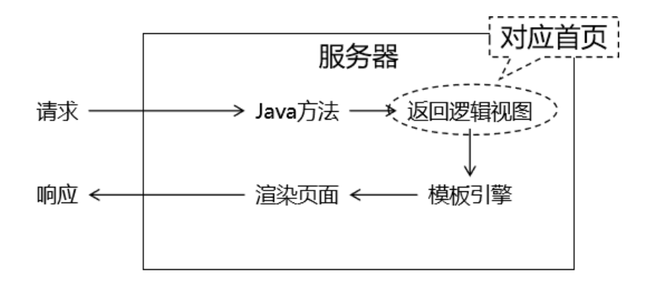

#### 在首页点超链接

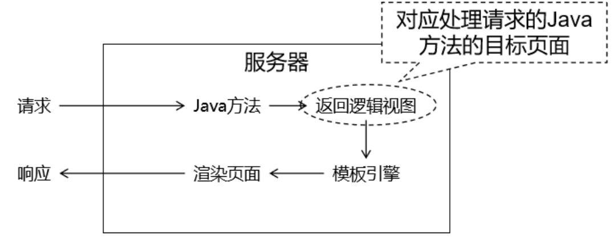

### 1.2.2 搭建环境

#### 导入依赖

```xml
<dependencies>
    <!-- SpringMVC -->
    <dependency>
        <groupId>org.springframework</groupId>
        <artifactId>spring-webmvc</artifactId>
        <version>5.3.1</version>
    </dependency>
    
    <!-- 日志 -->
    <dependency>
        <groupId>ch.qos.logback</groupId>
        <artifactId>logback-classic</artifactId>
        <version>1.2.3</version>
    </dependency>
    
    <!-- ServletAPI -->
    <dependency>
        <groupId>javax.servlet</groupId>
        <artifactId>javax.servlet-api</artifactId>
        <version>3.1.0</version>
        <scope>provided</scope>
    </dependency>
    
    <!-- Spring5和Thymeleaf整合包 -->
    <dependency>
        <groupId>org.thymeleaf</groupId>
        <artifactId>thymeleaf-spring5</artifactId>
        <version>3.0.12.RELEASE</version>
    </dependency>

    <!-- Lombok -->
    <dependency>
        <groupId>org.projectlombok</groupId>
        <artifactId>lombok</artifactId>
        <version>1.18.12</version>
        <scope>provided</scope>
    </dependency>
</dependencies>
```

#### web.xml

```xml
<!-- 配置SpringMVC中负责处理请求的核心Servlet，也被称为SpringMVC的前端控制器 -->
<servlet>
    <servlet-name>DispatcherServlet</servlet-name>
    
    <!-- DispatcherServlet的全类名 -->
    <servlet-class>org.springframework.web.servlet.DispatcherServlet</servlet-class>
    
    <!-- 通过初始化参数指定SpringMVC配置文件位置 -->
    <init-param>
    
        <!-- 如果不记得contextConfigLocation配置项的名称，可以到DispatcherServlet的父类FrameworkServlet中查找 -->
        <param-name>contextConfigLocation</param-name>
    
        <!-- 使用classpath:说明这个路径从类路径的根目录开始才查找 -->
        <param-value>classpath:spring-mvc.xml</param-value>
    </init-param>
    
    <!-- 作为框架的核心组件，在启动过程中有大量的初始化操作要做，这些操作放在第一次请求时才执行非常不恰当 -->
    <!-- 我们应该将DispatcherServlet设置为随Web应用一起启动 -->
    <load-on-startup>1</load-on-startup>
    
</servlet>
    
<servlet-mapping>
    <servlet-name>DispatcherServlet</servlet-name>
    
    <!-- 对DispatcherServlet来说，url-pattern有两种方式配置 -->
    <!-- 方式一：配置“/”，表示匹配整个Web应用范围内所有请求。这里有一个硬性规定：不能写成“/*”。只有这一个地方有这个特殊要求，以后我们再配置Filter还是可以正常写“/*”。 -->
    <!-- 方式二：配置“*.扩展名”，表示匹配整个Web应用范围内部分请求 -->
    <url-pattern>/</url-pattern>
</servlet-mapping>
```

#### Spring配置文件

```xml
<!-- 自动扫描包 -->
<context:component-scan base-package="com.atguigu.mvc.handler"/>
    
<!-- Thymeleaf视图解析器 -->
<bean id="viewResolver" class="org.thymeleaf.spring5.view.ThymeleafViewResolver">
    <property name="order" value="1"/>
    <property name="characterEncoding" value="UTF-8"/>
    <property name="templateEngine">
        <bean class="org.thymeleaf.spring5.SpringTemplateEngine">
            <property name="templateResolver">
                <bean class="org.thymeleaf.spring5.templateresolver.SpringResourceTemplateResolver">
    
                    <!-- 视图前缀 -->
                    <property name="prefix" value="/WEB-INF/templates/"/>
    
                    <!-- 视图后缀 -->
                    <property name="suffix" value=".html"/>
                    <property name="templateMode" value="HTML5"/>
                    <property name="characterEncoding" value="UTF-8" />
                </bean>
            </property>
        </bean>
    </property>
</bean>
```

#### logback.xml配置文件

```xml
<?xml version="1.0" encoding="UTF-8"?>
<configuration debug="true">
    <!-- 指定日志输出的位置，ConsoleAppender表示输出到控制台 -->
    <appender name="STDOUT"
              class="ch.qos.logback.core.ConsoleAppender">
        <encoder>
            <!-- 日志输出的格式 -->
            <!-- 按照顺序分别是：时间、日志级别、线程名称、打印日志的类、日志主体内容、换行 -->
            <pattern>[%d{HH:mm:ss.SSS}] [%-5level] [%thread] [%logger] [%msg]%n</pattern>
            <charset>UTF-8</charset>
        </encoder>
    </appender>

    <!-- 设置全局日志级别。日志级别按顺序分别是：TRACE、DEBUG、INFO、WARN、ERROR -->
    <!-- 指定任何一个日志级别都只打印当前级别和后面级别的日志。 -->
    <root level="INFO">
        <!-- 指定打印日志的appender，这里通过“STDOUT”引用了前面配置的appender -->
        <appender-ref ref="STDOUT" />
    </root>

    <!-- 根据特殊需求指定局部日志级别，可也是包名或全类名。 -->
    <logger name="com.atguigu" level="DEBUG" />

</configuration>
```

### 1.2.3 代码实现

#### 实现访问首页

```java
@Slf4j
@Controller
public class Demo01HelloHandler {

    // @RequestMapping注解在请求地址和Java方法之间建立映射关系
    @RequestMapping("/")
    public String showPortal() {
        return "portal";
    }

}
```

#### portal.html编写超链接

```html
<!DOCTYPE html>
<html lang="en" xmlns:th="http://www.thymeleaf.org">
<head>
    <meta charset="UTF-8">
    <title>首页</title>
</head>
<body>
    
    <h1>首页</h1>
    
    <!-- 以后我们会越来越倾向于用一句话来作为请求的URL地址，在这样的一句话中使用“/”分隔各个单词 -->
    <!-- say hello to spring mvc -->
    <!-- /say/hello/to/spring/mvc -->
    <a th:href="@{/say/hello/to/spring/mvc}">HelloWorld</a><br/>
    
</body>
</html>
```

#### 目标页面target.html

```html
<!DOCTYPE html>
<html lang="en" xmlns:th="http://www.thymeleaf.org">
<head>
    <meta charset="UTF-8">
    <title>目标页面</title>
</head>
<body>
    
    <h1>目标页面</h1>
    
    <a th:href="@{/}">回首页</a>
    
</body>
</html>
```

#### 声明handler方法

```java
// 以后我们会越来越倾向于用一句话来作为请求的URL地址
// 在这样的一句话中使用“/”分隔各个单词
@RequestMapping("/say/hello/to/spring/mvc")
public String sayHello() {
    
    // 方法内部打印日志，证明 SpringMVC 确实调用了这个方法来处理请求
    log.debug("我是 SpringMVC 的 Hello world。");
    
    return "target";
}
```

### 1.2.4 整套流程解析

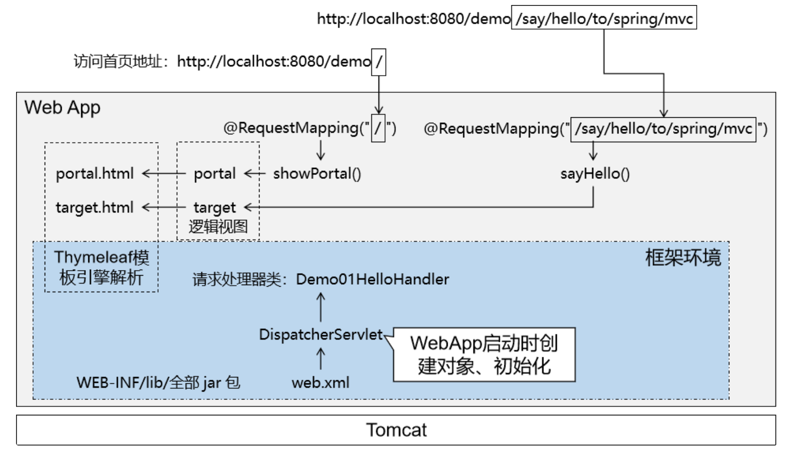

## 1.3 `@RequestMapping`注解

### 1.3.1 匹配方式说明

#### 精确匹配

在`@RequestMapping`注解指定URL地址时，**不使用任何通配符**，按照请求地址进行精确匹配。

```HTML
<a th:href="@{/say/hello/to/spring/mvc}">HelloWorld</a><br/>
```

```Java
@RequestMapping("/say/hello/to/spring/mvc")
```

#### 模糊匹配

在`@RequestMapping`注解指定URL地址时，通过使用通配符，匹配多个类似的地址。

```HTML
<h3>测试@RequestMapping注解匹配方式</h3>
<a th:href="@{/fruit/apple}">@RequestMapping模糊匹配[apple]</a><br/>
<a th:href="@{/fruit/orange}">@RequestMapping模糊匹配[orange]</a><br/>
<a th:href="@{/fruit/banana}">@RequestMapping模糊匹配[banana]</a><br/>
```

```Java
@RequestMapping("/fruit/*")
```

单层匹配和多层匹配：

-  `/*`：只能匹配URL地址中的一层，如果想准确匹配两层，那么就写“`/*/*`”以此类推；
- `/**`：可以匹配URL地址中的多层。 

其中所谓的一层或多层是指一个URL地址字符串被`/`划分出来的各个层次 这个知识点虽然对于`@RequestMapping`注解来说实用性不大，但是将来配置拦截器的时候也遵循这个规则。

### 1.3.2 在类级别标记

#### 超链接的HTML标签

```html
<h3>测试@RequestMapping注解标记在类上</h3>
<a th:href="@{/user/login}">用户登录</a><br/>
<a th:href="@{/user/register}">用户注册</a><br/>
<a th:href="@{/user/logout}">用户退出</a><br/>
```

#### 仅在标记方法上的`@RequestMapping`注解

```java
@RequestMapping("/user/login")
@RequestMapping("/user/register")
@RequestMapping("/user/logout")
```

#### 分别标记类和方法上

在类级别：抽取各个方法上@RequestMapping注解地址中前面重复的部分

```Java
@RequestMapping("/user")
```

在方法级别：省略被类级别抽取的部分

```Java
@RequestMapping("/login")
@RequestMapping("/register")
@RequestMapping("/logout")
```

### 1.3.3 附加请求方式

#### 请求方式

HTTP 协议定义了八种请求方式，在 SpringMVC 中封装到了下面这个枚举类：

```Java
public enum RequestMethod {

  GET, HEAD, POST, PUT, PATCH, DELETE, OPTIONS, TRACE

}
```

#### 注解附加请求方式

```html
<h3>测试@RequestMapping注解限定请求方式</h3>
<a th:href="@{/emp}">同地址GET请求</a><br/>
<form th:action="@{/emp}" method="post">
    <button type="submit">同地址POST请求</button>
</form>
<br/>
```

处理 GET 请求：

```Java
@RequestMapping(value = "/emp", method = RequestMethod.GET)
public String empGet() {
    
    log.debug("GET 请求");
    
    return "target";
}
```

处理 POST 请求：

```Java
@RequestMapping(value = "/emp", method = RequestMethod.POST)
public String empPost() {
    
    log.debug("POST 请求");
    
    return "target";
}
```

#### 进阶版

| 原版                                                         | 进阶版               |
| ------------------------------------------------------------ | -------------------- |
| @RequestMapping(value = "/emp", <br />method = RequestMethod.GET) | @GetMapping("/emp")  |
| @RequestMapping(value = "/emp", <br />method = RequestMethod.POST) | @PostMapping("/emp") |


除了 `@GetMapping`、`@PostMapping`还有下面几个类似的注解：

- `@PutMapping`
- `@DeleteMapping`
- `@PatchMapping`

另外需要注意：进阶版的这几个注解是从 4.3 版本才开始有，低于 4.3 版本无法使用。

## 1.4 获取请求参数

### 1.4.1 一名一值

#### 超链接

```html
<a th:href="@{/param/one/name/one/value(userName='tom')}">一个名字一个值的情况</a><br/>
```

#### `@RequestParam`注解

```java
@RequestMapping("/param/one/name/one/value")
public String oneNameOneValue(
        // 使用@RequestParam注解标记handler方法的形参
        // SpringMVC 会将获取到的请求参数从形参位置给我们传进来
        @RequestParam("userName") String userName
) {
    
    log.debug("获取到请求参数：" + userName);
    
    return "target";
}
```

#### 省略注解

```java
@RequestMapping("/param/one/name/one/value")
public String oneNameOneValue(
        // 当请求参数名和形参名一致，可以省略@RequestParam("userName")注解
        // 但是，省略后代码可读性下降而且将来在SpringCloud中不能省略，所以建议还是不要省略
        String userName
) {
    
    logger.debug("★获取到请求参数：" + userName);
    
    return "target";
}
```

#### 关闭请求参数必需

required 属性设置为 false 表示这个请求参数可有可无：

```Java
@RequestParam(value = "userName", required = false)
```

#### 参数设置默认值

使用`defaultValue`属性给请求参数设置默认值：

```Java
@RequestParam(value = "userName", required = false, defaultValue = "missing")
```

此时`required`属性可以继续保持默认值：

```Java
@RequestParam(value = "userName", defaultValue = "missing")
```

### 1.4.2 一名多值

#### 表单

```html
<form th:action="@{/param/one/name/multi/value}" method="post">
    请选择你最喜欢的球队：
    <input type="checkbox" name="team" value="Brazil"/>巴西
    <input type="checkbox" name="team" value="German"/>德国
    <input type="checkbox" name="team" value="French"/>法国
    <input type="checkbox" name="team" value="Holland"/>荷兰
    <input type="checkbox" name="team" value="Italian"/>意大利
    <input type="checkbox" name="team" value="China"/>中国
    <br/>
    <input type="submit" value="保存"/>
</form>
```

#### handler方法

```java
@RequestMapping("/param/one/name/multi/value")
public String oneNameMultiValue(
    
        // 在服务器端 handler 方法中，使用一个能够存储多个数据的容器就能接收一个名字对应的多个值请求参数
        @RequestParam("team") List<String> teamList
        ) {
    
    for (String team : teamList) {
        logger.debug("team = " + team);
    }
    
    return "target";
}
```

### 1.4.3 表单对应模型

#### 表单

```html
<form th:action="@{/emp/save}" method="post">
    姓名：<input type="text" name="empName"/><br/>
    年龄：<input type="text" name="empAge"/><br/>
    工资：<input type="text" name="empSalary"/><br/>
    <input type="submit" value="保存"/>
</form>
```

#### 处理方法

```java
@RequestMapping("/param/form/to/entity")
public String formToEntity(
    
        // SpringMVC 会自动调用实体类中的 setXxx() 注入请求参数
        Employee employee) {
    
    logger.debug(employee.toString());
    
    return "target";
}
```

#### POST请求乱码问题

到 web.xml 中配置 CharacterEncodingFilter 即可：

```XML
<!-- 配置过滤器解决 POST 请求的字符乱码问题 -->
<filter>
    <filter-name>CharacterEncodingFilter</filter-name>
    <filter-class>org.springframework.web.filter.CharacterEncodingFilter</filter-class>
    
    <!-- encoding参数指定要使用的字符集名称 -->
    <init-param>
        <param-name>encoding</param-name>
        <param-value>UTF-8</param-value>
    </init-param>
    
    <!-- 请求强制编码 -->
    <init-param>
        <param-name>forceRequestEncoding</param-name>
        <param-value>true</param-value>
    </init-param>
        
    <!-- 响应强制编码 -->
    <init-param>
        <param-name>forceResponseEncoding</param-name>
        <param-value>true</param-value>
    </init-param>
</filter>
<filter-mapping>
    <filter-name>CharacterEncodingFilter</filter-name>
    <url-pattern>/*</url-pattern>
</filter-mapping>
```

> 注1：在较低版本的 SpringMVC 中，`forceRequestEncoding`属性、`forceResponseEncoding`属性没有分开，它们是一个`forceEncoding`属性。这里需要注意一下；
>
> 注2：由于`CharacterEncodingFilter`是通过`request.setCharacterEncoding(encoding)`来设置请求字符集，所以在此操作前不能有任何的`request.getParameter()`操作。在设置字符集之前获取过请求参数，那么设置字符集的操作将无效。

### 1.4.4 表单对应实体类包含级联属性

#### 实体类

```java
@Data
@NoArgsConstructor
@AllArgsConstructor
public class Student {

    private String stuName;
    private School school;
    private List<Subject> subjectList;

}
```

#### 表单

```html
<!-- 提交数据的表单 -->
<form th:action="@{/param/cascad}" method="post">
    stuName：<input type="text" name="stuName" value="tom"/><br/>
    school.schoolName:<input type="text" name="school.schoolName" value="atguigu"/><br/>
    subjectList[0].subjectName:<input type="text" name="subjectList[0].subjectName" value="java"/><br/>
    subjectList[1].subjectName:<input type="text" name="subjectList[1].subjectName" value="php"/><br/>
    subjectList[2].subjectName:<input type="text" name="subjectList[2].subjectName" value="javascript"/><br/>
    subjectList[3].subjectName:<input type="text" name="subjectList[3].subjectName" value="css"/><br/>
    subjectList[4].subjectName:<input type="text" name="subjectList[4].subjectName" value="vue"/><br/>
    <input type="submit" value="保存"/>
</form>
```

#### 处理方法

```java
@RequestMapping("/param/form/to/nested/entity")
public String formToNestedEntity(
    
        // SpringMVC 自己懂得注入级联属性，只要属性名和对应的getXxx()、setXxx()匹配即可
        Student student) {
    
    logger.debug(student.toString());
    
    return "target";
}
```

### 1.4.5 要发送的数据是List

#### 额外封装一层

```java
public class EmployeeParam {
    
    private List<Employee> employeeList;
    ……
```

#### 表单

```html
直接发送 List&lt;Employee&gt;：<br/>
<form th:action="@{/param/list/emp}" method="post">
    1号员工姓名：<input type="text" name="employeeList[0].empName" /><br/>
    1号员工年龄：<input type="text" name="employeeList[0].empAge" /><br/>
    1号员工工资：<input type="text" name="employeeList[0].empSalary" /><br/>
    2号员工姓名：<input type="text" name="employeeList[1].empName" /><br/>
    2号员工年龄：<input type="text" name="employeeList[1].empAge" /><br/>
    2号员工工资：<input type="text" name="employeeList[1].empSalary" /><br/>
    <button type="submit">保存</button>
</form>
```

#### 处理方法

```java
@RequestMapping("/param/list/emp")
public String saveEmpList(
        // SpringMVC 访问这里实体类的setEmployeeList()方法注入数据
        EmployeeParam employeeParam
) {
    
    List<Employee> employeeList = employeeParam.getEmployeeList();
    
    for (Employee employee : employeeList) {
        logger.debug(employee.toString());
    }
    
    return "target";
}
```

## 1.5 `@CookieValue`注解

### 1.5.1 作用

获取当前请求中的Cookie数据。

### 1.5.2 用法

```java
@RequestMapping("/request/cookie")
public String getCookie(
    
        // 使用 @CookieValue 注解获取指定名称的 Cookie 数据
        // name 或 value 属性：指定Cookie 名称
        // defaultValue 属性：设置默认值
        @CookieValue(value = "JSESSIONID", defaultValue = "missing") String cookieValue,
    
        // 形参位置声明 HttpSession 类型的参数即可获取 HttpSession 对象
        HttpSession session
) {
    
    log.debug("cookieValue = " + cookieValue);
    
    return "target";
}
```

## 1.6 页面跳转控制

### 1.6.1 准备工作

- 准备一个地址在前后缀范围之外的页面；
- 让这个页面能够成功访问；

#### 创建范围之外的页面`outter.html`

```html
<body>
    
    <h1>范围之外页面</h1>
    
</body>
```

很多时候我们创建静态资源文件时，IDEA并不会自动帮我们放在构建目录下，进而就会导致部署到服务器上运行的时候没有这个文件，此时需要我们自己手动构建。

#### 配置SpringMVC配置文件

```xml
<mvc:annotation-driven/>
<mvc:default-servlet-handler/>
```

### 1.6.2 使用指令

#### 转发指令

```java
@RequestMapping("/test/forward/command")
public String forwardCommand() {
    
    // 需求：要转发前往的目标地址不在视图前缀指定的范围内，
    // 通过返回逻辑视图、拼接前缀后缀得到的物理视图无法达到目标地址
    
    // 转发到指定的地址：
    return "forward:/outter.html";
}
```

#### 重定向指令

```java
@RequestMapping("/test/redirect/command")
public String redirectCommand() {
    
    // 重定向到指定的地址：
    // 这个地址由 SpringMVC 框架负责在前面附加 contextPath，所以我们不能加，我们加了就加多了
    // 框架增加 contextPath 后：/demo/outter.html
    // 我们多加一个：/demo/demo/outter.html
    return "redirect:/outter.html";
}
```

### 1.6.3 指令处理在源码中的位置

#### 所在的类

- `org.thymeleaf.spring5.view.ThymeleafViewResolver`

#### 所在方法

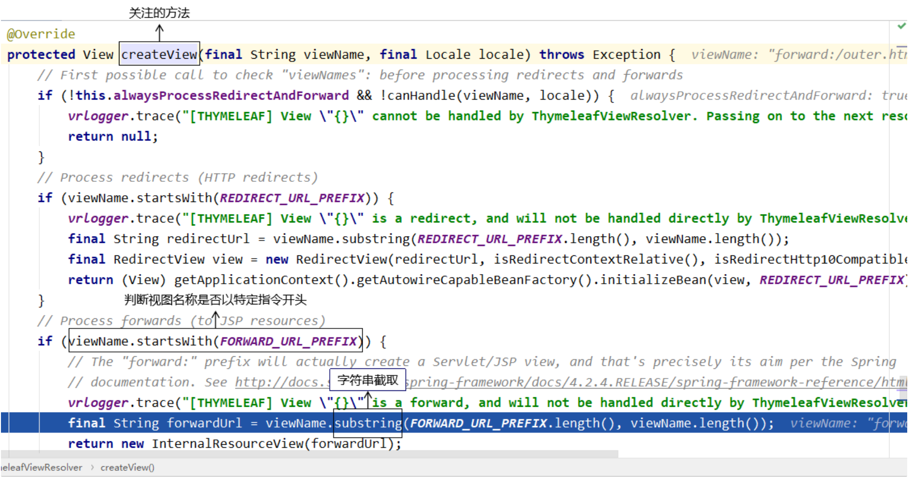

## 1.7 获取原生Servlet API对象

### 1.7.1 原生Servlet API

- `HttpServletRequest`
- `HttpServletResponse`
- `HttpSession`
- `ServletContext`

原生：最原始的、本真的，没有经过任何的加工、包装和处理。

API：直接翻译过来是应用程序接口的意思。对我们来说，提到 API 这个词的时候，通常指的是在某个特定的领域，已经封装好可以直接使用的一套技术体系。很多时候，特定领域的技术规范都是对外暴露一组接口作为这个领域的技术标准，然后又在这个标准下有具体实现。

### 1.7.2 可以直接拿到对象

#### 创建超链接

```html
<a th:href="@{/original/api/direct}">可以直接得到的三个</a><br/>
```

#### 处理方法

```java
@RequestMapping("/original/api/direct")
public String getOriginalAPIDirect(
        
        // 有需要使用的 Servlet API 直接在形参位置声明即可。
        // 需要使用就写上，不用就不写，开发体验很好，这里给 SpringMVC 点赞
        HttpServletRequest request,
        HttpServletResponse response,
        HttpSession session
) {
    
    logger.debug(request.toString());
    logger.debug(response.toString());
    logger.debug(session.toString());
    
    return "target";
}
```

`ServletContext`对象没法通过形参声明的方式直接获取，如果非要在形参位置声明`ServletContext`类型的变量，那么会抛出异常。

### 1.7.3 获取`ServletContext`

#### 通过`HttpSession`获取

```java
@RequestMapping("/original/servlet/context/first/way")
public String originalServletContextFirstWay(HttpSession session) {
    
    // 获取ServletContext对象的方法一：通过HttpSession对象获取
    ServletContext servletContext = session.getServletContext();
    logger.debug(servletContext.toString());
    
    return "target";
}
```

#### 通过IOC容器注入

```java
// 获取ServletContext对象的方法二：从 IOC 容器中直接注入
@Autowired
private ServletContext servletContext;
    
@RequestMapping("/original/servlet/context/second/way")
public String originalServletContextSecondWay() {
    
    logger.debug(this.servletContext.toString());
    
    return "target";
}
```

### 1.7.4 原生对象和IOC容器关系

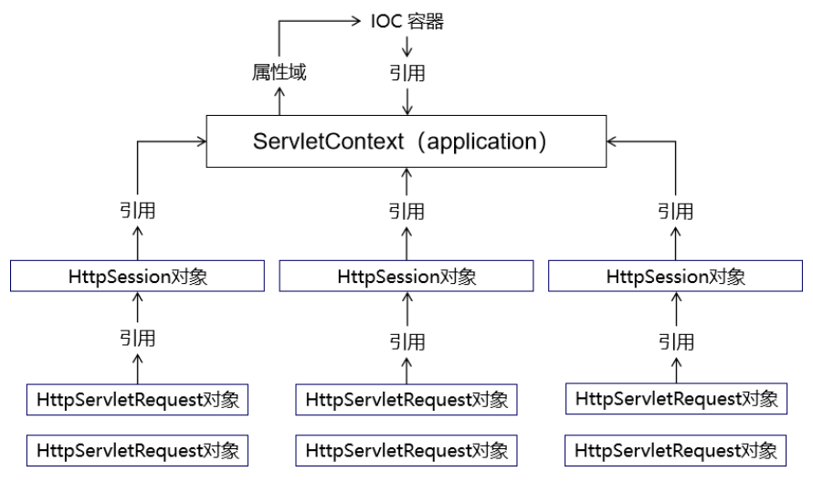

## 1.8 属性域

### 1.8.1 属性域作用

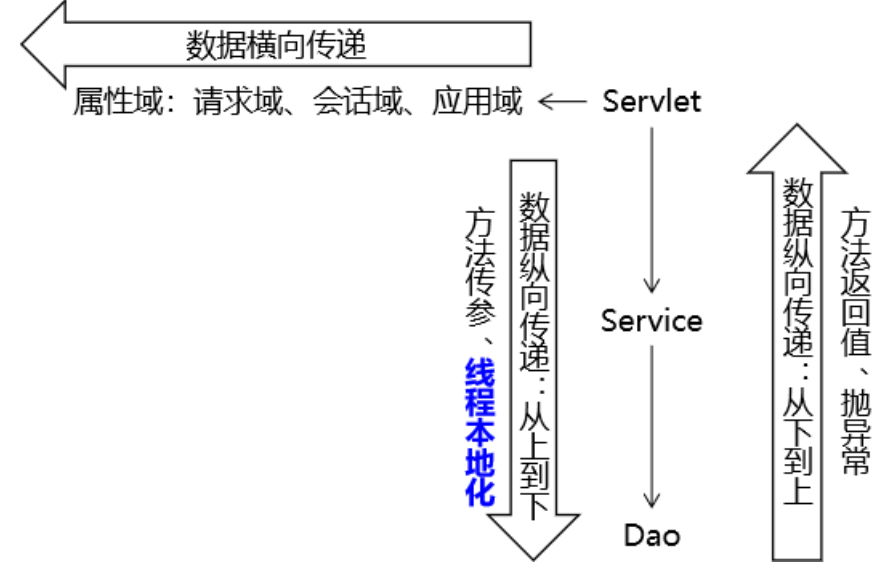

### 1.8.2 请求域操作

请求域是实际开发中使用最多的属性域，所以SpringMVC也提供了多种不同方式来操作：

#### `Model`类型形参

```java
@RequestMapping("/attr/request/model")
public String testAttrRequestModel(
    
        // 在形参位置声明Model类型变量，用于存储模型数据
        Model model) {
    
    // 我们将数据存入模型，SpringMVC 会帮我们把模型数据存入请求域
    // 存入请求域这个动作也被称为暴露到请求域
    model.addAttribute("requestScopeMessageModel","i am very happy[model]");
    
    return "target";
}
```

#### `ModelMap`类型

```java
@RequestMapping("/attr/request/model/map")
public String testAttrRequestModelMap(
    
        // 在形参位置声明ModelMap类型变量，用于存储模型数据
        ModelMap modelMap) {
    
    // 我们将数据存入模型，SpringMVC 会帮我们把模型数据存入请求域
    // 存入请求域这个动作也被称为暴露到请求域
    modelMap.addAttribute("requestScopeMessageModelMap","i am very happy[model map]");
    
    return "target";
}
```

#### `Map`类型的形参

```java
@RequestMapping("/attr/request/map")
public String testAttrRequestMap(
    
        // 在形参位置声明Map类型变量，用于存储模型数据
        Map<String, Object> map) {
    
    // 我们将数据存入模型，SpringMVC 会帮我们把模型数据存入请求域
    // 存入请求域这个动作也被称为暴露到请求域
    map.put("requestScopeMessageMap", "i am very happy[map]");
    
    return "target";
}
```

#### 原生request对象

```java
@RequestMapping("/attr/request/original")
public String testAttrOriginalRequest(
    
        // 拿到原生对象，就可以调用原生方法执行各种操作
        HttpServletRequest request) {
    
    request.setAttribute("requestScopeMessageOriginal", "i am very happy[original]");
    
    return "target";
}
```

#### `ModelAndView`对象

```java
@RequestMapping("/attr/request/mav")
public ModelAndView testAttrByModelAndView() {
    
    // 1.创建ModelAndView对象
    ModelAndView modelAndView = new ModelAndView();
    
    // 2.存入模型数据
    modelAndView.addObject("requestScopeMessageMAV", "i am very happy[mav]");
    
    // 3.设置视图名称
    modelAndView.setViewName("target");
    
    return modelAndView;
}
```

### 1.8.3 模型的本质

SpringMVC 传入的`Model`、`ModelMap`、`Map`类型的参数其实本质上都是`BindingAwareModelMap` 类型的。

#### 关系

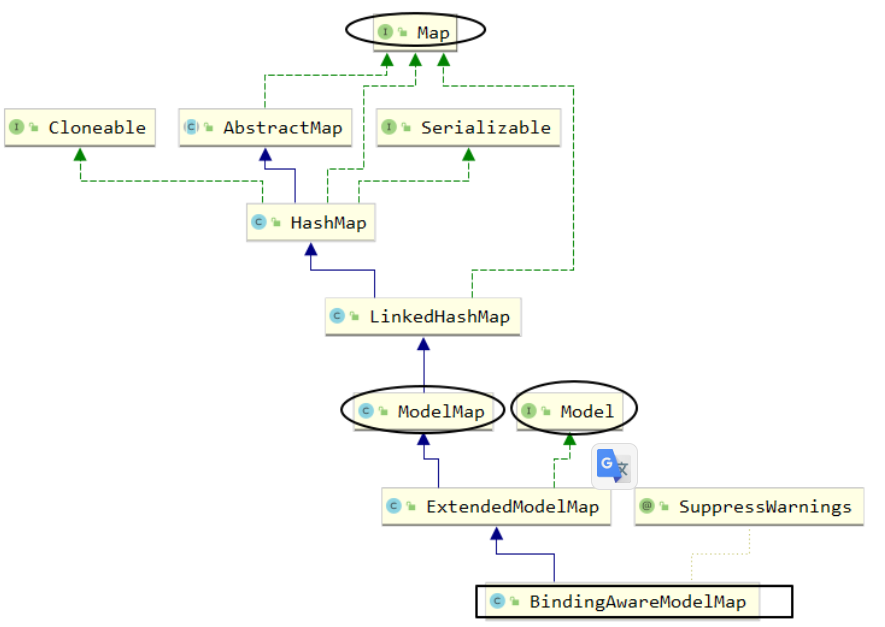

### 1.8.4 框架底层将模型存入请求域

所在类：`org.thymeleaf.context.WebEngineContext`内部类`RequestAttributesVariablesMap`

所在方法：`setVariable(String name, Obiect value)`；

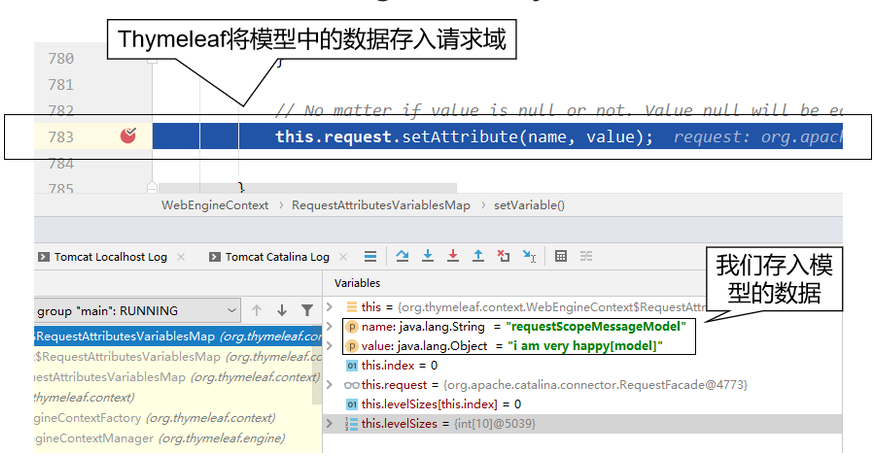

### 1.8.5 会话域

使用会话域最简单直接的办法就是使用原生的`HttpSession`对象。

```java
@RequestMapping("/attr/session")
public String attrSession(
        // 使用会话域最简单直接的办法就是使用原生的 HttpSession 对象
        HttpSession session) {
    
    session.setAttribute("sessionScopeMessage", "i am haha ...");
    
    return "target";
}
```

### 1.8.6 应用域

```java
@Autowired
private ServletContext servletContext;

@RequestMapping("/attr/application")
public String attrApplication() {
    
    servletContext.setAttribute("appScopeMsg", "i am hungry...");
    
    return "target";
}
```

## 1.9 静态资源访问

### 1.9.1 静态资源的概念

资源本身已经是可以直接拿到浏览器上使用的程度了，**不需要在服务器端做任何运算、处理**。典型的静态资源包括：

- 纯HTML文件
- 图片
- CSS文件
- JavaScript文件
- ……

### 1.9.2 SpringMVC环境下的静态资源问题

#### 斜杠情况

`DispatcherServlet`的`url-pattern`标签配置的是`/`。意味着整个Web应用范围内所有请求都由SpringMVC来处理。

- 对SpringMVC来说，必须有对应的 `@RequestMapping`才能找到处理请求的方法；
- 现在`images/mi.jpg`请求没有对应的`@RequestMapping`所以返回404；

**<u>解决办法:</u>**

```xml
<!-- 加入这个配置，SpringMVC 就会在遇到没有 @RequestMapping 的请求时放它过去 -->
<!-- 所谓放它过去就是让这个请求去找它原本要访问的资源 -->
<mvc:default-servlet-handler/>
```

- 新的问题：其他原本正常的请求访问不了了
- 进一步解决问题：再增加一个配置

```XML
<!-- 开启SpringMVC的注解驱动功能。这个配置也被称为SpringMVC的标配。 -->
<!-- 标配：因为 SpringMVC 环境下非常多的功能都要求必须打开注解驱动才能正常工作。 -->
<mvc:annotation-driven/>
```

大体机制：SpringMVC首先查找是否存在和当前请求对应的`@RequestMapping`；如果没有，则调用`handleRequest()`方法转发到目标资源。

```java
@Override
public void handleRequest(HttpServletRequest request, HttpServletResponse response)
      throws ServletException, IOException {
  
  Assert.state(this.servletContext != null, "No ServletContext set");
  RequestDispatcher rd = this.servletContext.getNamedDispatcher(this.defaultServletName);
  if (rd == null) {
    throw new IllegalStateException("A RequestDispatcher could not be located for the default servlet '" +
    this.defaultServletName + "'");
  }
    
    // 这里执行请求转发操作
  rd.forward(request, response);
}
```

#### 扩展名情况

**<u>修改`url-pattern`:</u>**

```xml
<servlet>
    <servlet-name>DispatcherServlet</servlet-name>
    <servlet-class>org.springframework.web.servlet.DispatcherServlet</servlet-class>
    <init-param>
        <param-name>contextConfigLocation</param-name>
        <param-value>classpath:spring-mvc.xml</param-value>
    </init-param>
    <load-on-startup>1</load-on-startup>
</servlet>
<servlet-mapping>
    <servlet-name>DispatcherServlet</servlet-name>
    <!--<url-pattern>/</url-pattern>-->
    
    <!-- 以扩展名方式匹配 SpringMVC 要处理的请求 -->
    <!-- 此时要求请求扩展名必须是 html，SpringMVC 才会处理这个请求 -->
    <url-pattern>*.html</url-pattern>
</servlet-mapping>
```

**<u>效果：</u>**

- 图片直接就可以访问了。因为请求扩展名不是`html`，不会受到 SpringMVC影响。
- 其他请求：做下面两个操作才可以正常访问
    - 需要在超链接地址后面附加`html`扩展名；
    - 在`@RequestMapping`注解指定的URL地址中也附加 `html`扩展名；

特殊情况：在请求扩展名就是`html`的情况下，访问HTML静态页面。仍然需要开启`mvc:default-servlet-handler`配置。

原因是：扩展名为`html` 会让 SpringMVC 觉得这个请求归它管，它一看没有`@RequestMapping`就会返回 404。而打开了`mvc:default-servlet-handler`配置就会转发到 HTML 页面。

## 1.10 `mvc:view-controller`

### 1.10.1 需求情景

在一个handler方法中，仅仅只是完成`@RequestMapping`映射，将请求转发到目标视图，除此之外没有任何其他代码。此时可以使用 SpringMVC 配置文件中的配置代替这样的handler方法。

### 1.10.2 具体操作

#### 配置

在SpringMVC配置文件中使用`mvc:view-controller`配置：

```XML
<mvc:view-controller path="/index.html" view-name="portal"/>
```

同时，handler类中就可以去掉被代替的方法。

#### 新的问题

加入`mvc:view-controller`配置后，其他正常`@RequestMapping` 将失效。此时还是需要加入`mvc:annotation-driven`来解决。

### 1.10.3 底层分析

#### `HabdlerMapping`

见名知意，`HandlerMapping` 封装的数据包含了请求地址和`handler`方法之间的映射关系。所以请求访问是否能生效关键要看`HandlerMapping`在IOC容器中加载的情况。为了看到这一点，我们可以在`DispatcherServlet`中找到`doDispatch()`方法设置断点。之所以选择这个方法，是因为每一个由SpringMVC处理的请求都会经过这里，便于操作。

#### 三个标签都没有配置

SpringMVC加载了三个`HandlerMapping`：

- `org.springframework.web.servlet.handler.BeanNameUrlHandlerMapping`;
- `org.springframework.web.servlet.mvc.method.annotation.RequestMappingHandlerMapping`;
- `org.springframework.web.servlet.function.support.RouterFunctionMapping`;

其中`RequestMappingHandlerMapping`封装了`@RequestMapping`相关请求，有它在`@RequestMapping`相关请求就能访问到。

#### 增加一个标签

配置了`mvc:view-controller`或`mvc:default-servlet-handler`之后。

SpringMVC加载了两个`HandlerMapping`：

- `org.springframework.web.servlet.handler.SimpleUrlHandlerMapping`；
- `org.springframework.web.servlet.handler.BeanNameUrlHandlerMapping`；

#### 全部配置三个标签

配置全部`mvc:view-controller`、`mvc:default-servlet-handler`、`mvc:annotation-driven`三个标签。

SpringMVC加载了略有不同的三个`HandlerMapping`：

- `org.springframework.web.servlet.mvc.method.annotation.RequestMappingHandlerMapping`；
- `org.springframework.web.servlet.handler.SimpleUrlHandlerMapping`；
- `org.springframework.web.servlet.handler.BeanNameUrlHandlerMapping`；

#### 结论

在配置不同的情况下，SpringMVC底层加载的组件不同，特定功能需要特定组件的支持。当特定功能所需组件没有加入到IOC容器中的时候，对应的功能就无法使用了。

还有一点是：`mvc:annotation-driven`是SpringMVC**标配**，必加。

## 1.11 表单标签

表单标签主要的目的是在页面上实现表单回显。最典型的情况是在修改数据时，把之前旧的数据重新显示出来供用户参考。

### 1.11.1 回显简单标签

#### 创建用于测试的实体类

```java
@Data
@NoArgsConstructor
@AllArgsConstructor
public class Tiger {

    private Integer tigerId;
    private String tigerName;
    private Double tigerSalary;
    
}
```

#### 创建handler方法

```java
@RequestMapping("/form/redisplay/simple")
public String simpleTagRedisplay(Model model) {
    
    // 1.准备好用来回显表单的实体类对象
    // 在实际功能中，这里的对象应该是从数据库查询得到
    Tiger tiger = new Tiger();
    tiger.setTigerId(5);
    tiger.setTigerName("tomCat");
    tiger.setTigerSalary(666.66);
        
    // 2.将实体类数据存入模型
    model.addAttribute("tiger", tiger);
    
    return "form-simple";
}
```

#### `form-simple.html`页面表单回显

```html
<h3>回显Tiger数据</h3>
    
<form th:action="@{/save/tiger}" method="post">
    
    <!-- th:value 和 th:field 属性都可以 -->
    老虎的id：<input type="text" name="tigerId" th:value="${tiger.tigerId}" /><br/>
    老虎的名字：<input type="text" name="tigerName" th:field="${tiger.tigerName}" /><br/>
    老虎的工资：<input type="text" name="tigerSalary" th:field="${tiger.tigerSalary}" /><br/>
    
    <button type="submit">保证</button>
</form>
```

### 1.11.2 回显带选择功能的标签

#### 总体思路

- 显示标签本身，需要用到一个集合对象来存储标签本身所需要的数据；
- 对标签执行回显操作，需要用到另外的一个实体类；

#### 创建实体类

```java
@Data
@NoArgsConstructor
@AllArgsConstructor
public class Season {

    // 提交给服务器的值
    private String submitValue;

    // 给用户看的值
    private String showForUserValue;
    
}
```

```java
@Data
@NoArgsConstructor
@AllArgsConstructor
public class Paige {

    private Integer paigeId;
    private String paigeName;
    private Season season;
    
}
```

#### handler方法

```java
@RequestMapping("/form/redisplay/choose")
public String chooseTagRedisplay(Model model) {
    
    // 1.准备用来显示标签的数据
    List<Season> seasonList = new ArrayList<>();
    seasonList.add(new Season("spring", "春天"));
    seasonList.add(new Season("summer", "夏天"));
    seasonList.add(new Season("autumn", "秋天"));
    seasonList.add(new Season("winter", "冬天"));
    
    model.addAttribute("seasonList", seasonList);
    
    // 2.准备用来回显表单的实体类数据
    Paige paige = new Paige();
    paige.setPaigeId(6);
    paige.setPaigeName("pig");
    paige.setSeason(new Season("summer", "夏天"));
    
    model.addAttribute("paige", paige);
    
    return "form-choose";
}
```

#### 页面表单回显

**<u>单选按钮：</u>**

```html
<!-- th:each属性：指定用来生成这一组标签的集合数据 -->
<!-- th:value属性：获取数据用来设置HTML标签的value属性，成为将来提交给服务器的值 -->
<!-- th:text属性：获取数据用来设置HTML标签旁边给用户看的名字 -->
<!-- th:checked属性：判断是否回显（把适合的标签设置为默认被选中） -->
<input type="radio" name="season.submitValue"
        th:each="season : ${seasonList}"
        th:value="${season.submitValue}"
        th:text="${season.showForUserValue}"
        th:checked="${season.submitValue == paige.season.submitValue}"
/>
```

**<u>下拉列表：</u>**

```html
<select name="season.submitValue">
    <option th:each="season : ${seasonList}"
            th:value="${season.submitValue}"
            th:text="${season.showForUserValue}"
            th:selected="${season.submitValue == paige.season.submitValue}"/>
</select>
```

**<u>多选框:</u>**

```java
@RequestMapping("/form/redisplay/choose/multi")
public String chooseMulti(Model model) {
    
    // 1.准备用来显示标签的数据
    List<Season> seasonList = new ArrayList<>();
    seasonList.add(new Season("spring", "春天"));
    seasonList.add(new Season("summer", "夏天"));
    seasonList.add(new Season("autumn", "秋天"));
    seasonList.add(new Season("winter", "冬天"));
    
    model.addAttribute("seasonList", seasonList);
    
    // 2.准备用来回显表单的实体类数据
    List<Season> seasonListForRedisplay = new ArrayList<>();
    seasonListForRedisplay.add(new Season("summer", "夏天"));
    seasonListForRedisplay.add(new Season("winter", "冬天"));
    
    model.addAttribute("seasonListForRedisplay", seasonListForRedisplay);
    
    return "form-multi";
}
```

- 页面标签：

```html
<!--
    seasonListForRedisplay.contains(season)
    用包含回显数据的集合调用contains()方法判断是否应该被选中；
    传入contains()方法的是生成具体每一个标签时遍历得到的对象
 -->
<input type="checkbox" name="xxx"
       th:each="season : ${seasonList}"
       th:value="${season.submitValue}"
       th:text="${season.showForUserValue}"
       th:checked="${seasonListForRedisplay.contains(season)}"
/>
```

注意：此时需要判断一个对象是否在集合中，那就需要重写`equals()`和`hashCode()`方法。

# 2 传统方式实现增删改查

## 2.1 准备工作

### 2.1.1 创建实体类

```java
@Data
@NoArgsConstructor
@AllArgsConstructor
public class Movie {
    
    private String movieId;
    private String movieName;
    private Double moviePrice;

}
```

### 2.1.2 创建Service

#### 接口

```java
public interface MovieService {
    
    List<Movie> getAll();
    
    Movie getMovieById(String movieId);
    
    void saveMovie(Movie movie);
    
    void updateMovie(Movie movie);
    
    void removeMovieById(String movieId);
    
}
```

#### 实现类

```java
import com.atguigu.spring.mvc.demo.entity.Movie;
import com.atguigu.spring.mvc.demo.service.api.MovieService;
import lombok.extern.slf4j.Slf4j;
import org.springframework.stereotype.Service;

import java.util.*;

@Slf4j
@Service
public class MovieServiceImpl implements MovieService {
    
    private static Map<String ,Movie> movieMap;
    
    static {
    
        movieMap = new HashMap<>();
    
        String movieId = null;
        Movie movie = null;
    
        movieId = UUID.randomUUID().toString().replace("-", "").toUpperCase();
        movie = new Movie(movieId, "肖申克救赎", 10.0);
        movieMap.put(movieId, movie);
    
        movieId = UUID.randomUUID().toString().replace("-", "").toUpperCase();
        movie = new Movie(movieId, "泰坦尼克号", 20.0);
        movieMap.put(movieId, movie);
    
        movieId = UUID.randomUUID().toString().replace("-", "").toUpperCase();
        movie = new Movie(movieId, "审死官", 30.0);
        movieMap.put(movieId, movie);
    
        movieId = UUID.randomUUID().toString().replace("-", "").toUpperCase();
        movie = new Movie(movieId, "大话西游之大圣娶亲", 40.0);
        movieMap.put(movieId, movie);
    
        movieId = UUID.randomUUID().toString().replace("-", "").toUpperCase();
        movie = new Movie(movieId, "大话西游之仙履奇缘", 50.0);
        movieMap.put(movieId, movie);
    
        movieId = UUID.randomUUID().toString().replace("-", "").toUpperCase();
        movie = new Movie(movieId, "功夫", 60.0);
        movieMap.put(movieId, movie);
    
        movieId = UUID.randomUUID().toString().replace("-", "").toUpperCase();
        movie = new Movie(movieId, "大内密探凌凌漆", 70.0);
        movieMap.put(movieId, movie);
    
        movieId = UUID.randomUUID().toString().replace("-", "").toUpperCase();
        movie = new Movie(movieId, "食神", 80.0);
        movieMap.put(movieId, movie);
    
        movieId = UUID.randomUUID().toString().replace("-", "").toUpperCase();
        movie = new Movie(movieId, "西游降魔篇", 90.0);
        movieMap.put(movieId, movie);
    
        movieId = UUID.randomUUID().toString().replace("-", "").toUpperCase();
        movie = new Movie(movieId, "西游伏妖篇", 11.0);
        movieMap.put(movieId, movie);
    
        movieId = UUID.randomUUID().toString().replace("-", "").toUpperCase();
        movie = new Movie(movieId, "三傻大闹宝莱坞", 12.0);
        movieMap.put(movieId, movie);
    
        movieId = UUID.randomUUID().toString().replace("-", "").toUpperCase();
        movie = new Movie(movieId, "唐人街探案", 13.0);
        movieMap.put(movieId, movie);
    
        movieId = UUID.randomUUID().toString().replace("-", "").toUpperCase();
        movie = new Movie(movieId, "一个人的武林", 14.0);
        movieMap.put(movieId, movie);
    
        movieId = UUID.randomUUID().toString().replace("-", "").toUpperCase();
        movie = new Movie(movieId, "罗马假日", 15.0);
        movieMap.put(movieId, movie);
    
        movieId = UUID.randomUUID().toString().replace("-", "").toUpperCase();
        movie = new Movie(movieId, "花季雨季", 16.0);
        movieMap.put(movieId, movie);
    
        movieId = UUID.randomUUID().toString().replace("-", "").toUpperCase();
        movie = new Movie(movieId, "夏洛特烦恼", 17.0);
        movieMap.put(movieId, movie);
    }
    
    @Override
    public List<Movie> getAll() {
        return new ArrayList<>(movieMap.values());
    }
    
    @Override
    public Movie getMovieById(String movieId) {
        return movieMap.get(movieId);
    }
    
    @Override
    public void saveMovie(Movie movie) {
        String movieId = UUID.randomUUID().toString().replace("-", "").toUpperCase();
    
        movie.setMovieId(movieId);
    
        movieMap.put(movieId, movie);
    }
    
    @Override
    public void updateMovie(Movie movie) {
    
        String movieId = movie.getMovieId();
    
        movieMap.put(movieId, movie);
    
    }
    
    @Override
    public void removeMovieById(String movieId) {
        movieMap.remove(movieId);
    }
}
```

### 2.1.3 搭建环境

#### 引入依赖

```xml
<dependencies>
    <!-- SpringMVC -->
    <dependency>
        <groupId>org.springframework</groupId>
        <artifactId>spring-webmvc</artifactId>
        <version>5.3.1</version>
    </dependency>
    
    <!-- 日志 -->
    <dependency>
        <groupId>ch.qos.logback</groupId>
        <artifactId>logback-classic</artifactId>
        <version>1.2.3</version>
    </dependency>
    
    <!-- ServletAPI -->
    <dependency>
        <groupId>javax.servlet</groupId>
        <artifactId>javax.servlet-api</artifactId>
        <version>3.1.0</version>
        <scope>provided</scope>
    </dependency>
    
    <!-- Spring5和Thymeleaf整合包 -->
    <dependency>
        <groupId>org.thymeleaf</groupId>
        <artifactId>thymeleaf-spring5</artifactId>
        <version>3.0.12.RELEASE</version>
    </dependency>
    
    <dependency>
        <groupId>junit</groupId>
        <artifactId>junit</artifactId>
        <version>4.12</version>
        <scope>test</scope>
    </dependency>
    <dependency>
        <groupId>org.springframework</groupId>
        <artifactId>spring-test</artifactId>
        <version>5.3.1</version>
    </dependency>
</dependencies>
```

#### `web.xml`配置文件

```xml
<servlet>
    <servlet-name>dispatcherServlet</servlet-name>
    <servlet-class>org.springframework.web.servlet.DispatcherServlet</servlet-class>
    <init-param>
        <param-name>contextConfigLocation</param-name>
        <param-value>classpath:spring-mvc.xml</param-value>
    </init-param>
    <load-on-startup>1</load-on-startup>
</servlet>
<servlet-mapping>
    <servlet-name>dispatcherServlet</servlet-name>
    <url-pattern>/</url-pattern>
</servlet-mapping>
    
<filter>
    <filter-name>characterEncodingFilter</filter-name>
    <filter-class>org.springframework.web.filter.CharacterEncodingFilter</filter-class>
    <init-param>
        <param-name>encoding</param-name>
        <param-value>UTF-8</param-value>
    </init-param>
    <init-param>
        <param-name>forceRequestEncoding</param-name>
        <param-value>true</param-value>
    </init-param>
    <init-param>
        <param-name>forceResponseEncoding</param-name>
        <param-value>true</param-value>
    </init-param>
</filter>
<filter-mapping>
    <filter-name>characterEncodingFilter</filter-name>
    <url-pattern>/*</url-pattern>
</filter-mapping>
```

#### 日志配置文件

```xml
<?xml version="1.0" encoding="UTF-8"?>
<configuration debug="true">
    <!-- 指定日志输出的位置 -->
    <appender name="STDOUT"
              class="ch.qos.logback.core.ConsoleAppender">
        <encoder>
            <!-- 日志输出的格式 -->
            <!-- 按照顺序分别是：时间、日志级别、线程名称、打印日志的类、日志主体内容、换行 -->
            <pattern>[%d{HH:mm:ss.SSS}] [%-5level] [%thread] [%logger] [%msg]%n</pattern>
        </encoder>
    </appender>
    
    <!-- 设置全局日志级别。日志级别按顺序分别是：DEBUG、INFO、WARN、ERROR -->
    <!-- 指定任何一个日志级别都只打印当前级别和后面级别的日志。 -->
    <root level="INFO">
        <!-- 指定打印日志的appender，这里通过“STDOUT”引用了前面配置的appender -->
        <appender-ref ref="STDOUT" />
    </root>
    
    <!-- 专门给某一个包指定日志级别 -->
    <logger name="com.atguigu" level="DEBUG" additivity="false">
        <appender-ref ref="STDOUT" />
    </logger>

    <logger name="org.springframework.web.servlet" level="DEBUG" additivity="false">
        <appender-ref ref="STDOUT" />
    </logger>
    
</configuration>
```

#### SpringMVC配置文件

```xml
<!-- 自动扫描的包 -->
<context:component-scan base-package="com.atguigu.demo"/>
    
<!-- 视图解析器 -->
<bean id="thymeleafViewResolver" class="org.thymeleaf.spring5.view.ThymeleafViewResolver">
    <property name="order" value="1"/>
    <property name="characterEncoding" value="UTF-8"/>
    <property name="templateEngine">
        <bean class="org.thymeleaf.spring5.SpringTemplateEngine">
            <property name="templateResolver">
                <bean class="org.thymeleaf.spring5.templateresolver.SpringResourceTemplateResolver">
                    <property name="prefix" value="/WEB-INF/templates/"/>
                    <property name="suffix" value=".html"/>
                    <property name="characterEncoding" value="UTF-8"/>
                    <property name="templateMode" value="HTML5"/>
                </bean>
            </property>
        </bean>
    </property>
</bean>
    
<!-- SpringMVC 标配：注解驱动 -->
<mvc:annotation-driven/>
    
<!-- 对于没有 @RequestMapping 的请求直接放行 -->
<mvc:default-servlet-handler/>
```

## 2.2 显示首页

### 2.2.1 流程图

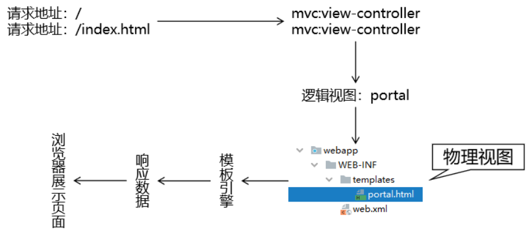

### 2.2.2 具体实现

#### 配置`view-controller`

```xml
<!-- 使用 mvc:view-controller 功能就不必编写 handler 方法，直接跳转 -->
<mvc:view-controller path="/" view-name="portal"/>
<mvc:view-controller path="/index.html" view-name="portal"/>
```

#### 页面

```html
<!DOCTYPE html>
<html lang="en" xmlns:th="http://www.thymeleaf.org">
<head>
    <meta charset="UTF-8">
    <title>Title</title>
</head>
<body style="text-align: center">
    
    <a th:href="@{/show/list}">显示电影列表</a>
    
</body>
</html>
```

## 2.3 显示全部数据

### 2.3.1 流程图

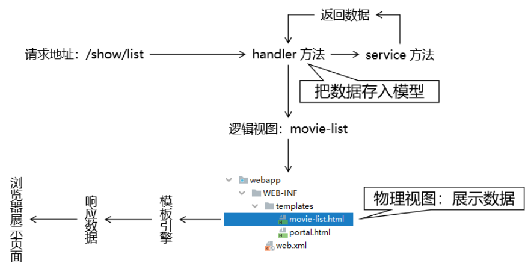

### 2.3.2 处理方法

```java
@Controller
public class MovieHandler {
    
    @Autowired
    private MovieService movieService;
    
    @RequestMapping("/show/list")
    public String showList(Model model) {
            
        // 1.调用 Service 方法查询数据
        List<Movie> movieList = movieService.getAll();
            
        // 2.将数据存入模型
        model.addAttribute("movieList", movieList);
    
        // 3.返回逻辑视图名称
        return "movie-list";
    }
        
}
```

### 2.3.3 页面

#### 样式

```html
<style type="text/css">
    table {
        border-collapse: collapse;
        margin: 0px auto 0px auto;
    }
    table th,td {
        border: 1px solid black;
        text-align: center;
    }
</style>
```

#### 数据展示

```html
<!-- 使用代码时将 ovi 替换为 ovi -->
<table>
    <tr>
        <th>ID</th>
        <th>NAME</th>
        <th>AMOUNT</th>
        <th>DEL</th>
        <th>UPDATE</th>
    </tr>
    <tbody th:if="${#lists.isEmpty(movieList)}">
        <tr>
            <td colspan="5">抱歉！没有查询到数据！</td>
        </tr>
    </tbody>
    <tbody th:if="${not #lists.isEmpty(movieList)}">
        <tr th:each="movie : ${movieList}">
            <td th:text="${movie.movieId}">这里显示映画ID</td>
            <td th:text="${movie.movieName}">这里显示映画名称</td>
            <td th:text="${movie.movieAmount}">这里显示映画那个</td>
            <td>删除</td>
            <td>更新</td>
        </tr>
        <tr>
            <td colspan="5">添加</td>
        </tr>
    </tbody>
</table>
```

## 2.4 增删改功能

### 2.4.1 movie-list.html界面

```html
<!DOCTYPE html>
<html lang="en">
<head>
    <meta charset="UTF-8">
    <title>电影列表</title>
  <style type="text/css">
    table {
      border-collapse: collapse;
      margin: 0px auto 0px auto;
    }
    table th,td {
      border: 1px solid black;
      text-align: center;
    }
  </style>
</head>
<body style="text-align: center">
<table>
  <tr>
    <th>ID</th>
    <th>NAME</th>
    <th>AMOUNT</th>
    <th>DEL</th>
    <th>UPDATE</th>
  </tr>
  <tbody th:if="${#lists.isEmpty(movieList)}">
  <tr>
    <td colspan="5">抱歉！没有查询到数据！</td>
  </tr>
  </tbody>
  <tbody th:if="${not #lists.isEmpty(movieList)}">
  <tr th:each="movie : ${movieList}">
    <td th:text="${movie.movieId}">这里显示映画ID</td>
    <td th:text="${movie.movieName}">这里显示映画名称</td>
    <td th:text="${movie.moviePrice}">这里显示映画那个</td>
    <td>
      <a th:href="@{/remove/movie(movieId=${movie.movieId})}">删除</a>
    </td>
    <td>
      <a th:href="@{/edit/movie/page(movieId=${movie.movieId})}">更新</a>
    </td>
  </tr>
  <tr>
    <td colspan="5">
      <a th:href="@{/add/movie/page}">添加</a>
    </td>
  </tr>
  </tbody>
</table>
</body>
</html>
```

### 2.4.2 movie-add.html页面

```html
<!DOCTYPE html>
<html lang="en">
<head>
    <meta charset="UTF-8">
    <title>添加电影</title>
</head>
<body>
<form th:action="@{/save/movie}" method="post">

  <label>
    电影名称：
    <input type="text" name="movieName"/>
  </label><br/>
  <label>
    电影票价格：
    <input type="text" name="moviePrice"/>
  </label><br/>

  <button type="submit">保存</button>

</form>
</body>
</html>
```

### 2.4.3 movie-edit.html页面

```html
<!DOCTYPE html>
<html lang="en">
<head>
    <meta charset="UTF-8">
    <title>信息更新</title>
</head>
<body>
<form th:action="@{/update/movie}" method="post">

  <input type="hidden" name="movieId" th:value="${movie.movieId}" />

  <label>
    电影名称：
    <input type="text" name="movieName" th:value="${movie.movieName}"/>
  </label><br/>
  <label>
    电影票价格：
    <input type="text" name="moviePrice" th:value="${movie.moviePrice}"/>
  </label><br/>

  <button type="submit">更新</button>

</form>
</body>
</html>
```

### 2.4.4 处理函数

```java
import lombok.AllArgsConstructor;
import org.springframework.stereotype.Controller;
import org.springframework.ui.Model;
import org.springframework.web.bind.annotation.RequestMapping;
import org.springframework.web.bind.annotation.RequestParam;
import seu.mvc.entity.Movie;
import seu.mvc.service.api.MovieService;

import java.util.List;

@Controller
@AllArgsConstructor
public class MovieHandler {

    private final MovieService movieService;

    @RequestMapping("/show/list")
    public String showList(Model model){
        List<Movie> movieList = movieService.getAll();

        model.addAttribute("movieList", movieList);

        return "movie-list";
    }

    @RequestMapping("/remove/movie")
    public String removeMovie(
            @RequestParam("movieId") String moveId
    ){
        movieService.removeMovieById(moveId);

        return "redirect:/show/list";
    }

    @RequestMapping("/save/movie")
    public String saveMovie(Movie movie){
        movieService.saveMovie(movie);

        return "redirect:/show/list";
    }

    @RequestMapping("/edit/movie/page")
    public String editMovie(
            @RequestParam("movieId") String movieId,
            Model model
    ){
        Movie movie = movieService.getMovieById(movieId);

        model.addAttribute("movie", movie);

        return "movie-edit";
    }

    @RequestMapping("/update/movie")
    public String updateMovie(
            Movie movie
    ){
        movieService.updateMovie(movie);
        return "redirect:/show/list";
    }

}
```

### 2.4.5 SpringMVC配置文件

```xml
<?xml version="1.0" encoding="UTF-8"?>
<beans xmlns="http://www.springframework.org/schema/beans"
       xmlns:xsi="http://www.w3.org/2001/XMLSchema-instance"
       xmlns:context="http://www.springframework.org/schema/context"
       xmlns:mvc="http://www.springframework.org/schema/mvc"
       xsi:schemaLocation="http://www.springframework.org/schema/beans http://www.springframework.org/schema/beans/spring-beans.xsd http://www.springframework.org/schema/context https://www.springframework.org/schema/context/spring-context.xsd http://www.springframework.org/schema/mvc https://www.springframework.org/schema/mvc/spring-mvc.xsd">

    <mvc:default-servlet-handler/>
    <mvc:annotation-driven/>

    <mvc:view-controller path="/" view-name="index"/>
    <mvc:view-controller path="/index.html" view-name="index"/>
    <mvc:view-controller path="/add/movie/page" view-name="movie-add"/>


    <context:component-scan base-package="seu.mvc"/>

    <bean id="templateResolver" class="org.thymeleaf.spring6.templateresolver.SpringResourceTemplateResolver">
        <property name="prefix" value="/WEB-INF/templates/"/>
        <property name="suffix" value=".html"/>
        <property name="templateMode" value="HTML"/>
        <property name="characterEncoding" value="UTF-8"/>
    </bean>

    <bean id="templateEngine" class="org.thymeleaf.spring6.SpringTemplateEngine">
        <property name="templateResolver" ref="templateResolver"/>
    </bean>

    <bean id="viewResolver" class="org.thymeleaf.spring6.view.ThymeleafViewResolver">
        <property name="templateEngine" ref="templateEngine"/>
        <property name="order" value="1"/>
        <property name="characterEncoding" value="UTF-8"/>
    </bean>

</beans>
```


# 3 RESTFul风格

## 3.1 RESTFul概述

### 3.1.1 REST概念

REST：**Re**presentational **S**tate **T**ransfer，表现层资源状态转移。

- 定位：互联网软件架构风格；
- 倡导者：Roy Thomas Fielding；
- 文献：Roy Thomas Fielding的博士论文；

### 3.1.2 REST规范的内涵

#### 资源

`URL：Uniform Resource Locator`统一资源定位器。意思是网络上的任何资源都可以通过 URL 来定位。但是在实际开发中，我们往往是使用URL来对应一个具体的功能，而不是资源本身。REST规范则倡导使用URL对应网络上的各种资源，任何一个资源都可以通过一个URL访问到，为实现操作**幂等性**奠定基础。而这个资源可以是网络上的一个文本、音频、视频、图片等等……

> 幂等性：如果一个操作执行一次和执行N次对系统的影响相同，那么我们就说这个操作满足幂等性。而幂等性正是REST规范所倡导的。

#### 状态转移

REST倡导针对资源本身操作，所以对资源的操作如果满足幂等性，那么操作只会导致资源本身的状态发生变化而不会破坏整个系统数据。

### 3.1.3 REST规范具体要求

#### 四种请求方式

REST风格主张在项目设计、开发过程中，具体的操作符合**HTTP协议定义的请求方式的语义**。

| 操作     | 请求方式 |
| -------- | -------- |
| 查询操作 | GET      |
| 保存操作 | POST     |
| 删除操作 | DELETE   |
| 更新操作 | PUT      |

另有一种说法：

- POST 操作针对功能执行，没有锁定资源 id，是非幂等性操作；
- PUT 操作锁定资源 id，即使操作失败仍然可以针对原 id 重新执行，对整个系统来说满足幂等性：
  - id对应的资源不存在：执行保存操作
  - id对应的资源存在：执行更新操作

#### URL地址风格

REST风格提倡**URL地址使用统一的风格设计**，从前到后**各个单词使用斜杠分开**，**不使用问号键值对方式携带请求参数**，而是将要发送给服务器的数据作为URL地址的一部分，以保证整体风格的一致性。还有一点是**不要使用请求扩展名**。

| 传统 URL 地址    | REST 风格地址 |
| ---------------- | ------------- |
| /remove/emp?id=5 | /emp/5        |


- 用一句话描述当前资源
- 一句话中各个单词用斜杠分开，从前到后保持完全一致的书写风格
- 不要使用问号键值对的方式传递数据
- 需要传递数据时，把数据嵌入到URL地址中，作为地址的一部分
- 不要使用请求扩展名

### 3.1.4 REST风格的好处

#### 含蓄安全

使用问号键值对的方式给服务器传递数据太明显，容易被人利用来对系统进行破坏。使用 REST 风格携带数据不再需要明显的暴露数据的名称。

#### 风格统一

URL 地址整体格式统一，从前到后始终都使用斜杠划分各个单词，用简单一致的格式表达语义。

#### 无状态

在调用一个接口（访问、操作资源）的时候，可以不用考虑上下文，不用考虑当前状态，极大的降低了系统设计的复杂度。

#### 严谨优雅

严格按照HTTP1.1协议中定义的请求方式本身的语义进行操作。

#### 简洁优雅

过去做增删改查操作需要设计4个不同的URL，现在一个就够了。

| 操作             | 传统风格                | REST 风格                                 |
| ---------------- | ----------------------- | ----------------------------------------- |
| 保存             | /CRUD/saveEmp           | URL 地址：/CRUD/emp<br>请求方式：POST     |
| 删除             | /CRUD/removeEmp?empId=2 | URL 地址：/CRUD/emp/2<br>请求方式：DELETE |
| 更新             | /CRUD/updateEmp         | URL 地址：/CRUD/emp<br>请求方式：PUT      |
| 查询（表单回显） | /CRUD/editEmp?empId=2   | URL 地址：/CRUD/emp/2<br>请求方式：GET    |

#### 丰富的语义

通过 URL 地址就可以知道资源之间的关系。它能够把一句话中的很多单词用斜杠连起来，反过来说就是可以在 URL 地址中用一句话来充分表达语义。

## 3.2 四种请求方式映射

### 3.2.1 `HiddenHttpMethodFilter`与装饰模式

#### 简介

在HTML中，GET和POST请求可以天然实现，但是DELETE和PUT请求无法直接做到。SpringMVC提供了`HiddenHttpMethodFilter`帮助我们将POST请求转换为DELETE或PUT请求。

#### `HiddenHttpMethodFilter`要点

**<u>默认请求参数名常量：</u>**

```java
public static final String DEFAULT_METHOD_PARAM = "_method";
```

在`HiddenHttpMethodFilter`中，声明了一个常量：`DEFAULT_METHOD_PARAM`，常量值是`"_method"`。

**<u>配套的成员变量：</u>**

```java
private String methodParam = DEFAULT_METHOD_PARAM;
```

之所以会提供这个成员变量和配套的`setXxx()`方法，是允许我们在配置`Filter`时，通过初始化参数来修改这个变量。如果不修改，默认就是前面常量定义的值。

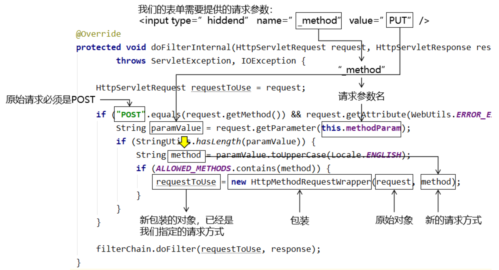

#### 原始请求对象的包装

**<u>困难：</u>**

- 包装对象必须和原始对象是同一个类型
- 保证同一个类型不能通过子类继承父类实现
    - 子类对象：希望改变行为、属性的对象
    - 父类对象：随着Servlet容器的不同，各个容器对`HttpServletRequest`接口给出的实现不同。如果继承了 A 容器给出的实现类，那么将来就不能再迁移到 B 容器。
- 只能让包装对象和被包装对象实现相同接口
    - 虽然使用动态代理技术大致上应该能实现，但是一旦应用代理就必须为被包装的对象的每一个方法都进行代理，操作过于繁琐。
- 如果我们自己创建一个类实现`HttpServletRequest`接口
    - 困难1：在不确定具体哪一个 Servlet 容器的情况下完全没办法实现
    - 困难2：抽象方法实在太多

**<u>`HttpServletRequestWrapper`：</u>**

`HttpServletRequestWrapper`类能够非常好的帮助我们对原始`request`对象进行包装。它为什么能帮我们解决上面的困难呢？

- `HttpServletRequestWrapper` 类替我们实现了`HttpServletRequest`接口；
- 为了让包装得到的新对象在任何Servlet容器平台上都能够正常工作，`HttpServletRequestWrapper`类此处的设计非常巧妙：它借助原始的request对象本身来实现所有的具体功能；
- 在我们想通过包装的方式来修改原始对象的行为或属性时，只需要在`HttpServletRequestWrapper` 类的子类中重写对应的方法即可；

**<u>`HttpMethodRequestWrapper`类：</u>**

`HttpMethodRequestWrapper`类就是`HiddenHttpMethodFilter` 的一个内部类，在`HttpMethodRequestWrapper`类中有如下行为实现了对原始对象的包装：

- 继承了官方包装类：`HttpServletRequestWrapper`；
- 在构造器中将原始`request`对象传给了父类构造器；
- 将我们指定的新请求方式传给了成员变量；
- 重写了父类（官方包装类）的`getMethod()`方法；
- 外界想知道新包装对象的请求方式时，会来调用被重写的`getMethod()`方法，从而得到我们指定的请求方式；

```java
/**
 * Simple {@link HttpServletRequest} wrapper that returns the supplied method for
 * {@link HttpServletRequest#getMethod()}.
 */
private static class HttpMethodRequestWrapper extends HttpServletRequestWrapper {
  
  private final String method;
  
  public HttpMethodRequestWrapper(HttpServletRequest request, String method) {
        // 在构造器中将原始 request 对象传给了父类构造器
    super(request);
        
        // 将我们指定的新请求方式传给了成员变量
    this.method = method;
  }
  
  @Override
  public String getMethod() {
    return this.method;
  }
}
```


### 3.2.2 PUT请求

#### web.xml

```xml
<filter>
    <filter-name>hiddenHttpMethodFilter</filter-name>
    <filter-class>org.springframework.web.filter.HiddenHttpMethodFilter</filter-class>
</filter>
<filter-mapping>
    <filter-name>hiddenHttpMethodFilter</filter-name>
    <url-pattern>/*</url-pattern>
</filter-mapping>
```

#### 表单

- 要点1：原请求方式必须是 post
- 要点2：新的请求方式名称通过请求参数发送
- 要点3：请求参数名称必须是_method
- 要点4：请求参数的值就是要改成的请求方式

```html
<!-- 原请求方式必须是 post -->
<form th:action="@{/emp}" method="post">
    <!-- 通过表单隐藏域携带一个请求参数 -->
    <!-- 请求参数名：_method -->
    <!-- 请求参数值：put -->
    <input type="hidden" name="_method" value="put" />

    <button type="submit">更新</button>
</form>
```

#### 处理方法

```java
// 映射请求地址：URL + 请求方式
@RequestMapping(value = "/emp", method = RequestMethod.PUT)
public String updateEmp() {
    
    logger.debug("现在执行的是 updateEmp() 方法");
    
    return "target";
}
```

### 3.2.3 DELETE请求

#### 场景

```html
<h3>将XXX请求转换为DELETE请求</h3>
<table id="dataTable">
    <tr>
        <th>姓名</th>
        <th>年龄</th>
        <th>删除</th>
    </tr>
    <tr>
        <td>张三</td>
        <td>40</td>
        <td>
            <a th:href="@{/emp}" @click="doConvert">删除</a>
        </td>
    </tr>
    <tr>
        <td>李四</td>
        <td>30</td>
        <td>
            <a th:href="@{/emp}" @click="doConvert">删除</a>
        </td>
    </tr>
</table>
```

#### 负责转换的表单

```html
<!-- 创建一个通用表单，在删除超链接的单击响应函数中通过这个表单把GET请求转换为POST，进而再转DELETE -->
<form method="post" id="convertForm">
    <input type="hidden" name="_method" value="delete" />
</form>
```

#### 删除超链接绑定单击响应函数

```html
<td>
    <!-- /emp/{empId}/{pageNo} -->
    <!-- onclick="convertMethod(this)" 表示点击这个超链接时，调用 convertMethod() 函数 -->
    <!-- this 代表当前超链接对象 -->
    <!-- event 是代表当前事件的事件对象 -->
    <a onclick="convertMethod(this, event)" th:href="@{/emp}">删除</a>
</td>
```

#### 编写单击响应函数

```html
<script type="text/javascript">

    function convertMethod(anchorElement, event) {

        // 获取超链接原本要访问的目标地址
        var targetURL = anchorElement.href;

        // 获取表单对象
        var formEle = document.getElementById("convertForm");

        // 把超链接原本要访问的地址设置给表单的 action 属性
        formEle.action = targetURL;

        // 提交表单
        formEle.submit();

        // 取消控件的默认行为：让超链接不会跳转
        event.preventDefault();
    }

</script>
```

#### 处理方法

```java
@RequestMapping(value = "/emp", method = RequestMethod.DELETE)
public String removeEmp() {
    
    logger.debug("现在执行的是 removeEmp() 方法");
    
    return "target";
}
```

## 3.3 `@PathVariable`注解

### 3.3.1 操作

#### 传一个值

```html
<a th:href="@{/emp/20}">传一个值</a><br/>
```

```java
// 实际访问地址：/emp/20
// 映射地址：/emp/{empId}是把变量部分用大括号标记出来，写入变量名
@RequestMapping("/emp/{empId}")
public String getEmpById(@PathVariable("empId") Integer empId) {
    
    logger.debug("empId = " + empId);
    
    return "target";
}
```

#### 传多个值

```html
<a th:href="@{/emp/tom/18/50}">传多个值</a><br/>
```

#### 处理方法

```java
// 实际地址：/emp/tom/18/50
@RequestMapping("/emp/{empName}/{empAge}/{empSalary}")
public String queryEmp(
        @PathVariable("empName") String empName,
        @PathVariable("empAge") Integer empAge,
        @PathVariable("empSalary") Double empSalary
) {
    
    logger.debug("empName = " + empName);
    logger.debug("empAge = " + empAge);
    logger.debug("empSalary = " + empSalary);
    
    return "target";
}
```


# 4 Ajax

## 4.1 `@RequestBody`注解

### 4.1.1 引入JavaScript库

```html
<script type="text/javascript" src="script/vue.js"></script>
<script type="text/javascript" src="script/axios.min.js"></script>
```

### 4.1.2 前端代码

```js
new Vue({
    "el":"#btnSpan",
    "methods":{
        "experimentOne":function () {
 
            // 请求：发送普通请求参数
            // 响应：普通文本
            axios({
                "method":"post",
                "url":"ajax/experiment/one",
                "params":{
                    "userName":"tom",
                    "password":"123456"
                }
            }).then(function (response) {
 
                // response接收服务器端返回的响应数据
                console.log(response);
            }).catch(function (response) {
                console.log(response);
            });
 
        }
    }
});
```

#### 后端代码

```java
// 使用@ResponseBody注解告诉 SpringMVC：请你拿当前方法的返回值作为响应体，不要再找视图了
// 方法返回值类型有两种情况：
// 情况一：简单类型。SpringMVC 会直接作为响应体数据。
// 情况二：复杂类型。SpringMVC 会把它转换为 JSON 然后再作为响应体。此时需要 Jackson 的支持。
@ResponseBody
@RequestMapping("/ajax/experiment/one")
public String experimentOne(
 
        // Ajax请求发过来的请求参数，对服务器端来说没有区别，还是像以前一样正常接收
        @RequestParam("userName") String userName,
        @RequestParam("password") String password
) {
 
    logger.debug("userName = " + userName);
    logger.debug("password = " + password);
 
    // 服务器端给Ajax程序的响应数据通过handler方法的返回值提供
    return "message from handler as response[来自服务器的问候]";
}
```

## 4.2 `@RequestBody`注解

### 4.2.1 前端代码

```js
"experimentTwo":function () {
 
    axios({
        "method":"post",
        "url":"ajax/experiment/two",
 
        // data属性中指定一个 JSON 数据作为请求体
        "data":{
            "stuId": 55,
            "stuName": "tom",
            "subjectList": [
                {
                    "subjectName": "java",
                    "subjectScore": 50.55
                },
                {
                    "subjectName": "php",
                    "subjectScore": 30.26
                }
            ],
            "teacherMap": {
                "one": {
                    "teacherName":"tom",
                    "teacherAge":23
                },
                "two": {
                    "teacherName":"jerry",
                    "teacherAge":31
                },
            },
            "school": {
                "schoolId": 23,
                "schoolName": "atguigu"
            }
        }
    }).then(function (response) {
        console.log(response);
    }).catch(function (error) {
        console.log(error);
    });
 
}
```

### 4.2.2 导入依赖

```xml
<!-- https://mvnrepository.com/artifact/com.fasterxml.jackson.core/jackson-databind -->
<dependency>
    <groupId>com.fasterxml.jackson.core</groupId>
    <artifactId>jackson-databind</artifactId>
    <version>2.12.1</version>
</dependency>
```

### 4.2.3 处理方法

```java
@ResponseBody
@RequestMapping("/ajax/experiment/two")
public String experimentTwo(

        // 使用 @RequestBody 注解将请求体 JSON 数据解析出来，注入到对应的实体类中
        @RequestBody Student student
        ) {
    
    logger.debug(student.toString());
    
    return "message from handler as response[来自服务器的问候]";
}
```

## 4.3 `@RestController`注解

类上的`@ResponseBody`注解可以和`@Controller`注解合并为`@RestController`注解。所以使用了`@RestController`注解就相当于给类中的每个方法都加了`@ResponseBody`注解。

### 源码

```java
@Target(ElementType.TYPE)
@Retention(RetentionPolicy.RUNTIME)
@Documented
@Controller
@ResponseBody
public @interface RestController {
 
  /**
   * The value may indicate a suggestion for a logical component name,
   * to be turned into a Spring bean in case of an autodetected component.
   * @return the suggested component name, if any (or empty String otherwise)
   * @since 4.0.1
   */
  @AliasFor(annotation = Controller.class)
  String value() default "";
 
}
```

## 4.4 注解对比

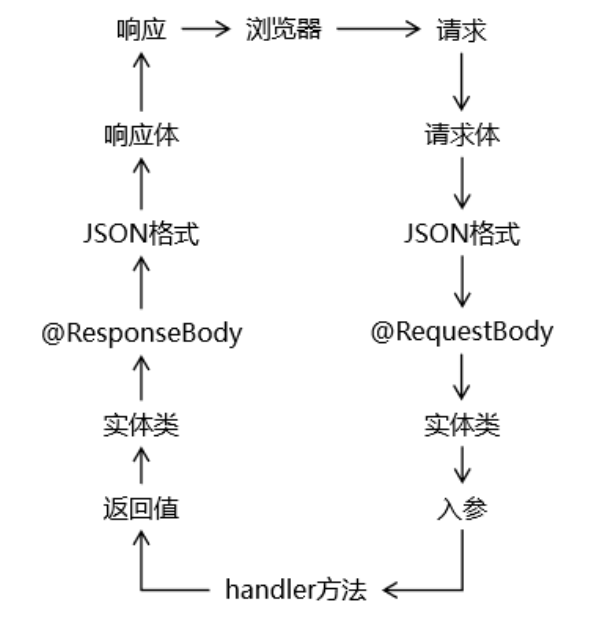

# 5 异常映射

## 5.1 概念

### 5.1.1 微观

将异常类型和某个具体的视图关联起来，建立映射关系。好处是可以通过SpringMVC框架来帮助我们管理异常。

- 声明式管理异常：在配置文件中指定异常类型和视图之间的对应关系。在配置文件或注解类中统一管理。
- 编程式管理异常：需要我们自己手动 try ... catch ... 捕获异常，然后再手动跳转到某个页面。

### 5.1.2 宏观

整个项目从架构这个层面设计的异常处理的统一机制和规范。

一个项目中会包含很多个模块，各个模块需要分工完成。如果张三负责的模块按照A方案处理异常，李四负责的模块按照B方案处理异常……各个模块处理异常的思路、代码、命名细节都不一样，那么就会让整个项目非常混乱。

## 5.2 异常映射的好处

- 使用声明式代替编程式来实现异常管理
    - 让异常控制和核心业务解耦，二者各自维护，结构性更好
- 整个项目层面使用同一套规则来管理异常
    - 整个项目代码风格更加统一、简洁
    - 便于团队成员之间的彼此协作

## 5.3 基于XML的异常映射

### 5.3.1 配置

SpringMVC 会根据异常映射信息，在捕获到指定异常对象后，将异常对象存入请求域，然后转发到和异常类型关联的视图。

```XML
<bean id="exceptionResolver"
      class="org.springframework.web.servlet.handler.SimpleMappingExceptionResolver">
 
    <!-- 配置异常映射关系 -->
    <property name="exceptionMappings">
        <props>
            <!-- key属性：指定异常类型 -->
            <!-- 文本标签体：和异常类型对应的逻辑视图 -->
            <prop key="java.lang.ArithmeticException">error-arith</prop>
        </props>
    </property>
 
    <!-- 使用 exceptionAttribute 属性配置将异常对象存入请求域时使用的属性名 -->
    <!-- 这个属性名默认是exception -->
    <property name="exceptionAttribute" value="atguiguException"/>
</bean>
```

### 5.3.2 异常范围

如果在配置文件中，发现有多个匹配的异常类型，那么 SpringMVC 会采纳**范围上最接近的**异常映射关系。

```XML
<prop key="java.lang.ArithmeticException">error-arith</prop>
<prop key="java.lang.RuntimeException">error-runtime</prop>
```

## 5.4 基于注解的异常映射

### 5.4.1 创建异常处理类并加入IOC容器

```xml
<context:component-scan base-package="com.atguigu.mvc.handler,com.atguigu.mvc.exception"/>
```

### 5.4.2 给异常处理类标记注解

```java
// 异常处理器类需要使用 @ControllerAdvice 注解标记
@ControllerAdvice
public class MyExceptionHandler {
    
}
```

### 5.4.3 声明处理异常的方法

```java
// @ExceptionHandler注解：标记异常处理方法
// value属性：指定匹配的异常类型
// 异常类型的形参：SpringMVC 捕获到的异常对象
@ExceptionHandler(value = NullPointerException.class)
public String resolveNullPointerException(Exception e, Model model) {
 
    // 我们可以自己手动将异常对象存入模型
    model.addAttribute("atguiguException", e);
 
    // 返回逻辑视图名称
    return "error-nullpointer";
}
```

当同一个异常类型在基于XML和注解的配置中都能够找到对应的映射，那么以注解为准。

## 5.5 区分请求类型

### 5.5.1 分析

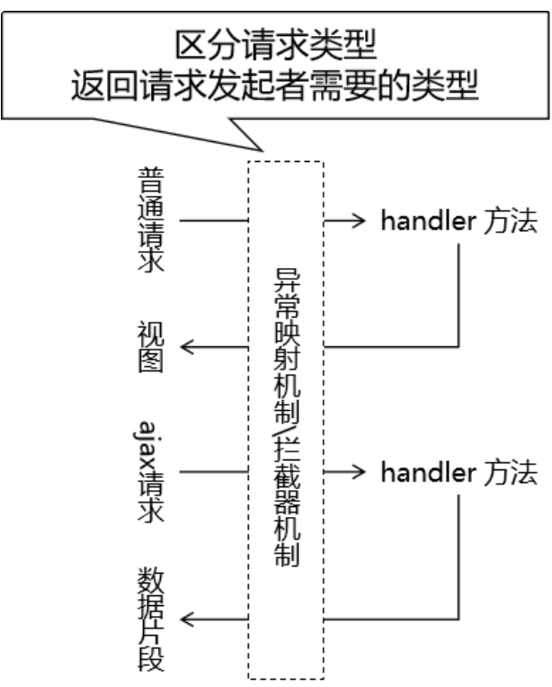

### 5.5.2 判断方法

查看请求消息头中是否包含 Ajax 请求独有的特征：

- `Accept`请求消息头：包含`application/json`；
- `X-Requested-With`请求消息头：包含`XMLHttpRequest`；

```java
@ExceptionHandler(value = Exception.class)
public String resolveException(Exception e, HttpServletRequest request, HttpServletResponse response) throws IOException {
 
    // 调用工具方法判断当前请求是否是 Ajax 请求
    boolean judgeResult = MVCUtil.judgeRequestType(request);
 
    if (judgeResult) {
 
        // 对 Ajax 请求返回字符串作为响应体
        String message = e.getMessage();
 
        response.setContentType("text/html;charset=UTF-8");
        response.getWriter().write(message);
 
        // 上面已经使用原生 response 对象返回了响应，这里就不返回视图名称了
        return null;
    }
 
    // 对普通请求返回逻辑视图名称
    return "error-exception";
}
```

# 6 SpringMVC拦截器

## 6.1 概念

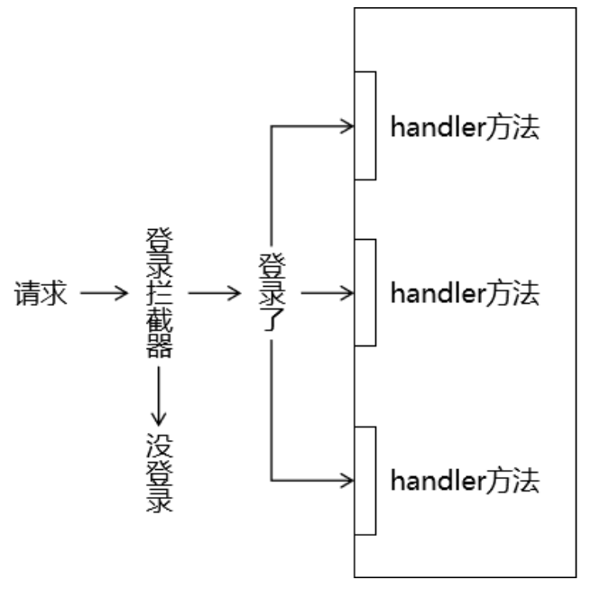

### 拦截器VS过滤器

#### 相似点

三要素相同

- 拦截：必须先把请求拦住，才能执行后续操作；
- 过滤：拦截器或过滤器存在的意义就是对请求进行统一处理；
- 放行：对请求执行了必要操作后，放请求过去，让它访问原本想要访问的资源；

#### 不同点

- 工作平台不同
    - 过滤器工作在 Servlet 容器中
    - 拦截器工作在 SpringMVC 的基础上
- 拦截的范围
    - 过滤器：能够拦截到的最大范围是整个 Web 应用
    - 拦截器：能够拦截到的最大范围是整个 SpringMVC 负责的请求
- IOC 容器支持
    - 过滤器：想得到 IOC 容器需要调用专门的工具方法，是间接的
    - 拦截器：它自己就在 IOC 容器中，所以可以直接从 IOC 容器中装配组件，也就是可以直接得到 IOC 容器的支持

#### 选择

功能需要如果用 SpringMVC 的拦截器能够实现，就不使用过滤器。

## 6.2 使用

### 6.2.1 创建拦截器类

#### 实现接口

```java
public class Process01Interceptor implements HandlerInterceptor {
 
    Logger logger = LoggerFactory.getLogger(this.getClass());
 
    // 在处理请求的目标 handler 方法前执行
    @Override
    public boolean preHandle(HttpServletRequest request, HttpServletResponse response, Object handler) throws Exception {
        
        logger.debug("Process01Interceptor preHandle方法");
         
        // 返回true：放行
        // 返回false：不放行
        return true;
    }
 
    // 在目标 handler 方法之后，渲染视图之前
    @Override
    public void postHandle(HttpServletRequest request, HttpServletResponse response, Object handler, ModelAndView modelAndView) throws Exception {
 
        logger.debug("Process01Interceptor postHandle方法");
        
    }
 
    // 渲染视图之后执行
    @Override
    public void afterCompletion(HttpServletRequest request, HttpServletResponse response, Object handler, Exception ex) throws Exception {
        
        logger.debug("Process01Interceptor afterCompletion方法");
        
    }
}
```

**<u>单个拦截器执行顺序:</u>**

- `preHandle()`方法
- 目标handler方法
- `postHandle()`方法
- 渲染视图
- `afterCompletion()`方法

在较低版本的 SpringMVC 中，实现`HandlerInterceptor`接口需要把所有抽象方法都实现。但是又不是每个方法都需要使用，导致代码比较繁琐。

此时可以通过继承`HandlerInterceptorAdapter`类同样可以创建拦截器类。`HandlerInterceptorAdapter`类中已经给 `HandlerInterceptor`接口提供了默认实现，我们继承后不需要把每个方法都实现，只需要把有用的方法重写即可。

在 SpringMVC 较高版本（例如：5.3版本以上）中，`HandlerInterceptor` 接口已经借助JDK1.8新特性让每个抽象方法都给出了默认实现，所以`HandlerInterceptorAdapter`这个类被标记为过时。

### 6.2.2 注册拦截器

#### 默认拦截全部请求

```xml
<!-- 注册拦截器 -->
<mvc:interceptors>
    
    <!-- 直接通过内部 bean 配置的拦截器默认拦截全部请求（SpringMVC 范围内） -->
    <bean class="com.atguigu.mvc.interceptor.Process01Interceptor"/>
</mvc:interceptors>
```

#### 配置拦截路径

**<u>精确匹配：</u>**

```xml
<!-- 具体配置拦截器可以指定拦截的请求地址 -->
<mvc:interceptor>
    <!-- 精确匹配 -->
    <mvc:mapping path="/common/request/one"/>
    <bean class="com.atguigu.mvc.interceptor.Process03Interceptor"/>
</mvc:interceptor>
```

**<u>匹配单层路径：</u>**

```xml
<mvc:interceptor>
    <!-- /*匹配路径中的一层 -->
    <mvc:mapping path="/common/request/*"/>
    <bean class="com.atguigu.mvc.interceptor.Process04Interceptor"/>
</mvc:interceptor>
```

**<u>匹配多层路径：</u>**

```xml
<mvc:interceptor>
    <!-- /**匹配路径中的多层 -->
    <mvc:mapping path="/common/request/**"/>
    <bean class="com.atguigu.mvc.interceptor.Process05Interceptor"/>
</mvc:interceptor>
```

#### 配置不拦截路径

```xml
<mvc:interceptor>
    <!-- /**匹配路径中的多层 -->
    <mvc:mapping path="/common/request/**"/>

    <!-- 使用 mvc:exclude-mapping 标签配置不拦截的地址 -->
    <mvc:exclude-mapping path="/common/request/two/bbb"/>

    <bean class="com.atguigu.mvc.interceptor.Process05Interceptor"/>
</mvc:interceptor>
```

### 6.2.3 执行顺序

- `preHandle()`方法：SpringMVC 会把所有拦截器收集到一起，然后按照<span style="color:blue;font-weight:bold;">配置顺序</span>调用各个`preHandle()` 方法；
- 目标 handler 方法；
- `postHandle()`方法：SpringMVC会把所有拦截器收集到一起，然后按照<span style="color:blue;font-weight:bold;">配置相反</span>的顺序调用各个`postHandle()`方法；
- 渲染视图；
- `afterCompletion()`方法：SpringMVC 会把所有拦截器收集到一起，然后按照<span style="color:blue;font-weight:bold;">配置相反</span>的顺序调用各个 `afterCompletion()` 方法；
