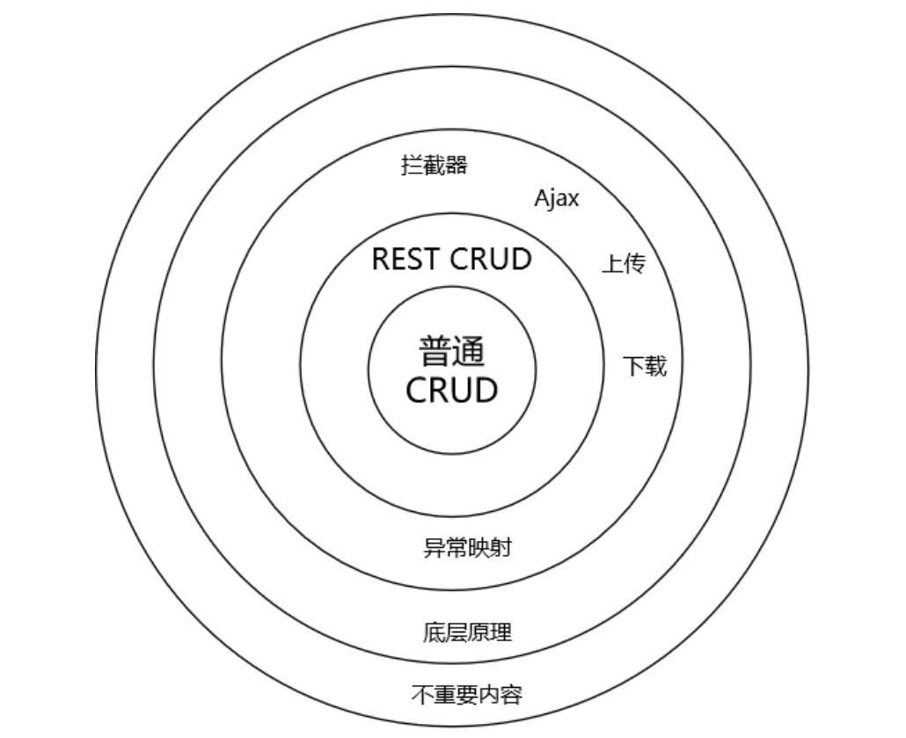

# SpringMVC

**@author: Shuxin_Wang**

**@time: 2023.04.04**

---

[toc]

---



# 1 SpringMVC基础操作

## 1.1 SpringMVC概述

### 1.1.1 SpringMVC优势

SpringMVC是Spring为表述层开发提供的一整套完备的解决方案。

在表述层框架历经`Strust`、`WebWork`、`Strust2`等诸多产品的历代更迭之后，目前业界普遍选择了SpringMVC作为`Java EE`项目表述层开发的**首选方案**。之所以能做到这一点，是因为SpringMVC具备如下显著优势：

- **Spring 家族原生产品**，与IOC容器等基础设施无缝对接；
- 表述层各细分领域需要解决的问题**全方位覆盖**，提供**全面解决方案**；
- **代码清新简洁**，大幅度提升开发效率；
- 内部组件化程度高，可插拔式组件**即插即用**，想要什么功能配置相应组件即可；
- **性能卓著**，尤其适合现代大型、超大型互联网项目要求；

### 1.1.2 表述层要解决的问题

- 请求映射
- 数据输入
- 视图界面
- 请求分发
- 表单回显
- 会话控制
- 过滤拦截
- 异步交互
- 文件上传
- 文件下载
- 数据校验
- 类型转换

### 1.1.3 SpringMVC代码对比

#### 基于原生Servlet API开发

```java
protected void doGet(HttpServletRequest request, HttpServletResponse response) 
                                                        throws ServletException, IOException {   
    
    String userName = request.getParameter("userName");
    
    System.out.println("userName="+userName);
    
}
```

#### 基于SpringMVC开发

```java
@RequestMapping("/user/login")
public String login(@RequestParam("userName") String userName){
    
    log.debug("userName="+userName);
    
    return "result";
}
```

