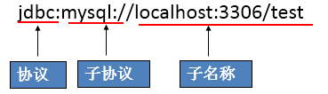

# JDBC

**@author: Shuxin_Wang**

**@time: 2023.03.02**

------

# 1 JDBC概述

## 1.1 数据的持久化

- 持久化(persistence)：**把数据保存到可掉电式存储设备中以供之后使用**。大多数情况下，特别是企业级应用，**数据持久化意味着将内存中的数据保存到硬盘**上加以”固化”**，而持久化的实现过程大多通过各种关系数据库来完成**；

- 持久化的主要应用是将内存中的数据存储在关系型数据库中，当然也可以存储在磁盘文件、XML数据文件中；


## 1.2 Java中的数据存储技术

- 在Java中，数据库存取技术可分为如下几类：
  - **JDBC**直接访问数据库；
  - `JDO (Java Data Object )`技术；

  - **第三方O/R工具**，如`Hibernate`, `Mybatis` 等；

- `JDBC`是Java访问数据库的基石，`JDO`、`Hibernate`、`MyBatis`等只是更好的封装了`JDBC`。


## 1.3 JDBC介绍

- `JDBC(Java Database Connectivity)`是一个**独立于特定数据库管理系统、通用的SQL数据库存取和操作的公共接口**（一组API），定义了用来访问数据库的标准Java类库，`（java.sql,javax.sql）`使用这些类库可以以一种**标准**的方法、方便地访问数据库资源；
- `JDBC`为访问不同的数据库提供了一种**统一的途径**，为开发者屏蔽了一些细节问题；
- `JDBC`的目标是使`Java`程序员使用`JDBC`可以连接任何**提供了`JDBC`驱动程序**的数据库系统，这样就使得程序员无需对特定的数据库系统的特点有过多的了解，从而大大简化和加快了开发过程；
- 如果没有`JDBC`，那么`Java`程序访问数据库时是这样的：


- 有了`JDBC`，`Java`程序访问数据库时是这样的：


- 总结如下：


## 1.4 JDBC体系结构

`JDBC`接口（`API`）包括两个层次：

- **面向应用的API**：`Java API`，抽象接口，供应用程序开发人员使用（连接数据库，执行SQL语句，获得结果）；
- **面向数据库的API**：`Java Driver API`，供开发商开发数据库驱动程序用；

> **`JDBC`是sun公司提供一套用于数据库操作的接口，java程序员只需要面向这套接口编程即可。**
>
> **不同的数据库厂商，需要针对这套接口，提供不同实现。不同的实现的集合，即为不同数据库的驱动。——面向接口编程**


## 1.5 JDBC程序编写步骤


> 补充：`ODBC`(**Open Database Connectivity**，开放式数据库连接)，是微软在Windows平台下推出的。使用者在程序中只需要调用`ODBC API`，由 `ODBC` 驱动程序将调用转换成为对特定的数据库的调用请求。


# 2 获取数据库连接

## 2.1 `Driver`接口实现类

### 2.1.1 `Driver`接口介绍

- `java.sql.Driver` 接口是所有 `JDBC` 驱动程序需要实现的接口。这个接口是提供给数据库厂商使用的，不同数据库厂商提供不同的实现；

- 在程序中不需要直接去访问实现了 `Driver` 接口的类，而是由驱动程序管理器类(`java.sql.DriverManager`)去调用这些`Driver`实现：
  - `Oracle`的驱动：`oracle.jdbc.driver.OracleDriver`；
  - `MySQL`的驱动： `com.mysql.jdbc.Driver`；

将驱动jar包拷贝到Java工程的一个目录中，将该驱动添加到`Build Path`中。

注意：如果是`Dynamic Web Project`（动态的web项目）话，则是把驱动`jar`放到`WebContent`（有的开发工具叫WebRoot）目录中的`WEB-INF`目录中的`lib`目录下即可

### 2.1.2 加载与注册JDBC驱动

- 加载驱动：加载 JDBC 驱动需调用 Class 类的静态方法 `forName()`，向其传递要加载的 JDBC 驱动的类名

  - `Class.forName(“com.mysql.jdbc.Driver”);`

- 注册驱动：`DriverManager` 类是驱动程序管理器类，负责管理驱动程序
  - 使用`DriverManager.registerDriver(com.mysql.jdbc.Driver)`来注册驱动

  - 通常不用显式调用 `DriverManager` 类的 `registerDriver()` 方法来注册驱动程序类的实例，因为 Driver 接口的驱动程序类==**都**==包含了静态代码块，在这个静态代码块中，会调用 `DriverManager.registerDriver()` 方法来注册自身的一个实例。下图是MySQL的Driver实现类的源码：


## 2.2 `URL`

- `JDBC URL` 用于标识一个被注册的驱动程序，驱动程序管理器通过这个 URL 选择正确的驱动程序，从而建立到数据库的连接。

- `JDBC URL`的标准由三部分组成，各部分间用冒号分隔。 
  - `jdbc:子协议:子名称`
  - **协议**：`JDBC URL`中的协议总是`jdbc` 
  - **子协议**：子协议用于标识一个数据库驱动程序
  - **子名称**：一种标识数据库的方法。子名称可以依不同的子协议而变化，用子名称的目的是为了**定位数据库**提供足够的信息。包含**主机名**(对应服务端的ip地址)**，端口号，数据库名**



- 举例：

  

- 几种常用数据库的 `JDBC URL`

  - MySQL的连接URL编写方式：

    - `jdbc:mysql://主机名称:mysql服务端口号/数据库名称?参数=值&参数=值`
    - `jdbc:mysql://localhost:3306/atguigu`
    - `jdbc:mysql://localhost:3306/atguigu?useUnicode=true&characterEncoding=utf8`（如果JDBC程序与服务器端的字符集不一致，会导致乱码，那么可以通过参数指定服务器端的字符集）
    - `jdbc:mysql://localhost:3306/atguigu?user=root&password=123456`

  - Oracle 9i的连接URL编写方式：

    - `jdbc:oracle:thin:@主机名称:oracle服务端口号:数据库名称`
    - `jdbc:oracle:thin:@localhost:1521:atguigu`

  - SQLServer的连接URL编写方式：

    - `jdbc:sqlserver://主机名称:sqlserver服务端口号:DatabaseName=数据库名称`

    - `jdbc:sqlserver://localhost:1433:DatabaseName=atguigu`

## 2.3 用户名和密码

- `user`,`password`可以用`属性名=属性值`方式告诉数据库
- 可以调用 `DriverManager` 类的 `getConnection`() 方法建立到数据库的连接

## 2.4 连接方式举例

### 2.4.1 连接方式1

```java
@Test
public void testConnection1() {
    try {
        //1.提供java.sql.Driver接口实现类的对象
        Driver driver = null;
        driver = new com.mysql.cj.jdbc.Driver();

        //2.提供url，指明具体操作的数据
        String url = "jdbc:mysql://localhost:3306/test";

        //3.提供Properties的对象，指明用户名和密码
        Properties info = new Properties();
        info.setProperty("user", "root");
        info.setProperty("password", "abc123");

        //4.调用driver的connect()，获取连接
        Connection conn = driver.connect(url, info);
        System.out.println(conn);
    } catch (SQLException e) {
        e.printStackTrace();
    }
}
```

> 说明：上述代码中显式出现了第三方数据库的API

### 2.4.2 连接方式2

```java
@Test
public void testConnection2() {
    try {
        //1.实例化Driver
        String className = "com.mysql.cj.jdbc.Driver";
        Class<?> clazz = Class.forName(className);
        Driver driver = (Driver) clazz.getDeclaredConstructor().newInstance();

        //2.提供url，指明具体操作的数据
        String url = "jdbc:mysql://localhost:3306/mysql";

        //3.提供Properties的对象，指明用户名和密码
        Properties info = new Properties();
        info.setProperty("user", "root");
        info.setProperty("password", "abc123");

        //4.调用driver的connect()，获取连接
        Connection conn = driver.connect(url, info);
        System.out.println(conn);

    } catch (Exception e) {
        e.printStackTrace();
    }
}
```

> 说明：相较于方式一，这里使用反射实例化Driver，不在代码中体现第三方数据库的API。体现了面向接口编程思想。

### 2.4.3 连接方式3

```java
@Test
    public void testConnection3() {
        try {
            //1.数据库连接的4个基本要素：
            String url = "jdbc:mysql://localhost:3306/mysql";
            String user = "root";
            String password = "abc123";
            String driverName = "com.mysql.cj.jdbc.Driver";
            //2.实例化Driver
            Class<?> clazz = Class.forName(driverName);
            Driver driver = (Driver) clazz.getDeclaredConstructor().newInstance();
            //3.注册驱动
            DriverManager.registerDriver(driver);
            //4.获取连接
            Connection conn = DriverManager.getConnection(url, user, password);
            System.out.println(conn);
        } catch (Exception e) {
            e.printStackTrace();
        }
    }
```

> 说明：使用DriverManager实现数据库的连接。体会获取连接必要的4个基本要素。

### 2.4.4 连接方式4

```java
@Test
public void testConnection4() {
    try {
        //1.数据库连接的4个基本要素：
        String url = "jdbc:mysql://localhost:3306/mysql";
        String user = "root";
        String password = "abc123";
        String driverName = "com.mysql.cj.jdbc.Driver";

        //2.加载驱动 （①实例化Driver ②注册驱动）
        Class.forName(driverName);

        //Driver driver = (Driver) clazz.newInstance();
        //3.注册驱动
        //DriverManager.registerDriver(driver);
        /*
        可以注释掉上述代码的原因，是因为在mysql的Driver类中声明有：
        static {
            try {
                DriverManager.registerDriver(new Driver());
            } catch (SQLException var1) {
                throw new RuntimeException("Can't register driver!");
            }
        }

         */

        //3.获取连接
        Connection conn = DriverManager.getConnection(url, user, password);
        System.out.println(conn);
    } catch (Exception e) {
        e.printStackTrace();
    }
}
```

> 说明：不必显式的注册驱动了。因为在DriverManager的源码中已经存在静态代码块，实现了驱动的注册。

### 2.4.5 连接方式5

```java
@Test
public  void testConnection5() throws Exception {
    //1.加载配置文件
    InputStream is = ConnectionTest.class.getClassLoader().getResourceAsStream("jdbc.properties");
    Properties pros = new Properties();
    pros.load(is);
    //2.读取配置信息
    String user = pros.getProperty("user");
    String password = pros.getProperty("password");
    String url = pros.getProperty("url");
    String driverClass = pros.getProperty("driverClass");
    //3.加载驱动
    Class.forName(driverClass);
    //4.获取连接
    Connection conn = DriverManager.getConnection(url,user,password);
    System.out.println(conn);
}
```

> 说明：使用配置文件的方式保存配置信息，在代码中加载配置文件
>
> **使用配置文件的好处：**
>
> ①实现了代码和数据的分离，如果需要修改配置信息，直接在配置文件中修改，不需要深入代码；
>
> ②如果修改了配置信息，省去重新编译的过程；

# 3 `PreparedStatement`

## 3.1 操作和访问数据库

- 数据库连接被用于向数据库服务器发送命令和 SQL 语句，并接受数据库服务器返回的结果。其实一个数据库连接就是一个`Socket`连接；

- 在 `java.sql` 包中有 3 个接口分别定义了对数据库的调用的不同方式：
  - `Statement`：用于执行**<u>静态 SQL 语句</u>**并返回它所生成结果的对象；
  - `PrepatedStatement`：SQL 语句被预编译并存储在此对象中，可以使用此对象多次高效地执行该语句；
  - `CallableStatement`：用于执行 SQL 存储过程；


## 3.2 使用`Statement`操作数据表的弊端

- 通过调用 `Connection` 对象的 `createStatement()` 方法创建该对象。该对象用于执行静态的 SQL 语句，并且返回执行结果。

- `Statement` 接口中定义了下列方法用于执行 SQL 语句：

```java
// 执行更新操作INSERT、UPDATE、DELETE
int excuteUpdate(String sql);
//执行查询操作SELECT
ResultSet executeQuery(String sql);
```

- 但是使用`Statement`操作数据表存在弊端：

  - **问题一：存在拼串操作，繁琐**
  - **问题二：存在SQL注入问题**

- SQL 注入是**<u>利用某些系统没有对用户输入的数据进行充分的检查，而在用户输入数据中注入非法的 SQL 语句段或命令</u>**(如：`SELECT user, password FROM user_table WHERE user='a' OR 1 = ' AND password = ' OR '1' = '1'`) ，从而利用系统的 SQL 引擎完成恶意行为的做法；

- 对于 Java 而言，要防范 SQL 注入，只要用 `PreparedStatement`(从`Statement`扩展而来) 取代 `Statement` 就可以了；

### 代码演示

```java
```

