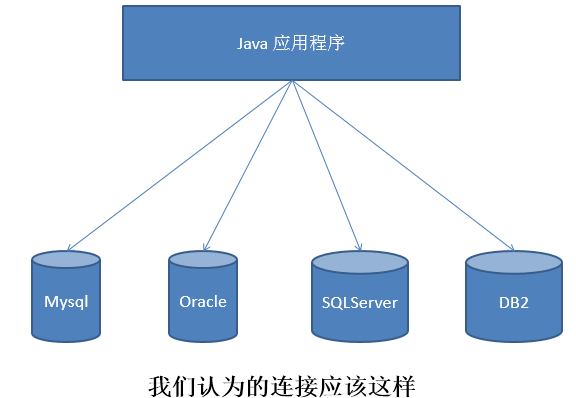

# JDBC

**@author: Shuxin_Wang**

**@time: 2023.03.02**

------

# 1 JDBC概述

## 1.1 数据的持久化

- 持久化(persistence)：**把数据保存到可掉电式存储设备中以供之后使用**。大多数情况下，特别是企业级应用，**数据持久化意味着将内存中的数据保存到硬盘**上加以”固化”**，而持久化的实现过程大多通过各种关系数据库来完成**；

- 持久化的主要应用是将内存中的数据存储在关系型数据库中，当然也可以存储在磁盘文件、XML数据文件中；

## 1.2 Java中的数据存储技术

- 在Java中，数据库存取技术可分为如下几类：
  - **JDBC**直接访问数据库；
  - `JDO (Java Data Object )`技术；

  - **第三方O/R工具**，如`Hibernate`, `Mybatis` 等；

- `JDBC`是Java访问数据库的基石，`JDO`、`Hibernate`、`MyBatis`等只是更好的封装了`JDBC`。

## 1.3 JDBC介绍

- `JDBC(Java Database Connectivity)`是一个**独立于特定数据库管理系统、通用的SQL数据库存取和操作的公共接口**（一组API），定义了用来访问数据库的标准Java类库，`（java.sql,javax.sql）`使用这些类库可以以一种**标准**的方法、方便地访问数据库资源；
- `JDBC`为访问不同的数据库提供了一种**统一的途径**，为开发者屏蔽了一些细节问题；
- `JDBC`的目标是使`Java`程序员使用`JDBC`可以连接任何**提供了`JDBC`驱动程序**的数据库系统，这样就使得程序员无需对特定的数据库系统的特点有过多的了解，从而大大简化和加快了开发过程；
- 如果没有`JDBC`，那么`Java`程序访问数据库时是这样的：

- 有了`JDBC`，`Java`程序访问数据库时是这样的：

- 总结如下：

## 1.4 JDBC体系结构

`JDBC`接口（`API`）包括两个层次：

- **面向应用的API**：`Java API`，抽象接口，供应用程序开发人员使用（连接数据库，执行SQL语句，获得结果）；
- **面向数据库的API**：`Java Driver API`，供开发商开发数据库驱动程序用；

> **`JDBC`是sun公司提供一套用于数据库操作的接口，java程序员只需要面向这套接口编程即可。**
>
> **不同的数据库厂商，需要针对这套接口，提供不同实现。不同的实现的集合，即为不同数据库的驱动。——面向接口编程**

## 1.5 JDBC程序编写步骤

> 补充：`ODBC`(**Open Database Connectivity**，开放式数据库连接)，是微软在Windows平台下推出的。使用者在程序中只需要调用`ODBC API`，由 `ODBC` 驱动程序将调用转换成为对特定的数据库的调用请求。

# 2 获取数据库连接

## 2.1 `Driver`接口实现类

### 2.1.1 `Driver`接口介绍

- `java.sql.Driver` 接口是所有 `JDBC` 驱动程序需要实现的接口。这个接口是提供给数据库厂商使用的，不同数据库厂商提供不同的实现；

- 在程序中不需要直接去访问实现了 `Driver` 接口的类，而是由驱动程序管理器类(`java.sql.DriverManager`)去调用这些`Driver`实现：
  - `Oracle`的驱动：`oracle.jdbc.driver.OracleDriver`；
  - `MySQL`的驱动： `com.mysql.jdbc.Driver`；

