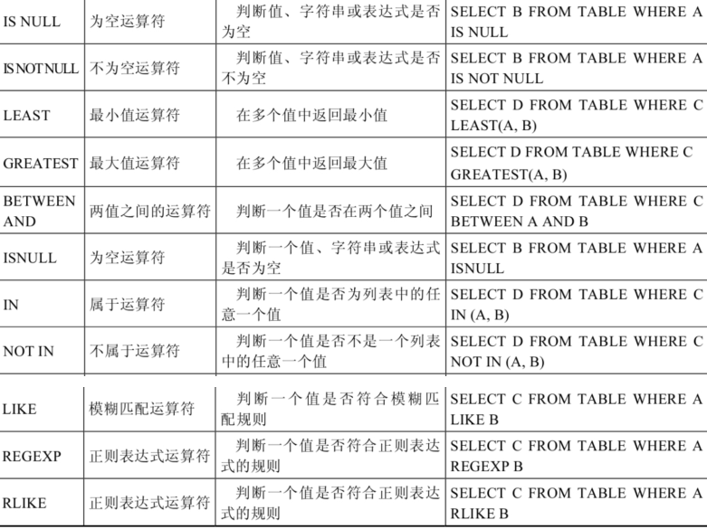
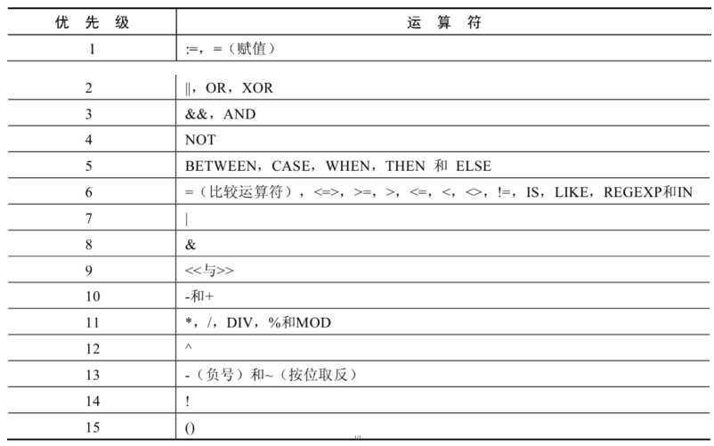
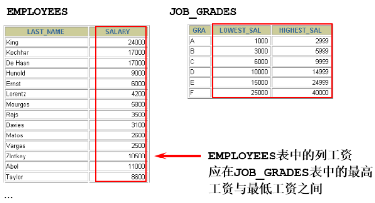

# MySQL基础篇

**@author: Shuxin_Wang**

**@time: 2022.09.02**

------


# 1 数据库概述

## 1.1 为什么使用数据库

- 持久化(persistence)：**把数据保存到可掉电式存储设备中以供之后使用**。大多数情况下，特别是企业级应用，**数据持久化意味着将内存中的数据保存到硬盘上加以”固化”**，而持久化的实现过程大多通过各种关系数据库来完成；
- 持久化的主要作用是**将内存中的数据存储在关系型数据库中**，当然也可以存储在磁盘文件、XML数据文件中；

## 1.2 数据库的相关概念

### 1.2.1 数据库相关概念

- 数据库（Database，DB）：存储数据的仓库，其本质是一个文件系统，它保存了一系列有组织的数据；
- 数据库管理系统（Database Management System，DBMS）：操作和管理数据库的大型软件，用于建立、使用和维护数据库，对数据库进行统一管理和控制。用户通过数据库管理系统访问数据库中表内的数据；
- 结构化查询语言（Structure Query Language，SQL）：专门用来与数据库通信的语言；

### 1.2.2 数据库与数据库管理系统的关系

数据库管理系统(DBMS)可以管理多个数据库，一般开发人员会针对每一个应用创建一个数据库。为保存应用中实体的数据，一般会在数据库创建多个表，以保存程序中实体用户的数据。

数据库管理系统、数据库和表的关系如图所示：


### 1.2.3 常见数据库

MySQL、Oracle、db2、SQLServer


## 1.3 MySQL介绍

- MySQL是一个`开放源代码的关系型数据库管理系统` ，由瑞典MySQL AB（创始人Michael Widenius）公司，1995年开发，迅速成为开源数据库的 No.1；
- 2008被 `Sun` 收购（10亿美金），2009年Sun被 `Oracle` 收购。 `MariaDB` 应运而生。（MySQL 的创造者担心 MySQL 有闭源的风险，因此创建了 MySQL 的分支项目 MariaDB）；
- MySQL6.x 版本之后分为`社区版` 和 `商业版` ；
- MySQL是一种关联数据库管理系统，将数据保存在不同的表中，而不是将所有数据放在一个大仓库内，这样就增加了速度并提高了灵活性；
- MySQL是开源的，所以你不需要支付额外的费用；
- MySQL是可以定制的，采用了`GPL（GNU General Public License）`协议，你可以修改源码来开发自己的MySQL系统；
- MySQL支持大型的数据库。可以处理拥有上千万条记录的大型数据库；
- MySQL支持大型数据库，支持5000万条记录的数据仓库，32位系统表文件最大可支持`4GB` ，64位系统支持最大的表文件为`8TB` ；
- MySQL使用`标准的SQL数据语言`形式；
- MySQL可以允许运行于多个系统上，并且支持多种语言。这些编程语言包括C、C++、Python、Java、Perl、PHP和Ruby等。

## 1.4 RDBMS与非RDBMS

### 1.4.1 关系型数据库（RDBMS）

#### 实质

- 这种类型的数据库是`最古老`的数据库类型，关系型数据库模型是把复杂的数据结构归结为简单的`二元关系`（即二维表格形式）；
- 关系型数据库以 `行(row)` 和 `列(column)` 的形式存储数据，以便于用户理解。这一系列的行和列被称为 `表(table)` ，一组表组成了一个库(database)；  
- 表与表之间的数据记录有`关系(relationship)`。现实世界中的各种实体以及实体之间的各种联系均用`关系模型` 来表示。关系型数据库，就是建立在 `关系模型` 基础上的数据库；

#### 优势

- **复杂查询**。可以用SQL语句方便的在一个表以及多个表之间做非常复杂的数据查询；
- **事务支持**。使得对于安全性能很高的数据访问要求得以实现。

### 1.4.2 非关系型数据库

**非关系型数据库**，可看成传统关系型数据库的功能 `阉割版本` ，基于键值对存储数据，不需要经过SQL层的解析， `性能非常高` 。同时，通过减少不常用的功能，进一步提高性能。  


# 2 MySQL环境搭建

## 2.1 MySQL下载、安装、配置、卸载

这里不再描述，网上有很多教程😀


## 2.2 MySQL登录

### 2.2.1 服务的启动和停止

用`管理员身份`打开windows命令行：

```shell
# 启动MySQL
net start MySQL服务名

# 停止MySQL
net stop MySQL服务名
```

### 2.2.2 登陆与退出

用`管理员身份`打开windows命令行：

```shell
mysql -h 主机名 -P 端口号 -u 用户名 -p密码
```

**`-p`与密码之间==不能有空格==**

**退出登录：**

```shell
exit
或
quit
```


# 3 基本的SELECT语句

## 3.1 SQL概述

SQL语言在功能上主要分为如下3大类：

- **DDL（Data Definition Languages、数据定义语言）**，这些语句定义了不同的数据库、表、视图、索引等数据库对象，还可以用来创建、删除、修改数据库和数据表的结构。主要的语句关键字包括 `CREATE` 、 `DROP` 、 `ALTER` 等；
- **DML（Data Manipulation Language、数据操作语言）**，用于添加、删除、更新和查询数据库记录，并检查数据完整性。主要的语句关键字包括 `INSERT` 、 `DELETE` 、 `UPDATE` 、 `SELECT` 等。`SELECT`是SQL语言的基础，最为重要；
- **DCL（Data Control Language、数据控制语言）**，用于定义数据库、表、字段、用户的访问权限和安全级别。主要的语句关键字包括`GRANT`、`REVOKE`、`COMMIT`、`ROLLBACK`、`SAVEPOINT` 等；

> 因为查询语句使用的非常的频繁，所以很多人把查询语句单拎出来一类：`DQL`（数据查询语言）。
>
> 还有单独将 `COMMIT` 、 `ROLLBACK` 取出来称为**TCL（Transaction Control Language，事务控制语言）**。


## 3.2 SQL语言的规则与规范

### 3.2.1 基本规则 

- SQL可以写在一行或者多行。为了提高可读性，各子句分行写，必要时使用缩进;
- 每条命令以 `;` 或 `\g` 或 `\G` 结束；
- 关键字不能被缩写也不能分行关于标点符号必须保证所有的`()`、`单引号`、`双引号`是成对结束的必须使用英文状态下的半角输入方；
- 字符串型和日期时间类型的数据可以使用单引号`（' '）`表示
- 列的别名，尽量使用双引号`（" "）`，而且不建议省略`AS`；

### 3.2.2 SQL大小写规范

- **MySQL 在 Windows 环境下是大小写不敏感的**；
- **MySQL 在 Linux 环境下是大小写敏感的**
  - 数据库名、表名、表的别名、变量名是严格区分大小写的；
  - 关键字、函数名、列名(或字段名)、列的别名(字段的别名) 是忽略大小写的；
- **推荐采用统一的书写规范**：
  - 数据库名、表名、表别名、字段名、字段别名等都`小写`；
  - SQL 关键字、函数名、绑定变量等都`大写`；

### 3.2.3 注释

```sql
# 单行注释（MySQL特有）
-- 单行注释（需空格
/* 多样注释 */
```

### 3.2.4 命名规则

- 数据库、表名不得超过`30`个字符，变量名限制为`29`个；
- 必须只能包含 `A–Z`, `a–z`, `0–9`, `_`共63个字符；
- 数据库名、表名、字段名等对象名中间不要包含空格；
- 同一MySQL软件中，数据库不能同名；同一个库中，表不能重名；同一个表中，字段不能重名；
- 必须保证你的字段没有和保留字、数据库系统或常用方法冲突。如果坚持使用，请在SQL语句中使用**`**（着重号）引起来；
- 保持字段名和类型的一致性，在命名字段并为其指定数据类型的时候一定要保证一致性。假如数据类型在一个表里是整数，那在另一个表里可就别变成字符型了；

### 3.2.5 数据导入

```shell
mysql> source d:\mysql.sql
```

## 3.3 基本的SELECT语句

### 3.3.1 `SELECT...FROM`

#### 语法

```sql
SELECT 标识选择列
FROM 标识从哪个表中选择
```

> 一般情况下，除非需要使用表中所有的字段数据，最好不要使用通配符`*`。使用**通配符虽然可以节省输入查询语句的时间，但是获取不需要的列数据通常会降低查询和所使用的应用程序的效率**。通配符的优势是，当不知道所需要的列的名称时，可以通过它获取它们。
>
> 在生产环境下，不推荐直接使用 `SELECT *` 进行查询。

### 3.3.2 列的别名

- 重命名一个列；
- 便于计算；
- 紧跟列名，也可以在列名和**别名**之间加入关键字`AS`，**见名**使用双引号，以便在别名中包含空格或特殊的字符并区分大小写；
- `AS` 可以省略；
- 建议别名简短，见名知意；

### 3.3.3 去除重复行

#### 语法

```sql
SELECT DISTINCT 标识选择列
FROM 标识从哪个表中选择
```

## 3.4 显示表结构

```sql
DESCRIBE 表名
或
DESC 表名
```

## 3.5 过滤数据

```sql
SELECT 字段1, 字段2
FROM 表名
WHERE 过滤条件
```

# 4 运算符

## 4.1 算数运算符


## 4.2 比较运算符


**安全等于运算符**（`<=>`）与等于运算符（`=`）的作用是相似的， 唯一的区别 是`<=>`可以用来对`NULL`进行判断。在两个操作数均为`NULL`时，其返回值为`1`，而不为`NULL`；当一个操作数为`NULL`时，其返回值为`0`，而不为`NULL`。  

**<u>非符号运算符：</u>**



## 4.3 逻辑运算符


## 4.4 运算符的优先级



# 5 排序与分页

## 5.1 排序数据

使用`ORDER BY`子句排序：

- `ASC`(ascend)：升序；
- `DESC`(descend)：降序；

### 单列排序

```sql
-- 默认升序
SELECT last_name, job_id, department_id, hire_date
FROM employees
ORDER BY hire_date ;
-- 降序
SELECT last_name, job_id, department_id, hire_date
FROM employees
ORDER BY hire_date DESC ;
```

### 多列排序

```sql
SELECT last_name, department_id, salary
FROM employees
ORDER BY department_id, salary DESC;
```

- 可以使用不在`SELECT`列表中的列排序；
- 在对多列进行排序的时候，首先排序的第一列必须有相同的列值，才会对第二列进行排序。如果第一列数据中所有值都是唯一的，将不再对第二列进行排序；

## 5.2 分页

### 5.2.1 背景

**背景1：**查询返回的记录太多了，查看起来很不方便，怎么样能够实现分页查询呢？

**背景2：**表里有 4 条数据，我们只想要显示第 2、3 条数据怎么办呢？

### 5.2.2 实现规则

#### 格式

```sql
LIMIT [位置偏移量，] 行数
```

```sql
-- 前10条记录：
SELECT * FROM 表名 LIMIT 0,10;
-- 或者
SELECT * FROM 表名 LIMIT 10;

-- 第11至20条记录：
SELECT * FROM 表名 LIMIT 10,10;

-- 第21至30条记录：
SELECT * FROM 表名 LIMIT 20,10;
```

> MySQL 8.0中可以使用`LIMIT 3 OFFSET 4`，意思是获取从第5条记录开始后面的3条记录，和`LIMIT 4,3;`返回的结果相同。  

==**<u>注意：LIMIT 子句必须放在整个SELECT语句的最后！</u>**==  

约束返回结果的数量可以 `减少数据表的网络传输量` ，也可以 `提升查询效率` 。如果我们知道返回结果只有1 条，就可以使用 `LIMIT 1` ，告诉 `SELECT` 语句只需要返回一条记录即可。这样的好处就是 SELECT 不需要扫描完整的表，只需要检索到一条符合条件的记录即可返回 。


# 6 多表查询

## 6.1 笛卡尔积


在如下情况会出现笛卡尔积：

```mysql
#查询员工姓名和所在部门名称
SELECT last_name,department_name FROM employees,departments;
SELECT last_name,department_name FROM employees CROSS JOIN departments;
SELECT last_name,department_name FROM employees INNER JOIN departments;
SELECT last_name,department_name FROM employees JOIN departments;
```

## 6.2 多表查询分类

### 6.2.1 等值vs非等值连接

#### 等值连接


==**<u>总结：连接n个表，至少需要n-1个连接条件</u>**==

#### 非等值连接



```mysql
SELECT e.last_name, e.salary, j.grade_level
FROM employees e, job_grades j
WHERE e.salary BETWEEN j.lowest_sal AND j.highest_sal;
```

### 6.2.3 自连接vs非自连接

连接两张不同的表叫做**<u>非自连接</u>**如上节介绍，下面的为**<u>自连接</u>**：


### 6.2.4 内连接vs外连接

- 内连接: 合并具有同一列的两个以上的表的行, **结果集中不包含一个表与另一个表不匹配的行**；
- 外连接: 两个表在连接过程中除了返回满足连接条件的行以外**还返回左（或右）表中不满足条件的行 ，这种连接称为左（或右） 外连接**。没有匹配的行时, 结果表中相应的列为空(NULL)；
- 如果是左外连接，则连接条件中**左边**的表也称为`主表` ，**右边**的表称为 `从表` ；
- 如果是右外连接，则连接条件中**右边**的表也称为 `主表` ，**左边**的表称为 `从表` ；

## 6.3 SQL99语法实现多表查询

### 6.3.1 基本语法

`JOIN...ON`语法结构如下：

```sql
SELECT table1.column, table2.column,table3.column
FROM table1
	JOIN table2 ON table1 和 table2 的连接条件
		JOIN table3 ON table2 和 table3 的连接条件
```

- 可以使用 `ON` 子句指定额外的连接条件；
- 这个连接条件是与其它条件分开的；
- `ON` 子句使语句具有更高的易读性；
- 关键字`JOIN`、`INNER JOIN`、`CROSS JOIN` 的含义是一样的，都表示内连接；

### 6.3.2 内连接

#### 语法

```sql
SELECT 字段列表
FROM A表 INNER JOIN B表
ON 关联条件
WHERE 等其他子句;
```

### 6.3.3 外连接

#### 左外连接

```mysql
# 实现查询结果是A
SELECT 字段列表
FROM A表 LEFT JOIN B表
ON 关联条件
WHERE 等其他子句;
```


#### 右外连接

```mysql
#实现查询结果是B
SELECT 字段列表
FROM A表 RIGHT JOIN B表
ON 关联条件
WHERE 等其他子句;
```


#### 满外连接

- 满外连接的结果 = 左右表匹配的数据 + 左表没有匹配到的数据 + 右表没有匹配到的数据；
- SQL99是支持满外连接的。使用`FULL JOIN` 或 `FULL OUTER JOIN`来实现；
- 需要注意的是，MySQL不支持`FULL JOIN`，但是可以用 `LEFT JOIN UNION RIGHT JOIN`代替；

## 6.4 `UNION`的使用

**合并查询结果** 利用`UNION`关键字，可以给出多条SELECT语句，并将它们的结果组合成单个结果集。合并时，两个表对应的列数和数据类型必须相同，并且相互对应。各个SELECT语句之间使用`UNION`或`UNION ALL`关键字分隔。

语法格式：

```sql
SELECT column,... FROM table1
UNION [ALL]
SELECT column,... FROM table2
```

- `UNION` 操作符返回两个查询的结果集的并集，**<u>去除重复记录</u>**；
- `UNION ALL`操作符返回两个查询的结果集的并集。对于两个结果集的重复部分，**<u>不去重</u>**；
