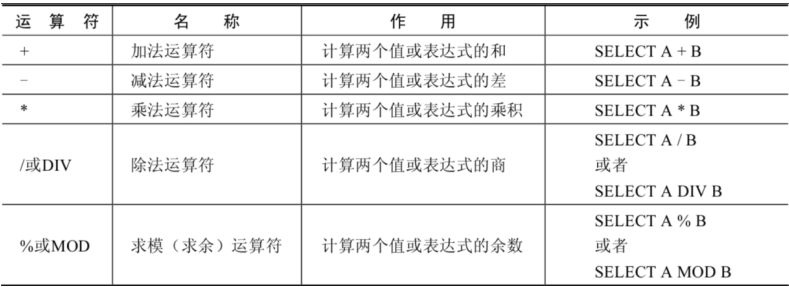
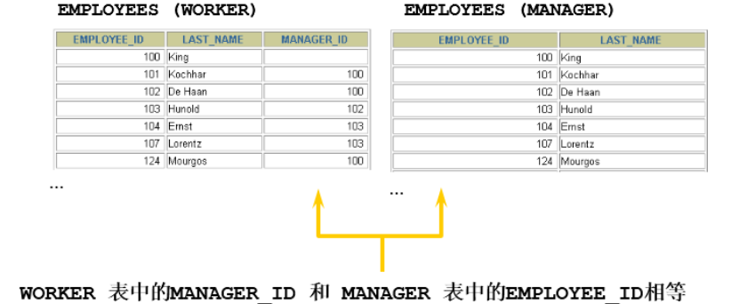
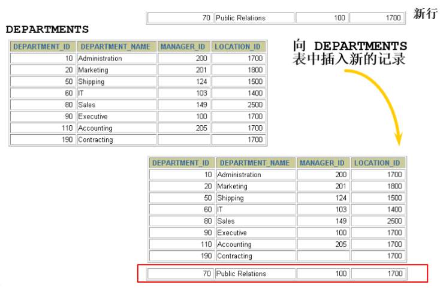
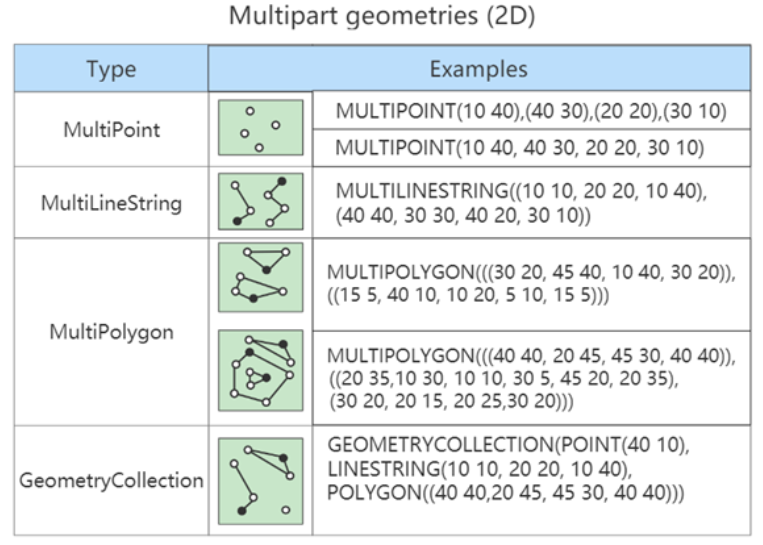

# MySQL基础篇

**@author: Shuxin_Wang**

**@time: 2022.09.02**

------


# 1 数据库概述

## 1.1 为什么使用数据库

- 持久化(persistence)：**把数据保存到可掉电式存储设备中以供之后使用**。大多数情况下，特别是企业级应用，**数据持久化意味着将内存中的数据保存到硬盘上加以”固化”**，而持久化的实现过程大多通过各种关系数据库来完成；
- 持久化的主要作用是**将内存中的数据存储在关系型数据库中**，当然也可以存储在磁盘文件、XML数据文件中；

## 1.2 数据库的相关概念

### 1.2.1 数据库相关概念

- **数据库（Database，DB）**：存储数据的仓库，其本质是一个文件系统，它保存了一系列有组织的数据；
- **数据库管理系统（Database Management System，DBMS）**：操作和管理数据库的大型软件，用于建立、使用和维护数据库，对数据库进行统一管理和控制。用户通过数据库管理系统访问数据库中表内的数据；
- **结构化查询语言（Structure Query Language，SQL）**：专门用来与数据库通信的语言；

### 1.2.2 数据库与数据库管理系统的关系

数据库管理系统(DBMS)可以管理多个数据库，一般开发人员会针对每一个应用创建一个数据库。为保存应用中实体的数据，一般会在数据库创建多个表，以保存程序中实体用户的数据。

数据库管理系统、数据库和表的关系如图所示：


### 1.2.3 常见数据库

MySQL、Oracle、db2、SQLServer


## 1.3 MySQL介绍

- MySQL是一个`开放源代码的关系型数据库管理系统` ，由瑞典MySQL AB（创始人Michael Widenius）公司，1995年开发，迅速成为开源数据库的 No.1；
- 2008被 `Sun` 收购（10亿美金），2009年Sun被 `Oracle` 收购。 `MariaDB` 应运而生。（MySQL 的创造者担心 MySQL 有闭源的风险，因此创建了 MySQL 的分支项目 MariaDB）；
- MySQL6.x 版本之后分为`社区版` 和 `商业版` ；
- MySQL是一种关联数据库管理系统，将数据保存在不同的表中，而不是将所有数据放在一个大仓库内，这样就增加了速度并提高了灵活性；
- MySQL是开源的，所以你不需要支付额外的费用；
- MySQL是可以定制的，采用了`GPL（GNU General Public License）`协议，你可以修改源码来开发自己的MySQL系统；
- MySQL支持大型的数据库。可以处理拥有上千万条记录的大型数据库；
- MySQL支持大型数据库，支持5000万条记录的数据仓库，32位系统表文件最大可支持`4GB` ，64位系统支持最大的表文件为`8TB` ；
- MySQL使用`标准的SQL数据语言`形式；
- MySQL可以允许运行于多个系统上，并且支持多种语言。这些编程语言包括C、C++、Python、Java、Perl、PHP和Ruby等。

## 1.4 RDBMS与非RDBMS

### 1.4.1 关系型数据库（RDBMS）

#### 实质

- 这种类型的数据库是`最古老`的数据库类型，关系型数据库模型是把复杂的数据结构归结为简单的`二元关系`（即二维表格形式）；
- 关系型数据库以 `行(row)` 和 `列(column)` 的形式存储数据，以便于用户理解。这一系列的行和列被称为 `表(table)` ，一组表组成了一个库(database)；  
- 表与表之间的数据记录有`关系(relationship)`。现实世界中的各种实体以及实体之间的各种联系均用`关系模型` 来表示。关系型数据库，就是建立在 `关系模型` 基础上的数据库；

#### 优势

- **复杂查询**。可以用SQL语句方便的在一个表以及多个表之间做非常复杂的数据查询；
- **事务支持**。使得对于安全性能很高的数据访问要求得以实现。

### 1.4.2 非关系型数据库

**非关系型数据库**，可看成传统关系型数据库的功能 `阉割版本` ，基于键值对存储数据，不需要经过SQL层的解析， `性能非常高` 。同时，通过减少不常用的功能，进一步提高性能。  


# 2 MySQL环境搭建

## 2.1 MySQL下载、安装、配置、卸载

这里不再描述，网上有很多教程😀


## 2.2 MySQL登录

### 2.2.1 服务的启动和停止

用`管理员身份`打开windows命令行：

```shell
# 启动MySQL
net start MySQL服务名

# 停止MySQL
net stop MySQL服务名
```

### 2.2.2 登陆与退出

用`管理员身份`打开windows命令行：

```shell
mysql -h 主机名 -P 端口号 -u 用户名 -p密码
```

**`-p`与密码之间==不能有空格==**

**退出登录：**

```shell
exit
或
quit
```


# 3 基本的SELECT语句

## 3.1 SQL概述

SQL语言在功能上主要分为如下3大类：

- **DDL（Data Definition Languages、数据定义语言）**，这些语句定义了不同的数据库、表、视图、索引等数据库对象，还可以用来创建、删除、修改数据库和数据表的结构。主要的语句关键字包括 `CREATE` 、 `DROP` 、 `ALTER` 等；
- **DML（Data Manipulation Language、数据操作语言）**，用于添加、删除、更新和查询数据库记录，并检查数据完整性。主要的语句关键字包括 `INSERT` 、 `DELETE` 、 `UPDATE` 、 `SELECT` 等。`SELECT`是SQL语言的基础，最为重要；
- **DCL（Data Control Language、数据控制语言）**，用于定义数据库、表、字段、用户的访问权限和安全级别。主要的语句关键字包括`GRANT`、`REVOKE`、`COMMIT`、`ROLLBACK`、`SAVEPOINT` 等；

> 因为查询语句使用的非常的频繁，所以很多人把查询语句单拎出来一类：`DQL`（数据查询语言）。
>
> 还有单独将 `COMMIT` 、 `ROLLBACK` 取出来称为**TCL（Transaction Control Language，事务控制语言）**。


## 3.2 SQL语言的规则与规范

### 3.2.1 基本规则 

- SQL可以写在一行或者多行。为了提高可读性，各子句分行写，必要时使用缩进;
- 每条命令以 `;` 或 `\g` 或 `\G` 结束；
- 关键字不能被缩写也不能分行关于标点符号必须保证所有的`()`、`单引号`、`双引号`是成对结束的必须使用英文状态下的半角输入方；
- 字符串型和日期时间类型的数据可以使用单引号`（' '）`表示
- 列的别名，尽量使用双引号`（" "）`，而且不建议省略`AS`；

### 3.2.2 SQL大小写规范

- **MySQL 在 Windows 环境下是大小写不敏感的**；
- **MySQL 在 Linux 环境下是大小写敏感的**
  - 数据库名、表名、表的别名、变量名是严格区分大小写的；
  - 关键字、函数名、列名(或字段名)、列的别名(字段的别名) 是忽略大小写的；
- **推荐采用统一的书写规范**：
  - 数据库名、表名、表别名、字段名、字段别名等都`小写`；
  - SQL 关键字、函数名、绑定变量等都`大写`；

### 3.2.3 注释

```sql
# 单行注释（MySQL特有）
-- 单行注释（需空格
/* 多样注释 */
```

### 3.2.4 命名规则

- 数据库、表名不得超过`30`个字符，变量名限制为`29`个；
- 必须只能包含 `A–Z`, `a–z`, `0–9`, `_`共63个字符；
- 数据库名、表名、字段名等对象名中间不要包含空格；
- 同一MySQL软件中，数据库不能同名；同一个库中，表不能重名；同一个表中，字段不能重名；
- 必须保证你的字段没有和保留字、数据库系统或常用方法冲突。如果坚持使用，请在SQL语句中使用**`**（着重号）引起来；
- 保持字段名和类型的一致性，在命名字段并为其指定数据类型的时候一定要保证一致性。假如数据类型在一个表里是整数，那在另一个表里可就别变成字符型了；

### 3.2.5 数据导入

```shell
mysql> source d:\mysql.sql
```

## 3.3 基本的SELECT语句

### 3.3.1 `SELECT...FROM`

#### 语法

```sql
SELECT 标识选择列
FROM 标识从哪个表中选择
```

> 一般情况下，除非需要使用表中所有的字段数据，最好不要使用通配符`*`。使用**通配符虽然可以节省输入查询语句的时间，但是获取不需要的列数据通常会降低查询和所使用的应用程序的效率**。通配符的优势是，当不知道所需要的列的名称时，可以通过它获取它们。
>
> 在生产环境下，不推荐直接使用 `SELECT *` 进行查询。

### 3.3.2 列的别名

- 重命名一个列；
- 便于计算；
- 紧跟列名，也可以在列名和**别名**之间加入关键字`AS`，**见名**使用双引号，以便在别名中包含空格或特殊的字符并区分大小写；
- `AS` 可以省略；
- 建议别名简短，见名知意；

### 3.3.3 去除重复行

#### 语法

```sql
SELECT DISTINCT 标识选择列
FROM 标识从哪个表中选择
```

## 3.4 显示表结构

```sql
DESCRIBE 表名
或
DESC 表名
```

## 3.5 过滤数据

```sql
SELECT 字段1, 字段2
FROM 表名
WHERE 过滤条件
```

# 4 运算符

## 4.1 算数运算符



## 4.2 比较运算符


**安全等于运算符**（`<=>`）与等于运算符（`=`）的作用是相似的， 唯一的区别 是`<=>`可以用来对`NULL`进行判断。在两个操作数均为`NULL`时，其返回值为`1`，而不为`NULL`；当一个操作数为`NULL`时，其返回值为`0`，而不为`NULL`。  

**<u>非符号运算符：</u>**


## 4.3 逻辑运算符


## 4.4 运算符的优先级


# 5 排序与分页

## 5.1 排序数据

使用`ORDER BY`子句排序：

- `ASC`(ascend)：升序；
- `DESC`(descend)：降序；

### 单列排序

```sql
-- 默认升序
SELECT last_name, job_id, department_id, hire_date
FROM employees
ORDER BY hire_date ;
-- 降序
SELECT last_name, job_id, department_id, hire_date
FROM employees
ORDER BY hire_date DESC ;
```

### 多列排序

```sql
SELECT last_name, department_id, salary
FROM employees
ORDER BY department_id, salary DESC;
```

- 可以使用不在`SELECT`列表中的列排序；
- 在对多列进行排序的时候，首先排序的第一列必须有相同的列值，才会对第二列进行排序。如果第一列数据中所有值都是唯一的，将不再对第二列进行排序；

## 5.2 分页

### 5.2.1 背景

**背景1：**查询返回的记录太多了，查看起来很不方便，怎么样能够实现分页查询呢？

**背景2：**表里有 4 条数据，我们只想要显示第 2、3 条数据怎么办呢？

### 5.2.2 实现规则

#### 格式

```sql
LIMIT [位置偏移量，] 行数
```

```sql
-- 前10条记录：
SELECT * FROM 表名 LIMIT 0,10;
-- 或者
SELECT * FROM 表名 LIMIT 10;

-- 第11至20条记录：
SELECT * FROM 表名 LIMIT 10,10;

-- 第21至30条记录：
SELECT * FROM 表名 LIMIT 20,10;
```

> MySQL 8.0中可以使用`LIMIT 3 OFFSET 4`，意思是获取从第5条记录开始后面的3条记录，和`LIMIT 4,3;`返回的结果相同。  

==**<u>注意：LIMIT 子句必须放在整个SELECT语句的最后！</u>**==  

约束返回结果的数量可以 `减少数据表的网络传输量` ，也可以 `提升查询效率` 。如果我们知道返回结果只有1 条，就可以使用 `LIMIT 1` ，告诉 `SELECT` 语句只需要返回一条记录即可。这样的好处就是 SELECT 不需要扫描完整的表，只需要检索到一条符合条件的记录即可返回 。


# 6 多表查询

## 6.1 笛卡尔积


在如下情况会出现笛卡尔积：

```mysql
#查询员工姓名和所在部门名称
SELECT last_name,department_name FROM employees,departments;
SELECT last_name,department_name FROM employees CROSS JOIN departments;
SELECT last_name,department_name FROM employees INNER JOIN departments;
SELECT last_name,department_name FROM employees JOIN departments;
```

## 6.2 多表查询分类

### 6.2.1 等值vs非等值连接

#### 等值连接


==**<u>总结：连接n个表，至少需要n-1个连接条件</u>**==

#### 非等值连接


```mysql
SELECT e.last_name, e.salary, j.grade_level
FROM employees e, job_grades j
WHERE e.salary BETWEEN j.lowest_sal AND j.highest_sal;
```

### 6.2.3 自连接vs非自连接

连接两张不同的表叫做**<u>非自连接</u>**如上节介绍，下面的为**<u>自连接</u>**：



### 6.2.4 内连接vs外连接

- 内连接: 合并具有同一列的两个以上的表的行, **结果集中不包含一个表与另一个表不匹配的行**；
- 外连接: 两个表在连接过程中除了返回满足连接条件的行以外**还返回左（或右）表中不满足条件的行 ，这种连接称为左（或右） 外连接**。没有匹配的行时, 结果表中相应的列为空(NULL)；
- 如果是左外连接，则连接条件中**左边**的表也称为`主表` ，**右边**的表称为 `从表` ；
- 如果是右外连接，则连接条件中**右边**的表也称为 `主表` ，**左边**的表称为 `从表` ；

## 6.3 SQL99语法实现多表查询

### 6.3.1 基本语法

`JOIN...ON`语法结构如下：

```sql
SELECT table1.column, table2.column,table3.column
FROM table1
	JOIN table2 ON table1 和 table2 的连接条件
		JOIN table3 ON table2 和 table3 的连接条件
```

- 可以使用 `ON` 子句指定额外的连接条件；
- 这个连接条件是与其它条件分开的；
- `ON` 子句使语句具有更高的易读性；
- 关键字`JOIN`、`INNER JOIN`、`CROSS JOIN` 的含义是一样的，都表示内连接；

### 6.3.2 内连接

#### 语法

```sql
SELECT 字段列表
FROM A表 INNER JOIN B表
ON 关联条件
WHERE 等其他子句;
```

### 6.3.3 外连接

#### 左外连接

```mysql
# 实现查询结果是A
SELECT 字段列表
FROM A表 LEFT JOIN B表
ON 关联条件
WHERE 等其他子句;
```


#### 右外连接

```mysql
#实现查询结果是B
SELECT 字段列表
FROM A表 RIGHT JOIN B表
ON 关联条件
WHERE 等其他子句;
```


#### 满外连接

- 满外连接的结果 = 左右表匹配的数据 + 左表没有匹配到的数据 + 右表没有匹配到的数据；
- SQL99是支持满外连接的。使用`FULL JOIN` 或 `FULL OUTER JOIN`来实现；
- 需要注意的是，MySQL不支持`FULL JOIN`，但是可以用 `LEFT JOIN UNION RIGHT JOIN`代替；

## 6.4 `UNION`的使用

**合并查询结果** 利用`UNION`关键字，可以给出多条SELECT语句，并将它们的结果组合成单个结果集。合并时，两个表对应的列数和数据类型必须相同，并且相互对应。各个SELECT语句之间使用`UNION`或`UNION ALL`关键字分隔。

语法格式：

```sql
SELECT column,... FROM table1
UNION [ALL]
SELECT column,... FROM table2
```

- `UNION` 操作符返回两个查询的结果集的并集，**<u>去除重复记录</u>**；
- `UNION ALL`操作符返回两个查询的结果集的并集。对于两个结果集的重复部分，**<u>不去重</u>**；

# 7 单行函数

## 7.1 MySQL的内置函数及分类

MySQL提供了丰富的内置函数，这些函数使得数据的维护与管理更加方便，能够更好地提供数据的分析与统计功能，在一定程度上提高了开发人员进行数据分析与统计的效率。

MySQL提供的内置函数从 `实现的功能角度` 可以分为数值函数、字符串函数、日期和时间函数、流程控制函数、加密与解密函数、获取MySQL信息函数、聚合函数等。这里，我将这些丰富的内置函数再分为两类： `单行函数` 、 `聚合函数（或分组函数）` 。


## 7.2 数值函数

### 7.2.1 基本函数

| 函数                | 用法                                                         |
| ------------------- | ------------------------------------------------------------ |
| ABS(x)              | 返回x的绝对值                                                |
| SIGN(X)             | 返回X的符号。正数返回1，负数返回-1，0返回0                   |
| PI()                | 返回圆周率的值                                               |
| CEIL(x)，CEILING(x) | 返回大于或等于某个值的最小整数                               |
| FLOOR(x)            | 返回小于或等于某个值的最大整数                               |
| LEAST(e1,e2,e3…)    | 返回列表中的最小值                                           |
| GREATEST(e1,e2,e3…) | 返回列表中的最大值                                           |
| MOD(x,y)            | 返回X除以Y后的余数                                           |
| RAND()              | 返回0~1的随机值                                              |
| RAND(x)             | 返回0~1的随机值，其中x的值用作种子值，相同的X值会产生相同的随机数 |
| ROUND(x)            | 返回一个对x的值进行四舍五入后，最接近于X的整数               |
| ROUND(x,y)          | 返回一个对x的值进行四舍五入后最接近X的值，并保留到小数点后面Y位 |
| TRUNCATE(x,y)       | 返回数字x截断为y位小数的结果                                 |
| SQRT(x)             | 返回x的平方根。当X的值为负数时，返回NULL                     |

### 7.2.2 角度和弧度互换函数

| 函数       | 用法                                |
| ---------- | ----------------------------------- |
| RADIANS(x) | 将角度转化为弧度，其中参数x为角度值 |
| DEGREES(x) | 将弧度转化为角度，其中参数x为弧度值 |

### 7.2.3 三角函数

| 函数       | 用法                                                         |
| :--------- | ------------------------------------------------------------ |
| SIN(x)     | 返回x的正弦值，其中，参数x为弧度值                           |
| ASIN(x)    | 返回x的反正弦值，即获取正弦为x的值。如果x的值不在-1到1之间，则返回NULL |
| COS(x)     | 返回x的余弦值，其中，参数x为弧度值                           |
| ACOS(x)    | 返回x的反余弦值，即获取余弦为x的值。如果x的值不在-1到1之间，则返回NULL |
| TAN(x)     | 返回x的正切值，其中，参数x为弧度值                           |
| ATAN(x)    | 返回x的反正切值，即返回正切值为x的值                         |
| ATAN2(m,n) | 返回两个参数的反正切值                                       |
| COT(x)     | 返回x的余切值，其中，X为弧度值                               |

### 7.2.4 指数与对数

| 函数                 | 用法                                                 |
| -------------------- | ---------------------------------------------------- |
| POW(x,y), POWER(X,Y) | 返回x的y次方                                         |
| EXP(X)               | 返回e的X次方，其中e是一个常数，2.718281828459045     |
| LN(X)，LOG(X)        | 返回以e为底的X的对数，当X <= 0 时，返回的结果为NULL  |
| LOG10(X)             | 返回以10为底的X的对数，当X <= 0 时，返回的结果为NULL |
| LOG2(X)              | 返回以2为底的X的对数，当X <= 0 时，返回NULL          |

### 7.2.5 进制间转换

| 函数          | 用法                     |
| ------------- | ------------------------ |
| BIN(x)        | 返回x的二进制编码        |
| HEX(x)        | 返回x的十六进制编码      |
| OCT(x)        | 返回x的八进制编码        |
| CONV(x,f1,f2) | 返回f1进制数变成f2进制数 |

## 7.3 字符串函数

| 函数                              | 用法                                                         |
| --------------------------------- | ------------------------------------------------------------ |
| ASCII(S)                          | 返回字符串S中的第一个字符的ASCII码值                         |
| CHAR_LENGTH(s)                    | 返回字符串s的字符数。作用与CHARACTER_LENGTH(s)相同           |
| LENGTH(s)                         | 返回字符串s的字节数，和字符集有关                            |
| CONCAT(s1,s2,......,sn)           | 连接s1,s2,......,sn为一个字符串                              |
| CONCAT_WS(x, s1,s2,......,sn)     | 同CONCAT(s1,s2,...)函数，但是每个字符串之间要加上x           |
| INSERT(str, idx, len, replacestr) | 将字符串str从第idx位置开始，len个字符长的子串替换为字符串replacestr |
| REPLACE(str, a, b)                | 用字符串b替换字符串str中所有出现的字符串a                    |
| UPPER(s) 或 UCASE(s)              | 将字符串s的所有字母转成大写字母                              |
| LOWER(s) 或LCASE(s)               | 将字符串s的所有字母转成小写字母                              |
| LEFT(str,n)                       | 返回字符串str最左边的n个字符                                 |
| RIGHT(str,n)                      | 返回字符串str最右边的n个字符                                 |
| LPAD(str, len, pad)               | 用字符串pad对str最左边进行填充，直到str的长度为len个字符     |
| RPAD(str ,len, pad)               | 用字符串pad对str最右边进行填充，直到str的长度为len个字符     |
| LTRIM(s)                          | 去掉字符串s左侧的空格                                        |
| RTRIM(s)                          | 去掉字符串s右侧的空格                                        |
| TRIM(s)                           | 去掉字符串s开始与结尾的空格                                  |
| TRIM(s1 FROM s)                   | 去掉字符串s开始与结尾的s1                                    |
| TRIM(LEADING s1 FROM s)           | 去掉字符串s开始处的s1                                        |
| TRIM(TRAILING s1 FROM s)          | 去掉字符串s结尾处的s1                                        |
| REPEAT(str, n)                    | 返回str重复n次的结果                                         |
| SPACE(n)                          | 返回n个空格                                                  |
| STRCMP(s1,s2)                     | 比较字符串s1,s2的ASCII码值的大小                             |
| SUBSTR(s,index,len)               | 返回从字符串s的index位置其len个字符，作用与SUBSTRING(s,n,len)、MID(s,n,len)相同 |
| LOCATE(substr,str)                | 返回字符串substr在字符串str中首次出现的位置，作用于POSITION(substr IN str)、INSTR(str,substr)相同。未找到，返回0 |
| ELT(m,s1,s2,…,sn)                 | 返回指定位置的字符串，如果m=1，则返回s1，如果m=2，则返回s2，如果m=n，则返回sn |
| FIELD(s,s1,s2,…,sn)               | 返回字符串s在字符串列表中第一次出现的位置                    |
| FIND_IN_SET(s1,s2)                | 返回字符串s1在字符串s2中出现的位置。其中，字符串s2是一个以逗号分隔的字符串 |
| REVERSE(s)                        | 返回s反转后的字符串                                          |
| NULLIF(value1,value2)             | 比较两个字符串，如果value1与value2相等，则返回NULL，否则返回value1 |

==**<u>注意：MySQL中，字符串的位置是从1开始的。</u>**==

## 7.4 日期和时间函数

### 7.4.1 获取日期时间

| 函数                                                         | 用法                           |
| ------------------------------------------------------------ | ------------------------------ |
| CURDATE() ，CURRENT_DATE()                                   | 返回当前日期，只包含年、月、日 |
| CURTIME() ， CURRENT_TIME()                                  | 返回当前时间，只包含时、分、秒 |
| NOW() / SYSDATE() / CURRENT_TIMESTAMP() / LOCALTIME() / LOCALTIMESTAMP() | 返回当前系统日期和时间         |
| UTC_DATE()                                                   | 返回UTC（世界标准时间）日期    |
| UTC_TIME()                                                   | 返回UTC（世界标准时间）时间    |

### 7.4.2 日期与时间戳的转换

| 函数                     | 用法                                                         |
| ------------------------ | ------------------------------------------------------------ |
| UNIX_TIMESTAMP()         | 以UNIX时间戳的形式返回当前时间。SELECT UNIX_TIMESTAMP() - >1634348884 |
| UNIX_TIMESTAMP(date)     | 将时间date以UNIX时间戳的形式返回。                           |
| FROM_UNIXTIME(timestamp) | 将UNIX时间戳的时间转换为普通格式的时间                       |

### 7.4.3 获取月份、星期、星期数、天数

| 函数                                     | 用法                                                |
| ---------------------------------------- | --------------------------------------------------- |
| YEAR(date) / MONTH(date) / DAY(date)     | 返回具体的日期值                                    |
| HOUR(time) / MINUTE(time) / SECOND(time) | 返回具体的时间值                                    |
| MONTHNAME(date)                          | 返回月份：January，...                              |
| DAYNAME(date)                            | 返回星期几：MONDAY，TUESDAY.....SUNDAY              |
| WEEKDAY(date)                            | 返回周几，注意，周1是0，周2是1，。。。周日是6       |
| QUARTER(date)                            | 返回日期对应的季度，范围为1～4                      |
| WEEK(date) ， WEEKOFYEAR(date)           | 返回一年中的第几周                                  |
| DAYOFYEAR(date)                          | 返回日期是一年中的第几天                            |
| DAYOFMONTH(date)                         | 返回日期位于所在月份的第几天                        |
| DAYOFWEEK(date)                          | 返回周几，==注意：周日是1，周一是2，。。。周六是7== |

### 7.4.4 日期的操作函数

| 函数                    | 用法                                       |
| ----------------------- | ------------------------------------------ |
| EXTRACT(type FROM date) | 返回指定日期中特定的部分，type指定返回的值 |

`EXTRACT(type FROM date)`函数中`type`的取值与含义：  


### 7.4.5 时间和秒钟转换函数

| 函数                 | 用法                                                         |
| -------------------- | ------------------------------------------------------------ |
| TIME_TO_SEC(time)    | 将 time 转化为秒并返回结果值。转化的公式为： 小时×3600+分钟×60+秒 |
| SEC_TO_TIME(seconds) | 将 seconds 描述转化为包含小时、分钟和秒的时间                |

### 7.4.6 计算日期和时间的函数

| 函数                                                         | 用法                                           |
| ------------------------------------------------------------ | ---------------------------------------------- |
| DATE_ADD(datetime, INTERVAL expr type)， ADDDATE(date,INTERVAL expr type) | 返回与给定日期时间相差INTERVAL时间段的日期时间 |
| DATE_SUB(date,INTERVAL expr type)， SUBDATE(date,INTERVAL expr type) | 返回与date相差INTERVAL时间间隔的日期           |

其中`type`的取值如下：


| 函数                         | 用法                                                         |
| ---------------------------- | ------------------------------------------------------------ |
| ADDTIME(time1,time2)         | 返回time1加上time2的时间。当time2为一个数字时，代表的是秒 ，可以为负数 |
| SUBTIME(time1,time2)         | 返回time1减去time2后的时间。当time2为一个数字时，代表的是 秒 ，可以为负数 |
| DATEDIFF(date1,date2)        | 返回date1 - date2的日期间隔天数                              |
| TIMEDIFF(time1, time2)       | 返回time1 - time2的时间间隔                                  |
| FROM_DAYS(N)                 | 返回从0000年1月1日起，N天以后的日期                          |
| TO_DAYS(date)                | 返回日期date距离0000年1月1日的天数                           |
| LAST_DAY(date)               | 返回date所在月份的最后一天的日期                             |
| MAKEDATE(year,n)             | 针对给定年份与所在年份中的天数返回一个日期                   |
| MAKETIME(hour,minute,second) | 将给定的小时、分钟和秒组合成时间并返回                       |
| PERIOD_ADD(time,n)           | 返回time加上n后的时间                                        |

### 7.4.7 日期的格式化与解析

| 函数                              | 用法                                       |
| --------------------------------- | ------------------------------------------ |
| DATE_FORMAT(date,fmt)             | 按照字符串fmt格式化日期date值              |
| TIME_FORMAT(time,fmt)             | 按照字符串fmt格式化时间time值              |
| GET_FORMAT(date_type,format_type) | 返回日期字符串的显示格式                   |
| STR_TO_DATE(str, fmt)             | 按照字符串fmt对str进行解析，解析为一个日期 |

上述`# GET_FORMAT`函数中fmt参数常用的格式符：

| 格式符 | 说明                                                         | 格式符 | 说明                                                         |
| ------- | ------------------------------------------------------------ | ------ | ------------------------------------------------------------ |
| %Y      | 4位数字表示年份                                              | %y     | 表示两位数字表示年份                                         |
| %M      | 月名表示月份（January,....）                                 | %m     | 两位数字表示月份（01,02,03。。。）                           |
| %b      | 缩写的月名（Jan.，Feb.，....）                               | %c     | 数字表示月份（1,2,3,...）                                    |
| %D      | 英文后缀表示月中的天数（1st,2nd,3rd,...）                    | %d     | 两位数字表示月中的天数(01,02...)                             |
| %e      | 数字形式表示月中的天数（1,2,3,4,5.....）                     |        |                                                              |
| %H      | 两位数字表示小数，24小时制（01,02..）                        | %h和%I | 两位数字表示小时，12小时制（01,02..）                        |
| %k      | 数字形式的小时，24小时制(1,2,3)                              | %l     | 数字形式表示小时，12小时制（1,2,3,4....）                    |
| %i      | 两位数字表示分钟（00,01,02）                                 | %S和%s | 两位数字表示秒(00,01,02...)                                  |
| %W      | 一周中的星期名称（Sunday...）                                | %a     | 一周中的星期缩写（Sun.， Mon.,Tues.，..）                    |
| %w      | 以数字表示周中的天数(0=Sunday,1=Monday....)                  |        |                                                              |
| %j      | 以3位数字表示年中的天数(001,002...)                          | %U     | 以数字表示年中的第几周， （1,2,3。。）其中Sunday为周中第一天 |
| %u      | 以数字表示年中的第几周， （1,2,3。。）其中Monday为周中第一天 |        |                                                              |
| %T      | 24小时制                                                     | %r     | 12小时制                                                     |
| %p      | AM或PM                                                       | %%     | 表示%                                                        |

`GET_FORMAT`函数中`date_type`和`format_type`参数取值如下：  


## 7.5 流程控制函数

流程处理函数可以根据不同的条件，执行不同的处理流程，可以在SQL语句中实现不同的条件选择。`MySQL`中的流程处理函数主要包括`IF()`、`IFNULL()`和`CASE()`函数 。

| 函数                                                         | 用法                                            |
| ------------------------------------------------------------ | ----------------------------------------------- |
| IF(value,value1,value2)                                      | 如果value的值为TRUE，返回value1，否则返回value2 |
| IFNULL(value1, value2)                                       | 如果value1不为NULL，返回value1，否则返回value2  |
| CASE WHEN 条件1 THEN 结果1 WHEN 条件2 THEN 结果2 .... [ELSE resultn] END | 相当于Java的if...else if...else...              |
| CASE expr WHEN 常量值1 THEN 值1 WHEN 常量值1 THEN值1 .... [ELSE 值n] END | 相当于Java的switch...case...                    |

## 7.6 加密解密函数

加密与解密函数主要用于对数据库中的数据进行加密和解密处理，以防止数据被他人窃取。这些函数在保证数据库安全时非常有用。  

| 函数                        | 用法                                                         |
| --------------------------- | ------------------------------------------------------------ |
| PASSWORD(str)               | 返回字符串str的加密版本，41位长的字符串。加密结果 **不可逆** ，常用于用户的密码加密 |
| MD5(str)                    | 返回字符串str的md5加密后的值，也是一种加密方式。若参数为NULL，则会返回NULL |
| SHA(str)                    | 从原明文密码str计算并返回加密后的密码字符串，当参数为NULL时，返回NULL。 **SHA加密算法比MD5更加安全** 。 |
| ENCODE(value,password_seed) | 返回使用password_seed作为加密密码加密value                   |
| DECODE(value,password_seed) | 返回使用password_seed作为加密密码解密value                   |

## 7.7 MySQL信息函数

MySQL中内置了一些可以查询MySQL信息的函数，这些函数主要用于帮助数据库开发或运维人员更好地对数据库进行维护工作。

| 函数                                                  | 用法                                                     |
| ----------------------------------------------------- | -------------------------------------------------------- |
| VERSION()                                             | 返回当前MySQL的版本号                                    |
| CONNECTION_ID()                                       | 返回当前MySQL服务器的连接数                              |
| DATABASE()，SCHEMA()                                  | 返回MySQL命令行当前所在的数据库                          |
| USER()，CURRENT_USER()、SYSTEM_USER()，SESSION_USER() | 返回当前连接MySQL的用户名，返回结果格式为“主机名@用户名” |
| CHARSET(value)                                        | 返回字符串value自变量的字符集                            |
| COLLATION(value)                                      | 返回字符串value的比较规则                                |

## 7.8 其他函数

MySQL中有些函数无法对其进行具体的分类，但是这些函数在MySQL的开发和运维过程中也是不容忽视的。  

| 函数                           | 用法                                                         |
| ------------------------------ | ------------------------------------------------------------ |
| FORMAT(value,n)                | 返回对数字value进行格式化后的结果数据。n表示 **四舍五入** 后保留到小数点后n位 |
| CONV(value,from,to)            | 将value的值进行不同进制之间的转换                            |
| INET_ATON(ipvalue)             | 将以点分隔的IP地址转化为一个数字                             |
| INET_NTOA(value)               | 将数字形式的IP地址转化为以点分隔的IP地址                     |
| BENCHMARK(n,expr)              | 将表达式expr重复执行n次。用于测试MySQL处理expr表达式所耗费的时间 |
| CONVERT(value USING char_code) | 将value所使用的字符编码修改为char_code                       |

# 8 聚合函数

## 8.1 聚合函数介绍

**<u>聚合函数类型：</u>**

- `AVG()`
- `SUM()`
- `MAX()`
- `MIN()`
- `COUNT()`

**<u>语法：</u>**

```sql
SELECT		[column,] group function(column), ...
FROM 		table
[WHERE		condition]
[GROUP BY	column]
[ORDER BY	column];
```

- 聚合函数==不能嵌套调用==。比如不能出现类似`AVG(SUM(字段名称))`形式的调用。  

### `COUNT`函数

- `COUNT(*)`返回表中记录总数，适用于**任意数据类型**；
- `COUNT(expr)`返回**`expr`不为空**的记录总数；

## 8.2 `GROUP BY`

### 8.2.1 基本使用

可以使用`GROUP BY`子句将表中的数据分成若干组：

```mysql
SELECT department_id, AVG(salary)
FROM employees
GROUP BY department_id ;
```


### 8.2.2 使用多个列分组

```sql
SELECT department_id dept_id, job_id, SUM(salary)
FROM employees
GROUP BY department_id, job_id;
```


### 8.2.3 使用`WITH ROLLP`

使用 `WITH ROLLUP` 关键字之后，在所有查询出的分组记录之后增加一条记录，该记录计算查询出的所有记录的总和，即统计记录数量。

```sql
SELECT department_id,AVG(salary)
FROM employees
WHERE department_id > 80
GROUP BY department_id WITH ROLLUP;
```

> 当使用`ROLLUP`时，**不能同时使用**`ORDER BY`子句进行结果排序，即`ROLLUP`和`ORDER BY`是**互相排斥**的。

## 8.3 `HAVING`

### 8.3.1 基本使用

1. 行已经被分组；
2. 使用了聚合函数；
3. 满足`HAVING`子句中条件的分组将被显示；
4. `HAVING` 不能单独使用，必须要跟 `GROUP BY` 一起使用；

```mysql
SELECT department_id, MAX(salary)
FROM employees
GROUP BY department_id
HAVING MAX(salary)>10000 ;
```


- **非法使用聚合函数**：不能在 `WHERE` 子句中使用聚合函数  

### 8.3.2 `WHERE`和`HAVING`的对比

**<u>区别1：`WHERE` 可以直接使用表中的字段作为筛选条件，但不能使用分组中的计算函数作为筛选条件； `HAVING` 必须要与 `GROUP BY` 配合使用，可以把分组计算的函数和分组字段作为筛选条件。</u>**这决定了，在需要对数据进行分组统计的时候，`HAVING` 可以完成 `WHERE` 不能完成的任务。这是因为，在查询语法结构中，`WHERE` 在 `GROUP BY` 之前，所以无法对分组结果进行筛选。`HAVING` 在 `GROUP BY` 之后，可以使用分组字段和分组中的计算函数，对分组的结果集进行筛选，这个功能是 `WHERE` 无法完成的。另外，`WHERE`排除的记录不再包括在分组中；

**区别2：如果需要通过连接从关联表中获取需要的数据，`WHERE` 是先筛选后连接，而 `HAVING` 是先连接后筛选。** 这一点，就决定了在关联查询中，`WHERE` 比 `HAVING` 更高效。因为 `WHERE` 可以先筛选，用一个筛选后的较小数据集和关联表进行连接，这样占用的资源比较少，执行效率也比较高。`HAVING` 则需要先把结果集准备好，也就是用未被筛选的数据集进行关联，然后对这个大的数据集进行筛选，这样占用的资源就比较多，执行效率也较低。

|          | 优点                         | 缺点                                   |
| -------- | ---------------------------- | -------------------------------------- |
| `WHERE`  | 先筛选数据再关联，执行效率高 | 不能使用分组中的计算函数进行筛选       |
| `HAVING` | 可以使用分组中的计算函数     | 在最后的结果集中进行筛选，执行效率较低 |

## 8.4 SELECT的执行过程

### 8.4.1 查询的结构

```mysql
#方式1：
SELECT ...,....,...
FROM ...,...,....
WHERE 多表的连接条件
AND 不包含组函数的过滤条件
GROUP BY ...,...
HAVING 包含组函数的过滤条件
ORDER BY ... ASC/DESC
LIMIT ...,...

#方式2：
SELECT ...,....,...
FROM ... JOIN ...
ON 多表的连接条件
JOIN ...
ON ...
WHERE 不包含组函数的过滤条件
AND/OR 不包含组函数的过滤条件
GROUP BY ...,...
HAVING 包含组函数的过滤条件
ORDER BY ... ASC/DESC
LIMIT ...,...

#其中：
#（1）from：从哪些表中筛选
#（2）on：关联多表查询时，去除笛卡尔积
#（3）where：从表中筛选的条件
#（4）group by：分组依据
#（5）having：在统计结果中再次筛选
#（6）order by：排序
#（7）limit：分页
```

### 8.4.2 SELECT执行顺序

1. **关键词的顺序是不能颠倒的：**

```sql
SELECT ... FROM ... WHERE ... GROUP BY ... HAVING ... ORDER BY ... LIMIT...
```

2. **SELECT语句的执行顺序：**

```sql
FROM -> WHERE -> GROUP BY -> HAVING -> SELECT 的字段 -> DISTINCT -> ORDER BY -> LIMIT
```

在 SELECT 语句执行这些步骤的时候，每个步骤都会产生一个`虚拟表`，然后将这个虚拟表传入下一个步骤中作为输入。需要注意的是，这些步骤隐含在 SQL 的执行过程中，对于我们来说是不可见的。

###  8.4.3 SQL的执行原理

==**<u>SELECT 是先执行 `FROM` 这一步的。</u>**==在这个阶段，如果是多张表联查，还会经历下面的几个步骤：

1. 首先先通过 `CROSS JOIN` 求笛卡尔积，相当于得到虚拟表 `vt（virtual table）1-1`；

2. 通过 `ON` 进行筛选，在虚拟表 `vt1-1` 的基础上进行筛选，得到虚拟表 `vt1-2`；

3. 添加外部行。如果我们使用的是左连接、右链接或者全连接，就会涉及到外部行，也就是在虚拟表 `vt1-2` 的基础上增加外部行，得到虚拟表 `vt1-3`；

当然如果我们操作的是两张以上的表，还会重复上面的步骤，直到所有表都被处理完为止。这个过程得到是我们的原始数据。

当我们拿到了查询数据表的原始数据，也就是最终的虚拟表 `vt1` ，==**<u>就可以在此基础上再进行 `WHERE` 阶段</u>**== 。在这个阶段中，会根据 `vt1` 表的结果进行筛选过滤，得到虚拟表 `vt2` 。

==**<u>然后进入第三步和第四步，也就是 `GROUP` 和 `HAVING` 阶段</u>**== 。在这个阶段中，实际上是在虚拟表 `vt2` 的基础上进行分组和分组过滤，得到中间的虚拟表 `vt3` 和 `vt4` 。

当我们完成了条件筛选部分之后，就可以筛选表中提取的字段，也就是==**<u>进入到 `SELECT` 和 `DISTINCT`阶段</u>**== 。

首先在 `SELECT` 阶段会提取想要的字段，然后在 `DISTINCT` 阶段过滤掉重复的行，分别得到中间的虚拟表`vt5-1` 和 `vt5-2` 。

当我们提取了想要的字段数据之后，就可以按照指定的字段进行排序，==**<u>也就是 `ORDER BY` 阶段</u>**== ，得到虚拟表 `vt6` 。

==**<u>最后在 `vt6` 的基础上，取出指定行的记录，也就是 `LIMIT` 阶段</u>**==，得到最终的结果，对应的是虚拟表`vt7` 。

当然我们在写 `SELECT` 语句的时候，不一定存在所有的关键字，相应的阶段就会省略。

同时因为 `SQL` 是一门类似英语的结构化查询语言，所以我们在写 `SELECT` 语句的时候，还要注意相应的关键字顺序，**<u>所谓底层运行的原理，就是我们刚才讲到的执行顺序</u>**。


# 9 子查询

## 9.1 简述

### 9.1.1 子查询的基本使用

```sql
SELECT	select_list
FROM	table
WHERE	expr operator
				(SELECT	select_list
                 FROM	table);
```

### 9.1.2 子查询分类

#### 分类方式1

按内查询的结果**<u>返回一条还是多条</u>**记录，将子查询分为 **单行子查询**、**多行子查询**。

####   分类方式2

我们按**<u>内查询是否被执行多次</u>**，将子查询划分为**相关(或关联)子查询** 和 **不相关(或非关联)子查询** 。

子查询从数据表中查询了数据结果，如果这个数据结果只执行一次，然后这个数据结果作为主查询的条件进行执行，那么这样的子查询叫做不相关子查询。

同样，如果子查询需要执行多次，即采用循环的方式，先从外部查询开始，每次都传入子查询进行查询，然后再将结果反馈给外部，这种嵌套的执行方式就称为相关子查询。

## 9.2 单行子查询

### 9.2.1 单行比较操作符

| 操作符 | 含义                     |
| ------ | ------------------------ |
| =      | equal to                 |
| >      | greater than             |
| >=     | greater than or equal to |
| <      | less than                |
| <=     | less than or equal to    |
| <>     | not equal to             |

### 9.2.2 代码示例

```mysql
SELECT last_name, job_id, salary
FROM employees
WHERE job_id =
		(SELECT job_id
		 FROM employees
		 WHERE employee_id = 141)
AND salary >
		(SELECT salary
		 FROM employees
		 WHERE employee_id = 143);
```

### 9.2.3 `HAVING`中的子查询

- 首先执行子查询；
- 向主查询中的`HAVING` 子句返回结果；

```mysql
SELECT department_id, MIN(salary)
FROM employees
GROUP BY department_id
HAVING MIN(salary) >
		(SELECT MIN(salary)
		 FROM employees
		 WHERE department_id = 50);
```

### 9.2.4 `CASE`中的子查询

```mysql
SELECT employee_id, last_name,
		(CASE department_id
		 WHEN
			(SELECT department_id FROM departments
			 WHERE location_id = 1800)
        THEN 'Canada' ELSE 'USA' END) location
FROM employees;
```

### 9.2.5 子查询的空值问题

> ==**<u>子查询不返回任何行</u>**==

## 9.3 多行子查询

### 多行比较操作符

| 操作符 | 含义                                                         |
| ------ | ------------------------------------------------------------ |
| IN     | 等于列表中的**任意一个**                                     |
| ANY    | 需要和单行比较操作符一起使用，和子查询返回的**某一个**值比较 |
| ALL    | 需要和单行比较操作符一起使用，和子查询返回的**所有**值比较   |
| SOME   | 实际上是**ANY的别名**，作用相同，一般常使用ANY               |

## 9.4 相关子查询

### 9.4.1 相关子查询执行流程

如果子查询的执行依赖于外部查询，通常情况下都是因为子查询中的表用到了外部的表，并进行了条件关联，因此每执行一次外部查询，子查询都要重新计算一次，这样的子查询就称之为`关联子查询`。

==**<u>相关子查询按照一行接一行的顺序执行，主查询的每一行都执行一次子查询</u>**==。


### 9.4.2 代码示例

在`FROM`中使用子查询：

```mysql
SELECT last_name,salary,e1.department_id
FROM employees e1, (SELECT department_id,AVG(salary)  dept_avg_sal 
                    FROM employees 
                    GROUP BY department_id) e2
WHERE e1.`department_id` = e2.department_id
AND e2.dept_avg_sal < e1.`salary`;
```

在`OEDER BY`中使用子查询：

```mysql
SELECT employee_id,salary
FROM employees e
ORDER BY (
	SELECT department_name
	FROM departments d
	WHERE e.`department_id` = d.`department_id`);
```

### 9.4.3 `EXISTS`与`NOT EXISTS`

关联子查询通常也会和`EXISTS`操作符一起来使用，用来检查在子查询中是否存在满足条件的行。

- 如果在子查询中不存在满足条件的行：
  - 条件返回 `FALSE`；
  - 继续在子查询中查找；
- 如果在子查询中存在满足条件的行：
  - 不在子查询中继续查找；
  - 条件返回 `TRUE`；

`NOT EXISTS`关键字表示如果不存在某种条件，则返回`TRUE`，否则返回`FALSE`  。

### 9.4.4 相关更新

```sql
UPDATE table1 alias1
SET column = (SELECT expression
			  FROM table2 alias2
			  WHERE alias1.column = alias2.column);
```

### 9.4.5 相关删除

```sql
DELETE FROM table1 alias1
WHERE column operator (SELECT expression
					   FROM table2 alias2
					   WHERE alias1.column = alias2.column);
```

## 9.5 自连接vs子查询

在可以使用子查询，也可以使用自连接的情况下，一般情况建议使用自连接，因为在许多 DBMS 的处理过程中，对于自连接的处理速度要比子查询快得多。

可以这样理解：**<u>子查询实际上是通过未知表进行查询后的条件判断，而自连接是通过已知的自身数据表进行条件判断</u>**，因此在大部分DBMS 中都对自连接处理进行了优化。


# 10 创建和管理表

## 10.1 基础知识

### 10.1.1 一条数据存储的过程

在 MySQL 中，一个完整的数据存储过程总共有 4 步，分别是创建数据库、确认字段、创建数据表、插入数据。  


因为从系统架构的层次上看，MySQL 数据库系统从大到小依次是 `数据库服务器` 、`数据库` 、 `数据表` 、数据表的 `行与列` 。

### 10.1.2 MySQL中的数据类型

| 类型             | 类型举例                                                     |
| ---------------- | ------------------------------------------------------------ |
| 整数类型         | TINYINT、SMALLINT、MEDIUMINT、**INT(或INTEGER)**、BIGINT     |
| 浮点类型         | FLOAT、DOUBLE                                                |
| 定点数类型       | **DECIMAL**                                                  |
| 位类型           | BIT                                                          |
| 日期时间类型     | YEAR、TIME、**DATE**、DATETIME、TIMESTAMP                    |
| 文本字符串类型   | CHAR、**VARCHAR**、TINYTEXT、TEXT、MEDIUMTEXT、LONGTEXT      |
| 枚举类型         | ENUM                                                         |
| 集合类型         | SET                                                          |
| 二进制字符串类型 | BINARY、VARBINARY、TINYBLOB、BLOB、MEDIUMBLOB、LONGBLOB      |
| JSON类型         | JSON对象、JSON数组                                           |
| 空间数据类型     | 单值：GEOMETRY、POINT、LINESTRING、POLYGON；集合：MULTIPOINT、MULTILINESTRING、MULTIPOLYGON、GEOMETRYCOLLECTION |

其中，常用的几类类型介绍如下：  

| 数据类型      | 描述                                                         |
| ------------- | ------------------------------------------------------------ |
| INT           | 从-2^31 到 2^31-1的整型数据。存储大小为 4个字节              |
| CHAR(size)    | 定长字符数据。若未指定，默认为1个字符，最大长度255           |
| VARCHAR(size) | 可变长字符数据，根据字符串实际长度保存，**必须指定长度**     |
| FLOAT(M,D)    | 单精度，占用4个字节，M=整数位+小数位，D=小数位。 D<=M<=255,0<=D<=30，默认M+D<=6 |
| DOUBLE(M,D)   | 双精度，占用8个字节，D<=M<=255,0<=D<=30，默认M+D<=15         |
| DECIMAL(M,D)  | 高精度小数，占用M+2个字节，D<=M<=65，0<=D<=30，最大取值范围与DOUBLE相同。 |
| DATE          | 日期型数据，格式'YYYY-MM-DD'                                 |
| BLOB          | 二进制形式的长文本数据，最大可达4G                           |
| TEXT          | 长文本数据，最大可达4G                                       |

## 10.2 创建数据库

### 10.2.1 创建数据库

方式1：创建数据库

```mysql
CREATE DATABASE 数据库名;
```

方式2：创建数据库并指定字符集

```mysql
CREATE DATABASE 数据库名 CHARACTER SET 字符集;
```

方式3：判断数据库是否已经存在，不存在则创建数据库（ 推荐 ）

```mysql
CREATE DATABASE IF NOT EXISTS 数据库名;
```

> 注意：**<u>DATABASE 不能改名</u>**。一些可视化工具可以改名，它是建新库，把所有表复制到新库，再删旧库完成的。

### 10.2.2 使用数据库

查看当前所有的数据库

```mysql
SHOW DATABASES; #有一个S，代表多个数据库
```

查看当前正在使用的数据库

```mysql
SELECT DATABASE(); #使用的一个 mysql 中的全局函数
```

查看指定库下所有的表

```mysql
SHOW TABLES FROM 数据库名;
```

查看数据库的创建信息

```mysql
SHOW CREATE DATABASE 数据库名;
或者：
SHOW CREATE DATABASE 数据库名\G
```

使用/切换数据库

```mysql
USE 数据库名
```

> 注意：要操作表格和数据之前必须先说明是对哪个数据库进行操作，否则就要对所有对象加上“数据库名.”。

### 10.2.3 修改数据库

更改数据库字符集

```mysql
ALTER DATABASE 数据库名 CHARACTER SET 字符集; #比如：gbk、utf8等
```

### 10.2.4 删除数据库

方式1：删除指定的数据库

```mysql
DROP DATABASE 数据库名;
```

方式2：删除指定的数据库（ 推荐 ）

```mysql
DROP DATABASE IF EXISTS 数据库名;
```

## 10.3 创建表

### 10.3.1 创建方式1

```mysql
CREATE TABLE [IF NOT EXISTS] 表名(
    字段1, 数据类型 [约束条件] [默认值],
    字段2, 数据类型 [约束条件] [默认值],
    字段3, 数据类型 [约束条件] [默认值],
    ……
    [表约束条件]
);
```

**<u>举例如下：</u>**

```mysql
CREATE TABLE dept(
    -- int类型，自增
    deptno INT(2) AUTO_INCREMENT,
    dname VARCHAR(14),
    loc VARCHAR(13),
    -- 主键
    PRIMARY KEY (deptno)
);
```

> 在MySQL 8.x版本中，不再推荐为INT类型指定显示长度，并在未来的版本中可能去掉这样的语法。

### 10.3.2 创建方式2

```mysql
CREATE TABLE table
		[(column1, column2, ...)]
AS subquery;# 子查询
```

### 10.3.3 查看数据表结构

在MySQL中创建好数据表之后，可以查看数据表的结构。MySQL支持使用 `DESCRIBE/DESC` 语句查看数据表结构，也支持使用 `SHOW CREATE TABLE` 语句查看数据表结构。

语法格式如下：

```mysql
SHOW CREATE TABLE 表名\G
```

使用`SHOW CREATE TABLE`语句不仅可以查看表创建时的详细语句，还可以查看存储引擎和字符编码。


## 10.4 修改表

### 10.4.1 追加一个列

```mysql
ALTER TABLE 表名 ADD 【COLUMN】 字段名 字段类型 【FIRST|AFTER 字段名】;
```

### 10.4.2 修改一个列

```mysql
ALTER TABLE 表名 MODIFY 【COLUMN】 字段名1 字段类型 【DEFAULT 默认值】【FIRST|AFTER 字段名2】;
```

### 10.4.3 重命名一个列

```mysql
ALTER TABLE 表名 CHANGE 【column】 列名 新列名 新数据类型;
```

### 10.4.4 删除一个列

```mysql
ALTER TABLE 表名 DROP 【COLUMN】字段名
```

## 10.5 重命名表

```mysql
RENAME TABLE emp
TO myemp;
或者
ALTER table dept
RENAME [TO] detail_dept; -- [TO]可以省略
```

## 10.6 删除表

```mysql
DROP TABLE [IF EXISTS] 数据表1 [, 数据表2, …, 数据表n];
```

`IF EXISTS` 的含义为：如果当前数据库中存在相应的数据表，则删除数据表；如果当前数据库中不存在相应的数据表，则忽略删除语句，不再执行删除数据表的操作。

## 10.7 清空表

```mysql
TRUNCATE TABLE 数据表名;
```

`TRUNCATE`语句不能回滚，而使用 `DELETE` 语句删除数据，**<u>可以回滚</u>** 


# 11 数据处理之增删改

## 11.1 插入数据

### 11.1.1 实际问题



### 11.1.2 `VALUES` 的方式添加

使用这种语法一次只能向表中插入**<u>一条数据</u>**。 

1. 为所有字段按默认顺序插入

```mysql
INSERT INTO 表名
VALUES (value1,value2,....);
```

2. 为表指定子段插入

```mysql
INSERT INTO 表名(column1 [, column2, …, columnn])
VALUES (value1 [,value2, …, valuen]);
```

3. 同时插入多条记录

```mysql
INSERT INTO table_name
VALUES
(value1 [,value2, …, valuen]),
(value1 [,value2, …, valuen]),
……
(value1 [,value2, …, valuen])

或者
INSERT INTO table_name(column1 [, column2, …, columnn])
VALUES
(value1 [,value2, …, valuen]),
(value1 [,value2, …, valuen]),
……
(value1 [,value2, …, valuen]);
```

> 一个同时插入多行记录的INSERT语句等同于多个单行插入的INSERT语句，但是多行的INSERT语句在处理过程中 效率更高 。因为MySQL执行单条INSERT语句插入多行数据比使用多条INSERT语句快，所以在插入多条记录时最好选择使用单条INSERT语句的方式插入。  

- `VALUES` 也可以写成 `VALUE` ，但是`VALUES`是标准写法；
- 字符和日期型数据应包含在`单引号`中。

### 11.1.3 查询结果插入表中

```mysql
INSERT INTO 目标表名
(tar_column1 [, tar_column2, …, tar_columnn])
SELECT
(src_column1 [, src_column2, …, src_columnn])
FROM 源表名
[WHERE condition]
```

- 在 `INSERT` 语句中加入子查询；
- 不必书写 `VALUES` 子句；
- 子查询中的值列表应与 `INSERT` 子句中的列名对应。

## 11.2 更新数据

```mysql
UPDATE table_name
SET column1=value1, column2=value2, … , column=valuen
[WHERE condition]
```

- 可以一次更新多条数据；
- 如果需要回滚数据，需要保证在**<u>`DML`</u>**前，进行设置：`SET AUTOCOMMIT = FALSE`;

## 11.3 删除数据

```mysql
DELETE FROM table_name [WHERE <condition>];
```

- 如果省略 `WHERE` 子句，则表中的全部数据将被删除。


# 12 MySQL数据类型精讲

## 12.1 MySQL中的数据类型

| 类型             | 类型举例                                                     |
| ---------------- | ------------------------------------------------------------ |
| 整数类型         | TINYINT、SMALLINT、MEDIUMINT、INT(或INTEGER)、BIGINT         |
| 浮点类型         | FLOAT、DOUBLE                                                |
| 定点数类型       | DECIMAL                                                      |
| 位类型           | BIT                                                          |
| 日期时间类型     | YEAR、TIME、DATE、DATETIME、TIMESTAMP                        |
| 文本字符串类型   | CHAR、VARCHAR、TINYTEXT、TEXT、MEDIUMTEXT、LONGTEXT          |
| 枚举类型         | ENUM                                                         |
| 集合类型         | SET                                                          |
| 二进制字符串类型 | BINARY、VARBINARY、TINYBLOB、BLOB、MEDIUMBLOB、LONGBLOB      |
| JSON类型         | JSON对象、JSON数组                                           |
| 空间数据类型     | 单值类型：GEOMETRY、POINT、LINESTRING、POLYGON；集合类型：MULTIPOINT、MULTILINESTRING、MULTIPOLYGON、GEOMETRYCOLLECTION |

常见数据类型的属性，如下：

| MySQL关键字        | 含义                     |
| ------------------ | ------------------------ |
| NULL               | 数据列可包含NULL值       |
| NOT NULL           | 数据列不允许包含NULL值   |
| DEFAULT            | 默认值                   |
| PRIMARY KEY        | 主键                     |
| AUTO_INCREMENT     | 自动递增，适用于整数类型 |
| UNSIGNED           | 无符号                   |
| CHARACTER SET name | 指定一个字符集           |

## 12.2 整数类型

### 12.2.1 类型介绍

| 整数类型     | 字节 | 有符号数取值范围                         | 无符号数取值范围       |
| ------------ | ---- | ---------------------------------------- | ---------------------- |
| TINYINT      | 1    | -128~127                                 | 0~255                  |
| SMALLINT     | 2    | -32768~32767                             | 0~65535                |
| MEDIUMINT    | 3    | -8388608~8388607                         | 0~16777215             |
| INT、INTEGER | 4    | -2147483648~2147483647                   | 0~4294967295           |
| BIGINT       | 8    | -9223372036854775808~9223372036854775807 | 0~18446744073709551615 |

### 12.2.2 可选属性

#### `M`

`M` : 表示显示宽度，`M`的取值范围是(0, 255)。例如，`int(5)`：当数据宽度小于5位的时候在数字前面需要用字符填满宽度。该项功能需要配合“ `ZEROFILL` ”使用，表示用“`0`”填满宽度，否则指定显示宽度无效。

如果设置了显示宽度，那么插入的数据宽度超过显示宽度限制，会不会截断或插入失败？

答案：不会对插入的数据有任何影响，还是按照类型的实际宽度进行保存，即 `显示宽度与类型可以存储的值范围无关` 。**从MySQL 8.0.17开始，整数数据类型不推荐使用显示宽度属性**。

整型数据类型可以在定义表结构时指定所需要的显示宽度，如果不指定，则系统为每一种类型指定默认的宽度值。

#### `UNSIGNED`

`UNSIGNED` : 无符号类型（非负），所有的整数类型都有一个可选的属性`UNSIGNED`（无符号属性），无符号整数类型的最小取值为0。所以，如果需要在MySQL数据库中保存非负整数值时，可以将整数类型设置为无符号类型。

`int`类型默认显示宽度为`int(11)`，无符号`int`类型默认显示宽度为`int(10)`。

#### `ZEROFILL`

`ZEROFILL` : 0填充,（如果某列是`ZEROFILL`，那么MySQL会自动为当前列添加`UNSIGNED`属性），如果指定了ZEROFILL只是表示不够M位时，用0在左边填充，如果超过M位，只要不超过数据存储范围即可。

原来，在 int(M) 中，M 的值跟 int(M) 所占多少存储空间并无任何关系。 **<u>int(3)、int(4)、int(8) 在磁盘上都是占用 4 bytes 的存储空间</u>**。也就是说，**int(M)，必须和UNSIGNED ZEROFILL一起使用才有意义。**如果整数值超过M位，就按照实际位数存储。只是无须再用字符 0 进行填充。

#### 使用场景

`TINYINT` ：一般用于枚举数据，比如系统设定取值范围很小且固定的场景；

`SMALLINT` ：可以用于较小范围的统计数据，比如统计工厂的**固定资产库存数量**等；

`MEDIUMINT` ：用于较大整数的计算，比如车站每日的客流量等；

`INT、INTEGER`：取值范围足够大，一般情况下不用考虑超限问题，用得最多。比如商品编号；

`BIGINT` ：只有当**<u>处理特别巨大的整数</u>**时才会用到。比如双十一的交易量、大型门户网站点击量、证券公司衍生产品持仓等；

## 12.3 浮点类型

### 12.3.1 类型介绍

浮点数和定点数类型的特点是可以 `处理小数` ，你可以把整数看成小数的一个特例。因此，浮点数和定点数的使用场景，比整数大多了。 MySQL支持的浮点数类型，分别是 `FLOAT`、`DOUBLE`、`REAL`。

- `FLOAT` 表示单精度浮点数；

- `DOUBLE` 表示双精度浮点数；

- `REAL`默认就是 `DOUBLE`。如果你把 SQL 模式设定为启用“`REAL_AS_FLOAT` ”，那 么，MySQL 就认为`REAL` 是 `FLOAT`。如果要启用“`REAL_AS_FLOAT`”，可以通过以下 SQL语句实现：

```mysql
SET sql_mode = “REAL_AS_FLOAT”;
```

###   12.3.2 数据精度说明

对于浮点类型，在MySQL中单精度值使用 `4` 个字节，双精度值使用 `8` 个字节。

- MySQL允许使用 非标准语法（其他数据库未必支持，因此如果涉及到数据迁移，则最好不要这么用）： `FLOAT(M,D)` 或 `DOUBLE(M,D)` 。这里，M称为 `精度` ，D称为 `标度` 。(M,D)中 M=整数位+小数位，D=小数位。 D<=M<=255，0<=D<=30。例如，定义为`FLOAT(5,2)`的一个列可以显示为`-999.99-999.99`。如果超过这个范围会报错；
- `FLOAT`和`DOUBLE`类型在不指定(M,D)时，默认会按照实际的精度（由实际的硬件和操作系统决定）来显示；
- 说明：浮点类型，也可以加 `UNSIGNED` ，但是不会改变数据范围，例如：`FLOAT(3,2) UNSIGNED`仍然只能表示`0-9.99`的范围；
- 不管是否显式设置了精度(M,D)，这里MySQL的处理方案如下
  - 如果存储时，整数部分超出了范围，MySQL就会报错，不允许存这样的值；
  - 如果存储时，小数点部分若超出范围，就分以下情况
    - 若四舍五入后，整数部分没有超出范围，则只警告，但能成功操作并四舍五入删除多余的小数位后保存。例如在FLOAT(5,2)列内插入999.009，近似结果是999.01；
    - 若四舍五入后，整数部分超出范围，则MySQL报错，并拒绝处理。如FLOAT(5,2)列内插入999.995和-999.995都会报错。
- **<u>从MySQL 8.0.17开始，FLOAT(M,D) 和DOUBLE(M,D)用法在官方文档中已经明确不推荐使用</u>**，将来可能被移除。另外，关于浮点型FLOAT和DOUBLE的UNSIGNED也不推荐使用了，将来也可能被移除；

### 12.3.3 精度误差说明

MySQL 用 4 个字节存储 FLOAT 类型数据，用 8 个字节来存储 DOUBLE 类型数据。无论哪个，都是采用二进制的方式来进行存储的。比如 `9.625`，用二进制来表达，就是 `1001.101`，或者表达成`1.001101×2^3`。**<u>如果尾数不是 0 或 5（比如 9.624），你就无法用一个二进制数来精确表达。</u>**进而，就只好在取值允许的范围内进行四舍五入。  

在编程中，如果用到浮点数，要特别注意误差问题，**<u>因为浮点数是不准确的，所以我们要避免使用“=”来判断两个数是否相等</u>**。同时，在一些对精确度要求较高的项目中，千万不要使用浮点数，不然会导致结果错误，甚至是造成不可挽回的损失。那么，MySQL 有没有精准的数据类型呢？当然有，这就是定点数类型： `DECIMAL` 。    

## 12.4 定点数类型

### 12.4.1 类型介绍

| 数据类型                 | 字节数  | 含义               |
| ------------------------ | ------- | ------------------ |
| DECIMAL(M,D),DEC,NUMERIC | M+2字节 | 有效范围由M和D决定 |

使用 DECIMAL(M,D) 的方式表示高精度小数。其中，M被称为精度，D被称为标度。`0<=M<=65， 0<=D<=30`，D<M。例如，定义`DECIMAL（5,2）`的类型，表示该列取值范围是`-999.99~999.99`。

`DECIMAL(M,D)`的最大取值范围与`DOUBLE`类型一样，但是有效的数据范围是由M和D决定的。`DECIMAL` 的存储空间并不是固定的，由精度值M决定，总共占用的存储空间为`M+2`个字节。也就是说，在一些对精度要求不高的场景下，比起占用同样字节长度的定点数，浮点数表达的数值范围可以更大一些。

定点数在MySQL内部是以 ==**<u>字符串</u>**== 的形式进行存储，这就决定了它一定是精准的。

当DECIMAL类型不指定精度和标度时，其默认为DECIMAL(10,0)。当数据的精度超出了定点数类型的精度范围时，则MySQL同样会进行四舍五入处理。

**<u>浮点数 vs 定点数</u>**

- 浮点数相对于定点数的优点是在长度一定的情况下，浮点类型取值范围大，但是不精准，适用于需要取值范围大，又可以容忍微小误差的科学计算场景（比如计算化学、分子建模、流体动力学等）；
- 定点数类型取值范围相对小，但是精准，没有误差，适合于对精度要求极高的场景 （比如涉及金额计算的场景）；

> 由于 DECIMAL 数据类型的精准性，在项目中，除了极少数（比如商品编号）用到整数类型外，其他的数值都用的是 DECIMAL，原因就是这个项目所处的零售行业，要求精准，一分钱也不能差。

## 12.5 位类型：`BIT`

| 二进制字符串类型 | 长度 | 长度范围     | 占用空间            |
| ---------------- | ---- | ------------ | ------------------- |
| BIT(M)           | M    | 1 <= M <= 64 | 约为(M + 7)/8个字节 |

BIT类型，如果没有指定(M)，**<u>默认是1位</u>**。这个1位，表示只能存1位的二进制值。这里(M)是表示二进制的位数，位数最小值为1，最大值为64。  

注意：在向BIT类型的字段中插入数据时，一定要确保插入的数据在BIT类型支持的范围内。  使用SELECT命令查询位字段时，可以用 `BIN()` 或 `HEX()` 函数进行读取。


## 12.6 日期和时间类型

| 类型      | 名称     | 字节 | 日期格式            | 最小值                 | 最大值                 |
| --------- | -------- | ---- | ------------------- | ---------------------- | ---------------------- |
| YEAR      | 年       | 1    | YYYY或YY            | 1901                   | 2155                   |
| TIME      | 时间     | 3    | HH:MM:SS            | -838:59:59             | 838:59:59              |
| DATE      | 日期     | 3    | YYYY-MM-DD          | 1000-01-01             | 9999-12-03             |
| DATETIME  | 日期时间 | 8    | YYYY-MM-DD HH:MM:SS | 1000-01-0100:00:00     | 9999-12-31 23:59:59    |
| TIMESTAMP | 日期时间 | 4    | YYYY-MM-DD HH:MM:SS | 1970-01-0100:00:00 UTC | 2038-01-19 03:14:07UTC |

可以看到，不同数据类型表示的时间内容不同、取值范围不同，而且占用的字节数也不一样，你要根据实际需要灵活选取。

为什么时间类型 TIME 的取值范围不是 -23:59:59～23:59:59 呢？原因是 MySQL 设计的 TIME 类型，不光表示一天之内的时间，而且可以用来表示一个时间间隔，这个时间间隔可以超过 24 小时

### 12.6.1 `YEAR`类型

`YEAR`类型用来表示年份，在所有的日期时间类型中所占用的存储空间最小，只需要 `1个字节`的存储空间。

在MySQL中，YEAR有以下几种存储格式：

- 以4位字符串或数字格式表示YEAR类型，其格式为YYYY，最小值为1901，最大值为2155；
- 以2位字符串格式表示YEAR类型，最小值为00，最大值为99：
  - 当取值为01到69时，表示2001到2069；
  - 当取值为70到99时，表示1970到1999；
  - 当取值整数的0或00添加的话，那么是0000年；
  - 当取值是日期/字符串的'0'添加的话，是2000年；

**从MySQL5.5.27开始，2位格式的YEAR已经不推荐使用**。YEAR默认格式就是“YYYY”，没必要写成YEAR(4)，从MySQL 8.0.19开始，不推荐使用指定显示宽度的YEAR(4)数据类型。

### 12.6.2 `DATA`类型

DATE类型表示日期，没有时间部分，格式为 `YYYY-MM-DD` ，其中，YYYY表示年份，MM表示月份，DD表示日期。需要 `3个字节` 的存储空间。在向DATE类型的字段插入数据时，同样需要满足一定的格式条件。

- 以 `YYYY-MM-DD` 格式或者 `YYYYMMDD` 格式表示的字符串日期，其最小取值为`1000-01-01`，最大取值为`9999-12-03`。`YYYYMMDD`格式会被转化为`YYYY-MM-DD`格式；
- 以 `YY-MM-DD` 格式或者 `YYMMDD` 格式表示的字符串日期，此格式中，年份为两位数值或字符串满足YEAR类型的格式条件为：当年份取值为`00`到`69`时，会被转化为`2000`到`2069`；当年份取值为70到99时，会被转化为`1970`到`1999`；
- 使用 `CURRENT_DATE()` 或者 `NOW()` 函数，会插入当前系统的日期；

### 12.6.3 `TIME`类型

 TIME类型用来表示时间，不包含日期部分。在MySQL中，需要 `3个字节` 的存储空间来存储TIME类型的数据，可以使用`“HH:MM:SS”`格式来表示TIME类型，其中，HH表示小时，MM表示分钟，SS表示秒。

在MySQL中，向TIME类型的字段插入数据时，也可以使用几种不同的格式。 

（1）可以使用带有冒号的字符串，比如`' D HH:MM:SS'` 、`' HH:MM:SS '`、`' HH:MM '`、`' D HH:MM '`、`' D HH '`或`' SS '`格式，都能被正确地插入TIME类型的字段中。其中D表示天，其最小值为0，最大值为34。如果使用带有D格式的字符串插入TIME类型的字段时，D会被转化为小时，计算格式为`D*24+HH`。当使用带有冒号并且不带D的字符串表示时间时，表示当天的时间，比如12:10表示12:10:00，而不是00:12:10。 

（2）可以使用不带有冒号的字符串或者数字，格式为' HHMMSS '或者 HHMMSS 。**<u>如果插入一个不合法的字符串或者数字，MySQL在存储数据时，会将其自动转化为00:00:00进行存储</u>**。比如1210，MySQL会将最右边的两位解析成秒，表示00:12:10，而不是12:10:00。 

（3）使用 `CURRENT_TIME()` 或者 `NOW()` ，会插入当前系统的时间。

### 12.6.4 `DATETIME`类型

DATETIME类型在所有的日期时间类型中占用的存储空间最大，总共需要 8 个字节的存储空间。在格式上为DATE类型和TIME类型的组合，可以表示为 YYYY-MM-DD HH:MM:SS ，其中YYYY表示年份，MM表示月份，DD表示日期，HH表示小时，MM表示分钟，SS表示秒。

在向DATETIME类型的字段插入数据时，同样需要满足一定的格式条件。

- 以 `YYYY-MM-DD HH:MM:SS` 格式或者 `YYYYMMDDHHMMSS` 格式的字符串插入DATETIME类型的字段时，最小值为1000-01-01 00:00:00，最大值为9999-12-03 23:59:59；
  - 以`YYYYMMDDHHMMSS`格式的数字插入DATETIME类型的字段时，会被转化为YYYY-MM-DD HH:MM:SS格式
- 以 `YY-MM-DD HH:MM:SS` 格式或者 `YYMMDDHHMMSS` 格式的字符串插入DATETIME类型的字段时，两位数的年份规则符合YEAR类型的规则，00到69表示2000到2069；70到99表示1970到1999；
- 使用函数 `CURRENT_TIMESTAMP()` 和 `NOW()` ，可以向DATETIME类型的字段插入系统的当前日期和时间

### 12.6.5 `TIMESTAMP`类型

TIMESTAMP类型也可以表示日期时间，其显示格式与DATETIME类型相同，都是 YYYY-MM-DDHH:MM:SS ，需要4个字节的存储空间。但是TIMESTAMP存储的时间范围比DATETIME要小很多，只能存储“1970-01-01 00:00:01 UTC”到“2038-01-19 03:14:07 UTC”之间的时间。其中，UTC表示世界统一时间，也叫作世界标准时间。

存储数据的时候需要对当前时间所在的时区进行转换，查询数据的时候再将时间转换回当前的时区。因此，使用TIMESTAMP存储的同一个时间值，在不同的时区查询时会显示不同的时间。

向TIMESTAMP类型的字段插入数据时，当插入的数据格式满足YY-MM-DD HH:MM:SS和YYMMDDHHMMSS时，两位数值的年份同样符合YEAR类型的规则条件，只不过表示的时间范围要小很多。

如果向TIMESTAMP类型的字段插入的时间超出了TIMESTAMP类型的范围，则MySQL会抛出错误信息。

### 12.6.6 开发经验

用得最多的日期时间类型，就是 DATETIME 。虽然 MySQL 也支持 YEAR（年）、 TIME（时间）、DATE（日期），以及 TIMESTAMP 类型，但是在实际项目中，尽量用 DATETIME 类型。因为这个数据类型包括了完整的日期和时间信息，取值范围也最大，使用起来比较方便。毕竟，如果日期时间信息分散在好几个字段，很不容易记，而且查询的时候，SQL 语句也会更加复杂。

此外，一般存注册时间、商品发布时间等，不建议使用DATETIME存储，而是使用 `时间戳` ，因为`DATETIME`虽然直观，但不便于计算。

## 12.7 文本字符串类型

MySQL中，文本字符串总体上分为 `CHAR` 、 `VARCHAR` 、 `TINYTEXT` 、 `TEXT` 、 `MEDIUMTEXT` 、`LONGTEXT` 、 `ENUM` 、 `SET` 等类型。 

### 12.7.1 `CHAR`与`VARCHAR`类型

| 字符串(文本)类型 | 特点     | 长度 | 长度范围        | 占用的存储空间        |
| ---------------- | -------- | ---- | --------------- | --------------------- |
| CHAR(M)          | 固定长度 | M    | 0 <= M <= 255   | M个字节               |
| VARCHAR(M)       | 可变长度 | M    | 0 <= M <= 65535 | (实际长度 + 1) 个字节 |

**<u>CHAR类型：</u>**

- CHAR(M) 类型一般需要预先定义字符串长度。如果不指定(M)，则表示长度**默认是1个字符**；
- 如果保存时，数据的实际长度比CHAR类型声明的长度小，则会在 右侧填充 空格以达到指定的长度。当MySQL检索CHAR类型的数据时，CHAR类型的字段会去除尾部的空格；
- 定义CHAR类型字段时，声明的字段长度即为CHAR类型字段所占的存储空间的字节数。

**<u>VARCHAR类型：</u>**

- `VARCHAR(M)` 定义时， ==**<u>必须指定</u>**== 长度M，否则报错；
- MySQL4.0版本以下，varchar(20)：指的是20字节，如果存放UTF8汉字时，只能存6个（每个汉字3字节） ；MySQL5.0版本以上，varchar(20)：指的是20字符；
- 检索`VARCHAR`类型的字段数据时，会保留数据尾部的空格。VARCHAR类型的字段所占用的存储空间为字符串实际长度加1个字节。

| 类型       | 特点     | 空间上       | 时间上 | 适用场景             |
| ---------- | -------- | ------------ | ------ | -------------------- |
| CHAR(M)    | 固定长度 | 浪费存储空间 | 效率高 | 存储不大，速度要求高 |
| VARCHAR(M) | 可变长度 | 节省存储空间 | 效率低 | 非CHAR的情况         |

- `MyISAM` 数据存储引擎和数据列：MyISAM数据表，最好使用固定长度(CHAR)的数据列代替可变长度(VARCHAR)的数据列。这样使得整个表静态化，从而使 数据检索更快，用空间换时间；
- `MEMORY` 存储引擎和数据列：MEMORY数据表目前都使用固定长度的数据行存储，因此无论使用CHAR或VARCHAR列都没有关系，两者都是作为CHAR类型处理的；
- `InnoDB` 存储引擎，建议使用VARCHAR类型。因为对于InnoDB数据表，内部的行存储格式并没有区分固定长度和可变长度列（所有数据行都使用指向数据列值的头指针），而且主要影响性能的因素是数据行使用的存储总量，由于char平均占用的空间多于varchar，所以除了简短并且固定长度的，其他考虑varchar。这样节省空间，对磁盘I/O和数据存储总量比较好。


### 12.7.2 `TEXT`类型

| 文本字符串类型 | 特点               | 长 度 | 长度范围                         | 占用的存储空 间 |
| -------------- | ------------------ | ----- | -------------------------------- | --------------- |
| TINYTEXT       | 小文本、可变长度   | L     | 0 <= L <= 255                    | L + 2 个字节    |
| TEXT           | 文本、可变长度     | L     | 0 <= L <= 65535                  | L + 2 个字节    |
| MEDIUMTEXT     | 中等文本、可变长度 | L     | 0 <= L <= 16777215               | L + 3 个字节    |
| LONGTEXT       | 大文本、可变长度   | L     | 0 <= L<= 4294967295（相当于4GB） | L + 4 个字节    |

**由于实际存储的长度不确定，MySQL==<u>不允许</u>== TEXT 类型的字段做主键**。遇到这种情况，你只能采用CHAR(M)，或者 VARCHAR(M)。  

`TEXT`文本类型，可以存比较大的文本段，搜索速度稍慢，因此如果不是特别大的内容，建议使用`CHAR`， `VARCHAR`来代替。还有TEXT类型不用加默认值，加了也没用。而且text和blob类型的数据删除后容易导致“空洞”，使得文件碎片比较多，所以频繁使用的表不建议包含TEXT类型字段，建议单独分出去，单独用一个表。

## 12.8 `ENUM`类型

| 文本字符串类型 | 长度 | 长度范围        | 占用的存储空间 |
| -------------- | ---- | --------------- | -------------- |
| ENUM           | L    | 1 <= L <= 65535 | 1或2个字节     |

- 当ENUM类型包含1～255个成员时，需要1个字节的存储空间；

- 当ENUM类型包含256～65535个成员时，需要2个字节的存储空间。

- ENUM类型的成员个数的上限为65535个

## 12.9 `SET`类型

SET表示一个字符串对象，可以包含0个或多个成员，但成员个数的上限为 `64` 。设置字段值时，可以取取值范围内的 0 个或多个值。

当SET类型包含的成员个数不同时，其所占用的存储空间也是不同的，具体如下：

| 成员个数范围（L表示实际成员个数） | 占用的存储空间 |
| --------------------------------- | -------------- |
| 1 <= L <= 8                       | 1个字节        |
| 9 <= L <= 16                      | 2个字节        |
| 17 <= L <= 24                     | 3个字节        |
| 25 <= L <= 32                     | 4个字节        |
| 33 <= L <= 64                     | 8个字节        |

SET类型在存储数据时成员个数越多，其占用的存储空间越大。注意：**<u>SET类型在选取成员时，可以一次选择多个成员</u>**，这一点与ENUM类型不同。

## 12.10 二进制字符串类型

MySQL中的**<u>二进制字符串类型主要存储一些二进制数据</u>**，比如可以存储图片、音频和视频等二进制数据。

MySQL中支持的二进制字符串类型主要包括`BINARY`、`VARBINARY`、`TINYBLOB`、`BLOB`、`MEDIUMBLOB` 和`LONGBLOB`类型。

### 12.10.1 `BINARY`与`VARBINARY`类型

`BINARY`和`VARBINARY`类似于`CHAR`和`VARCHAR`，只是它们存储的是二进制字符串。

BINARY (M)为固定长度的二进制字符串，M表示最多能存储的字节数，取值范围是0~255个字符。如果未指定(M)，表示只能存储 1个字节 。例如BINARY (8)，表示最多能存储8个字节，如果字段值不足(M)个字节，将在右边填充'\0'以补齐指定长度。

VARBINARY (M)为可变长度的二进制字符串，M表示最多能存储的字节数，总字节数不能超过行的字节长度限制65535，另外还要考虑额外字节开销，VARBINARY类型的数据除了存储数据本身外，还需要1或2个字节来存储数据的字节数。VARBINARY类型 必须指定(M) ，否则报错。

| 二进制字符串类型 | 特点     | 值的长度             | 占用空间  |
| ---------------- | -------- | -------------------- | --------- |
| BINARY(M)        | 固定长度 | M （0 <= M <= 255）  | M个字节   |
| VARBINARY(M)     | 可变长度 | M（0 <= M <= 65535） | M+1个字节 |

### 12.10.2 `BLOB`类型

BLOB是一个 `二进制大对象` ，可以容纳可变数量的数据。

MySQL中的BLOB类型包括`TINYBLOB`、`BLOB`、`MEDIUMBLOB`和`LONGBLOB` 4种类型，它们可容纳值的最大长度不同。可以存储一个二进制的大对象，比如 `图片` 、 `音频` 和 `视频` 等。

需要注意的是，在实际工作中，往往不会在MySQL数据库中使用BLOB类型存储大对象数据，通常会将图片、音频和视频文件存储到 `服务器的磁盘上` ，并将图片、音频和视频的访问路径存储到MySQL中。

| 二进制字符串类型 | 值的长度 | 长度范围                          | 占用空间     |
| ---------------- | -------- | --------------------------------- | ------------ |
| TINYBLOB         | L        | 0 <= L <= 255                     | L + 1 个字节 |
| BLOB             | L        | 0 <= L <= 65535（相当于64KB）     | L + 2 个字节 |
| MEDIUMBLOB       | L        | 0 <= L <= 16777215 （相当于16MB） | L + 3 个字节 |
| LONGBLOB         | L        | 0 <= L <= 4294967295（相当于4GB） | L + 4 个字节 |

**<u>TEXT和BLOB的使用注意事项：</u>**

在使用text和blob字段类型时要注意以下几点，以便更好的发挥数据库的性能。

① `BLOB`和`TEXT`值也会引起自己的一些问题，特别是执行了大量的删除或更新操作的时候。删除这种值会在数据表中留下很大的" `空洞` "，以后填入这些"空洞"的记录可能长度不同。为了提高性能，建议定期使用 `OPTIMIZE TABLE` 功能对这类表进行 `碎片整理`；

② 如果需要对大文本字段进行模糊查询，MySQL 提供了 `前缀索引`。但是仍然要在不必要的时候避免检索大型的BLOB或TEXT值。例如，`SELECT *` 查询就不是很好的想法，除非你能够确定作为约束条件的`WHERE`子句只会找到所需要的数据行。否则，你可能毫无目的地在网络上传输大量的值；

③ 把BLOB或TEXT列 `分离到单独的表` 中。在某些环境中，如果把这些数据列移动到第二张数据表中，可以让你把原数据表中的数据列转换为固定长度的数据行格式，那么它就是有意义的。这会 `减少主表中的碎片` ，使你得到固定长度数据行的性能优势。它还使你在主数据表上运行 SELECT * 查询的时候不会通过网络传输大量的BLOB或TEXT值；

## 12.11 `JSON`类型

`JSON（JavaScript Object Notation）`是一种轻量级的 `数据交换格式` 。简洁和清晰的层次结构使得 JSON 成为理想的数据交换语言。它易于人阅读和编写，同时也易于机器解析和生成，并有效地提升网络传输效率。JSON 可以将 JavaScript 对象中表示的一组数据转换为字符串，然后就可以在网络或者程序之间轻松地传递这个字符串，并在需要的时候将它还原为各编程语言所支持的数据格式。

在MySQL 5.7中，就已经支持JSON数据类型。在MySQL 8.x版本中，JSON类型提供了可以进行自动验证的JSON文档和优化的存储结构，使得在MySQL中存储和读取JSON类型的数据更加方便和高效。 创建数据表，表中包含一个JSON类型的字段 js

当需要检索JSON类型的字段中数据的某个具体值时，可以使用“`->`”和“`->>`”符号：

```mysql
SELECT js -> '$.name' AS NAME,js -> '$.age' AS age ,js -> '$.address.province' AS province, js -> '$.address.city' AS city
FROM test_json;
```

## 12.12 空间类型

MySQL 空间类型扩展支持地理特征的生成、存储和分析。这里的地理特征表示世界上具有位置的任何东西，可以是一个实体，例如一座山；可以是空间，例如一座办公楼；也可以是一个可定义的位置，例如一个十字路口等等。MySQL中使用 Geometry（几何） 来表示所有地理特征。Geometry指一个点或点的集合，代表世界上任何具有位置的事物。

MySQL的空间数据类型`（Spatial Data Type）`对应于OpenGIS类，包括单值类型：`GEOMETRY`、`POINT`、`LINESTRING`、`POLYGON`以及集合类型：`MULTIPOINT`、`MULTILINESTRING`、`MULTIPOLYGON`、`GEOMETRYCOLLECTION` 。

- `Geometry`是所有空间集合类型的基类，其他类型如POINT、LINESTRING、POLYGON都是Geometry的子类。
  - `Point`，顾名思义就是点，有一个坐标值。例如`POINT(121.213342 31.234532)`，POINT(30 10)，坐标值支持DECIMAL类型，经度（longitude）在前，维度（latitude）在后，用空格分隔；
  - `LineString`，线，由一系列点连接而成。如果线从头至尾没有交叉，那就是简单的（simple）；如果起点和终点重叠，那就是封闭的（closed）。例如`LINESTRING(30 10,10 30,40 40)`，点与点之间用逗号分隔，一个点中的经纬度用空格分隔，与POINT格式一致；
  - `Polygon`，多边形。可以是一个实心平面形，即没有内部边界，也可以有空洞，类似纽扣。最简单的就是只有一个外边界的情况，例如`POLYGON((0 0,10 0,10 10, 0 10))`； 




# 13 约束

## 13.1 约束概述

数据完整性（Data Integrity）是指数据的精确性（Accuracy）和可靠性（Reliability）。它是防止数据库中存在不符合语义规定的数据和防止因错误信息的输入输出造成无效操作或错误信息而提出的。

为了保证数据的完整性，SQL规范以约束的方式对表数据进行额外的条件限制。从以下四个方面考虑：

- `实体完整性（Entity Integrity）` ：例如，同一个表中，不能存在两条完全相同无法区分的记录；
- `域完整性（Domain Integrity）` ：例如：年龄范围0-120，性别范围“男/女”；
- `引用完整性（Referential Integrity）` ：例如：员工所在部门，在部门表中要能找到这个部门；
- `用户自定义完整性（User-defined Integrity）` ：例如：用户名唯一、密码不能为空等，本部门经理的工资不得高于本部门职工的平均工资的5倍；

约束是表级的强制规定。

可以在创建表时规定约束（通过 `CREATE TABLE` 语句），或者在表创建之后通过 `ALTER TABLE` 语句规定约束。

### 13.1.1 约束的分类

- 根据**约束数据列的限制**，约束可分为：
  - 单列约束：每个约束只约束一列；
  - 多列约束：每个约束可约束多列数据；
- 根据**约束的作用范围**，约束可分为：
  - 列级约束：只能作用在一个列上，跟在列的定义后面；
  - 表级约束：可以作用在多个列上，不与列一起，而是单独定义；
- 根据**约束起的作用**，约束可分为：
  - `NOT NULL` 非空约束，规定某个字段不能为空；
  - `UNIQUE` 唯一约束，规定某个字段在整个表中是唯一的；
  - `PRIMARY KEY` 主键(非空且唯一)约束；
  - `FOREIGN KEY` 外键约束；
  - `CHECK` 检查约束；
  - `DEFAULT` 默认值约束；

## 13.2 非空约束

### 13.2.1 作用

限定某个字段/某列的值不允许为空


### 13.2.2 关键字

`NOT NULL`

### 13.2.3 特点

- 默认，所有的类型的值都可以是NULL，包括INT、FLOAT等数据类型；
- 非空约束只能出现在**表对象的列**上，只能某个列单独限定非空，不能组合非空；
- 一个表可以有很多列都分别限定了非空；
- 空字符串不等于NULL，0也不等于NULL；

### 13.2.4 添加非空约束

建表时：

```mysql
CREATE TABLE 表名称(
    字段名 数据类型,
    字段名 数据类型 NOT NULL,
    字段名 数据类型 NOT NULL
);
```

建表后：

```mysql
alter table 表名称 modify 字段名 数据类型 not null;
```

### 13.2.5 删除非空约束

```mysql
alter table 表名称 modify 字段名 数据类型 NULL;#去掉not null，相当于修改某个非注解字段，该字段允许为空
或 
alter table 表名称 modify 字段名 数据类型;#去掉not null，相当于修改某个非注解字段，该字段允许为空
```

## 13.3 唯一性约束

### 13.3.1 作用

用来限制某个字段/某列的值不能重复


唯一约束 ，允许出现多个空值：`NULL`。

### 13.3.2 关键词

`UNIQUE`

### 13.3.3 特点

- 同一个表可以有多个唯一约束；
- 唯一约束可以是某一个列的值唯一，也可以多个列组合的值唯一；
- 唯一性约束允许列值为空；
- 在创建唯一约束的时候，如果不给唯一约束命名，就默认和列名相同；
- **MySQL会给唯一约束的列上默认创建一个唯一索引**；

### 13.3.4 添加唯一约束

建表时：

```mysql
create table 表名称(
    字段名 数据类型,
    字段名 数据类型 unique,
    字段名 数据类型 unique key,
    字段名 数据类型
);
create table 表名称(
    字段名 数据类型,
    字段名 数据类型,
    字段名 数据类型,
    [constraint 约束名] unique key(字段名)
);
```

建表后：

```mysql
#字段列表中如果是一个字段，表示该列的值唯一。如果是两个或更多个字段，那么复合唯一，即多个字段的组合是唯一的
#方式1：
alter table 表名称 add unique key(字段列表);
#方式2：
alter table 表名称 modify 字段名 字段类型 unique;
```

### 13.3.5 复合唯一约束

```mysql
create table 表名称(
    字段名 数据类型,
    字段名 数据类型,
    字段名 数据类型,
    unique key(字段列表) #字段列表中写的是多个字段名，多个字段名用逗号分隔，表示那么是复合唯一，即多个字段的组合是唯一的
);
```

### 13.3.6 删除唯一约束

- 添加唯一性约束的列上也会自动创建唯一索引；
- 删除唯一约束只能通过删除唯一索引的方式删除；
- 删除时需要指定唯一索引名，唯一索引名就和唯一约束名一样；
- 如果创建唯一约束时未指定名称，如果是单列，就默认和列名相同；如果是组合列，那么默认和()中排在第一个的列名相同。也可以自定义唯一性约束名；

```mysql
SELECT * FROM information_schema.table_constraints WHERE table_name = '表名'; #查看都有哪些约束
```

```mysql
ALTER TABLE USER
DROP INDEX 索引名
```

## 13.4 `PRIMARY KEY`约束

### 13.4.1 作用

用来标识表中的一行记录。

### 13.4.2 关键词

`PRIMARY KEY`

### 13.4.3 特点

主键约束相当于==**<u>唯一约束+非空约束</u>**==的组合，主键约束列不允许重复，也不允许出现空值。  


- 一个表最多只能有一个主键约束，建立主键约束可以在列级别创建，也可以在表级别上创建；
- 主键约束对应着表中的一列或者多列（复合主键）；
- 如果是多列组合的复合主键约束，那么这些列都不允许为空值，并且组合的值不允许重复；
- **<u>MySQL的主键名总是PRIMARY</u>**，就算自己命名了主键约束名也没用；
- 当创建主键约束时，系统默认会在所在的列或列组合上建立对应的**<u>主键索引</u>**（能够根据主键查询的，就根据主键查询，效率更高）。如果删除主键约束了，主键约束对应的索引就自动删除了；
- 需要注意的一点是，不要修改主键字段的值。因为主键是数据记录的唯一标识，如果修改了主键的值，就有可能会破坏数据的完整性。

### 13.4.4 添加主键约束

建表时：

```mysql
create table 表名称(
    字段名 数据类型 primary key, #列级模式
    字段名 数据类型,
    字段名 数据类型
);

create table 表名称(
    字段名 数据类型,
    字段名 数据类型,
    字段名 数据类型,
    [constraint 约束名] primary key(字段名) #表级模式
);
```

建表后：

```mysql
ALTER TABLE 表名称 ADD PRIMARY KEY(字段列表); #字段列表可以是一个字段，也可以是多个字段，如果是多个字段的话，是复合主键
```

### 13.4.5 删除主键约束

```mysql
alter table 表名称 drop primary key;
```

## 13.5 自增列：`AUTO_INCREMENT`

### 13.5.1 作用

某个字段的值自增

### 13.5.2 关键字

`AUTO_INCREMENT`

### 13.5.3 特点

- 一个表最多**<u>只能有一个</u>**自增长列；
- 当需要产生唯一标识符或顺序值时，可设置自增长；
- 自增长列约束的列**<u>必须是键列</u>**（主键列，唯一键列）；
- 自增约束的列的数据类型必须是整数类型；如果自增列指定了 0 和 null，会在当前最大值的基础上自增；如果自增列手动指定了具体值，直接赋值为具体值。

### 13.5.4 添加指定自增约束

建表时：

```mysql
create table 表名称(
    字段名 数据类型 primary key auto_increment,
    字段名 数据类型 unique key not null,
    字段名 数据类型 unique key,
    字段名 数据类型 not null default 默认值,
);

create table 表名称(
    字段名 数据类型 default 默认值 ,
    字段名 数据类型 unique key auto_increment,
    字段名 数据类型 not null default 默认值,,
    primary key(字段名)
);
```

建表后：

```mysql
alter table 表名称 modify 字段名 数据类型 auto_increment;
```

### 13.5.5 修改自增约束

```mysql
alter table 表名称 modify 字段名 数据类型 auto_increment;#给这个字段增加自增约束

alter table 表名称 modify 字段名 数据类型; #去掉auto_increment相当于删除
```

## 13.6 `FOREIGN KEY`约束

### 13.6.1 作用

限定某个表的某个字段的引用完整性


### 13.6.2 关键字

`FOREIGN KEY`

### 13.6.3 特点

- 从表的外键列，必须引用/参考主表的主键或唯一约束的列；
- 在创建外键约束时，如果不给外键约束命名，**默认名不是列名，而是自动产生一个外键名（例如student_idfk_1）**，也可以指定外键约束名；
- 创建(CREATE)表时就指定外键约束的话，先创建主表，再创建从表；
- 删表时，先删从表（或先删除外键约束），再删除主表；
- 当主表的记录被从表参照时，主表的记录将不允许删除，如果要删除数据，需要先删除从表中依赖该记录的数据，然后才可以删除主表的数据；
- 在“从表”中指定外键约束，并且一个表可以建立多个外键约束；
- 从表的外键列与主表被参照的列名字可以不相同，但是数据类型必须一样，逻辑意义一致。如果类型不一样，创建子表时，就会出现错误`“ERROR 1005 (HY000): Can't create table'database.tablename'(errno: 150)”`；
- **<u>当创建外键约束时，系统默认会在所在的列上建立对应的普通索引</u>**。但是索引名是外键的约束名。（根据外键查询效率很高）；
- 删除外键约束后，必须 `手动` 删除对应的索引；

### 13.6.4 添加外键约束

