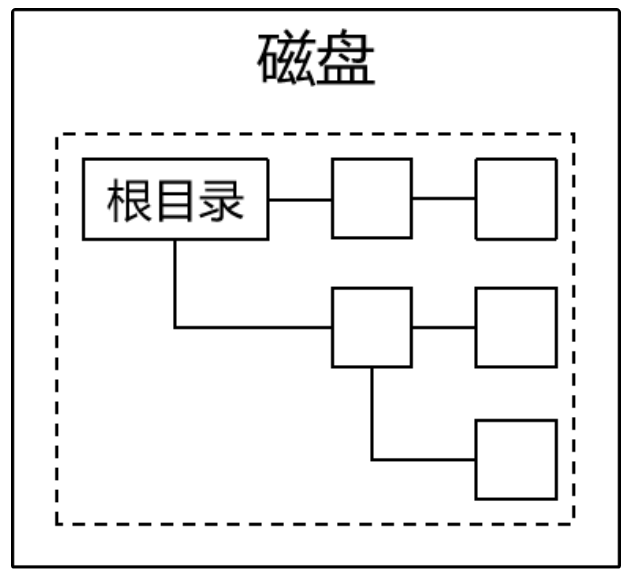
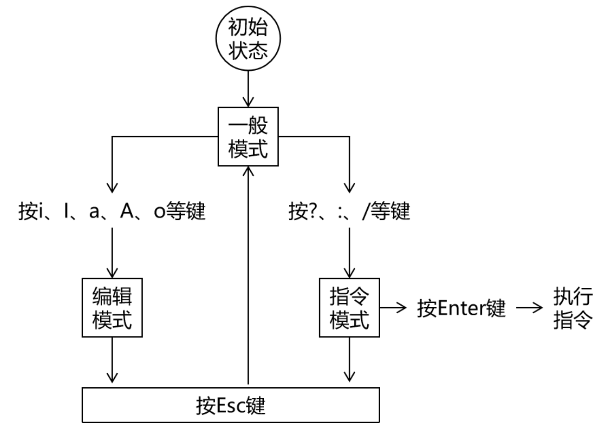

# Linux

**@author: Shuxin_Wang**

**@time: 2023.04.08**

---

[toc]

---

# 1 常用命令

## 1.1 背景知识

### 1.1.1 一切皆文件

在Linux系统中任何东西都是以文件形式来存储的。这其中不仅包括我们熟知的文本文件、可执行文件等等，还包括硬件设备、虚拟设备、网络连接等等，甚至连目录其实都是一种特殊的文件。

### 1.1.2 文件系统

在Linux系统中不管创建了多少个硬盘分区都只有一个文件系统。整个文件系统的根目录是“`/`”，从“`/`”出发可以找到Linux系统中的所有目录和文件。



### 1.1.3 系统中的路径

- 绝对路径：从“/”根目录开始逐层查找文件和目录；
- 相对路径：以当前目录或上一级目录为基准逐层查找文件和目录：
  - 当前目录：“`./`” 当前目录的上一级目录：“`../`”；
  - “`./`”可以省略不写，也同样表示当前目录；

### 1.1.4 文件扩展名不敏感

在Windows系统中，操作系统会负责根据文件扩展名识别文件类型，然后再根据文件类型匹配打开这种文件的应用程序。让用户不必记忆大量的对应关系，用哪个直接打开就好了。

而Linux是一个命令行系统，虽然现在也有了图形化界面，但是还是以命令行使用为主。所以Linux系统中通常是使用命令去打开文件。而这个命令和文件是否匹配，那就需要运行命令的人自己注意。

### 1.1.5 一级目录简介

| 目录名       | 是否重要 | 作用                                                         |
| ------------ | -------- | ------------------------------------------------------------ |
| /bin         |          | bin是binary的缩写，这个目录存放着最经常使用的命令。          |
| /boot        |          | 这里存放的是启动Linux时用到的引导程序文件。                  |
| /dev         |          | device(设备)的缩写，该目录下存放的是Linux的外部设备。        |
| /etc         | √        | 存放系统和第三方应用程序的配置文件。                         |
| /home        | √        | 存放普通用户家目录。                                         |
| /lib和/lib64 |          | 系统开机所需要最基本的动态连接共享库。                       |
| /media       |          | 挂载Linux系统会自动识别的设备，例如U盘、光驱等。             |
| /mnt         |          | mnt是mount（挂载）的缩写，这个目录专门用于挂载操作的目录。   |
| /opt         | √        | 存放安装第三方应用程序时使用的压缩包文件。                   |
| /proc        |          | 这个目录是一个虚拟的目录，它是系统内存的映射。               |
| /root        | √        | 超级管理员root用户的家目录。                                 |
| /run         |          | 存放进程产生的临时文件，关机重启后会消失。                   |
| /sbin        |          | s是Super User的意思，这里存放的是系统管理员使用的系统管理程序。 |
| /srv         |          | service缩写，该目录存放一些服务启动之后需要提取的数据。      |
| /sys         |          | 该目录下安装了2.6内核中新出现的一个文件系统sysfs。           |
| /tmp         |          | 存放临时文件。                                               |
| /usr         | √        | 应用程序的默认安装目录，类似于Windows下的program files目录。 |
| /var         | √        | 存放经常变化的内容，例如日志文件。                           |

## 1.2 文件和目录相关命令

### 1.2.1 快捷键

命令行环境下快捷键：

| 按键         | 作用         |
| ------------ | ------------ |
| Ctrl+l       | 清屏         |
| Ctrl+c       | 强制终止程序 |
| Ctrl+Insert  | 复制         |
| Shift+Insert | 粘贴         |
| Ctrl+s       | 锁屏         |
| Ctrl+q       | 解除锁屏     |
| tab          | 自动补全     |

### 1.2.2 创建目录

格式：

```shell
mkdir [OPTION] DIRECTORY
```

- 单层目录：

`mkdir aaa/bbb/ccc`其中`aaa/bbb`是存在的目录，要创建的仅仅是`ccc`;

- 多层目录：

`mkdir -p aaa/bbb/ccc/ddd`其中`bbb/ccc/ddd`都不存在，现在想一次性把这些目录都建出来；

### 1.2.3 切换目录

格式：

```shell
cd [DIRECTORY]
```

用法1：使用绝对路径；

用法2：使用相对路径；

用法3：使用~回到家目录；

### 1.2.4 `ls`

列出目录中的内容，这里所说的目录可以是当前目录也可以是其他目录（需要指定路径）

```shell
ls [OPTION] [FILE]
```

常用参数

| 参数 | 说明                               |
| ---- | ---------------------------------- |
| -A   | 显示目录内容时把隐藏资源也显示出来 |
| -l   | 以详细信息形式显示资源             |
| -R   | 递归查看目录内容                   |

命令的参数既可以单独使用也可以组合使用。同时`ls -l`可以简写为`ll`

### 1.2.5 打印目录

格式：

```shell
pwd
```

打印当前所在的目录print work directory

### 1.2.6 创建空文件

格式：

```shell
touch [FILE]
```

### 1.2.7 复制文件或目录

格式：

```shell
cp [OPTION] [DIRECTORY or FILE]
```

复制文件：`cp 被复制的文件的路径 目标目录的路径`

复制目录：`cp -r 被复制的目录的路径 目标目录的路径`

### 1.2.8 移动目录文件

格式：

```shell
mv [被移动的文件或目录的路径] [目标目录]
```

**<u>将目录或文件在当前位置移动可以起到重命名的作用</u>**

### 1.2.9 删除目录文件

```shell
rm [OPTION] [目标文件 目录]
```

删除文件：`rm 被删除的文件的路径`

强制删除文件：`rm -f 被删除的文件的路径`

递归删除目录：`rm -r 被删除的目录的路径`

强制删除目录：`rm -rf 被删除的目录的路径`

### 1.2.10 cat

显示文件全部内容，适用短小的文件

### 1.2.11 less

分屏查看文件内容

```shell
less [file]
```

#### 控制方式

| 按键    | 效果                           |
| ------- | ------------------------------ |
| 空格    | 向下滚动一屏                   |
| b       | 向上滚动一屏                   |
| 回车    | 向下滚动一行                   |
| q       | 退出                           |
| /关键词 | 搜索  <br>n向下找  <br>N向上找 |
| =       | 显示详细的文件信息             |

### 1.2.12 tail

显示文件末尾的部分文件

```shell
tail [[OPTION] [ARGS]] [FILE]
```

- 查看文件word末尾5行内容：

```shell
tail -n 5 word
```

- 实时查看文件末尾新增的内容：

```shell
tail -F word
```

### 1.2.13 find

查找文件或目录：

```shell
find [查找范围] [参数] [表达式]
```

示例：


### 1.2.14 locate

#### 简介

locate命令同样是用来查询文件或目录，但它是基于索引查询，速度快很多。

#### locate命令的原理

系统启动时把每一个目录、每一个文件的完整路径保存到索引库中。使用locate命令搜索关键词时，就使用关键词查询索引库，把匹配的路径字符串返回。

而新建的文件或目录不会被系统吧路径存入索引库，那么使用locate命令就搜索不到。此时使用`updatedb`命令更新一下索引库就行了。

### 1.2.15 grep

将文本内容中匹配的行返回：

```shell
grep [参数] [查找内容] [文件]
```

`grep`命令使用`-v`参数可以返回不匹配的行；

### 1.2.16 管道pip

管道不是命令，而是一个符号：“`|`”。它的用法是：`命令A | 命令B`。作用是把命令A的输出作为命令B的输入。

### 1.2.17 tar

在Linux系统环境中，很多程序安装包都是以tar包的形式提供下载的所以通常我们需要从官网下载这些tar包，再上传到Linux服务器上，然后在Linux系统内解压。

```shell
tar -zxvf 包路径
```

默认解压到当前目录下，如果当前目录下有同名的目录或文件会被直接覆盖，没有任何提示，这一点请大家注意。

参数作用说明：

| 参数名称 | 作用                              |
| -------- | --------------------------------- |
| -z       | 用 gzip 对存档压缩或解压          |
| -x       | 解压                              |
| -v       | 详细显示处理的文件                |
| -f       | 指定存档或设备 (缺省为 /dev/rmt0) |

## 1.3 vim

### 1.3.1 简介

在命令行环境下编辑文本文件，在命令行模式下没有鼠标，所以刚开始使用的时候会觉得非常不习惯。但是慢慢的熟练之后你会发现，不需要鼠标全部用键盘就可以操作效率很高。

### 1.3.2 三种模式



一般模式：通过按键控制VIM工作

编辑模式：可以自由输入

指令模式：通过执行指令完成一些特殊操作