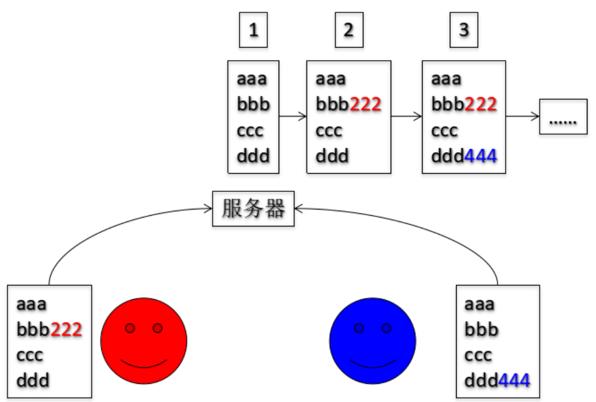
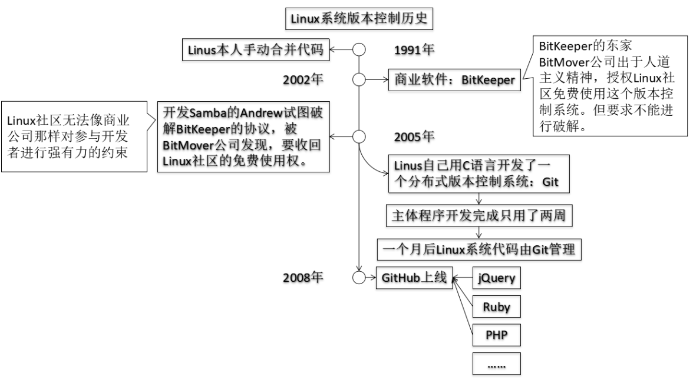
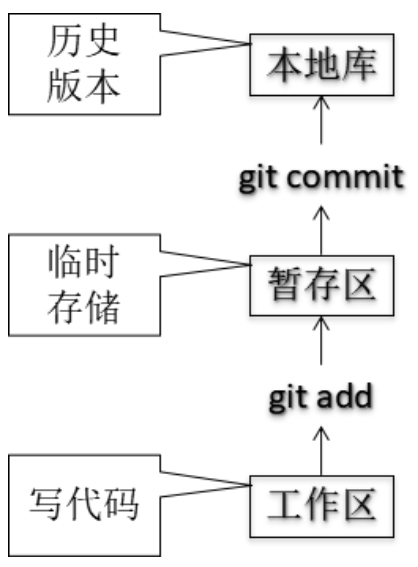
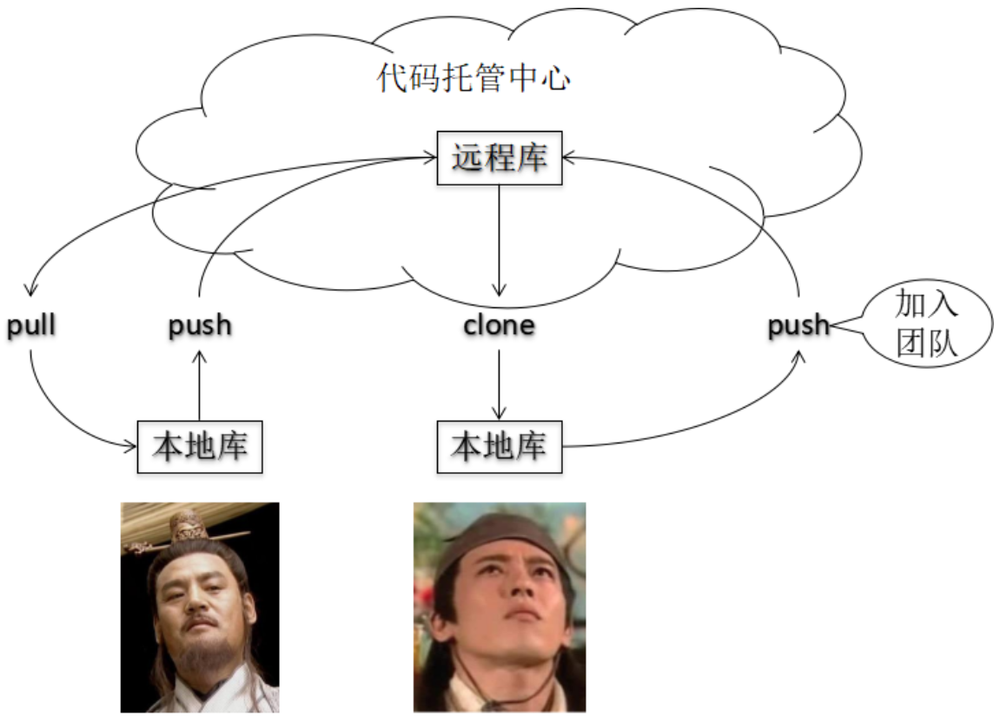
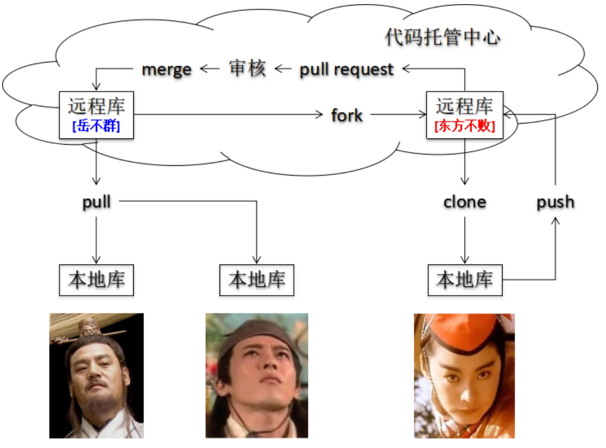

# Git

[toc]

---

# 1 什么是版本控制

## 1.1 为什么需要版本控制

一个人无法完成一个庞大项目的开发，而多人协作开发时需要使用相应的辅助工具。



## 1.2 版本控制工具

- 集中式版本控制工具
  - CVS、**SVN(Subversion)**、VSS……
- 分布式版本控制工具
  - **Git**、Mercurial、Bazaar、Darcs……


# 2 Git概述

## 2.1 简介

Git官网的网址是：https://git-scm.com/，Git的Logo中特意凸显了**分支**功能，说明这是Git官方认为的Git最大特色。而我们在实际使用中也确实能够体会到Git的分支功能确实如丝般顺滑，非常好用。


## 2.2 Git简史



## 2.3 Git工作机制

### 2.3.1 本地库工作机制

Git使用本地库在我们本地的电脑上就可以记录版本信息，不需要联网。



### 2.3.2 代码托管中心

代码托管中心负责维护**远程库**，让团队成员可以彼此协作。

- 局域网

  - Gitlab：如果有特殊需求不能使用外网的代码托管中心，可以在局域网内搭建自己的代码托管中心服务器。

- Internet

  - GitHub：国外网站，有非常多优秀的开源项目托管代码，但是从国内访问很慢。

  - 码云：国内的代码托管中心，在国内互联网开发圈子中的地位举足轻重。

### 2.3.3 远程库工作机制

#### 团队内协作



#### 跨团队协作



# 3 命令行本地操作

## 3.1 初始化本地库并设置签名

### 3.1.1 初始化本地库

创建一个专门的目录，使用`git init`命令初始化为本地库，后面我们的版本控制操作都是在这个目录下进行。

```bash
git init
```

### 3.1.2 设置用户签名

签名的作用是区分不同操作者身份。用户的签名信息在每一个版本的提交信息中能够看到，以此确认本次提交是谁做的。

==注意：这里设置用户签名和将来登录GitHub（或其他代码托管中心）的账号没有任何关系。==

#### 设置用户名

```bash
git config --global user.name [用户名]
```

#### 设置用户邮箱

```bash
git config --global user.email [y]
```

